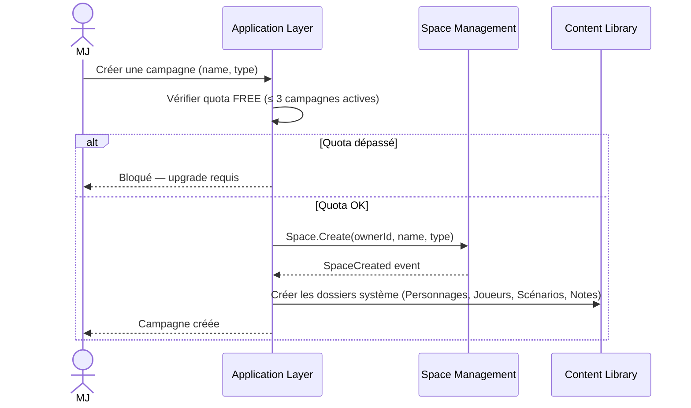
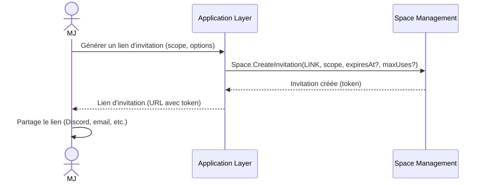
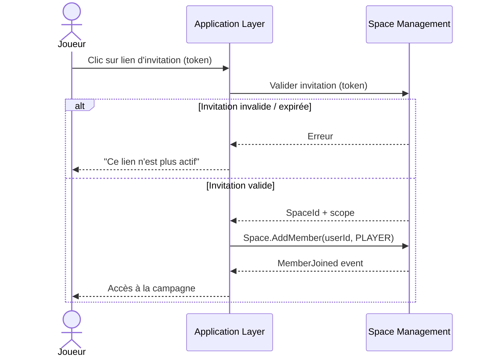
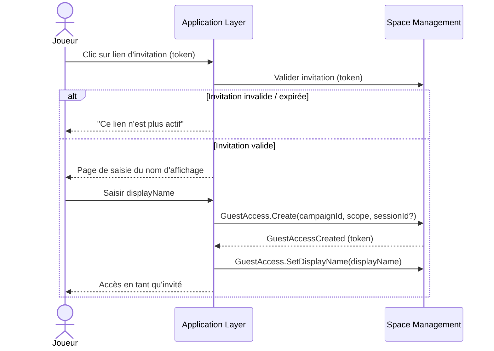
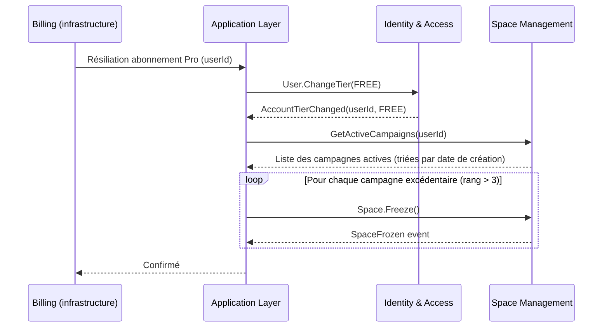
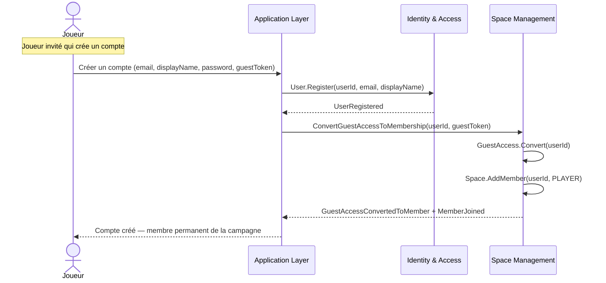
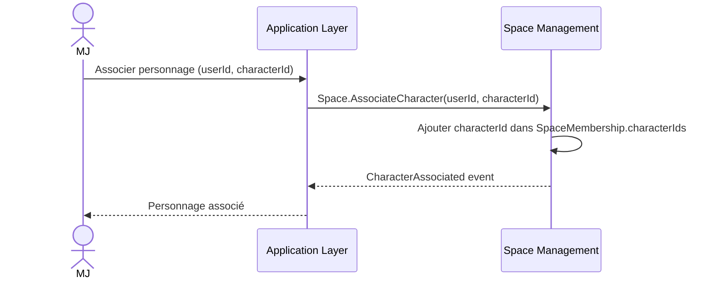

# Space Management — Diagrammes de flux

## 1. Créer une campagne

## 2. Inviter un joueur (via lien)

## 3. Rejoindre via invitation — utilisateur connecté

## 4. Rejoindre en tant qu'invité (sans compte)

## 5. Gel des campagnes excédentaires (downgrade PRO → FREE)

## 6. Conversion GuestAccess → SpaceMembership

## 7. Associer un personnage à un membre

