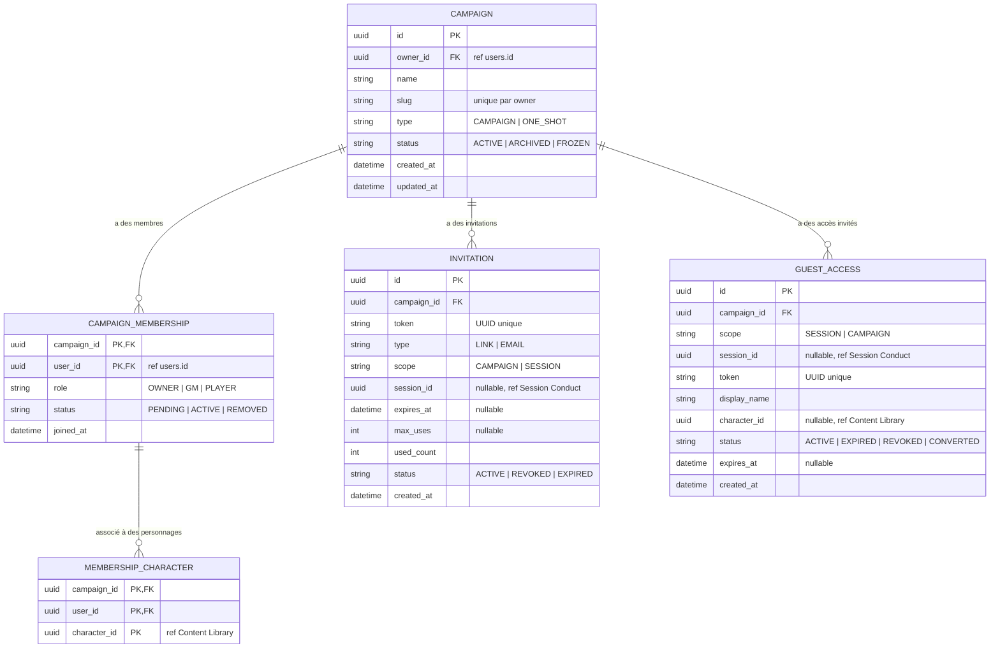

# Campaign Management — Modèle Conceptuel de Données (MCD)

```mermaid
erDiagram
    CAMPAIGN {
        uuid id PK
        uuid owner_id FK "ref users.id"
        string name
        string slug "unique par owner"
        string type "CAMPAIGN | ONE_SHOT"
        string status "ACTIVE | ARCHIVED | FROZEN"
        datetime created_at
        datetime updated_at
    }

    CAMPAIGN_MEMBERSHIP {
        uuid campaign_id PK,FK
        uuid user_id PK,FK "ref users.id"
        string role "OWNER | GM | PLAYER"
        string status "PENDING | ACTIVE | REMOVED"
        datetime joined_at
    }

    MEMBERSHIP_CHARACTER {
        uuid campaign_id PK,FK
        uuid user_id PK,FK
        uuid character_id PK "ref Content Library"
    }

    INVITATION {
        uuid id PK
        uuid campaign_id FK
        string token "UUID unique"
        string type "LINK | EMAIL"
        string scope "CAMPAIGN | SESSION"
        uuid session_id "nullable, ref Session Conduct"
        datetime expires_at "nullable"
        int max_uses "nullable"
        int used_count
        string status "ACTIVE | REVOKED | EXPIRED"
        datetime created_at
    }

    GUEST_ACCESS {
        uuid id PK
        uuid campaign_id FK
        string scope "SESSION | CAMPAIGN"
        uuid session_id "nullable, ref Session Conduct"
        string token "UUID unique"
        string display_name
        uuid character_id "nullable, ref Content Library"
        string status "ACTIVE | EXPIRED | REVOKED | CONVERTED"
        datetime expires_at "nullable"
        datetime created_at
    }

    CAMPAIGN ||--o{ CAMPAIGN_MEMBERSHIP : "a des membres"
    CAMPAIGN ||--o{ INVITATION : "a des invitations"
    CAMPAIGN ||--o{ GUEST_ACCESS : "a des accès invités"
    CAMPAIGN_MEMBERSHIP ||--o{ MEMBERSHIP_CHARACTER : "associé à des personnages"
```
