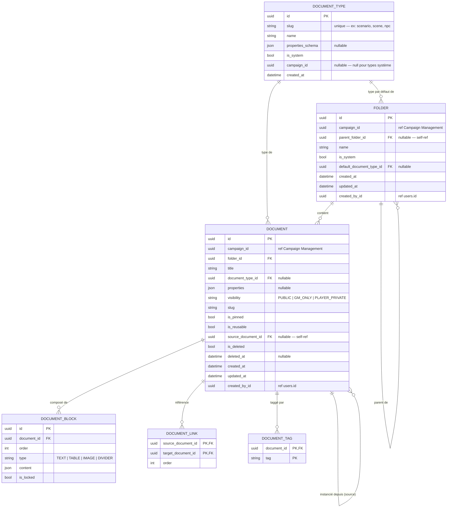

# Content Library — Modèle Conceptuel de Données (MCD)

```mermaid
erDiagram
    FOLDER {
        uuid id PK
        uuid campaign_id "ref Campaign Management"
        uuid parent_folder_id FK "nullable — self-ref"
        string name
        bool is_system
        uuid default_document_type_id FK "nullable"
        datetime created_at
        datetime updated_at
        uuid created_by_id "ref users.id"
    }

    DOCUMENT_TYPE {
        uuid id PK
        string slug "unique — ex: scenario, scene, npc"
        string name
        json properties_schema "nullable"
        bool is_system
        uuid campaign_id "nullable — null pour types système"
        datetime created_at
    }

    DOCUMENT {
        uuid id PK
        uuid campaign_id "ref Campaign Management"
        uuid folder_id FK
        string title
        uuid document_type_id FK "nullable"
        json properties "nullable"
        string visibility "PUBLIC | GM_ONLY | PLAYER_PRIVATE"
        string slug
        bool is_pinned
        bool is_reusable
        uuid source_document_id FK "nullable — self-ref"
        bool is_deleted
        datetime deleted_at "nullable"
        datetime created_at
        datetime updated_at
        uuid created_by_id "ref users.id"
    }

    DOCUMENT_BLOCK {
        uuid id PK
        uuid document_id FK
        int order
        string type "TEXT | TABLE | IMAGE | DIVIDER"
        json content
        bool is_locked
    }

    DOCUMENT_LINK {
        uuid source_document_id PK,FK
        uuid target_document_id PK,FK
        int order
    }

    DOCUMENT_TAG {
        uuid document_id PK,FK
        string tag PK
    }

    FOLDER ||--o{ DOCUMENT : "contient"
    FOLDER ||--o{ FOLDER : "parent de"
    DOCUMENT_TYPE ||--o{ DOCUMENT : "type de"
    DOCUMENT_TYPE ||--o{ FOLDER : "type par défaut de"
    DOCUMENT ||--o{ DOCUMENT_BLOCK : "composé de"
    DOCUMENT ||--o{ DOCUMENT_LINK : "référence"
    DOCUMENT ||--o{ DOCUMENT_TAG : "taggé par"
    DOCUMENT ||--o{ DOCUMENT : "instancié depuis (source)"
```
