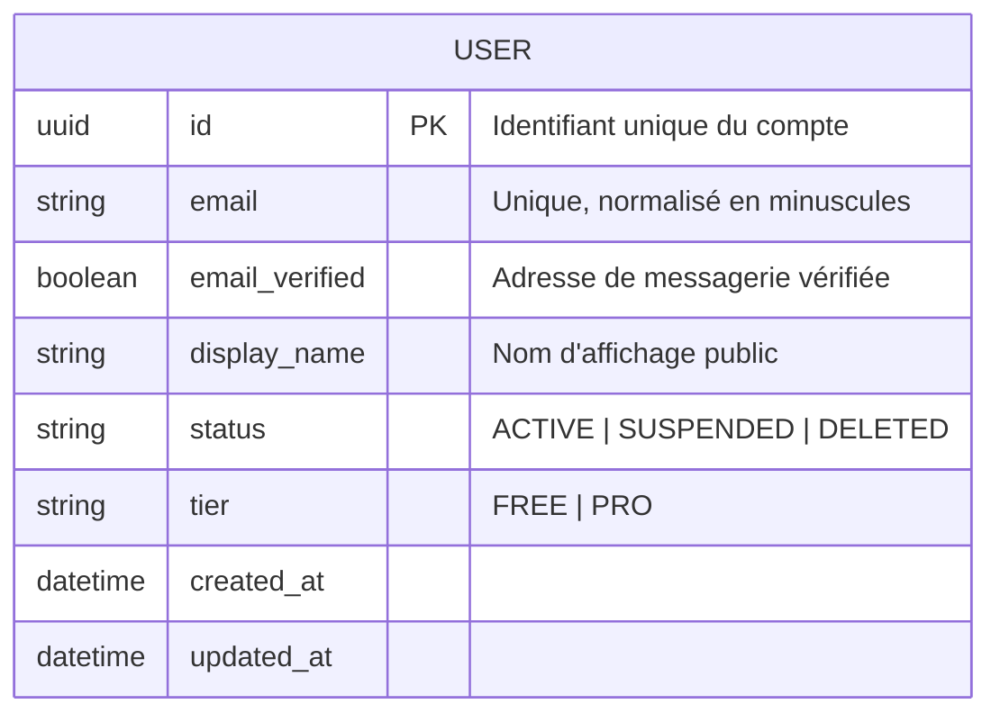

# Identity & Access — Modèle Conceptuel de Données (MCD)

Le bounded context Identity & Access a un seul concept central : le compte utilisateur.
Les détails d'authentification (mot de passe, tokens) sont délégués à l'infrastructure d'identité
et ne font pas partie du modèle conceptuel de domaine.

> **Note** : Le mode local (sans compte) n'est pas représenté ici —
> il n'y a pas de `User` en mode local. Les données locales vivent dans le stockage local du navigateur.

