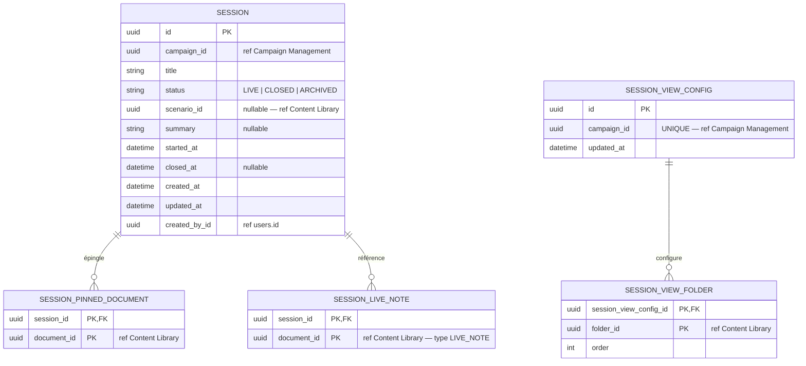

# Session Conduct — Modèle Conceptuel de Données (MCD)

```mermaid
erDiagram
    SESSION {
        uuid id PK
        uuid campaign_id "ref Campaign Management"
        string title
        string status "LIVE | CLOSED | ARCHIVED"
        uuid scenario_id "nullable — ref Content Library"
        string summary "nullable"
        datetime started_at
        datetime closed_at "nullable"
        datetime created_at
        datetime updated_at
        uuid created_by_id "ref users.id"
    }

    SESSION_PINNED_DOCUMENT {
        uuid session_id PK,FK
        uuid document_id PK "ref Content Library"
    }

    SESSION_LIVE_NOTE {
        uuid session_id PK,FK
        uuid document_id PK "ref Content Library — type LIVE_NOTE"
    }

    SESSION_VIEW_CONFIG {
        uuid id PK
        uuid campaign_id "UNIQUE — ref Campaign Management"
        datetime updated_at
    }

    SESSION_VIEW_FOLDER {
        uuid session_view_config_id PK,FK
        uuid folder_id PK "ref Content Library"
        int order
    }

    SESSION ||--o{ SESSION_PINNED_DOCUMENT : "épingle"
    SESSION ||--o{ SESSION_LIVE_NOTE : "référence"
    SESSION_VIEW_CONFIG ||--o{ SESSION_VIEW_FOLDER : "configure"
```
