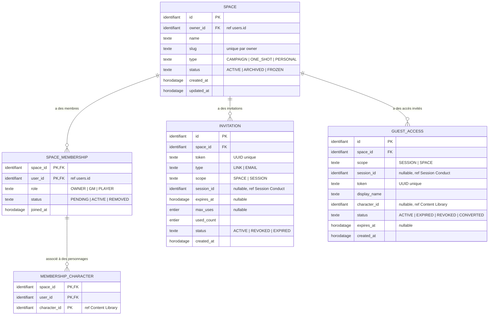

# Space Management — Modèle Conceptuel de Données (MCD)

> **Pas d'agrégat de pont `ScenarioLibrary`/`ScenarioLibraryEntry`** : la réutilisabilité est portée par `Document.isReusable` (Content Library) ; la bibliothèque personnelle du MJ est une vue filtrée de son espace `PERSONAL` (`type = PERSONAL` ∧ `isReusable = true`) — voir space-management.md § Scénario réutilisable (invariant 12, retiré) et ADR-018.
