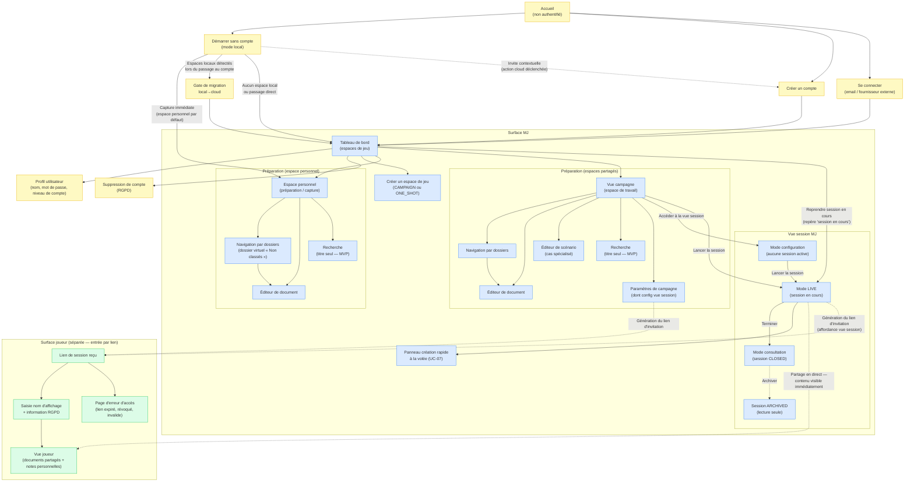

# Zoning d'interface — MVP Haversack

> Document de conception d'interface du MVP Haversack.
> Couche réflexive : porte la cohérence d'ensemble avant la production des wireframes.
> Périmètre : tout le MVP (décision opérateur du 2026-06-12, étendant l'arbitrage T-09 du 2026-06-10 initialement limité à la vue session).
> La vue session MJ reste l'écran prioritaire — support de validation de l'hypothèse H2.
> Statut : à valider par l'opérateur avant production des wireframes.
> Discipline : langage besoin, aucun nom de technologie.

---

## S1 — Préambule

Ce document décrit le zoning d'interface du MVP Haversack. Il constitue la couche réflexive de la conception : son rôle est de porter la cohérence d'ensemble avant que les wireframes ne soient produits, écran par écran. Il ne contient pas de wireframes, pas de gabarits, pas de légendes visuelles.

### Périmètre

Le périmètre couvre l'intégralité du MVP (décision opérateur du 2026-06-12, qui étend l'arbitrage T-09 du 2026-06-10 — initialement limité à la vue session — à l'ensemble des surfaces du produit). Parmi ces surfaces, la **vue session MJ reste l'écran prioritaire** : c'est le support de validation de l'hypothèse centrale du produit (H2 — un MJ paiera pour une vue dédiée qui réduit la friction de pilotage en session).

### Statut

Ce document est à valider par l'opérateur avant d'engager la production des wireframes. Toute décision d'arbitrage consignée ici (section S6) est figée ; les conditions de retour éventuelles sont explicitement nommées.

### Discipline

Tout ce document est rédigé en langage de besoin et de comportement observable. Aucun nom de technologie, de format de stockage, de bibliothèque ou de protocole n'y figure. Les formes cibles (grand écran, tablette, mobile) sont décrites en termes de contexte d'usage, pas d'implémentation.

### Principe directeur — fluidité de navigation

L'application offre une navigation sans rupture : passer d'une vue à l'autre — tableau de bord ↔ espace ↔ vue session, et au sein de chacune — est instantané ; les données restent à l'écran sans attente perceptible lors d'un changement de vue, et l'état de travail est préservé. Ce principe cadre tous les écrans du zoning. Il est la traduction, à l'échelle de l'application entière, de ce qu'AR-02 et AR-09 posent à l'échelle de la vue session : une surface qui change de mode, non un écran qui se recharge.

Ancrage besoin : NFR-PERF-01 (fluidité de navigation en session), NFR-PERF-02 (réactivité de la première interaction), NFR-PERF-03 (continuité sans interruption).

Décliné dans le châssis applicatif — S7.

---

## S2 — Colonne vertébrale et déterminants sourcés

### Ossature de navigation

L'ossature retenue est :

**Tableau de bord (espaces de jeu) → Espace → {Préparation | Vue session MJ}**

L'espace se décline en trois types : `CAMPAIGN` (campagne longue), `ONE_SHOT`, `PERSONAL` (espace personnel). **L'espace personnel mène uniquement à Préparation** — il n'a pas de vue session (surface mono-membre, sans joueurs). La **surface joueur** constitue un point d'entrée parallèle, séparé — accessible par lien direct, hors de l'arborescence espace. Le **mode local** est un état transversal, présent sur toutes les surfaces MJ tant que l'utilisateur n'a pas créé de compte.

### Les quatre déterminants

Ces quatre déterminants convergent tous vers la même ossature ; aucun ne la contredit.

**Déterminant (a) — Le contenu est scopé par espace**

Le contenu est rattaché à un espace (`Document.spaceId`). Dans la bibliothèque de contenu, tout document appartient à exactement un espace. Dans la conduite de session, toute session appartient à un espace partagé (`CAMPAIGN` ou `ONE_SHOT`). L'espace personnel (`SpaceType.PERSONAL`) est le conteneur par défaut qui reçoit tout contenu créé hors d'un espace partagé explicite — en mode local comme après création de compte. L'espace (`Space`) est l'agrégat racine et la frontière de cohérence.

Sources : domaine `content-library` (`Document.spaceId`) ; domaine `session-conduct` (`Session.spaceId`) ; domaine `space-management` (`Space` — agrégat racine, frontière de cohérence) ; UC-01 (contenu atterrit dans l'espace personnel par défaut, sans créer de campagne) ; UC-02 (l'espace personnel préexiste, non créé via ce parcours) ; vision §2.2.

**Déterminant (b) — La postcondition d'UC-02 exige un tableau de bord multi-espaces**

Après création d'une campagne, depuis le point d'entrée de l'application (tableau de bord), le MJ retrouve l'ensemble des espaces dont il est propriétaire ou membre, jusqu'à la limite de son niveau de compte. L'espace personnel figure dans cette liste (hors quota). Il peut passer de l'un à l'autre sans rupture.

Source : UC-02, postconditions — *« depuis le tableau de bord le MJ retrouve l'ensemble des espaces de jeu… passe de l'un à l'autre sans rupture »* ; UC-02 §Postconditions (l'espace personnel figure dans la liste).

**Déterminant (c) — Le lancement de session depuis la campagne est universel pour les MJ, mais le persona joueur entre par lien**

Pour les six parcours MJ (UC-06 §Déclencheur — « Le MJ clique sur "Lancer la session" »), le lancement s'effectue depuis la campagne. Cela vaut pour Antoine (multi-campagnes — parcours-05) et Sonia (one-shot MVP via campagne — parcours-07). Lucas, seul persona non-MJ, entre par un lien de session direct — hors arborescence espace — et accède immédiatement à la vue joueur sans passer par un tableau de bord ou un espace.

Sources : UC-06 §Déclencheur ; parcours-05 (Antoine, étapes 1-6) ; parcours-07 (Sonia, étape 1) ; UC-09 scénario A (Lucas, parcours-03 étape 1 — *« Lucas clique sur le lien. L'application affiche immédiatement les informations partagées »*).

**Déterminant (d) — Antoine multi-campagnes valide le besoin de tableau de bord**

Antoine mène trois campagnes simultanées avec trois groupes distincts. Son parcours (parcours-05) valide que le tableau de bord multi-espaces est une nécessité fonctionnelle, pas un confort : sans lui, le passage d'une campagne à l'autre en cours de semaine impose une navigation sans repère.

Source : persona-05 (Antoine) — *« trois campagnes simultanément »* ; parcours-05 étapes 2 et 6 — *« Antoine accède à son tableau de bord. Ses trois campagnes sont visibles »*.

### Précision fondamentale

La **séparation de la surface joueur est un déterminant de premier ordre** — corollaire direct du déterminant (c), confirmé par NFR-CONF-01. La vue joueur n'est pas une vue filtrée de la surface MJ ; c'est une surface construite séparément, qui n'expose aucune structure MJ et ne révèle pas l'existence d'un contenu non partagé. Cette séparation n'est pas une option d'implémentation — c'est une garantie de conception.

---

## S3 — Modèle de navigation

Le graphe ci-dessous couvre l'ensemble des surfaces et transitions du MVP, y compris le châssis de gestion de compte. Les transitions d'état de la vue session (configuration → LIVE → consultation CLOSED) et la séparation de la surface joueur sont représentées explicitement.

> Légende : fond bleu — surface MJ ; fond vert — surface joueur ; fond jaune — écrans transversaux.

---

## S4 — Inventaire des écrans MVP

### Écrans transversaux (hors espace)

Écrans non rattachés à un espace ; ils s'affichent dans le châssis applicatif (S7).

| Nom | Rôle | Surface | Contexte | Forme cible | UC / US / UJ couverts |
|---|---|---|---|---|---|
| **Accueil non authentifié** | Point d'entrée — présente les deux chemins (sans compte / avec compte) | Transversal | Transversal | Grand écran + tablette | UC-01, UC-10 |
| **Inscription** | Création de compte (email + nom d'affichage, ou fournisseur externe) | Transversal | Transversal | Grand écran + tablette | UC-10, UC-01 A1 |
| **Connexion** | Authentification (email/mot de passe ou fournisseur externe) | Transversal | Transversal | Grand écran + tablette | UC-10 |
| **Profil utilisateur** | Modification du nom d'affichage, du mot de passe ; affichage du niveau de compte | Transversal | Transversal | Grand écran + tablette | UC-10 A2 |
| **Suppression de compte (RGPD)** | Confirmation de suppression avec présentation des conséquences ; bloquée si campagnes actives avec membres | Transversal | Transversal | Grand écran + tablette | UC-10 A4 |
| **Gate de migration local→cloud** | Présentation des espaces locaux détectés ; confirmation explicite avant migration ; signale que la configuration de vue session n'est pas reprise et devra être reconfigurée | Transversal | Transversal | Grand écran + tablette | UC-10, UC-01 A1 |

> **Note migration** : après migration local→cloud, la configuration de la vue session (choix des panneaux affichés) n'est pas reprise — elle est recréée et le MJ la reconfigure. Source : UC-10 (règle de migration — la config vue session est recréée).

---

### Surface MJ — Tableau de bord

| Nom | Rôle | Surface | Contexte | Forme cible | UC / US / UJ couverts |
|---|---|---|---|---|---|
| **Tableau de bord des espaces de jeu** | Liste de tous les espaces dont le MJ est propriétaire ou membre ; inclut l'espace personnel (**hors quota**, visuellement distinct) et les espaces partagés décomptés du quota FREE ; accès rapide à chaque espace ; repère visuel « session en cours » si une session LIVE existe dans un espace partagé. **Sous-spécifié dans le corpus** — UC-02 énonce la postcondition mais ne décrit pas l'interface du tableau. | MJ | Transversal | Grand écran + tablette | UC-02 postcondition ; parcours-05 étapes 2 et 6 |
| **Création d'un espace de jeu** | Formulaire de création (nom obligatoire, description et système optionnels) pour les espaces partagés (`CAMPAIGN` ou `ONE_SHOT`) ; crée aussi les quatre dossiers système. L'espace personnel préexiste — il n'est pas créé via ce parcours. | MJ | Transversal | Grand écran + tablette | UC-02 scénario nominal |

---

### Surface MJ — Préparation

| Nom | Rôle | Surface | Contexte | Forme cible | UC / US / UJ couverts |
|---|---|---|---|---|---|
| **Vue campagne (espace de travail)** | Hub de l'espace partagé — point d'entrée vers les dossiers, les documents, la vue session, les paramètres et l'invitation de joueurs. La même surface de préparation (navigation dossiers, éditeur, recherche) sert l'espace personnel en **version réduite** : sans configuration de vue session, sans invitation de joueurs. | MJ | Préparation | Grand écran + tablette | UC-02, UC-03, UC-04, UC-05, UC-06, UC-08, UC-11 |
| **Navigation par dossiers** | Arborescence des dossiers de l'espace ; affichage des documents en vue condensée ; accès à la création d'un document dans le dossier courant. Pour l'espace personnel : arborescence débutant avec le seul dossier virtuel « Non classés » à la création, complétée des dossiers créés librement par le propriétaire (aucun dossier système nommé). | MJ | Préparation | Grand écran + tablette | UC-05 scénario nominal ; UJ-UC-05 |
| **Éditeur de document** | Création et modification d'un document (titre, type optionnel, propriétés structurées optionnelles, blocs libres, visibilité, liens) ; **non spécifié visuellement dans le corpus** — la structure de contenu est décrite par UC-04 mais l'interface de l'éditeur n'est pas détaillée | MJ | Préparation | Grand écran + tablette | UC-04, UC-07 |
| **Éditeur de scénario** | Cas spécialisé de l'éditeur pour les documents de type scénario — structure narrative (scènes liées, documents associés) ; cas d'usage documenté par UC-03. Disponible dans les espaces partagés comme dans l'espace personnel. | MJ | Préparation | Grand écran + tablette | UC-03 |
| **Recherche en préparation** | Barre de recherche globale dans le contenu de l'espace ; **titre seul au MVP** ; résultats regroupés par type. Disponible pour tous les types d'espace, y compris l'espace personnel. | MJ | Préparation + session | Grand écran + tablette | UC-14 ; US-UC-14 |
| **Paramètres de campagne** | Configuration de la vue session (dossiers mis en avant, ordre) ; export d'espace (Should Have) ; archivage de l'espace ; génération du lien d'invitation. Réservé aux espaces partagés (`CAMPAIGN`/`ONE_SHOT`). | MJ | Préparation | Grand écran + tablette | UC-06 Phase 2 (config view) ; UC-02 (archivage) ; UC-11 (lien) |

---

### Surface MJ — Vue session (hub central)

| Nom | Rôle | Surface | Contexte | Forme cible | UC / US / UJ couverts |
|---|---|---|---|---|---|
| **Vue session MJ** *(livrable prioritaire)* | Hub central de pilotage de session — tableau de bord configurable avec panneaux de dossiers, zone de notes co-présente, recherche, épinglage, partage ; disponible en trois modes (configuration / LIVE / consultation CLOSED) selon le statut de la session. Réservé aux espaces partagés (`CAMPAIGN`/`ONE_SHOT`). | MJ | Session | Grand écran + tablette | UC-06, UC-07, UC-08, UC-14 ; US-06-01 à US-06-10 ; UJ-UC-06 |
| **Panneau de création rapide à la volée** | Formulaire minimal (titre seul obligatoire) permettant de créer un document ou une note de session sans quitter la vue session ; le document créé est automatiquement épinglé | MJ | Session | Grand écran + tablette | UC-07 ; UJ-UC-07 |

---

### Surface joueur (séparée)

| Nom | Rôle | Surface | Contexte | Forme cible | UC / US / UJ couverts |
|---|---|---|---|---|---|
| **Accès par lien + saisie du nom d'affichage** | Première page visible par le joueur à l'ouverture du lien ; présente les informations partagées par le MJ ; demande uniquement un nom d'affichage ; information RGPD sur la durée de conservation | Joueur | Session | Grand écran + tablette (mobile structuré non implémenté au MVP) | UC-09 scénario A ; RB-09-20 |
| **Vue joueur post-accès** | Consultation des documents partagés par le MJ ; prise de notes personnelles pendant une session LIVE ; fiche du personnage associé si disponible | Joueur | Session | Grand écran + tablette | UC-12, UC-06 §vue joueur ; US-06-07, US-06-08 |
| **Page d'erreur d'accès** | Message sobre en cas de lien expiré, révoqué ou invalide ; ne révèle pas l'existence de la campagne | Joueur | Transversal | Grand écran + tablette | UC-09 A3, E1, E2 |

---

### Surface MJ — Accès (périmètre Should, fraction Must wireframée)

| Nom | Rôle | Surface | Contexte | Forme cible | UC / US / UJ couverts |
|---|---|---|---|---|---|
| **Affordance de génération de lien d'invitation** | Action logée dans la vue session ou la vue campagne ; génère le lien de session ponctuel partageable ; correspond à la fraction Must tirée d'UC-08/09 | MJ | Session / Préparation | Grand écran + tablette | UC-06 (lien ponctuel), UC-11 A4 |

> **Différé, inventorié non wireframé** : l'écran Membres complet (UC-11 — gestion de l'ensemble des membres, révocations, associations joueur-personnage) est inventorié mais non wireframé au MVP (Should Have — voir AR-10). L'enrichissement de la vue joueur au niveau campagne (UC-12 complet) est également différé.

---

## S5 — Table de couverture UC → écran(s)

| Use Case | Écran(s) porteur(s) |
|---|---|
| **UC-01** — Mode local sans compte | Accueil non authentifié ; Inscription (invite contextuelle A1) ; châssis mode local (bandeaux transversaux) ; espace personnel (capture immédiate, hors quota FREE — RB-01-01/RB-01-03) |
| **UC-02** — Créer un espace de jeu | Tableau de bord des espaces de jeu ; Création d'un espace de jeu (espaces partagés uniquement — l'espace personnel préexiste, non créé via ce parcours) |
| **UC-03** — Structurer un scénario | Éditeur de scénario |
| **UC-04** — Gérer les documents d'un espace | Éditeur de document ; Navigation par dossiers |
| **UC-05** — Organiser par dossiers | Navigation par dossiers ; Vue campagne (espace de travail) ; Paramètres de campagne |
| **UC-06** — Utiliser la vue session | Vue session MJ (tous modes) ; Panneau de création rapide à la volée |
| **UC-07** — Créer un élément à la volée | Panneau de création rapide à la volée |
| **UC-08** — Partager une information aux joueurs | Vue session MJ (mode LIVE) ; Affordance de génération de lien d'invitation |
| **UC-09** — Accès joueur via lien | Accès par lien + saisie du nom d'affichage ; Vue joueur post-accès ; Page d'erreur d'accès |
| **UC-10** — Créer un compte et synchroniser dans le cloud | Inscription ; Connexion ; Profil utilisateur ; Suppression de compte (RGPD) ; Gate de migration local→cloud |
| **UC-11** — Gérer les membres d'une campagne | Affordance de génération de lien d'invitation (fraction Must) ; *Écran Membres complet = différé* |
| **UC-12** — Consulter sa campagne en tant que joueur (vue post-accès) | Vue joueur post-accès (fraction de base ; enrichissement campagne différé — AR-10) |
| **UC-13** — Utiliser un scénario réutilisable | Hors périmètre wireframe MVP (post-MVP) — l'interface de bibliothèque « Mes scénarios » se logera dans l'espace personnel (AR-08 révisé) |
| **UC-14** — Rechercher rapidement une information | Recherche en préparation ; Vue session MJ (recherche omniprésente) |

> **Zones sans UC propre** : le Tableau de bord des espaces de jeu est porté par la postcondition d'UC-02, sans UC qui lui soit dédié. Les Paramètres de campagne agrègent des fonctions de plusieurs UC (config vue session = UC-06 Phase 2, export = Should Have, archivage = UC-02, lien d'invitation = UC-11) sans UC propre. L'espace personnel est porté par UC-01 (capture hors campagne), UC-04 (gestion documents, tout espace) et moscow §Espace personnel (Must Have), sans UC dédié.

---

## S6 — Arbitrages tracés

### AR-01 — Ossature de navigation — arbitrage du 2026-06-12 (révisé 2026-06-18)

**Décision** : l'ossature retenue est **Tableau de bord (espaces de jeu) → Espace → {Préparation | Vue session MJ}**, l'espace se déclinant en trois types (`CAMPAIGN`, `ONE_SHOT`, `PERSONAL`). L'**espace personnel se branche uniquement sur Préparation** (mono-membre, pas de session — `session-conduct.md` ; invariant 5). Le tableau de bord le liste **hors quota** (UC-01, RB-01-03). La **surface joueur** constitue un point d'entrée parallèle par lien. Le **mode local** est un état transversal.

**Raison d'être produit** : les quatre déterminants (S2) convergent sans exception vers cette ossature. Le contenu est scopé par espace (`Document.spaceId`) — l'espace personnel est le conteneur par défaut pour tout contenu créé hors espace partagé explicite (UC-01 ; UC-02). La postcondition d'UC-02 exige un tableau de bord multi-espaces lisible où l'espace personnel figure (UC-02 §Postconditions), validé par le persona Antoine (trois campagnes simultanées). Le lancement de session depuis la campagne est universel pour les MJ (six parcours) — ce qui positionne l'espace comme nœud de transit naturel. Lucas entre par lien direct — ce qui sépare structurellement la surface joueur de l'arborescence MJ. L'espace personnel n'a pas de vue session : `session-conduct.md` (invariant : pas de `SessionViewConfig` pour PERSONAL) établit qu'un espace `PERSONAL` n'a pas de `SessionViewConfig` ni de session — le partage temps réel et la vue joueur présupposent un groupe de jeu absent d'un espace mono-membre. H1 (vision §2.3) confirme.

**Alternatives considérées** : entrée directe sur l'espace sans tableau de bord — écartée, car elle contredirait la postcondition d'UC-02 et bloquerait Antoine. Surface joueur intégrée sous l'espace — écartée, car elle violerait NFR-CONF-01 (la séparation est une garantie de conception, pas un filtre). Doter l'espace personnel d'une vue session — écarté, car `session-conduct.md` l'exclut explicitement (pas de `SessionViewConfig` sur `PERSONAL`). Masquer l'espace personnel du tableau de bord — écarté, car UC-02 §Postconditions l'y inscrit explicitement et H1 le confirme.

**Condition de retour** : aucune sur l'ossature.

---

### AR-02 — Préparation et vue session = surfaces distinctes ; vue session = une surface à modes — arbitrage du 2026-06-12

**Décision** : la préparation et la vue session sont **deux surfaces distinctes**. La configuration de la vue session hors-LIVE est un **mode de la vue session** (mode configuration), pas une troisième surface ni un panneau de réglages séparé.

> *Note d'articulation* : la branche « Vue session » de l'ossature est **absente pour l'espace personnel** — conséquence directe d'AR-01 (espace `PERSONAL` sans `SessionViewConfig` ni session).

**Raison d'être produit** : NFR-PERF-01 exige que la navigation en session soit fluide et ne casse pas le rythme de table — ce qui impose une surface optimisée pour la vitesse, distincte de la préparation posée. NFR-ACC-04 confirme l'opposition des contextes de lecture (lecture rapide à distance en session, lecture posée en préparation). US-06-02 prescrit que la configuration de la vue session soit accessible en mode édition sans lancer de session, sans créer de session, et sans panneau paramètres séparé : *« Pas de panneau paramètres séparé — la config se fait directement dans la vue session »* ; *« La vue session est accessible en mode édition sans lancer de session »*. Ces contraintes font de la configuration un mode de la vue session, non une surface indépendante.

**Alternatives considérées** : un seul écran préparation + session — écarté, car les contextes de lecture sont opposés et la confusion entre les deux modes serait une source de friction (UJ-UC-06 §friction). Un écran de réglages séparé — écarté, car US-06-02 l'interdit explicitement.

**Condition de retour** : aucune.

---

### AR-03 — Séparation radicale surface MJ / surface joueur — arbitrage du 2026-06-12

**Décision** : la vue joueur **n'expose aucune structure MJ** et **ne révèle pas l'existence d'un document non partagé**.

**Raison d'être produit** : NFR-CONF-01 garantit que la séparation entre les notes privées du MJ et la vue des joueurs est permanente et ne dépend d'aucune action supplémentaire du MJ — c'est une *garantie de conception*, pas une configuration utilisateur. Les règles métier RB-06-08, RB-06-24 et RB-06-25 précisent que les documents non partagés sont invisibles depuis la vue joueur, quels que soient le rôle, le type de document ou le mode d'accès, et que toute tentative d'accès direct ne révèle pas l'existence du document. Cette garantie conditionne la confiance des MJ qui préparent des informations secrètes : Thomas ne confierait pas 10 % de ses notes à un outil dont la frontière privé/visible dépend de son attention constante (NFR-CONF-01 §Raison d'être).

**Alternatives considérées** : vue joueur = vue MJ filtrée — écartée, car la garantie de conception serait réduite à une garantie d'exécution, insuffisante pour NFR-CONF-01.

**Condition de retour** : aucune (invariant de confidentialité).

---

### AR-04 — Vue session épurée par défaut, zone de notes co-présente — arbitrage du 2026-06-12

**Décision** : par défaut (vue non configurée), la vue session est **épurée** ; la **zone de notes de session est co-présente et jamais masquée par défilement** ; la densité est construite par configuration ; le défaut est calibré pour qui ne configure pas (Émilie, Nadia). Le défaut épuré reste **assez informatif** pour retrouver un élément dans un dossier dense : un panneau condensé montre titre et repère de type, afin de ne pas desservir le besoin d'accès rapide.

**Raison d'être produit** : UJ-UC-06 §friction identifie explicitement que la zone de notes peut être noyée si les panneaux occupent tout l'espace : *« Zone de saisie non visible sans scroll si les panneaux occupent tout l'espace »* — ce point de friction justifie que la zone de notes soit co-présente par construction, indépendamment de la configuration. Les personas Émilie (improvisatrice, notes intensives, pas de configuration initiale) et Nadia (lancement rapide, peu de configuration) constituent les profils qui définissent le défaut : si le défaut ne leur convient pas, le produit les exclut dès la première session. La tension « épuré mais informatif » est également signalée par UJ-UC-06 §friction (scénario Nadia : trouver un PNJ dans un dossier dense ; *« vue mal organisée / condensée pas assez informative »*) et confirmée par NFR-ACC-04.

**Alternatives considérées** : vue dense multi-panneaux par défaut — écartée, car elle pénalise les profils qui ne configurent pas et amplifie la friction de démarrage pour Nadia et Émilie.

**Condition de retour** : si l'usage révèle que la majorité des MJ configure dès la première session, le défaut pourra être enrichi.

---

### AR-05 — Vocabulaire « campagne » et « espace personnel » — arbitrage du 2026-06-12 (révisé 2026-06-18)

**Décision** : le terme **« campagne »** est utilisé en surface (boutons, titres, labels) pour les espaces de type `CAMPAIGN` ; le terme « espace de jeu » ne figure jamais dans l'interface — c'est un terme de conception. **L'espace personnel est nommé « Espace personnel » en surface** — ni « campagne », ni « espace de jeu », ni « bibliothèque ».

**Raison d'être produit** : UC-02 scénario nominal utilise « Nouvelle campagne » comme intitulé du bouton de création ; US-UC-02 confirme ce vocabulaire. Exposer « espace de jeu » en surface créerait un décalage entre la langue des personas et la langue de l'interface, sans bénéfice utilisateur. Pour l'espace personnel : le glossaire (entrée `Espace personnel`) fait autorité sur la forme ; nommer cet espace « campagne » est factuellement faux (mono-membre, pas de jeu partagé) ; « espace de jeu » est faux (ni session ni joueurs) ; « bibliothèque » anticipe une fonction post-MVP.

**Alternatives considérées** : « espace de jeu » en label — écartée, car le terme n'est pas naturel pour les personas cibles. Libellé d'usage « Mes notes » ou « Brouillons » pour l'espace personnel — écarté, car il diverge du glossaire (autorité de forme) ; à n'ouvrir qu'en interview.

**Condition de retour** : libellé de surface de l'espace personnel = point d'interview (UC-02 §Questions à valider en interview). À l'arrivée du point d'entrée one-shot dédié (UC-13, post-MVP), réexaminer le seul libellé du bouton de ce point d'entrée.

---

### AR-06 — Partage temps réel côté joueur : apparition ambiante, disparition symétrique, pas de notification active MVP — arbitrage du 2026-06-12

**Décision** : l'apparition d'un document partagé est **immédiate et ambiante** (repère de nouveauté discret) ; le retrait d'un partage fait **disparaître le contenu en direct** côté joueur (symétrique) ; **aucune notification active** (toast, badge) au MVP. Cette « apparition ambiante » concerne la couche **visuelle** ; le changement de visibilité côté joueur **reste annoncé** aux outils de lecture d'écran sans action de l'utilisateur (annonce assistive ≠ notification UX visuelle) — NFR-ACC-02.

**Raison d'être produit** : UC-06 précise que les joueurs voient immédiatement les documents partagés lors d'une session LIVE. UC-08 A1 et UC-06 précisent que le retrait d'un partage rend le document invisible pour les joueurs — la symétrie est une conséquence directe du modèle de visibilité. NFR-ACC-04 précise que la vue joueur est utilisée pendant une session, potentiellement sur mobile, dans des conditions de lecture rapide — une notification active serait intrusive et distrairait de la table. La question d'une notification active est explicitement ouverte dans US-06 (*« non décidé MVP »*). NFR-ACC-02 §Critères impose que les changements d'état dynamiques soient annoncés aux outils de lecture d'écran sans action de l'utilisateur — cette exigence est orthogonale à l'absence de notification UX visuelle.

**Alternatives considérées** : notification active (toast, badge) au moment du partage — écartée, car elle n'est pas décidée dans le corpus et constitue un angle d'interview (US-06 §Questions ouvertes).

**Condition de retour** : la notification active est un point d'interview (US-06 §Questions ouvertes) ; si les entretiens révèlent que les joueurs ratent systématiquement les nouveaux partages, elle sera réévaluée.

---

### AR-07 — Forme cible : laptop/tablette + responsive, mobile pensé non implémenté — arbitrage du 2026-06-12

**Décision** : la cible de référence est **grand écran laptop + tablette** ; la logique responsive s'applique entre les deux ; le mobile est **pensé dans la structure (non bloqué) mais non implémenté au MVP** — aucun wireframe mobile. La vue session est conçue comme un ensemble de **panneaux dont le nombre visible se réduit** quand la largeur diminue (repli vers un panneau focus + rail de bascule), la **zone de notes restant prioritaire** — pour que le wireframe mobile futur soit une adaptation, pas une refonte.

**Raison d'être produit** : NFR-ACC-04 décrit l'usage à *« distance normale de l'écran »* lors d'une session à table — contexte qui correspond à un laptop ou une tablette, pas à un smartphone tenu à la main. Le corpus signale la vue joueur mobile comme angle d'interview (NFR-ACC-04, INTERVIEW_GUIDE Q8) mais ne la prescrit pas comme exigence MVP. La décision de l'opérateur (2026-06-12) est de reporter les wireframes mobiles sans bloquer l'implémentation mobile future. La contrainte de disposition repliable (panneaux réductibles, zone de notes prioritaire) ancre la structure responsive dès le design laptop — NFR-ACC-04 (lecture à distance) conforte la hiérarchie des zones.

**Alternatives considérées** : vue joueur mobile critique dès le MVP — écartée par décision opérateur, le corpus la signalait comme angle d'interview non tranché ; ne rien présupposer sur la forme (wireframes uniquement desktop) — écartée, car la structure doit rester compatible avec le mobile pour ne pas créer de dette.

**Condition de retour** : si les entretiens révèlent un accès joueur majoritairement par smartphone (INTERVIEW_GUIDE Q8), les wireframes mobiles seront produits en priorité de la vague suivante.

---

### AR-08 — UC-13 et espace personnel — arbitrage du 2026-06-12 (ré-arbitré 2026-06-18)

**Décision** : l'ancienne « réservation logique zéro pixel » du tableau de bord est **caduque**. Au MVP : l'espace personnel **est** le foyer réutilisable réel, visible et accessible au tableau de bord — plus rien à « réserver » : la place est occupée par un espace réel. Post-MVP : l'**interface de bibliothèque « Mes scénarios »** (vue filtrée `isReusable = true`, parcours « Rejouer », instanciation cross-espace, historique des runs) reste hors première livraison — elle se logera **dans** l'espace personnel (pas un nouveau nœud de navigation), ce qui résout par construction la dette de navigation que l'ancien AR-08 prévenait. Au point d'entrée « Mes scénarios » décrit par UC-13 (tableau de bord), cette interface post-MVP se présentera comme un **raccourci vers une vue filtrée interne à l'espace personnel** (documents `isReusable = true`), et non comme une surface de premier ordre distincte — d'où l'absence de nouveau nœud d'arborescence. La prétention « résout la dette par construction » s'entend exactement ainsi. Dans la table de couverture S5, UC-13 (post-MVP) est articulé avec cet arbitrage.

**Raison d'être produit** : UC-13 (bibliothèque = espace personnel, subsomption) ; moscow §UC-13 (interface bibliothèque post-MVP) ; vision §5bis (espace personnel réel au MVP).

**Alternatives considérées** : conserver la réservation invisible dans le tableau de bord — factuellement faux dès lors que l'espace personnel existe et y figure ; wireframer l'interface bibliothèque au MVP — UC-13 post-MVP.

**Condition de retour** : à la promotion d'UC-13 (interface bibliothèque).

---

### AR-09 — Modèle de transition d'état de la vue session — arbitrage du 2026-06-12

**Décision** : la vue session est **une surface unique à 3 modes** (configuration / LIVE / consultation CLOSED) ; la machine d'états est **unidirectionnelle** (LIVE → CLOSED → ARCHIVED, sans pause ni retour) ; **« Lancer la session » est accessible depuis la vue session (mode configuration) ET depuis la vue campagne** ; une session LIVE interrompue **reste LIVE** et se **reprend en un clic** depuis le tableau de bord ou la vue campagne (repère « session en cours ») ; la disposition configurée **persiste** entre les modes ; un **indicateur de statut omniprésent** matérialise le mode courant.

**Raison d'être produit** : US-06-02 précise que la vue session est accessible en mode édition sans lancer de session (mode configuration). UC-06 §Déclencheur indique que le bouton « Lancer la session » est présent dans la vue campagne. RB-06-21 prescrit la machine d'états unidirectionnelle. UC-06 A5 décrit la reprise depuis le tableau de bord ou la vue campagne : *« Le MJ accède à la session depuis la vue campagne. La session est déjà au statut LIVE. »* UJ-UC-06 §friction identifie la confusion entre les modes comme source de friction : *« Statut CLOSED peu visible — MJ peut penser être en LIVE »* — ce point justifie l'indicateur de statut omniprésent.

**Alternatives considérées** : 3 écrans distincts (configuration, session, consultation) — écarté, car US-06-02 interdit le panneau de réglages séparé et la mise en session impose un changement d'écran injustifié. Pause/reprise d'une session close — écarté, car la machine d'états RB-06-21 est explicitement unidirectionnelle.

**Condition de retour** : aucune (contraint par la machine d'états du domaine).

---

### AR-10 — Périmètre UC-11 / UC-12 : fraction Must wireframée — arbitrage du 2026-06-12

**Décision** : wireframer la **fraction tirée dans le Must** (affordance de génération de lien d'invitation + vue joueur de base + page d'erreur) ; **différer** l'écran Membres complet (UC-11) et l'enrichissement de la vue joueur au niveau campagne (UC-12).

**Raison d'être produit** : UC-08 et UC-09 sont Must Have et nécessitent tous deux un mécanisme de génération de lien de session (logé dans la vue session ou la vue campagne) et une vue joueur de base permettant la consultation des documents partagés. Ces éléments sont le minimum indispensable pour valider l'hypothèse H2 (partage et accès joueur). En revanche, l'écran Membres complet (révocations, associations joueur-personnage, gestion des invitations permanentes) et l'enrichissement de la vue joueur (historique de campagne, sélection de personnage) relèvent d'UC-11 et UC-12 qui sont Should Have.

**Alternatives considérées** : tout wireframer (UC-11 complet + UC-12 enrichi) — écarté, car cela étend le périmètre wireframe au-delà du Must sans validation préalable des flux prioritaires. Ne rien wireframer pour UC-11/12 — écarté, car UC-08/09 Must Have ne peuvent pas fonctionner sans lien d'invitation ni vue joueur de base.

**Condition de retour** : à la promotion d'UC-11 et UC-12 en livraison.

---

### AR-11 — Navigation contenu : dossier épine dorsale + recherche + backlink — arbitrage du 2026-06-12

**Décision** : la navigation par dossiers est l'épine dorsale (un document appartient à **exactement un dossier** ; le dossier virtuel « Non classés » fait office de repli) ; la recherche est un **accélérateur omniprésent** (MVP : titre seul) ; les backlinks sont **consultables depuis la fiche cible** — le **placement « Référencé par » est une recommandation, non une décision figée**. Dans l'espace personnel, l'arborescence démarre **sans dossiers nommés** — seul « Non classés » à la création ; le propriétaire organise librement (voir AR-16 pour le détail). En session, les résultats de recherche s'ouvrent dans un **panneau latéral sans interrompre le contexte** de la vue session.

**Raison d'être produit** : UC-05 prescrit qu'un document appartient toujours à exactement un dossier (`dossier associé` non-nullable) — ce qui fonde l'unicité d'appartenance. UC-05 A4 mentionne le dossier virtuel « Non classés » comme repli pour les documents sans dossier explicite. UC-14 prescrit la recherche par titre seul au MVP, omniprésente (préparation et session). La vision produit §2.2 mentionne les backlinks comme élément du système documentaire. UJ-UC-04 utilise le label « Référencé par » dans la description des opportunités UX, mais US-UC-04 reste plus souple sur ce point — ce qui justifie de traiter le placement comme recommandation révisable. Le rendu non disruptif des résultats de recherche en session est sourcé par UJ-UC-06 §Opportunités UX (*« résultats de recherche ouverts dans un panneau latéral sans interrompre le contexte de session »*) et NFR-PERF-04.

**Alternatives considérées** : multi-dossiers par document — écartée, car UC-05 prescrit explicitement l'unicité d'appartenance.

**Condition de retour** : le placement du bloc « Référencé par » est révisable (recommandation d'UJ).

---

### AR-12 — Partager ≠ épingler : deux affordances, auto-épinglage en LIVE — arbitrage du 2026-06-12

**Décision** : deux affordances **distinctes** dans l'interface ; en session LIVE, partager **auto-épingle** (sens unique partage → épingle, jamais l'inverse) ; un **indicateur permanent « visible par les joueurs »** est distinct de l'état épinglé.

**Raison d'être produit** : UC-08 prescrit que l'épinglage et la visibilité sont des opérations indépendantes — retirer le partage d'un document épinglé ne le retire pas du panneau des documents épinglés. UC-08 A3 prescrit l'auto-épinglage en LIVE : *« Lorsque la session est en statut LIVE, le document partagé est automatiquement ajouté aux documents épinglés »* — sens unique. UC-06 confirme qu'un document épinglé mais non partagé n'est pas visible dans la vue joueur : l'épinglage n'est pas un partage implicite. Ces deux règles rendent indispensable la distinction visuelle entre « partagé » et « épinglé » dans l'interface.

**Alternatives considérées** : fusionner partager + épingler (épingler = partager implicitement) — écartée, car UC-08 prescrit explicitement l'indépendance des deux opérations.

**Condition de retour** : aucune.

---

### AR-13 — Sans-compte → compte : invite contextuelle — arbitrage du 2026-06-12

**Décision** : la transition du mode local vers le compte s'effectue au **point de friction**, par une invite contextuelle ; les fonctions cloud sont **visibles mais désactivées** avec une invite explicite ; **jamais de watermark** ; l'invite met en avant la connexion via fournisseur externe (un geste) pour minimiser le coût d'inscription à l'instant de bascule. En mode local, **la capture atterrit immédiatement dans l'espace personnel par défaut, sans création de compte ni d'espace préalable** ; l'invite contextuelle ne se déclenche qu'au franchissement d'une frontière cloud (partage, multi-device), **jamais à la capture**.

**Raison d'être produit** : UC-01 A1 prescrit que l'invite apparaît lorsque le MJ déclenche une action nécessitant un compte : *« L'application affiche une invite contextuelle : 'Cette fonctionnalité nécessite un compte.' »* La vision produit §3 décrit le modèle de monétisation non-agressif : la valeur est perçue avant l'engagement. Imposer un compte au démarrage ou cacher les fonctions cloud priverait le MJ de la visibilité sur ce qu'il obtiendrait, et violerait le différenciant « friction d'entrée nulle ». UC-10 offre la connexion via fournisseur externe en un geste — c'est le chemin le moins coûteux à l'instant de bascule. La capture immédiate dans l'espace personnel est sourcée par UC-01 et RB-01-01 — elle renforce le différenciant « friction d'entrée nulle » en rendant la valeur immédiatement perceptible.

**Alternatives considérées** : watermark ou fonctions cachées — écartées, car elles réduisent la surface de valeur perçue avant engagement. Imposer le compte au démarrage — écarté, car cela contredit UC-01 et le différenciant n°1 de la vision. Déclencher l'invite à la capture — écarté, la capture est la proposition de valeur de départ ; déclencher une friction au premier acte est contraire à l'onboarding capture-first.

**Condition de retour** : aucune.

---

### AR-14 — Espace personnel opérationnel au MVP, à surface réduite — arbitrage du 2026-06-18

**Décision** : l'espace personnel est une **destination réelle dès le MVP**, dotée de la surface Préparation (navigation dossiers, éditeur, recherche). Il est **privé de vue session, surface joueur, partage et gestion de membres** — sa surface est un sous-ensemble strict de celle d'un espace partagé. L'espace personnel n'est pas une « campagne amputée » avec des fonctions grisées : la vue session et la surface joueur sont **absentes**, pas désactivées (elles n'ont pas de sens pour un espace mono-membre).

**Raison d'être produit** : moscow §Espace personnel (Must Have) et vision §5bis tranchent le timing MVP. L'invariant 13 de `space-management.md` établit le mono-membre (pas d'`AddMember`, pas de `CreateInvitation`, pas de `GuestAccess`). `session-conduct.md` (invariant : pas de `SessionViewConfig` pour PERSONAL) établit qu'un espace `PERSONAL` n'a pas de `SessionViewConfig` — il n'y a ni joueurs, ni vue session joueur, ni partage temps réel. H1 (vision §2.3) confirme.

**Alternatives considérées** : schéma anticipé + comportement post-MVP (timing MVP tranché par l'opérateur). Surface identique à un espace partagé avec vue session grisée — écarté : la session n'a pas de sens pour un espace mono-membre ; grisé crée de la confusion là où l'absence est la bonne réponse.

**Condition de retour** : reports domaine non bloquants (sémantique `ARCHIVED`/`FROZEN` d'un espace `PERSONAL` — cf. S9, non tranchée à ce stade).

---

### AR-15 — Onboarding capture-first — arbitrage du 2026-06-18

**Décision** : à la première ouverture (mode local comme compte), l'utilisateur arrive sur une surface où il **crée du contenu immédiatement** ; ce contenu atterrit dans l'espace personnel **sans étape de création d'espace** ; créer un espace partagé est un acte distinct et optionnel, proposé non imposé.

**Raison d'être produit** : UC-01 et RB-01-01 établissent que tout contenu créé sans espace explicite atterrit dans l'espace personnel par défaut, dès le mode local. La vision §2.2 et les personas Nadia (lancement rapide) et Rémi (MJ en découverte) illustrent le besoin de démarrer sans friction.

**Alternatives considérées** : atterrissage sur tableau de bord vide invitant à créer une campagne — réintroduit la friction d'entrée que le différenciant n°1 cherche à éliminer. Micro-choix « capturer / créer une campagne » à l'arrivée — friction à l'entrée, écarté ; point d'interview (UC-01).

**Condition de retour** : point d'interview (UC-01) — le parcours d'onboarding exact reste à valider en entretien.

---

### AR-16 — Dossiers de l'espace personnel — arbitrage du 2026-06-18

**Décision** : un espace personnel est créé avec **uniquement le dossier virtuel « Non classés »** ; aucun des quatre dossiers système nommés (Personnages, Joueurs, Scénarios, Notes) ; le propriétaire crée ses propres dossiers selon son organisation.

**Raison d'être produit** : `content-library.md` (agrégat `Folder`) fait autorité : à la réception de `SpaceCreated`, pour `PERSONAL`, seul le dossier virtuel « Non classés » est créé automatiquement — les quatre dossiers système nommés sont réservés aux espaces `CAMPAIGN` et `ONE_SHOT`. Invariant 4 de `content-library.md` ; glossaire entrée `Espace personnel` confirment. Les concepts « Personnages » et « Joueurs » présupposent un groupe de jeu absent d'un espace mono-membre.

**Alternatives considérées** : doter l'espace personnel des quatre dossiers système — sémantiquement vide (pas de joueurs, pas de groupe) et contraire aux sources. Aucun dossier du tout — « Non classés » virtuel est obligatoire : il garantit qu'un document créé sans dossier explicite dispose toujours d'un rattachement.

**Condition de retour** : aucune (contraint par le domaine — `content-library.md`).

---

### AR-17 — Expression en surface du quota FREE excluant l'espace personnel — arbitrage du 2026-06-18

**Décision** : le quota FREE (3 espaces `CAMPAIGN`/`ONE_SHOT`) **n'inclut jamais l'espace personnel** ; en surface, l'espace personnel est un conteneur permanent **hors-compteur, visuellement distinct**, **jamais bloqué ni grisé** ; le compteur visible (ex. « X / 3 ») ne porte que sur les espaces partagés.

**Raison d'être produit** : `space-management.md` invariant 6 et règle 6 établissent que l'espace `PERSONAL` n'est pas décompté du quota. Moscow §Quota FREE et UC-01 (RB-01-03) confirment. Afficher l'espace personnel dans le compteur induirait le MJ en erreur sur le quota restant.

**Alternatives considérées** : espace personnel dans le compteur — induirait en erreur sur le quota restant. Même liste sans badge de décompte — ambigu sur ce qui compte et ce qui ne compte pas.

**Condition de retour** : l'expression exacte (badge, section, libellé) relève du wireframe ; l'arbitrage fixe l'invariant « PERSONAL hors quota, jamais bloqué ».

---

## S7 — Châssis applicatif

Le châssis applicatif est la structure persistante de l'application — pas un écran. C'est le cadre dans lequel tous les écrans (transversaux, MJ, joueur) s'affichent sans rupture de navigation (principe directeur — S1). Il porte le chrome transversal présent au-dessus du contenu.

Les composants ci-dessous constituent ce chrome transversal. Les zoner une seule fois évite les divergences entre surfaces.

### Indicateur de statut de session

Cet indicateur est **omniprésent dans la barre de la vue session** — visible quelle que soit la position de défilement. Il matérialise le mode courant de la vue session : configuration (aucune session active), LIVE (session en cours), consultation CLOSED (session terminée, annotations rétroactives possibles).

Sa présence répond directement à la friction identifiée dans UJ-UC-06 §friction : *« Statut CLOSED peu visible — MJ peut penser être en LIVE »*. Sans lui, le MJ peut prendre des notes qu'il croit visibles en session alors que la session est terminée.

Lié à AR-09 (modèle de transition d'état de la vue session).

### Indicateur de partage

Cet élément constitue un **récapitulatif permanent de ce que les joueurs voient en ce moment**. Il est distinct du panneau des documents épinglés : un document peut être épinglé sans être partagé, et réciproquement.

Sa présence répond à la décision AR-12 (partager ≠ épingler) : l'interface doit permettre au MJ de distinguer d'un coup d'œil ce qui est visible côté joueur, sans avoir à consulter la visibilité de chaque document individuellement.

Lié à AR-12 (deux affordances distinctes).

### Châssis mode local

Le châssis mode local comprend **deux bandeaux distincts et non fusionnés** :

- **Bandeau de durabilité** : affiché si les données locales ne bénéficient pas d'une garantie de conservation permanente de l'appareil. Signale un risque futur de disparition des données sous pression. Non bloquant. Propose la création d'un compte comme action de sécurisation.
- **Bandeau de confidentialité** : affiché systématiquement en mode local. Signale que les données ne sont pas protégées par des identifiants et qu'une personne ayant accès à ce navigateur sur cet appareil pourrait les lire. Non bloquant. Propose la création d'un compte.

Ces deux bandeaux **ne doivent pas être fusionnés** : ils portent des risques distincts (perte future vs accès non autorisé) avec des déclencheurs différents.

Les fonctions cloud (partage, synchronisation) sont **visibles mais désactivées** dans ce mode, avec une invite contextuelle non bloquante. En mode local, **le conteneur par défaut est l'espace personnel** — tout contenu créé sans espace explicite y atterrit directement (UC-01 ; RB-01-01).

Ce châssis est transversal à **toutes les surfaces MJ en mode local**.

Sources : UC-01 §Règles métier (bandeaux distincts) ; NFR-OFF-03 (aucune perte silencieuse) ; NFR-CONF-04 (transparence en mode local partagé) ; RB-01-14 (non-fusion des bandeaux).

Lié à AR-13 (invite contextuelle sans-compte → compte).

### Accessibilité transversale

Ce composant de châssis couvre les garanties d'accessibilité valables sur l'ensemble des surfaces et écrans :

- **Focus clavier visible en permanence** : à tout moment, l'élément ayant le focus au clavier est visuellement identifiable. Aucune étape de navigation ne laisse le focus dans un état invisible ou ambigu.
- **Ordre de navigation cohérent** : l'ordre dans lequel le clavier passe d'un élément interactif au suivant suit la logique visuelle de la page, sans sauts incohérents entre des zones sans rapport.
- **Changements d'état annoncés sans action de l'utilisateur** : lorsqu'une note est créée, lorsque la visibilité d'un document bascule vers visible par les joueurs, lorsqu'un résultat de recherche se charge, ou lorsqu'une notification non bloquante apparaît — le changement est annoncé par le produit sans que l'utilisateur ait à déplacer son focus pour le découvrir.

Sources : NFR-ACC-01 §Critères (« focus visible en permanence », « ordre de navigation cohérent ») ; NFR-ACC-02 §Énoncé + §Critères (« changements d'état… annoncés sans action »).

### Notification d'état de synchronisation (mode cloud uniquement)

Ce composant est **distinct** des bandeaux mode local. Il signale l'état de synchronisation réseau en cours de session cloud (synchronisation en attente, reconnexion après coupure) de manière **non bloquante** :

- **Ne couvre pas la vue session** : la notification n'est pas un bandeau superposé à la vue session.
- **Ne suspend pas l'interface** : le MJ peut continuer à saisir des notes et à naviguer pendant l'affichage de la notification.
- Les changements d'état de synchronisation sont **annoncés aux outils de lecture d'écran** sans action de l'utilisateur (perte de connexion, stockage sous pression).

Sources : NFR-OFF-04 §Critère (« la notification… ne couvre pas la vue session ») ; NFR-ACC-02 (perte de connexion, stockage sous pression annoncés assistivement).

---

## S8 — Exclusions nommées

Les éléments ci-dessous sont **hors périmètre wireframe MVP**. Chacun est listé avec sa source.

| Élément exclu | Source |
|---|---|
| Point d'entrée one-shot dédié / parcours express « Lancer un one-shot » | UC-02 A1 §périmètre post-MVP ; vision §5bis arbitrage « Contexte one-shot — arbitrage du 2026-06-10 » |
| Interface de bibliothèque « Mes scénarios » (UC-13) | UC-13 §Statut — Should Have hors première livraison ; vision §5bis ; AR-08 révisé (logée dans l'espace personnel post-MVP) |
| Création de scénario en bibliothèque (UC-F07) | UC-HORS-MVP |
| Éditeur de types de document personnalisés | moscow.md §Could Have (Types personnalisés) |
| Réimport de fichier de sauvegarde | UC-01 A4b §Post-MVP ; moscow.md §Could Have |
| Notes personnelles joueur persistantes inter-sessions sans compte | moscow.md §Could Have (Notes personnelles joueur) |
| Partage sélectif par joueur ou personnage | UC-08 §Règles métier (arbitrage du 2026-06-10) ; vision §5bis (granularité du partage) |
| Invitation par **email** (hors MVP — le lien d'invitation = fraction Must couverte, AR-10) | UC-11 scénario nominal |
| Recherche par tag / contenu des blocs | UC-14 §Scénarios alternatifs A3 (Could Have) ; UC-14 scénario nominal (titre seul au MVP) |
| Relations typées entre documents / moteur de règles (UC-F06) | moscow.md §Won't Have |
| Transfert de propriété de campagne | UC-10 A4 §Note MVP (hors MVP) |
| Gel / dégel d'espaces au downgrade | space-management.md §Ce que ce contexte fait (gestion interne) |
| Clôture formelle de session | moscow.md §Won't Have |
| Inventaire personnage | moscow.md §Won't Have |
| Table visuelle | moscow.md §Won't Have |
| Assistant IA | moscow.md §Won't Have |
| Templates communautaires | moscow.md §Won't Have |
| Écran Membres complet (UC-11 — gestion complète : révocations, associations joueur-personnage) | Should Have — différé (AR-10) |
| Enrichissement vue joueur au niveau campagne (UC-12 complet) | Should Have — différé (AR-10) |

---

## S9 — Trous de corpus / points d'interview

Les éléments suivants relèvent d'un entretien utilisateur ou d'une session de remédiation du corpus, et **non de décisions de zoning**. Ils sont listés ici pour mémoire.

| Point | Nature |
|---|---|
| **Vue mobile joueur** | Angle mort d'interview — NFR-ACC-04 §Raison d'être signale l'usage potentiellement sur smartphone ; INTERVIEW_GUIDE Q8 liste la question. Non prescrit comme exigence MVP. Relève d'interview. |
| **Éditeur de document non spécifié visuellement** | UC-04 décrit la structure du modèle documentaire mais ne précise pas l'interface de l'éditeur (disposition des blocs, affordances de type, gestion des liens). La conception de l'éditeur sera définie en wireframe. |
| **Écran de consultation des backlinks non décrit** | La vision §2.2 mentionne les backlinks ; UJ-UC-04 utilise le label « Référencé par » ; mais aucun UC ni US ne décrit l'interface de consultation des backlinks. Le zoning réserve un emplacement sans le spécifier. |
| **Vue « Non classés »** | UC-05 A4 mentionne une *« vue 'Non classés' dédiée »* accessible une seule fois dans le corpus. L'interface de cette vue n'est pas décrite — particulièrement centrale pour l'espace personnel où elle est la seule vue de départ. Relève de wireframe. |
| **Persistance des notes invité inter-sessions sans compte** | La mécanique de récupération des notes `PLAYER_PRIVATE` d'un invité via un nouveau lien vers le même personnage est évoquée dans UC-06 §Règles métier mais non entièrement spécifiée. Parcours-03 §Couture C5 identifie ce point comme zone muette. Relève de remédiation corpus. |
| **Notification active côté joueur** | US-06 §Questions ouvertes — *« non décidé pour le MVP »*. Angle d'interview. |
| **Interface de l'espace personnel sous-spécifiée** | UC-02 §Questions à valider en interview identifie la présence de l'espace personnel au tableau de bord (perçue comme naturelle ou à expliquer ?) et son libellé de surface comme points d'interview. Relève de wireframe. |
| **Sémantique `ARCHIVED`/`FROZEN` d'un espace `PERSONAL` non tranchée** | Le glossaire §SpaceStatus et `space-management.md` invariant 14 (NOTE i) signalent que la sémantique de `ARCHIVED` et `FROZEN` pour un espace mono-membre est à préciser à la modélisation — ces états ont-ils le même sens que pour un espace partagé ? Non arbitré, non inventer. Trou de corpus à traiter en W2. |
