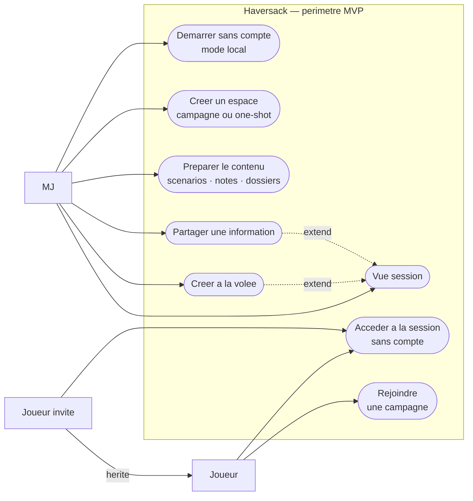
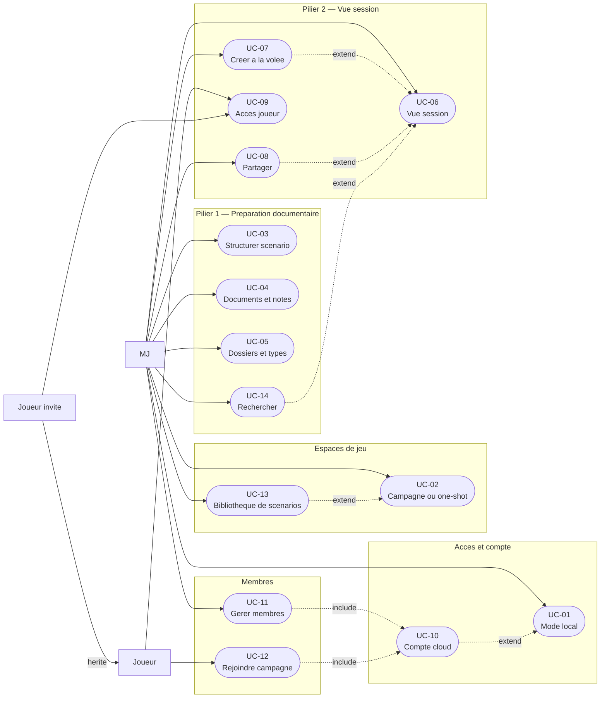
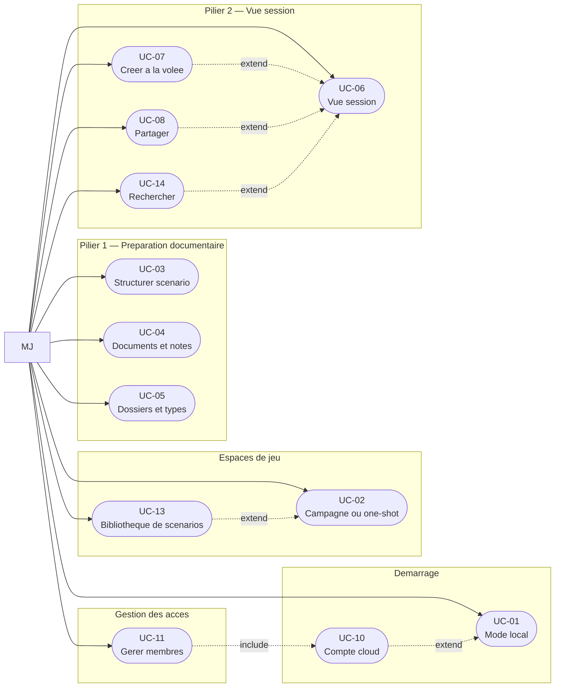
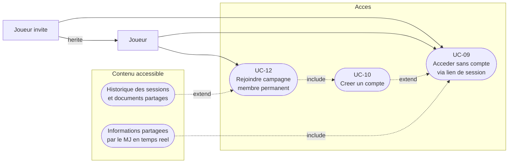
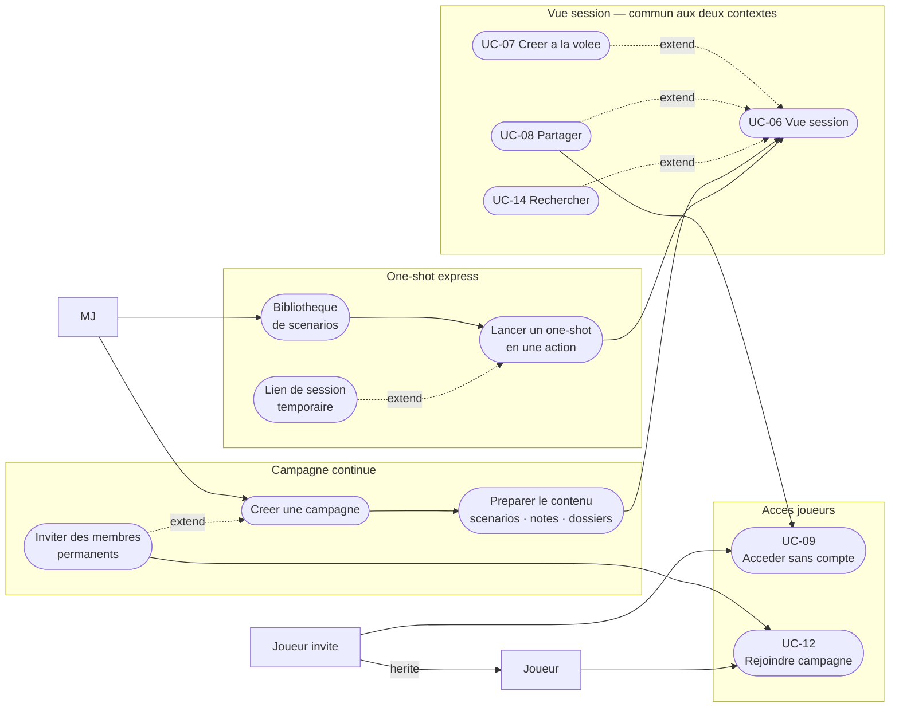

# Haversack — Diagrammes de cas d'utilisation

> Périmètre fonctionnel MVP défini dans [README.md](README.md).
> Organisés du plus synthétique au plus détaillé.
>
> **Note sur les acteurs** : `MJ` et `Joueur` sont des rôles contextuels liés à un espace de jeu,
> pas des types d'utilisateurs globaux. Un même utilisateur peut être MJ d'une campagne et joueur
> dans une autre. Le `MJ` peut utiliser l'application sans compte (mode local, UC-01).
> `JoueurInvite` est un joueur sans compte — accès temporaire via lien de session (UC-09).

---

## Légende

| Notation | Signification |
|---|---|
| Rectangle `[ ]` | Acteur |
| Ovale `([ ])` | Cas d'utilisation |
| `-->` | Association acteur → cas d'utilisation |
| `-.->` `include` | Inclusion — le cas inclus est toujours exécuté |
| `-.->` `extend` | Extension — le cas étendu s'exécute sous condition |
| `-- hérite -->` | Généralisation entre acteurs |

---

## 1. Vue simplifiée

Vue d'ensemble. Utile pour une présentation ou pour saisir le périmètre en un coup d'œil.

---

## 2. Vue globale

Périmètre fonctionnel complet — tous les acteurs, tous les cas d'utilisation, toutes les relations clés.
Référence complète pour le dossier de conception.

---

## 3. Vue centrée MJ

Focus sur le cœur du produit. Détaille tous les cas d'utilisation du MJ et leurs relations.

---

## 4. Vue centrée joueur

Expérience côté joueur. Simple par conception — le joueur est un consommateur de contenu,
pas un producteur.

---

## 5. Parcours campagne vs one-shot

Compare les deux contextes de jeu. Ils convergent vers la même vue session
mais n'ont pas le même point d'entrée ni le même cycle de vie.

