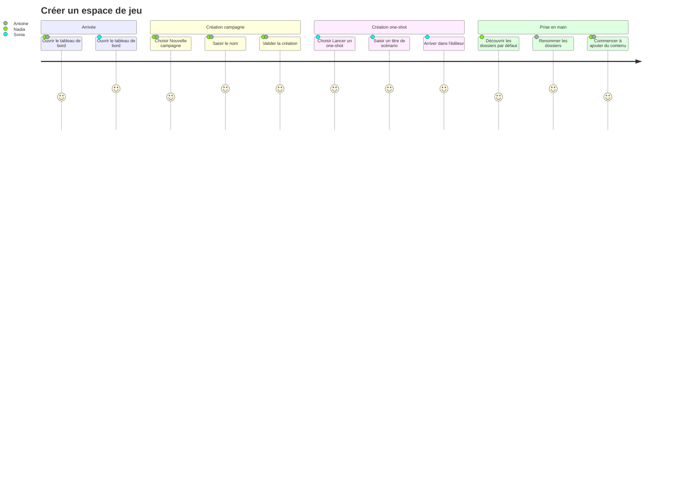
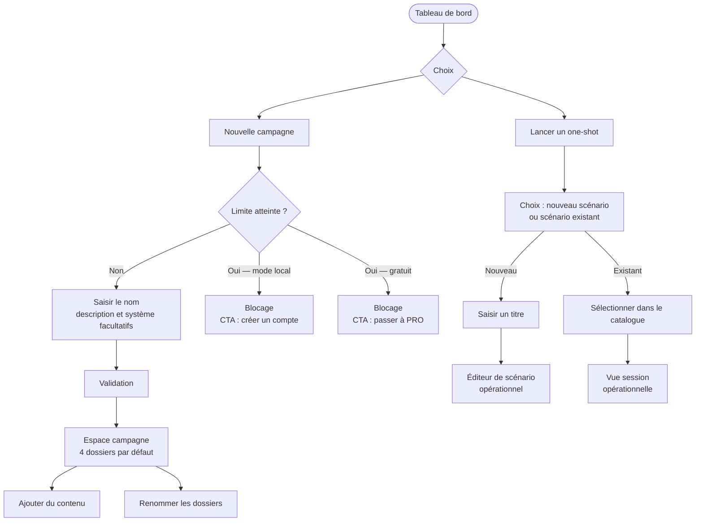

# User Journey — Créer un espace de jeu (UC-02)

## Périmètre

Ce parcours couvre la création d'un espace de jeu — campagne ou one-shot — depuis le tableau de bord jusqu'à la première interaction avec le contenu. Il inclut le scénario de blocage par la limite de campagnes.

Le one-shot est techniquement une campagne ; le MJ ne voit pas ce détail.

---

## Personas concernés

| Persona | Profil | Objectif dans ce parcours |
|---|---|---|
| **Nadia** | MJ infirmière, sessions mensuelles | Créer sa première campagne sans friction |
| **Sonia** | MJ one-shot, 3-5 sessions/mois | Être opérationnelle en moins de 30 secondes |
| **Antoine** | MJ multi-campagnes simultanées | Créer une 3e campagne et adapter la structure à son système |

---

## Vue d'ensemble du parcours

### Carte d'expérience

### Flux fonctionnel

---

## Détail des étapes

| Étape | Persona(s) | Friction | Opportunité produit |
|---|---|---|---|
| Ouvrir le tableau de bord | Tous | Orientation incertaine si première visite | Deux CTA distincts et équivalents, sans hiérarchie culpabilisante |
| Choisir "Nouvelle campagne" | Nadia, Antoine | Formulaire perçu comme long | Seul le nom est requis — description et système facultatifs |
| Saisir le nom | Nadia, Antoine | Blocage si nom vide sans retour visuel clair | Validation inline, suggestion de nom par défaut modifiable |
| Valider la création | Nadia, Antoine | Chargement sans confirmation | Transition immédiate vers l'espace — pas d'écran intermédiaire |
| Découvrir les dossiers par défaut | Nadia | Dossiers génériques perçus comme imposés | Dossiers renommables dès la création, noms évocateurs |
| Renommer les dossiers | Antoine | Renommage inexistant ou caché | Action accessible en un clic depuis le nom du dossier |
| Choisir "Lancer un one-shot" | Sonia | Redirection inattendue vers un formulaire | Parcours express : titre → éditeur, sans étape intermédiaire |
| Sélectionner un scénario existant | Sonia | Catalogue lent à charger ou peu lisible | Liste compacte avec recherche rapide et aperçu titre |
| Arriver dans l'éditeur | Sonia | Interface d'édition chargée ou désorientante | Vue épurée avec zone de saisie active immédiatement |

---

## Scénarios alternatifs et d'erreur

**Sonia — scénario existant**
- Elle choisit "Lancer un one-shot" et sélectionne un scénario dans son catalogue de 15.
- Elle arrive dans l'éditeur en mode lecture/édition, sans recréer de structure.

**Antoine — 3e campagne**
- Il a déjà 2 campagnes actives. La création suit le parcours principal sans blocage.
- Il renomme les dossiers par défaut pour coller à la terminologie de Fate.

**Limite de campagnes atteinte**
- Mode local : blocage à la 4e campagne, message positif ("Créez un compte pour gérer plus de campagnes").
- Compte gratuit : blocage avec CTA vers l'offre supérieure.
- Pas de destruction silencieuse — la création est simplement refusée avec explication claire.

**Nom vide à la validation**
- Retour d'erreur inline sous le champ, sans rechargement. La saisie reste active.

---

## Points de conversion clés

| Moment | Déclencheur | Action attendue |
|---|---|---|
| Première campagne créée | Dossiers visibles, accès immédiat | Installation de la confiance — reprise à la prochaine session |
| One-shot < 30 secondes | Accès direct à l'éditeur | Fidélisation Sonia — usage récurrent sans effort |
| Dossiers renommés (Antoine) | Flexibilité perçue | Satisfaction structurelle — adoption sur plusieurs systèmes |
| Limite atteinte (mode local) | Blocage fonctionnel | Conversion vers la création de compte |
| Limite atteinte (gratuit) | Besoin de plus de campagnes | Conversion vers offre payante |

---

## Liens

- Use case associé : `docs/conception/usecases/UC-02-creer-espace-jeu.md`
- Vision produit : `docs/conception/vision/vision-produit.md`
- Conception source : campaign-management : `docs/conception/domain/campaign-management.md`
- User Journey UC-01 : `docs/conception/user-journeys/UJ-UC-01-mode-local-sans-compte.md`
