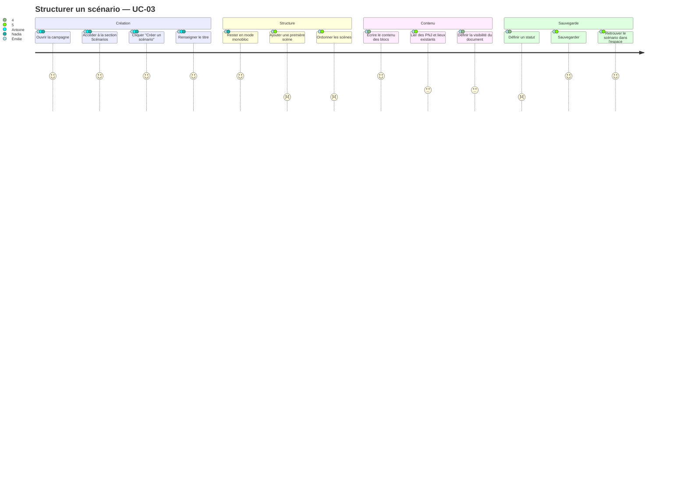
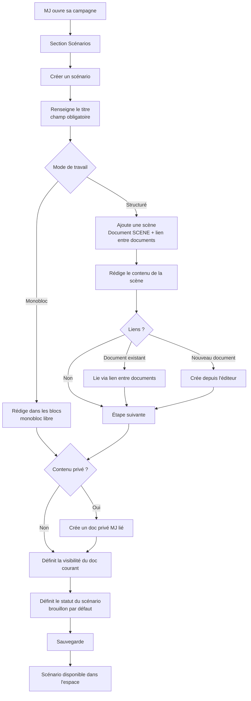

# User Journey — Structurer un scénario (UC-03)

## Périmètre

Parcours du MJ depuis l'accès à sa campagne jusqu'à la sauvegarde d'un scénario utilisable en session. Couvre les modes monobloc (scénario libre) et structuré (scènes), ainsi que la liaison de documents existants.

---

## Personas concernés

| Persona | Mode de travail | Attente principale | Risque de friction |
|---|---|---|---|
| Émilie | Monobloc, improvisation | Saisie rapide, liberté totale | Toute étape qui impose une structure |
| Antoine | Structuré par scènes, liens riches | Navigation entre documents, ordre des scènes | Manque de liens entre documents |
| Nadia | Préparation express (30-45 min) | Zéro configuration, accès direct | Configuration fine, options superflues |
| Sonia | Catalogue de scénarios réutilisables | Scénarios autonomes et portables | Couplage fort à une campagne spécifique |
| Thomas | Structure maîtrisée, libre | Contrôle total de l'arborescence | Structure imposée par l'outil |

---

## Vue d'ensemble du parcours

### Carte d'expérience

### Flux fonctionnel

---

## Détail des étapes

| Étape | Persona(s) | Friction potentielle | Opportunité produit |
|---|---|---|---|
| Ouvrir la campagne et naviguer vers Scénarios | Tous | Navigation peu claire si beaucoup de sections | Entrée directe "Mes scénarios" sur le tableau de bord campagne |
| Créer un scénario (titre seul) | Émilie, Nadia | Formulaire trop long au démarrage | Création one-click avec titre uniquement, reste configurable après |
| Passer en mode monobloc | Émilie, Nadia | Mode par défaut peu visible si l'outil propose d'emblée des scènes | Rédaction libre par défaut, ajout de scènes en option secondaire |
| Ajouter et ordonner des scènes | Antoine, Thomas | Absence de drag-and-drop, réordonnancement flou | Drag-and-drop sur ordre des scènes, avec indicateur visuel de l'ordre |
| Écrire le contenu d'une scène | Tous | Éditeur peu expressif, absence de mise en forme basique | Éditeur de blocs fluide, raccourcis clavier |
| Lier un document existant | Antoine, Sonia | Recherche de documents inexistante ou lente | Recherche rapide par titre dans la campagne, suggestion des documents récents |
| Séparer notes privées et contenu partageable | Antoine, Thomas | Modèle "deux documents liés" non évident pour l'utilisateur | Affordance claire dans l'UI : "Ajouter une note MJ" crée automatiquement un doc privé MJ lié |
| Définir le statut | Nadia, Sonia | Étape perçue comme superflue si la valeur n'est pas visible | Statut "brouillon" par défaut, modifiable en un clic depuis la liste |
| Sauvegarder | Tous | Perte de données si la sauvegarde n'est pas automatique | Sauvegarde automatique + indicateur de statut de synchronisation |
| Retrouver le scénario | Nadia, Sonia | Liste non triée, pas de filtre par statut | Tri par date et filtre par statut dans la liste des scénarios |

---

## Scénarios alternatifs et d'erreur

- **A1 — Scénario monobloc** : le MJ ne crée aucune scène. Le document est valide. Aucune friction supplémentaire.
- **A2 — Lier des documents existants** : le document cible n'existe pas encore → proposer la création à la volée (A3).
- **A3 — Créer un document depuis l'éditeur** : création d'un document + ajout automatique du lien entre documents. Risque : le MJ crée un doublon s'il ne sait pas que le document existe déjà.
- **A4 — Scénario improvisé** : titre uniquement, sauvegarde immédiate. Aucune contrainte. Cas nominal simplifié.
- **Erreur — titre manquant** : la création est bloquée. Message d'erreur inline sur le champ titre.
- **Erreur — perte de connexion** : si la sauvegarde automatique est implémentée, buffer local à vider à la reconnexion.
- **Erreur — document lié introuvable** : lien entre documents vers un document supprimé → afficher un lien cassé identifiable et permettre de le supprimer.

---

## Points de conversion clés

| Point de conversion | Indicateur de succès | Risque d'abandon |
|---|---|---|
| Création du scénario (premier enregistrement) | MJ atteint l'éditeur avec un titre sauvegardé | Formulaire de création trop long ou obligatoire |
| Premier contenu rédigé | Au moins un bloc de contenu non vide | Éditeur peu intuitif, page blanche intimidante |
| Ajout d'une première scène | lien entre documents créé vers un document scène | Mode monobloc non trouvé, ajout de scène perçu comme obligatoire |
| Premier lien vers un document | lien entre documents vers un NPC ou LOCATION existant | Recherche de documents absente ou trop lente |
| Scénario marqué "prêt" | Statut = `PRET` | Statut ignoré si la valeur n'est pas perçue |

---

## Liens

- Use case source : [`docs/conception/usecases/`](../usecases/)
- User stories associées : [`US-UC-03-structurer-scenario.md`](../user-stories/US-UC-03-structurer-scenario.md)
- Conception source : la bibliothèque de contenu : [`docs/conception/domain/content-library.md`](../domain/content-library.md)
- UC-06 Vue session (impacté par US-03-04) : [`docs/conception/usecases/UC-06-vue-session.md`](../usecases/UC-06-vue-session.md)
