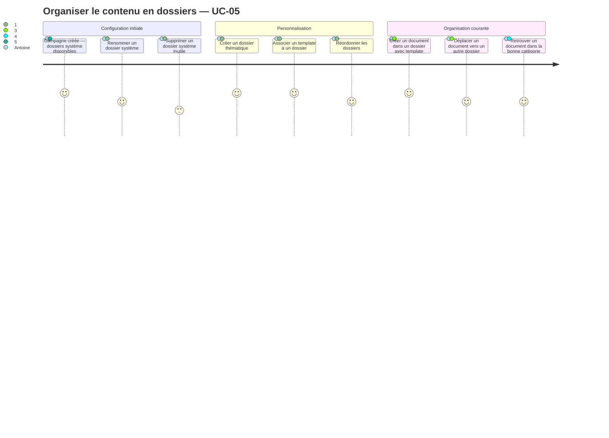
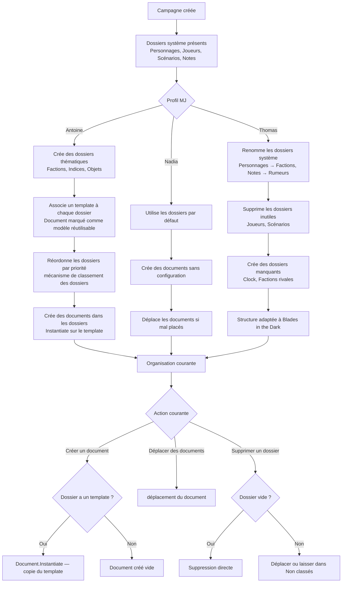

# User Journey — Organiser le contenu en dossiers (UC-05)

## Périmètre

Parcours du MJ depuis la découverte des dossiers de sa campagne jusqu'à la personnalisation avancée (renommage, templates, réordonnage). Couvre trois profils : Antoine (organisation thématique et templates), Nadia (usage des dossiers par défaut sans configuration), Thomas (renommage des dossiers système pour les adapter à son système de jeu). Le comportement du dossier virtuel "Non classés" est couvert comme mécanisme interne, invisible en navigation.

---

## Personas concernés

| Persona | Mode de travail | Attente principale | Risque de friction |
|---|---|---|---|
| Antoine | Organisation thématique, templates, réordonnage | Créer des dossiers métier, associer des templates, maîtriser l'ordre | Absence de templates ou d'ordre persisté |
| Nadia | Dossiers par défaut, pas de configuration | Que ça marche sans rien configurer | Configuration imposée, dossiers par défaut trop génériques ou absents |
| Thomas | Renommage des dossiers système, logique personnalisée | Renommer "Personnages" en "Factions", adapter la structure à Blades in the Dark | Impossibilité de renommer les dossiers système, structure trop rigide |

---

## Vue d'ensemble du parcours

### Carte d'expérience

### Flux fonctionnel

---

## Points de friction

| Étape | Persona(s) | Friction potentielle | Opportunité produit |
|---|---|---|---|
| Découvrir les dossiers système à la création de l'espace | Tous | Dossiers trop génériques ou inadaptés au système de jeu | Afficher les dossiers système dès l'écran de l'espace avec une explication courte |
| Renommer un dossier système | Thomas, Antoine | Action non trouvée si l'édition inline n'est pas évidente | Édition inline au clic sur le nom du dossier, sans passer par un panneau de configuration |
| Créer un nouveau dossier thématique | Antoine, Thomas | Pas de point d'entrée visible pour ajouter un dossier | Bouton "+" à côté de la liste des dossiers |
| Associer un template à un dossier | Antoine | Templates inexistants si UC-13 non implémenté — liste vide déconcertante | Afficher un message explicatif si aucun template n'est disponible + lien vers la création |
| Réordonner les dossiers | Antoine | Interface peu intuitive si drag-and-drop absent | Drag-and-drop en première intention, ordre numérique en fallback |
| Créer un document dans un dossier avec template | Antoine, Thomas | Pas de retour visuel sur l'application du template | Indiquer visuellement que le template a été appliqué à l'ouverture de l'éditeur |
| Déplacer un document vers un autre dossier | Émilie, Nadia | Sélection de plusieurs documents non disponible | Multi-sélection avec déplacement groupé |
| Supprimer un dossier non vide | Antoine | Perte de documents si l'action n'est pas explicitée | Dialogue clair : "3 documents seront déplacés vers — choisissez un dossier ou laissez dans Non classés" |
| Dossier virtuel Non classés | Tous | Confusion si des documents apparaissent dans un dossier inconnu | Le dossier virtuel est invisible en navigation — les documents orphelins sont accessibles via la recherche |

---

## Scénarios par persona

### Antoine — Organisation thématique avec templates

Antoine ouvre une nouvelle campagne Warhammer Fantasy. Les dossiers système sont présents mais génériques. Il supprime "Joueurs" (sa table ne gère pas les fiches joueurs dans l'outil), renomme "Personnages" en "PNJ" et crée trois nouveaux dossiers : "Factions", "Lieux" et "Indices". Il associe un template de fiche faction qu'il a préparé (marqué comme modèle réutilisable) au dossier "Factions", et un template de fiche lieu au dossier "Lieux". Il réordonne ensuite : PNJ, Factions, Lieux, Indices, Scénarios, Notes. Lors de la prochaine session, chaque nouveau document créé dans "Factions" part de sa fiche template, ce qui lui fait gagner plusieurs minutes par PNJ.

**Points de conversion** :
- Premier dossier thématique créé avec succès.
- Premier template associé et appliqué à la création d'un document.
- Ordre persisté après fermeture et réouverture de l'espace.

**Risques** :
- Template non disponible si UC-13 n'est pas implémenté — valeur de US-05-03 réduite.
- Réordonnage non intuitif si drag-and-drop absent.

---

### Nadia — Usage des dossiers par défaut

Nadia ouvre sa campagne Dungeon World après deux semaines d'absence. Elle ne se souvient plus de sa structure. Les dossiers système (Personnages, Scénarios, Notes) sont là, intacts. Elle retrouve ses PNJ dans "Personnages" et ses notes dans "Notes". Elle crée un nouveau document directement depuis le dossier "Notes" sans aucune configuration. Le document est créé vide — ça lui convient. Elle n'a jamais ouvert les paramètres d'un dossier et ne sait pas que les templates existent. L'outil fonctionne comme attendu sans effort de sa part.

**Points de conversion** :
- Campagne rouverte — dossiers système disponibles immédiatement.
- Document créé depuis un dossier sans friction.

**Risques** :
- Dossiers système trop génériques si Nadia a un système de jeu atypique.
- Documents mal placés si Nadia crée depuis la bibliothèque générale sans sélectionner de dossier (→ dossier "Notes" par défaut).

---

### Thomas — Renommage pour Blades in the Dark

Thomas commence une campagne Blades in the Dark. Les dossiers système lui semblent inadaptés — "Personnages" ne correspond pas à sa logique, "Joueurs" non plus. Il renomme "Personnages" en "Scoundrels", supprime "Joueurs" et "Scénarios", et crée "Factions", "Turf" et "Clock". Il renomme "Notes" en "Rumeurs". Après cinq minutes, la structure correspond exactement à son référentiel Blades. Il n'a associé aucun template — il improvise et structure après coup.

**Points de conversion** :
- Premier dossier système renommé sans blocage (isSystem non contraignant).
- Structure personnalisée opérationnelle avant la première session.

**Risques** :
- Si le renommage inline n'est pas évident, Thomas peut chercher une option dans un menu de configuration.
- Si `isSystem` était une contrainte de renommage, Thomas serait bloqué — décision actée que ça ne l'est pas.

---

## Scénarios alternatifs et d'erreur

- **E1 — Nom de dossier vide** : la création ou le renommage est refusé avec un message d'erreur inline. Aucune action destructrice ne se produit.
- **E2 — Suppression d'un dossier non vide** : dialogue explicite proposant (a) de choisir un dossier cible pour les documents ou (b) de les laisser dans "Non classés". Aucune suppression de document.
- **E3 — Suppression d'un dossier système** : même comportement qu'E2. `isSystem` n'est pas une contrainte — la suppression est autorisée avec le même dialogue.
- **E4 — Template supprimé après association** : `defaultTemplateDocumentId` passe silencieusement à null. Les documents existants (copies indépendantes) ne sont pas affectés. Le dossier se comporte comme un dossier sans template.
- **A4 — Document orphelin** : un document sans dossier associé explicite est rattaché au dossier virtuel "Non classés". Ce dossier est invisible en navigation mais les documents sont accessibles via la recherche.

---

## Opportunités UX

| Point de conversion | Indicateur de succès | Risque d'abandon |
|---|---|---|
| Premier dossier créé ou renommé | Dossier visible en navigation avec le bon nom | Action de renommage non trouvée |
| Premier template associé à un dossier | `defaultTemplateDocumentId` non null sur le dossier | Aucun template disponible — liste vide |
| Premier document créé depuis un dossier avec template | Document ouvert avec la structure du template | Pas de retour visuel sur l'application du template |
| Suppression d'un dossier non vide sans perte de documents | Documents retrouvables après suppression | Dialogue peu clair — MJ pense avoir perdu ses documents |
| Ordre des dossiers persisté | Même ordre à la réouverture de l'espace | Ordre réinitialisé — frustration pour Antoine |

---

## Liens

- Use case source : [`docs/conception/usecases/`](../usecases/)
- User stories associées : [`US-UC-05-organiser-contenu-dossiers.md`](../user-stories/US-UC-05-organiser-contenu-dossiers.md)
- Conception source : la bibliothèque de contenu : [`docs/conception/domain/content-library.md`](../domain/content-library.md)
- UC-04 Documents de campagne (déplacement de documents) : [`docs/conception/user-journeys/UJ-UC-04-gerer-documents-campagne.md`](UJ-UC-04-gerer-documents-campagne.md)

---

## Transitions inter-UC

### Depuis UC-02 (création de l'espace de jeu)

À la création d'une campagne (UC-02), les dossiers système — **Personnages**, **Joueurs**, **Scénarios**, **Notes** — et le dossier virtuel « Non classés » (non visible en navigation) sont créés automatiquement. UC-05 peut être déclenché immédiatement après : le MJ renomme, supprime ou crée des dossiers selon son système de jeu, avant même d'avoir créé son premier document. L'ordre entre la configuration des dossiers (UC-05) et la création des documents (UC-04) n'est pas imposé — les deux peuvent s'alterner librement.

### Vers UC-04 (gestion des documents)

L'organisation des dossiers dans UC-05 conditionne l'initialisation des documents créés dans UC-04. Lorsqu'un dossier porte un document réutilisable comme modèle par défaut, tout nouveau document créé depuis ce dossier est initialisé à partir d'une copie indépendante de ce modèle. La disponibilité de ce modèle dépend de UC-13 (Should Have — post-MVP) : en l'absence de UC-13, la liste des modèles disponibles est vide et l'association de modèle à un dossier n'est pas opérante. Les documents déjà créés dans un dossier ne sont jamais affectés par un changement de modèle par défaut du dossier.

### Vers UC-06 (vue session)

La `SessionViewConfig` de la campagne référence des dossiers parmi ceux gérés dans UC-05. Le MJ configure quels dossiers apparaissent dans les panneaux de la vue session depuis les paramètres de la campagne (hors session) ou depuis la vue session elle-même. Les dossiers renommés par Thomas dans UC-05 (par exemple, « Scoundrels » au lieu de « Personnages ») apparaissent avec leur nouveau nom dans les panneaux de la vue session — aucune resynchronisation n'est nécessaire. La suppression d'un dossier présent dans la `SessionViewConfig` retire ce dossier des panneaux configurés ; les documents déplacés vers « Non classés » restent accessibles via la recherche globale de la vue session.
