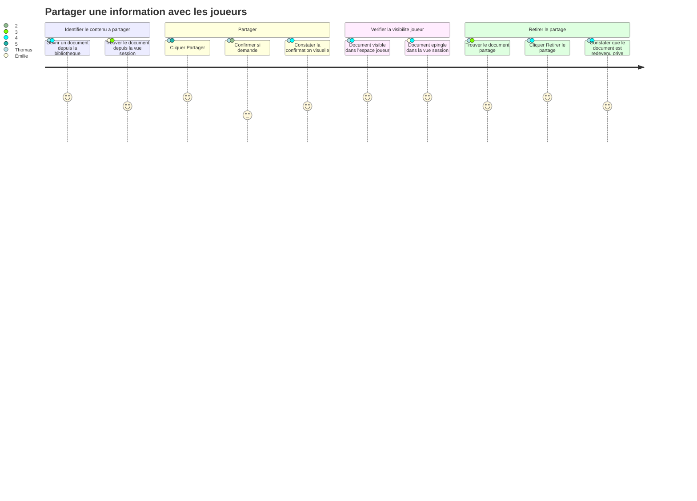
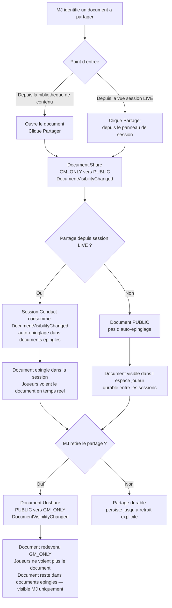

# User Journey — Partager une information aux joueurs (UC-08)

## Périmètre

Parcours du MJ depuis l'identification d'un document à partager jusqu'à la confirmation que les joueurs y ont accès. Couvre trois profils : Émilie (partage à la volée en session, besoin de rapidité), Thomas (partage préparé au moment précis d'une révélation), Nadia (partage occasionnel d'une aide de jeu simple). La gestion de session est couverte par UC-06.

---

## Carte d'expérience

---

## Flux fonctionnel

---

## Points de friction identifiés

- **Confirmation superflue pour Émilie** : une boite de dialogue de confirmation interrompt le rythme de la partie. Émilie partage à la volée — chaque seconde compte.
- **Manque de retour visuel sur l'état de partage** : sans indicateur clair sur le document (icône, badge), le MJ ne sait pas d'un coup d'oeil quels documents sont `PUBLIC` ou `GM_ONLY`. Thomas prépare plusieurs révélations — il a besoin de distinguer visuellement l'état de chacune.
- **Auto-épinglage non perceptible** : le document est ajouté aux `documents épinglés` automatiquement lors d'un partage depuis la vue session, mais si aucun indicateur visuel ne le confirme, Émilie ne sait pas que le document est désormais accessible aux joueurs dans la session.
- **Retrait du partage difficile à trouver** : l'action "Retirer le partage" peut être enfouie dans un menu contextuel ou peu visible si l'interface ne distingue pas les documents `PUBLIC` des documents `GM_ONLY`.

---

## Opportunités UX

- **Indicateur d'état de visibilité persistant** : un badge ou une icône sur chaque document (bibliotheque et vue session) indique son état (`GM_ONLY` / `PUBLIC`) sans ouvrir le document.
- **Action directe sans confirmation en session** : pour Émilie, le partage depuis la vue session ne demande pas de confirmation. Une confirmation peut être proposée depuis la bibliothèque (contexte non urgent).
- **Toast de confirmation après partage** : un retour visuel bref (toast) confirme le partage et l'auto-épinglage sans bloquer l'interaction.
- **Accès rapide au partage depuis la vue session** : un bouton ou un raccourci visible sur le document dans la liste des `documents épinglés` ou dans le panneau de documents de la session, sans ouvrir le document.

---

## Liens

- Use case source : [`docs/conception/usecases/UC-08-partager-information.md`](../usecases/UC-08-partager-information.md)
- User stories associées : [`US-UC-08-partager-information.md`](../user-stories/US-UC-08-partager-information.md)
- UC-06 Vue session : [`docs/conception/user-journeys/UJ-UC-06-vue-session.md`](UJ-UC-06-vue-session.md)
- UC-07 Création à la volée : [`docs/conception/user-journeys/UJ-UC-07-creation-volee-session.md`](UJ-UC-07-creation-volee-session.md)
- Conception Content Library : [`docs/conception/domain/content-library.md`](../domain/content-library.md)
- Conception Session Conduct : [`docs/conception/domain/session-conduct.md`](../domain/session-conduct.md)
