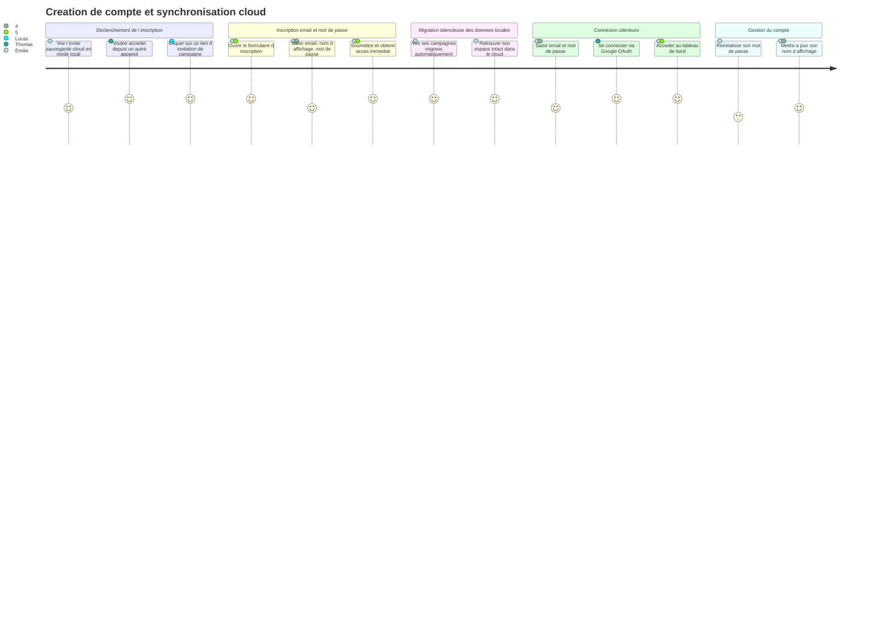
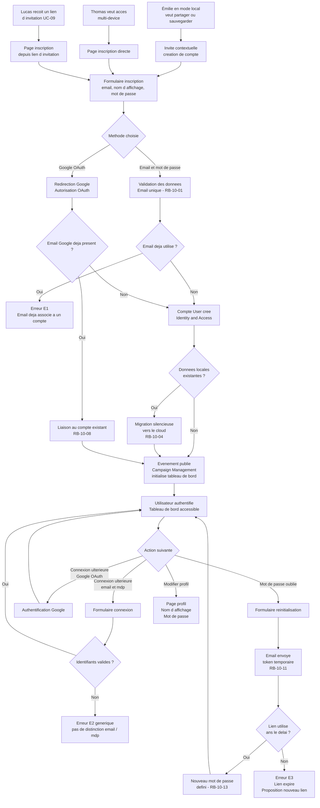

# User Journey — Créer un compte et synchroniser dans le cloud (UC-10)

## Périmètre

Parcours couvrant trois flux d'entrée : l'inscription par un MJ venant du mode local (Émilie), la création directe de compte pour usage multi-device (Thomas), et la création de compte depuis un lien d'invitation par un joueur (Lucas). La migration silencieuse des données locales est intégrée dans le flux d'Émilie. La suppression de compte est hors MVP et exclue de ce périmètre.

---

## Carte d'expérience

---

## Flux fonctionnel

---

## Points de friction identifiés

- **Invite contextuelle peu visible en mode local** : Émilie peut passer plusieurs sessions sans voir l'invite de sauvegarde cloud. Si le bandeau est discret ou apparait en bas d'écran, le déclencheur naturel de l'inscription peut être raté. Le contexte idéal pour l'afficher est la première tentative de partage avec un joueur.

- **Friction à la saisie du mot de passe pour Lucas** : Lucas arrive depuis un lien d'invitation — il vient d'utiliser l'application sans mot de passe (mode invité). Lui demander de choisir un mot de passe sécurisé à ce moment peut créer un abandon. Google OAuth réduit ce frein mais ne couvre pas tous les cas.

- **Migration silencieuse opaque** : Émilie ne voit pas ce qui se passe pendant la migration. Si elle a un volume important de données, l'absence de retour visuel (progress, confirmation) peut créer de l'inquiétude sur la perte éventuelle de ses campagnes.

- **Réinitialisation de mot de passe avec délai d'expiration court** : si le token expire rapidement (exemple : 1 heure) et que l'utilisateur ne voit pas l'email immédiatement, il devra recommencer le processus. La durée d'expiration est à calibrer.

- **Pas de différenciation des erreurs de connexion** : le message générique (E2) est correct sur le plan de la sécurité, mais peut frustrer un utilisateur légitime qui ne sait pas si c'est son email ou son mot de passe qui est en cause. L'aide doit orienter vers la réinitialisation du mot de passe.

---

## Opportunités UX

- **Invite contextuelle au bon moment** : déclencher la proposition de création de compte précisément lorsque le MJ tente une action qui nécessite un compte (clic sur "Partager avec les joueurs", "Accéder depuis un autre appareil"). L'invite est ainsi justifiée par le besoin et non perçue comme une interruption.

- **Migration silencieuse avec confirmation post-inscription** : après la migration, afficher une confirmation discrète "Vos X campagnes et Y documents ont été synchronisés" rassure Émilie sans interrompre son flux. Un toast suffit.

- **Google OAuth en premier plan** : sur les pages d'inscription et de connexion, Google OAuth peut être présenté en priorité (bouton principal) pour réduire la friction, notamment pour Lucas qui arrive depuis un lien et veut un accès rapide.

- **Pré-remplissage de l'email depuis le lien d'invitation** : si le lien d'invitation UC-09 contient un contexte de campagne, la page d'inscription peut afficher "Vous rejoignez la campagne de [MJ]" et contextualiser l'inscription — la conversion est meilleure quand le but est explicite.

- **Retour visuel sur la progression de la migration** : pour les MJ avec beaucoup de données locales, une barre de progression discrète ou un indicateur "Synchronisation en cours..." évite l'inquiétude pendant la migration.

- **Lien direct vers réinitialisation depuis E2** : le message d'erreur générique peut contenir un lien discret "Mot de passe oublié ?" — sans révéler si l'email existe, mais en proposant la sortie naturelle pour l'utilisateur légitime bloqué.

---

## Liens

- Use case source : [`docs/conception/usecases/UC-10-compte-cloud.md`](../usecases/UC-10-compte-cloud.md)
- User stories associées : [`US-UC-10-compte-cloud.md`](../user-stories/US-UC-10-compte-cloud.md)
- UC-01 Mode local : [`docs/conception/usecases/UC-01-mode-local-sans-compte.md`](../usecases/UC-01-mode-local-sans-compte.md)
- UC-09 Accès session joueur : [`docs/conception/usecases/UC-09-acces-session-joueur.md`](../usecases/UC-09-acces-session-joueur.md)
- UC-11 Gérer membres campagne : [`docs/conception/usecases/UC-11-gerer-membres-campagne.md`](../usecases/UC-11-gerer-membres-campagne.md)
- UC-12 Rejoindre campagne : [`docs/conception/usecases/UC-12-rejoindre-campagne.md`](../usecases/UC-12-rejoindre-campagne.md)
- User Journey UC-09 : [`UJ-UC-09-acces-session-joueur.md`](UJ-UC-09-acces-session-joueur.md)
- Conception Identity and Access : [`docs/conception/domain/identity-access.md`](../domain/identity-access.md)
- Conception Campaign Management : [`docs/conception/domain/campaign-management.md`](../domain/campaign-management.md)
