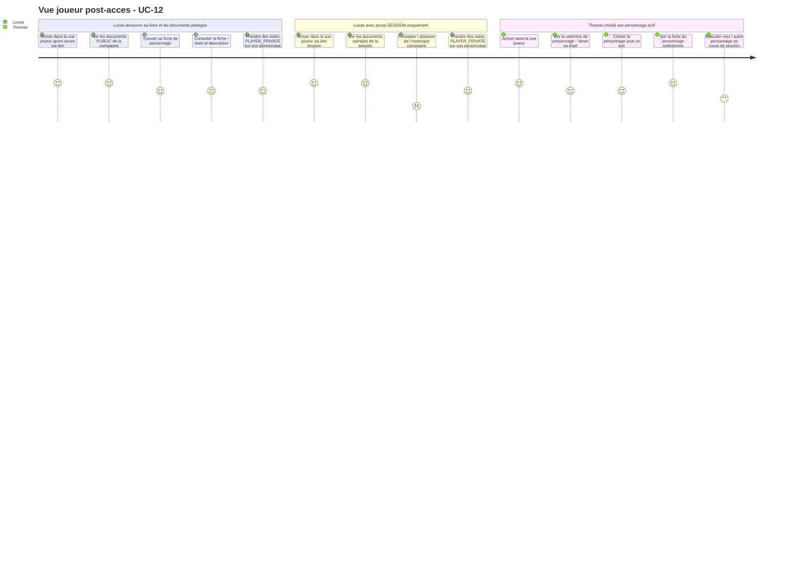
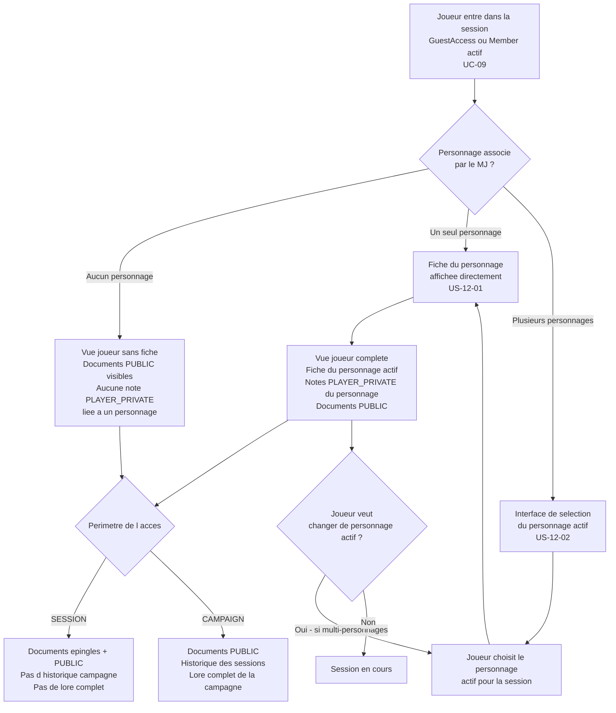

# User Journey — Rejoindre une campagne ou une session (UC-12)

## Périmètre

Ce parcours couvre la perspective joueur post-accès : ce que le joueur voit et fait une fois dans la session, après que l'accès a été validé. Les flux d'accès (clic sur le lien, saisie du nom, validation du token, création du `GuestAccess` ou du `Member`) sont entièrement couverts par UC-09 et UC-11. UC-12 commence là où ils s'arrêtent.

Les deux situations couvertes ici sont : Lucas qui accède pour la première fois à sa fiche et aux documents partagés, et Thomas qui joue dans une campagne avec deux personnages alternés et doit choisir lequel est actif.

---

## Carte d'expérience

---

## Flux fonctionnel

---

## Points de friction identifiés

- **Absence de personnage associe - frustration silencieuse** : Lucas rejoint la session, voit les documents partagés, mais ne trouve pas sa fiche. Sans message explicite ("Le MJ ne t'a pas encore associé à un personnage"), il ne comprend pas pourquoi la fiche est absente et peut penser à un bug.

- **Distinction SESSION vs CAMPAIGN peu lisible** : Lucas arrive via un lien `SESSION` et ne comprend pas pourquoi il n'a pas accès à l'historique des sessions précédentes ni au lore complet. L'interface doit indiquer clairement le périmètre de son accès et proposer une action pour l'étendre (migration vers compte et lien `CAMPAIGN`).

- **Sélection du personnage actif bloquante si non anticipée** : Thomas arrive dans la session et se retrouve face à une sélection entre deux personnages sans contexte. Si la session a déjà démarré et que le MJ attend, cette étape intermédiaire crée une rupture. Un personnage par défaut (dernier utilisé) réduirait la friction.

- **Changement de personnage actif en cours de session - visibilité incertaine** : Thomas bascule de "Veran" à "Kael" en cours de session. Si ce changement n'est pas visible du MJ dans sa vue session, le MJ ne sait pas quel personnage Thomas joue à un instant donné.

- **Notes PLAYER_PRIVATE liees au personnage, pas a l acces** : un joueur invité (`GuestAccess`) qui retrouve un lien vers un personnage déjà utilisé récupère ses notes. Mais si ce lien pointe vers un nouveau `GuestAccess` sans personnage associé, les notes sont inaccessibles sans que le joueur comprenne pourquoi. Ce comportement doit être visible dans l'interface.

---

## Opportunités UX

- **Message contextuel si aucun personnage associe** : si aucun personnage n'est associé, la vue joueur affiche un message sobre ("Le MJ associera ton personnage prochainement") plutôt qu'une vue vide. Aucun blocage — les documents `PUBLIC` restent accessibles.

- **Indicateur du perimetre d acces** : un libellé discret dans la vue joueur ("Accès session" ou "Accès campagne complet") permet à Lucas de comprendre immédiatement ce qu'il peut voir. Un lien "Comment obtenir l'accès complet" redirige vers la migration invité (US-09-04).

- **Personnage actif par defaut - dernier utilise** : si Thomas a plusieurs personnages, la vue joueur propose par défaut le dernier personnage utilisé, avec une option de changement en un clic. La sélection explicite n'est requise que si aucune session précédente n'est connue.

- **Visibilite du personnage actif dans la vue session MJ** : la vue session du MJ (UC-06) affiche pour chaque joueur multi-personnages le personnage actif en cours. Thomas n'a pas à annoncer dans le chat quel personnage il joue ce soir.

- **Transition fluide depuis UC-09** : à la fin du flux d'accès (saisie du nom, validation du token), la vue joueur s'affiche directement sans page intermédiaire. Si un personnage est associé, la fiche est visible immédiatement — pas de navigation supplémentaire.

- **Fiche personnage en lecture rapide** : dans la vue joueur, la fiche du personnage est accessible en lecture rapide (stats, description, compétences) sans quitter la session. Un onglet dédié ou un panneau latéral évite de perdre le contexte de la session.

---

## Liens

- Use case source : [`docs/conception/usecases/UC-12-rejoindre-campagne.md`](../usecases/UC-12-rejoindre-campagne.md)
- User stories associées : [`US-UC-12-rejoindre-campagne.md`](../user-stories/US-UC-12-rejoindre-campagne.md)
- UC-09 Accès session joueur : [`docs/conception/usecases/UC-09-acces-session-joueur.md`](../usecases/UC-09-acces-session-joueur.md)
- UC-11 Gérer membres campagne : [`docs/conception/usecases/UC-11-gerer-membres-campagne.md`](../usecases/UC-11-gerer-membres-campagne.md)
- User Journey UC-09 : [`UJ-UC-09-acces-session-joueur.md`](UJ-UC-09-acces-session-joueur.md)
- User Journey UC-11 : [`UJ-UC-11-gerer-membres-campagne.md`](UJ-UC-11-gerer-membres-campagne.md)
- Conception Space Management : [`docs/conception/domain/space-management.md`](../domain/space-management.md)
- Conception Identity and Access : [`docs/conception/domain/identity-access.md`](../domain/identity-access.md)
- Conception Bibliothèque de contenu : [`docs/conception/domain/content-library.md`](../domain/content-library.md)
