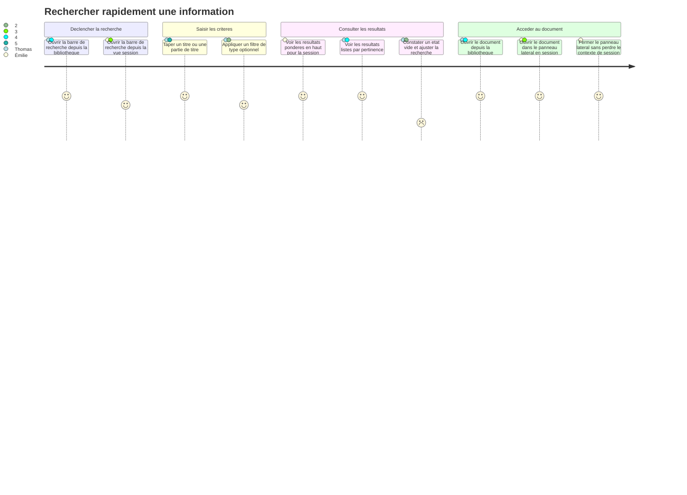
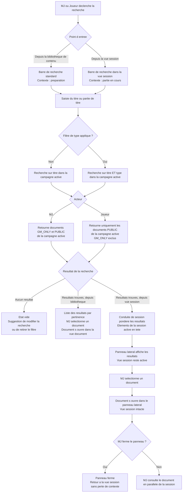

# User Journey — Rechercher rapidement une information (UC-14)

## Périmètre

Parcours du MJ et du joueur depuis le déclenchement d'une recherche jusqu'à l'accès au document trouvé. Couvre trois profils : Émilie (MJ cherchant un PNJ en pleine session, besoin de rapidité), Thomas (MJ cherchant une note de préparation par son titre hors session), Nadia (MJ retrouvant une note de session d'une séance précédente). La gestion de la vue session est couverte par UC-06 ; la gestion de la visibilité des documents est couverte par UC-08.

---

## Carte d'expérience

---

## Flux fonctionnel

---

## Points de friction identifiés

- **Interruption du rythme de partie pour Émilie** : toute friction dans la recherche (lenteur, navigation multiple, panneau ne s'ouvrant pas directement) rompt le rythme de la partie. La recherche doit produire un résultat en moins de 2 secondes et s'ouvrir dans un panneau latéral sans détruire la vue session.
- **Résultats trop nombreux sans filtre** : sur une campagne longue (nombreux PNJ, scènes, notes), une recherche générale peut retourner trop de résultats. Sans filtre de type facilement accessible, Thomas et Nadia doivent faire défiler une longue liste.
- **Pondération session active non perceptible** : si les documents liés à la session active ne sont pas clairement distingués des autres résultats (badge, section séparée), Émilie ne perçoit pas l'avantage de la pondération et cherche manuellement dans la liste.
- **Etat vide peu informatif** : un état vide sans suggestion concrète (modifier la recherche, retirer le filtre, créer un document) laisse l'utilisateur sans action claire — particulièrement bloquant pour Nadia qui cherche une note dont elle ne se rappelle pas le titre exact.
- **Règles de visibilité opaques pour le joueur** : si un joueur cherche un document et ne le trouve pas (parce qu'il est `GM_ONLY`), l'absence de résultat doit être claire sans révéler l'existence du document.

---

## Opportunités UX

- **Raccourci clavier depuis la vue session** : un raccourci clavier (ex. Ctrl+K ou Cmd+K) ouvre la barre de recherche directement depuis la vue session, sans déplacer la souris. Essentiel pour Émilie.
- **Section dédiée aux éléments de la session active** : dans les résultats depuis la vue session, afficher une section "Dans cette session" en tête de liste (documents épinglés, `LIVE_NOTE` en cours, documents du scénario actif) avant les autres résultats de la campagne.
- **Filtres de type accessibles en un clic** : des pastilles de type directement visibles sous la barre de recherche (pas dans un menu déroulant) permettent à Thomas de filtrer par "PNJ" ou "scène" immédiatement après la saisie.
- **Aperçu du document au survol** : un tooltip ou un aperçu inline au survol d'un résultat (titre, type, extrait du titre ou date de dernière modification) aide Nadia à identifier le bon document sans ouvrir chaque résultat.
- **Suggestion proactive en état vide** : afficher des suggestions basées sur les documents récemment consultés ou les documents de la session active lorsque la barre de recherche est ouverte mais vide.

---

## Liens

- Use case source : [`docs/conception/usecases/UC-14-recherche.md`](../usecases/UC-14-recherche.md)
- User stories associées : [`US-UC-14-recherche.md`](../user-stories/US-UC-14-recherche.md)
- UC-06 Vue session : [`docs/conception/user-journeys/UJ-UC-06-vue-session.md`](UJ-UC-06-vue-session.md)
- UC-08 Partager une information : [`docs/conception/user-journeys/UJ-UC-08-partager-information.md`](UJ-UC-08-partager-information.md)
- Conception Content Library : [`docs/conception/domain/content-library.md`](../domain/content-library.md)
- Conception Session Conduct : [`docs/conception/domain/session-conduct.md`](../domain/session-conduct.md)
