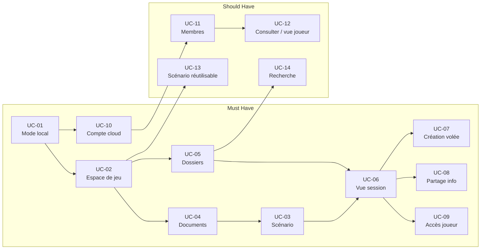

# User Stories — Haversack MVP

Ce dossier contient les 14 epics de user stories couvrant l'ensemble du périmètre fonctionnel MVP. Chaque epic est dérivé d'un use case source (dossier `../usecases/`) et ancré dans le modèle de domaine (dossier `../domain/`). Les user journeys associés se trouvent dans `../user-journeys/`. Utiliser les epics pour le découpage en tickets, les user journeys pour valider les flux de bout en bout.

---

## Personas de référence

| Persona | Profil | Usage principal |
|---|---|---|
| Emilie | MJ débutante, improvise beaucoup, peu de préparation | Création à la volée, vue session rapide |
| Thomas | MJ expérimenté, préparation minutieuse, multi-campagnes | Organisation des dossiers, panneaux configurés |
| Nadia | MJ occasionnelle, joue peu souvent, sessions espacées | Reprise rapide, recherche intuitive |
| Sonia | MJ convention, one-shots exclusivement, 15 scénarios en catalogue | Scénarios réutilisables, lancement rapide |
| Antoine | MJ avancé, 3 campagnes simultanées, systèmes variés | Structures réutilisables, types de documents |
| Lucas | Joueur type, pas d'outil supplémentaire voulu | Accès sans compte, friction minimale |

---

## Correspondance Use Cases — Epics et Journeys

| UC | Titre | MoSCoW | Epic | Journey |
|---|---|---|---|---|
| UC-01 | Mode local sans compte | Must Have | [US-UC-01](US-UC-01-mode-local-sans-compte.md) | [UJ-UC-01](../user-journeys/UJ-UC-01-mode-local-sans-compte.md) |
| UC-02 | Créer un espace de jeu (campagne) | Must Have | [US-UC-02](US-UC-02-creer-espace-jeu.md) | [UJ-UC-02](../user-journeys/UJ-UC-02-creer-espace-jeu.md) |
| UC-03 | Structurer un scénario | Must Have | [US-UC-03](US-UC-03-structurer-scenario.md) | [UJ-UC-03](../user-journeys/UJ-UC-03-structurer-scenario.md) |
| UC-04 | Gérer les documents de campagne | Must Have | [US-UC-04](US-UC-04-gerer-documents-campagne.md) | [UJ-UC-04](../user-journeys/UJ-UC-04-gerer-documents-campagne.md) |
| UC-05 | Organiser le contenu en dossiers *(base — dossiers libres)* | Must Have | [US-UC-05](US-UC-05-organiser-contenu-dossiers.md) | [UJ-UC-05](../user-journeys/UJ-UC-05-organiser-contenu-dossiers.md) |
| UC-06 | Utiliser la vue session | Must Have | [US-UC-06](US-UC-06-vue-session.md) | [UJ-UC-06](../user-journeys/UJ-UC-06-vue-session.md) |
| UC-07 | Créer un élément à la volée | Must Have | [US-UC-07](US-UC-07-creation-volee-session.md) | [UJ-UC-07](../user-journeys/UJ-UC-07-creation-volee-session.md) |
| UC-08 | Partager une information | Must Have | [US-UC-08](US-UC-08-partager-information.md) | [UJ-UC-08](../user-journeys/UJ-UC-08-partager-information.md) |
| UC-09 | Accès session joueur | Must Have | [US-UC-09](US-UC-09-acces-session-joueur.md) | [UJ-UC-09](../user-journeys/UJ-UC-09-acces-session-joueur.md) |
| UC-10 | Créer un compte et synchroniser dans le cloud | Must Have | [US-UC-10](US-UC-10-compte-cloud.md) | [UJ-UC-10](../user-journeys/UJ-UC-10-compte-cloud.md) |
| UC-11 | Gérer les membres d'une campagne | Should Have | [US-UC-11](US-UC-11-gerer-membres-campagne.md) | [UJ-UC-11](../user-journeys/UJ-UC-11-gerer-membres-campagne.md) |
| UC-12 | Consulter sa campagne en tant que joueur (vue post-accès) | Should Have | [US-UC-12](US-UC-12-rejoindre-campagne.md) | [UJ-UC-12](../user-journeys/UJ-UC-12-rejoindre-campagne.md) |
| UC-13 | Scénario réutilisable | Should Have — hors première livraison | [US-UC-13](US-UC-13-scenario-reutilisable.md) | [UJ-UC-13](../user-journeys/UJ-UC-13-scenario-reutilisable.md) |
| UC-14 | Recherche | Should Have | [US-UC-14](US-UC-14-recherche.md) | [UJ-UC-14](../user-journeys/UJ-UC-14-recherche.md) |

---

## Vue MoSCoW globale

**Must Have (UC-01 à UC-10)** : toutes les fonctionnalités nécessaires pour qu'un MJ seul puisse utiliser l'application localement, structurer une campagne, animer une session et partager des informations avec ses joueurs. UC-10 (compte cloud) est Must Have car le partage joueurs (UC-08/09) l'exige et le MVP est livré en un seul bloc — raisonnement de priorisation détaillé dans la section MoSCoW (`../vision/moscow.md`). UC-05 base (dossiers libres) est Must Have ; la couche riche (types élaborés) est Should Have.

**Should Have (UC-05 riche + UC-11, UC-12, UC-14)** : couche riche des dossiers (types de document élaborés), gestion de groupe et recherche. **UC-13 (scénario réutilisable) est Should Have mais hors première livraison** — voir MoSCoW.

**Could Have / Won't Have** : référencés dans `../usecases/UC-HORS-MVP.md` et dans les sections "Stories exclues" de chaque epic.

---

## Dépendances entre use cases

---

## Décisions transversales

| Décision | Impact |
|---|---|
| Mode local = point d'entrée (pas d'inscription obligatoire) | UC-01 Must Have, UC-10 Must Have (le partage joueurs exige un compte — voir MoSCoW) |
| Migration locale vers cloud avec gate de reconnaissance | US-01-05, US-10-01 |
| Cap 3 campagnes en **mode local** (règle d'interface — RB-01-03 / RB-02-11) **et en cloud tier gratuit** (règle stable — RB-02-10) | [US-01](US-UC-01-mode-local-sans-compte.md) / RB-01-03 (local) ; [US-02](US-UC-02-creer-espace-jeu.md) / RB-02-10 (cloud) |
| Archivage uniquement manuel (pas d'auto-archivage) | UC-02, UC-13 A3 |
| Tout est Document (bibliothèque de contenu) | Architecture transversale |
| Type REVEAL pour partage scène vers joueurs | US-03-04, UC-08 |
| Dossier virtuel "Non classés" (folderId non-nullable) | US-05-XX, domaine Content Library |
| Partage = opération permanente sur visibility (pas temporaire) | UC-08, UC-06 |
| Epinglage et visibilité sont indépendants | US-08-02 |
| Pas de validation email à l'inscription | US-10-01 |
| **Connexion fédérée (fournisseur d'identité externe)** dans le MVP | US-10-03 |
| Suppression de compte RGPD **dans le MVP** ; transfert de propriété de campagnes à membres actifs = post-MVP | Stories exclues UC-10 |
| Invitation par lien uniquement (pas d'email par la plateforme) | US-11-01 |
| Recherche titre + type uniquement (full-text post-MVP) | US-14-XX |
| Catalogue scénarios au niveau compte (cross-campagne) | US-13-XX, extension domaine ScenarioLibrary |
| SessionViewConfig : auto-save, mode édition sans session active | US-06-02 |

---

## Statut des scénarios Gherkin

Les scénarios Gherkin répartis dans les user stories constituent une **couche de conception pérenne** (arbitrage T-07, audit conception pure 2026-06). Ils expriment les critères d'acceptation produit en langage métier (Given/When/Then), indépendant de tout code applicatif.

**Règle anti double-maintenance** : les scénarios vivent dans les fichiers user stories ; ils restent la source unique. Si un outillage de test les consomme à l'avenir, cet outillage se synchronise sur les US, jamais l'inverse. Un scénario modifié côté test sans répercussion dans l'US constitue une dérive à corriger immédiatement.

---

## Ordre de livraison recommandé

**Phase 1 — Socle local** : UC-01, UC-02, UC-05, UC-04
Fondations : accès sans compte, création de campagne, organisation en dossiers, gestion des documents.

**Phase 2 — Session** : UC-03, UC-06, UC-07, UC-08
Valeur core : structurer un scénario, animer une session, créer à la volée, partager des informations.

**Phase 3 — Partage joueurs** : UC-09, UC-11, UC-12
Multi-joueurs : accès joueur en session, gestion des membres, octroi d'accès permanent (UC-09/UC-11) et vue joueur post-accès (UC-12).

**Phase 4 — Cloud et catalogue** : UC-10, UC-13, UC-14
Extensions : compte cloud, scénarios réutilisables cross-campagne, recherche.

---

## Documents source

- Use cases : [`../usecases/`](../usecases/)
- Domaine : [`../domain/`](../domain/)
- Vision produit : [`../vision/vision-produit.md`](../vision/vision-produit.md)
