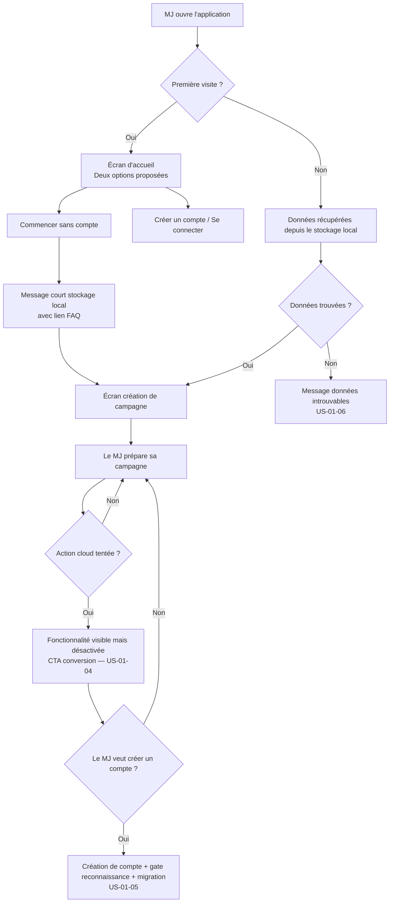
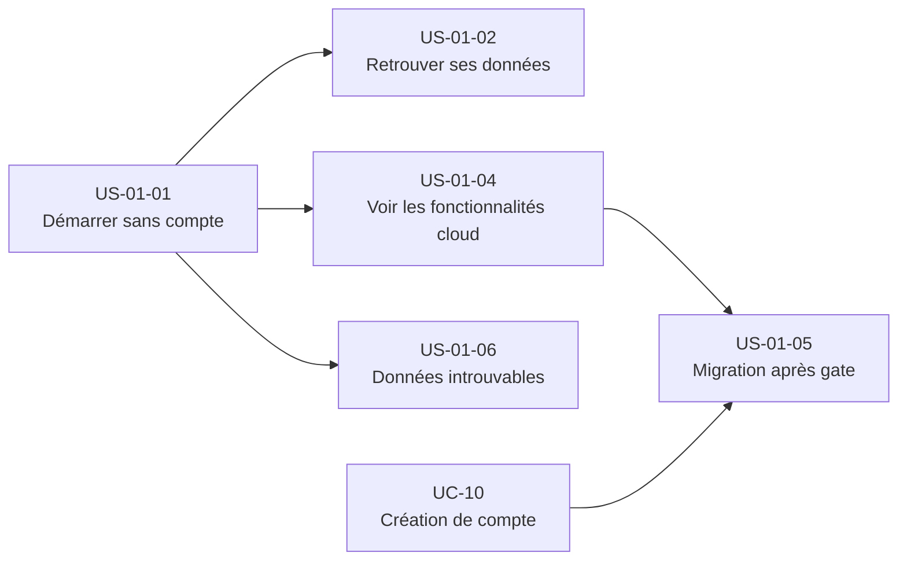

# Epic — Mode local sans compte

---

## Objectif utilisateur

Permettre à un MJ de commencer à utiliser Haversack immédiatement, sans friction d'inscription, en stockant les données localement dans le navigateur. L'objectif est de réduire le coût d'adoption initial et de démontrer la valeur de l'outil avant toute création de compte.

---

## Personas concernés

| Persona | Profil | Douleur principale | Lien avec cet epic |
|---|---|---|---|
| **Nadia** | MJ infirmière, 42 ans | Coût d'adoption trop élevé pour sa fréquence de jeu | Bénéficiaire directe — peut tester sans s'engager |
| **Thomas** | MJ développeur, 35 ans | Lock-in propriétaire, migration lourde | Concerné par l'export en format ouvert et la liberté des données — ce besoin est transverse au mode local et au compte cloud |
| **Rémi** | MJ libraire, 48 ans | Ne voit pas la valeur face à un carnet | Entrée sans friction peut abaisser sa résistance initiale |

---

## Use cases couverts

- **UC-01** — Mode local sans compte (intégralité du périmètre)
- **UC-10** — Création de compte (dépendance externe pour US-01-05)

---

## Priorité MoSCoW

| Story | Priorité |
|---|---|
| US-01-01 | Must Have |
| US-01-02 | Must Have |
| US-01-03 | Exclue (voir section Stories exclues ou repoussées) |
| US-01-04 | Must Have |
| US-01-05 | Must Have (dépend UC-10) |
| US-01-06 | Should Have |
| US-01-07 | Should Have |

---

## Bounded contexts pressentis

- **la gestion de campagne** — création et stockage des campagnes locales, règle de quota (max 3 campagnes en mode local)
- **la bibliothèque de contenu** — documents, dossiers, scénarios stockés localement
- **Identity & Access** — activation lors de la conversion vers un compte (US-01-05 uniquement)

Le mode local ne crée aucun compte utilisateur côté serveur. Les contraintes de stockage (~50-100 Mo)
sont des règles d'interface, pas des règles métier durables.

---

## Vue d'ensemble



---

## Dépendances



---

## User stories

---

### US-01-01 — Démarrer l'application sans créer de compte

**Format**

> En tant que MJ,
> je veux pouvoir commencer à utiliser Haversack immédiatement sans créer de compte,
> afin de découvrir la valeur de l'outil avant de m'engager.

**Métadonnées**

| Champ | Valeur |
|---|---|
| Priorité | Must Have |
| Source | UC-01 — scénario nominal |
| Bounded context | la gestion de campagne |

**Critères d'acceptation**

```gherkin
Feature: Démarrage sans compte

  Scenario: Le MJ choisit de commencer sans compte
    Given le MJ ouvre l'application pour la première fois
    When il choisit "Commencer sans compte"
    Then l'application affiche un message court sur le stockage local
    And un lien vers la FAQ est disponible
    And le MJ est redirigé vers l'écran de création de campagne

  Scenario: Le MJ reçoit un message informatif au premier démarrage
    Given le MJ ouvre l'application pour la première fois
    When il choisit de commencer sans compte
    Then le MJ reçoit un message informatif court sur le stockage local lors du premier démarrage

  Scenario: Le MJ crée une campagne en mode local
    Given le MJ est en mode local sans compte
    When il crée une campagne et y ajoute du contenu
    Then aucune donnée n'est envoyée au serveur
    And le contenu est disponible dans la session courante

  Scenario: Le MJ atteint la limite de 3 campagnes en mode local
    Given le MJ est en mode local sans compte
    And il a déjà 3 campagnes créées
    When il tente de créer une 4e campagne
    Then la création est bloquée
    And un message l'invite à créer un compte pour bénéficier d'un stockage cloud illimité
```

**Règles métier**

- RB-01-01 : En mode local, aucune donnée n'est envoyée au serveur. Cette règle est une garantie de confiance envers l'utilisateur, pas uniquement une contrainte technique.
- RB-01-02 : L'application propose systématiquement les deux options (sans compte / avec compte) à l'écran d'accueil, sans hiérarchie visuelle forçant l'inscription.
- RB-01-03 : En mode local, le MJ peut créer au maximum 3 campagnes. Au-delà, la création est bloquée avec un message proposant de créer un compte.
- RB-01-14 : L'application affiche deux bandeaux distincts et non bloquants en mode local :
  - **Bandeau de durabilité** : conditionnel — affiché lorsque le navigateur n'a pas garanti la conservation permanente des données. Message : *« Vos données sont en mode éphémère — elles peuvent être supprimées par le navigateur. Créez un compte pour les sécuriser. »* Câblé à l'invite UC-10.
  - **Bandeau de confidentialité** : systématique en mode local — les données du stockage local du navigateur ne sont pas protégées contre la lecture ; toute personne ayant accès à ce navigateur sur ce poste peut les lire. Câblé à l'invite UC-10. Limitation MVP assumée (la protection des données stockées localement contre la lecture est repoussée post-MVP).
  Ces deux bandeaux ont des causes, des risques et des publics cibles distincts — ils ne doivent pas être fusionnés.
- RB-01-15 : En mode local, aucun élément donnant accès à des données protégées (jeton d'accès, secret, identifiant de connexion à un compte) n'est conservé dans le navigateur.

**Notes de conception**

- Le mode local n'instancie aucun compte utilisateur. La gestion de campagne opère avec un identifiant de session local opaque.
- La règle "aucune donnée envoyée au serveur" doit être testable (ex : absence de requêtes réseau sortantes en mode local, vérifiable en tests d'intégration). Le raisonnement technique est tracé dans ADR-017.

---

### US-01-02 — Retrouver ses données après fermeture du navigateur

**Format**

> En tant que MJ,
> je veux retrouver mes campagnes et contenus intacts après avoir fermé et rouvert le navigateur,
> afin de ne pas perdre mon travail de préparation.

**Métadonnées**

| Champ | Valeur |
|---|---|
| Priorité | Must Have |
| Source | UC-01 — scénario alternatif A2 |
| Bounded context | la gestion de campagne, la bibliothèque de contenu |

**Critères d'acceptation**

```gherkin
Feature: Persistance des données locales

  Scenario: Retour après fermeture du navigateur
    Given le MJ a créé du contenu en mode local
    And il a fermé le navigateur
    When il rouvre l'application
    Then ses campagnes et contenus sont disponibles
```

**Règles métier**

- RB-01-04 : Les données créées en mode local sont durables — elles survivent à la fermeture et à la réouverture du navigateur. Dès l'entrée en mode local, l'application demande au navigateur la garantie de conservation permanente des données. Si cette garantie est refusée, les données restent conservées au mieux (le navigateur peut les supprimer sous pression de stockage) et un bandeau de durabilité non bloquant informe l'utilisateur de ce risque.
- RB-01-05 : Les limites de stockage (~50-100 Mo) sont des contraintes d'interface. Elles ne constituent pas des règles métier durables.

**Notes de conception**

- Aucun utilisateur ne doit être modélisé pour le mode local. L'id est un identifiant de session opaque géré côté interface.
- Le comportement du navigateur face à la demande de conservation permanente des données est un comportement d'environnement d'exécution ; la logique applicative (lire le résultat de cette demande, déclencher le bandeau) est testable par simulation de l'API. Le raisonnement technique est tracé dans ADR-017.

---

### US-01-04 — Voir les fonctionnalités cloud inaccessibles depuis le mode local

**Format**

> En tant que MJ en mode local,
> je veux voir quelles fonctionnalités nécessitent un compte,
> afin de comprendre ce que je gagnerais à créer un compte sans être bloqué dans mon usage actuel.

**Métadonnées**

| Champ | Valeur |
|---|---|
| Priorité | Must Have |
| Source | UC-01 — règle métier 4, critère d'acceptation |
| Bounded context | la gestion de campagne (partage), la conduite de session (accès joueur) |

**Critères d'acceptation**

```gherkin
Feature: Visibilité des fonctionnalités cloud en mode local

  Scenario: Fonctionnalité de partage visible mais désactivée
    Given le MJ est en mode local sans compte
    When il accède à une fonctionnalité de partage (UC-08) ou d'accès joueur (UC-09)
    Then la fonctionnalité est visible dans l'interface
    And elle est désactivée
    And un CTA clair invite le MJ à créer un compte pour y accéder

  Scenario: Le MJ comprend ce qui est accessible sans compte
    Given le MJ est en mode local sans compte
    When il navigue dans l'application
    Then les fonctionnalités locales sont pleinement accessibles
    And les fonctionnalités cloud sont distinguables visuellement (ex : cadenas, label)
    And aucune fonctionnalité cloud n'est masquée ou cachée
```

**Règles métier**

- RB-01-06 : Les fonctionnalités de partage (UC-08) et d'accès joueur (UC-09) nécessitent au minimum un compte gratuit.
- RB-01-07 : Les fonctionnalités cloud sont visibles mais désactivées en mode local. Elles ne sont pas masquées.
- RB-01-08 : Un CTA de conversion vers un compte doit accompagner chaque fonctionnalité cloud désactivée.

**Notes de conception**

- Pattern UI obligatoire : "unlock" (visible + désactivé + CTA) et non "hidden" (masqué). Le choix "hidden" nuirait à la découvrabilité et à la démonstration de valeur, ce qui est contraire à l'objectif de cet epic.
- Ce pattern est un point de conversion implicite vers US-01-05.

---

### US-01-05 — Créer un compte depuis le mode local avec migration après gate de reconnaissance

**Format**

> En tant que MJ en mode local,
> je veux créer un compte depuis n'importe quelle page de l'application et y retrouver toutes mes données,
> afin de passer au cloud sans perdre mon travail de préparation.

**Métadonnées**

| Champ | Valeur |
|---|---|
| Priorité | Must Have (dépend UC-10) |
| Source | UC-01 — scénario alternatif A1, règle métier 2 |
| Bounded context | Identity & Access (création du compte), la gestion de campagne (migration des données) |

**Critères d'acceptation**

```gherkin
Feature: Migration des données locales à la création de compte

  Scenario: Le MJ crée un compte depuis une invite contextuelle
    Given le MJ est en mode local sans compte
    And il a tenté d'accéder à une fonctionnalité cloud
    When il choisit de créer un compte via le CTA
    Then il est redirigé vers le flow de création de compte (UC-10)
    And après création du compte, le gate de reconnaissance est présenté puis la migration est déclenchée après confirmation
    And il retrouve ses campagnes et contenus dans son espace cloud

  Scenario: Le MJ crée un compte depuis les paramètres
    Given le MJ est en mode local sans compte
    When il accède aux paramètres et choisit de créer un compte
    Then le même flow de migration automatique est déclenché

  Scenario: Le gate de reconnaissance est présenté avant la migration
    Given le MJ vient de créer un compte
    And des données locales existent dans le navigateur
    When la création de compte est finalisée
    Then l'application présente les campagnes locales détectées avec titre, volume et date
    And une confirmation explicite est demandée au MJ avant de démarrer la migration
    And la migration ne démarre qu'après confirmation

  Scenario: La migration échoue pour une campagne
    Given le MJ vient de créer un compte et a confirmé la migration
    When la migration d'une campagne locale échoue (slug collision, properties invalides, type inconnu ou version non supportée)
    Then un rapport de rejets est présenté indiquant les raisons par campagne
    And les données locales de la campagne rejetée sont préservées intactes dans le navigateur
    And le MJ peut reprendre la migration de cette campagne manuellement
    And les autres campagnes migrées avec succès restent accessibles en cloud
```

**Règles métier**

- RB-01-09 : La création de compte depuis le mode local déclenche une migration des données locales vers le cloud. Si des données locales existent, un gate de reconnaissance est présenté (campagnes détectées, volume, date) et la migration ne démarre qu'après confirmation explicite de l'utilisateur. Cette exigence de confirmation est une exigence du système : aucune migration ne peut démarrer sans elle, quel que soit le moyen par lequel elle est déclenchée. La règle porteuse complète est RB-10-04 dans UC-10.
- RB-01-10 : Le MJ peut initier la création de compte depuis n'importe quelle page de l'application.
- RB-01-11 : En cas d'échec de migration, les données locales de la campagne concernée sont préservées intactes. Un rapport de rejets est présenté (raisons par campagne). Les campagnes migrées avec succès sont disponibles en cloud.

**Notes de conception**

- Ce flow est transverse : Identity & Access crée le compte utilisateur, la gestion de campagne orchestre la migration des données locales. Ce n'est pas la responsabilité d'un seul périmètre fonctionnel.
- Dépendance forte avec UC-10 (création de compte) : cette story ne peut être livrée qu'après stabilisation d'UC-10. Le raisonnement et les alternatives pour le gate de reconnaissance sont tracés dans ADR-016.
- La migration implique de lire les données depuis le stockage local du navigateur et de les persister via l'API la gestion de campagne / la bibliothèque de contenu.

---

### US-01-06 — Être guidé quand les données locales sont introuvables

**Format**

> En tant que MJ revenant sur l'application,
> je veux être informé clairement quand mes données locales ne sont pas disponibles,
> afin de comprendre ce qui s'est passé et de savoir comment continuer.

**Métadonnées**

| Champ | Valeur |
|---|---|
| Priorité | Should Have |
| Source | UC-01 — scénario alternatif A3, exception E1 |
| Bounded context | la gestion de campagne |

**Critères d'acceptation**

```gherkin
Feature: Gestion des données locales introuvables

  Scenario: Données effacées (cache vidé)
    Given le MJ a déjà utilisé l'application en mode local
    And les données du stockage local du navigateur ont été supprimées (ex : cache vidé)
    When le MJ rouvre l'application
    Then un message explicite indique que les données précédentes sont introuvables
    And le message distingue ce cas d'une première visite
    And le MJ peut choisir de créer une nouvelle campagne ou de se connecter

  Scenario: Première visite réelle
    Given le MJ ouvre l'application pour la première fois
    When l'application ne trouve aucune donnée locale
    Then le message affiché est celui d'un accueil, pas d'un avertissement de perte de données

  Scenario: Stockage navigateur plein
    Given le MJ est en mode local
    When le stockage local du navigateur atteint sa limite
    Then un message indique que le stockage est plein
    And l'application propose de migrer les données vers le cloud (création de compte)

  Scenario: Le MJ atteint la limite de 3 campagnes en mode local
    Given le MJ est en mode local sans compte
    And il a déjà 3 campagnes créées
    When il tente de créer une 4e campagne
    Then un message d'erreur indique que la limite de campagnes en mode local est atteinte
    And le MJ est invité à créer un compte pour continuer
```

**Règles métier**

- RB-01-12 : L'application distingue le cas "première visite" (aucune donnée attendue) du cas "données perdues" (des données étaient présentes précédemment). Les messages affichés sont différents.
- RB-01-13 : En cas de stockage plein, la migration vers le cloud est proposée comme solution.

**Notes de conception**

- La distinction "première visite" vs. "données perdues" peut reposer sur un flag local persisté indépendant des données campagne. Ce flag est distinct des données métier. En mode local, un flag d'interface persisté localement (distinguant première visite de données perdues) n'entre pas dans la catégorie des éléments protégés couverts par RB-01-15, car il ne donne accès à rien de protégé et sa lecture par un tiers est sans conséquence de sécurité. Le raisonnement est tracé dans ADR-017.
- Le message "données introuvables" ne doit pas être anxiogène pour une première visite.
- Le cas "données disparues après refus de la garantie de conservation permanente" est couvert par le même message que "cache vidé" (A3) — la cause technique est distincte mais la résolution proposée à l'utilisateur est identique.

---

### US-01-07 — Exporter sa campagne dans un format ouvert

**Priorité** : Should Have (vision §5bis, décision 2026-06-10)

**Note de transversalité** : ce besoin de possession des données existe en mode local comme avec un compte cloud — l'export n'est pas une fonctionnalité exclusive au mode local. L'implémentation sera commune aux deux contextes.

**Format**

> En tant que MJ,
> je veux pouvoir exporter ma campagne dans un format ouvert depuis les paramètres,
> afin de disposer d'une copie de sauvegarde et de ne pas être enfermé dans l'outil.

**Métadonnées**

| Champ | Valeur |
|---|---|
| Priorité | Should Have |
| Source | UC-01 — scénario alternatif A4a ; vision §5bis |
| Bounded context | la gestion de campagne |

**Critères d'acceptation**

```gherkin
Feature: Export de campagne en format ouvert

  Scenario: Le MJ exporte sa campagne depuis les paramètres (mode local)
    Given le MJ est en mode local sans compte
    And il a au moins une campagne
    When il accède aux paramètres et déclenche l'export
    Then un fichier de sauvegarde au format ouvert est généré et téléchargé
    And le fichier contient l'intégralité des données de la campagne

  Scenario: Le MJ exporte sa campagne depuis les paramètres (compte cloud)
    Given le MJ est connecté avec un compte
    When il accède aux paramètres et déclenche l'export d'une campagne
    Then un fichier de sauvegarde au format ouvert est généré et téléchargé
    And le fichier contient l'intégralité des données de la campagne
```

**Règles métier**

- RB-01-16 : L'export de campagne est disponible en mode local comme avec un compte cloud. L'utilisateur est propriétaire du fichier généré.
- RB-01-17 : Le fichier d'export utilise un format ouvert et documenté, lisible sans dépendance à l'outil.

**Notes de conception**

- Ceci est la story centrale de l'export ; le réimport (lecture d'un fichier de sauvegarde) est une story distincte, repoussée post-MVP (US-01-08).
- La transversalité mode local / compte cloud implique que l'implémentation de l'export ne peut pas résider exclusivement dans le périmètre du mode local.

---

## Stories repoussées post-MVP

### US-01-03 — Comprendre le risque du mode local sans être bloqué

**Raison d'exclusion initiale** : Le bandeau persistant générique avait été jugé trop intrusif. Un message informatif au premier démarrage était couvert par US-01-01.

**Révision apportée** : Les deux bandeaux non bloquants distincts, ciblés et conditionnels, ne relèvent plus d'un "bandeau persistant générique" :
- **Bandeau de durabilité** : conditionnel — affiché quand le navigateur n'a pas garanti la conservation permanente des données. Risque d'éviction. Couvert par US-01-02 (voir RB-01-04 révisée) et US-01-06 (E1).
- **Bandeau de confidentialité** : systématique en mode local — risque de lecture par un tiers sur poste partagé. Ce bandeau est minimal : affiché en mode local, câblé à l'invite UC-10, non bloquant.

Ces deux bandeaux sont portés par les stories existantes (US-01-01 pour le premier affichage, US-01-02 pour la logique de durabilité, US-01-06 pour la gestion des erreurs) et par une règle métier ajoutée à US-01-01 (RB-01-14). US-01-03 reste exclue en tant que story autonome — les bandeaux sont distribués dans les stories fonctionnelles.

**Format original**

> En tant que MJ,
> je veux être informé de la nature éphémère du stockage local,
> afin de comprendre le risque de perte de données sans que cela interrompe mon usage.

---

### US-01-08 — Réimporter un fichier de sauvegarde (post-MVP)

> **Post-MVP.** Le filet de sécurité du mode local repose sur la persistance navigateur, l'export (US-01-07) et la migration vers un compte (NFR-OFF-02/03). Cette story est conservée pour tracer le raisonnement et les règles de validation à reprendre lors de l'implémentation ultérieure.

**Format**

> En tant que MJ,
> je veux pouvoir réimporter un fichier de sauvegarde précédemment exporté,
> afin de restaurer mes campagnes sur un autre navigateur ou après perte des données locales.

**Règles de validation à reprendre (post-MVP)**

- Validation structurelle : le fichier est vérifié (version reconnue, format des champs, types attendus). Un fichier malformé ou d'une version non reconnue est rejeté avec un message d'erreur.
- Nettoyage de contenu : le contenu est nettoyé de tout élément susceptible de déclencher l'exécution de code avant d'être enregistré. Un fichier importé n'est jamais enregistré tel quel dans le stockage local.

---

## Ordre de livraison recommandé

1. **US-01-01** — Démarrer sans compte (fondation de l'epic)
2. **US-01-02** — Persistance des données locales (nécessaire pour que l'outil soit utilisable)
3. **US-01-04** — Visibilité des fonctionnalités cloud (prépare la conversion)
4. **US-01-06** — Gestion des données introuvables (robustesse, Should Have)
5. **US-01-05** — Migration vers compte (dépend UC-10, livrable uniquement après)
6. **US-01-07** — Export de campagne en format ouvert (Should Have — transverse mode local / cloud)

---

## Vérification de couverture

| Règle métier UC-01 | Story couvrant la règle |
|---|---|
| RB-01-01 : aucune donnée envoyée au serveur en mode local | US-01-01 |
| RB-01-09 : migration obligatoire à la création de compte | US-01-05 |
| RB-01-02 : message informatif non bloquant au premier démarrage | US-01-01 (message informatif au premier démarrage uniquement — le bandeau persistant générique est supprimé ; les deux bandeaux ciblés sont portés par RB-01-14) |
| RB-01-06 : fonctionnalités de partage nécessitent un compte | US-01-04 |
| RB-01-14 : bandeaux durabilité + confidentialité | US-01-01 (RB-01-14), US-01-02 (logique de durabilité), US-01-06 (E1) |
| RB-01-15 : aucun élément protégé conservé en mode local | US-01-01 (garanties du mode local) |
| Export de campagne en format ouvert (RB-01-16/17) | US-01-07 (Should Have) |
| Fichier réimporté validé et nettoyé avant enregistrement (post-MVP) | US-01-08 — post-MVP ; règles de validation tracées dans UC-01 A4b |

| Critère d'acceptation UC-01 | Story couvrant le critère |
|---|---|
| Campagne créable sans compte | US-01-01 |
| Persistance après fermeture/réouverture | US-01-02 |
| Rappel non bloquant sur la nature locale | US-01-01 (message premier démarrage) + RB-01-14 (bandeaux durabilité/confidentialité) |
| Création de compte depuis n'importe quelle page avec migration | US-01-05 |
| Export de campagne en format ouvert (Should Have) | US-01-07 |
| Réimport de fichier de sauvegarde (post-MVP) | US-01-08 — post-MVP |
| Fonctionnalités de partage visibles mais désactivées avec invite | US-01-04 |
| Bandeau durabilité si garantie de conservation refusée | US-01-02 (RB-01-04 révisée) |
| Bandeau confidentialité systématique en mode local | US-01-01 (RB-01-14) |

| Scénario alternatif UC-01 | Story couvrant le scénario |
|---|---|
| A1 — Conversion vers un compte | US-01-05 |
| A2 — Retour après fermeture du navigateur | US-01-02 |
| A3 — Données introuvables (cache vidé ou éviction navigateur) | US-01-06 |
| A4a — Export de campagne (format ouvert) | US-01-07 (Should Have) |
| A4b — Réimport de fichier de sauvegarde (validation + nettoyage) | US-01-08 — post-MVP |
| E1 — Stockage navigateur plein | US-01-06 |

---

## Questions ouvertes

1. **Affichage des bandeaux de limitation** — Formalisé. Deux bandeaux ciblés et non bloquants remplacent un bandeau persistant générique : bandeau de durabilité (conditionnel — quand la garantie de conservation permanente est refusée) et bandeau de confidentialité (systématique en mode local). Portés par RB-01-14. Le message informatif au premier démarrage reste couvert par US-01-01.
2. **Confirmation de migration des données locales** — Formalisé : un gate de reconnaissance est présenté avant migration si des données locales existent (campagnes détectées, volume estimé, date de création). La migration démarre uniquement après confirmation explicite. Cette confirmation est une exigence du système — aucune migration ne peut démarrer sans elle. La règle porteuse est RB-10-04 dans UC-10.
3. **Limite du nombre de campagnes en mode local** — DÉCIDÉ : limite à 3 campagnes en mode local (cap numérique).
4. **Périmètre de l'export / de la sauvegarde locale** — DÉCIDÉ : export de campagne = **Should Have** (vision §5bis, 2026-06-10), disponible en mode local comme avec un compte cloud. Le **réimport** d'un fichier de sauvegarde est un objet distinct, repoussé **post-MVP** (US-01-08).

---

## Décisions liées

- [ADR-016](../../architecture/decisions/ADR-016-serialisation-locale-migration.md) — Trace du raisonnement sur la sérialisation locale et le contrat de migration local→cloud, notamment le gate de confirmation avant migration.
- [ADR-017](../../architecture/decisions/ADR-017-modele-indexeddb-local.md) — Trace du raisonnement sur le modèle de stockage local du navigateur et la sécurité du mode local : persistance et best-effort, bandeaux de durabilité et de confidentialité, importation et nettoyage de fichiers de sauvegarde.
