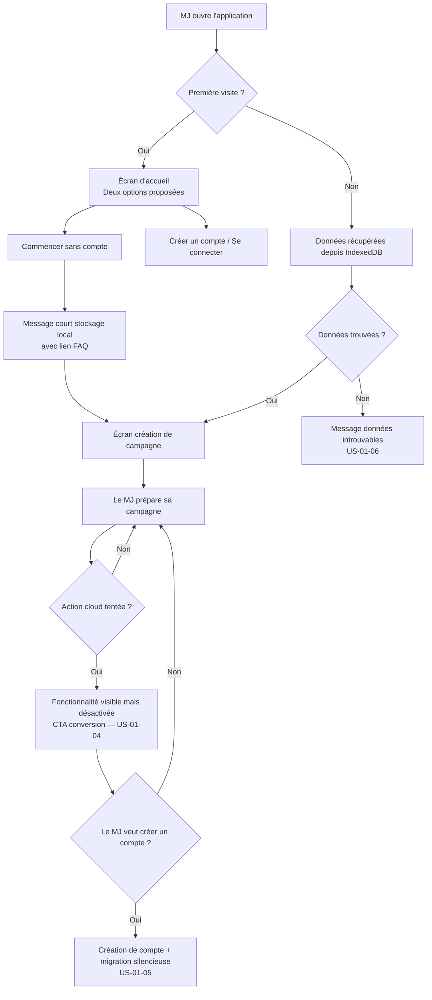
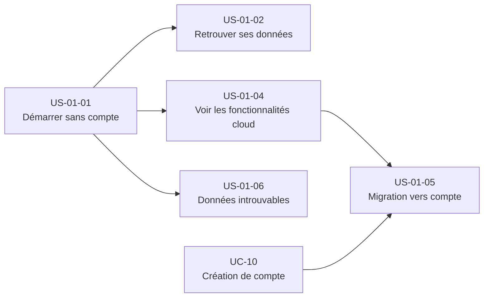

# Epic — Mode local sans compte

---

## Objectif utilisateur

Permettre à un MJ de commencer à utiliser Haversack immédiatement, sans friction d'inscription, en stockant les données localement dans le navigateur (IndexedDB). L'objectif est de réduire le coût d'adoption initial et de démontrer la valeur de l'outil avant toute création de compte.

---

## Personas concernés

| Persona | Profil | Douleur principale | Lien avec cet epic |
|---|---|---|---|
| **Nadia** | MJ infirmière, 42 ans | Coût d'adoption trop élevé pour sa fréquence de jeu | Bénéficiaire directe — peut tester sans s'engager |
| **Thomas** | MJ développeur, 35 ans | Lock-in propriétaire, migration lourde | Concerné par l'export JSON et la liberté des données |
| **Rémi** | MJ libraire, 48 ans | Ne voit pas la valeur face à un carnet | Entrée sans friction peut abaisser sa résistance initiale |

---

## Use cases couverts

- **UC-01** — Mode local sans compte (intégralité du périmètre)
- **UC-10** — Création de compte (dépendance externe pour US-01-05)

---

## Priorité MoSCoW

| Story | Priorité |
|---|---|
| US-01-01 | Must Have |
| US-01-02 | Must Have |
| US-01-03 | Exclue (voir section Stories exclues ou repoussées) |
| US-01-04 | Must Have |
| US-01-05 | Must Have (dépend UC-10) |
| US-01-06 | Should Have |
| US-01-07 | Exclue (voir section Stories exclues ou repoussées) |

---

## Bounded contexts pressentis

- **la gestion de campagne** — création et stockage des campagnes locales, règle de quota (max 3 campagnes en mode local)
- **la bibliothèque de contenu** — documents, dossiers, scénarios stockés localement
- **Identity & Access** — activation lors de la conversion vers un compte (US-01-05 uniquement)

Le mode local ne crée aucun compte utilisateur côté serveur. Les contraintes de stockage (~50-100 Mo)
sont des règles d'interface, pas des règles métier durables.

---

## Vue d'ensemble



---

## Dépendances



---

## User stories

---

### US-01-01 — Démarrer l'application sans créer de compte

**Format**

> En tant que MJ,
> je veux pouvoir commencer à utiliser Haversack immédiatement sans créer de compte,
> afin de découvrir la valeur de l'outil avant de m'engager.

**Métadonnées**

| Champ | Valeur |
|---|---|
| Priorité | Must Have |
| Source | UC-01 — scénario nominal |
| Bounded context | la gestion de campagne |

**Critères d'acceptation**

```gherkin
Feature: Démarrage sans compte

  Scenario: Le MJ choisit de commencer sans compte
    Given le MJ ouvre l'application pour la première fois
    When il choisit "Commencer sans compte"
    Then l'application affiche un message court sur le stockage local
    And un lien vers la FAQ est disponible
    And le MJ est redirigé vers l'écran de création de campagne

  Scenario: Le MJ reçoit un message informatif au premier démarrage
    Given le MJ ouvre l'application pour la première fois
    When il choisit de commencer sans compte
    Then le MJ reçoit un message informatif court sur le stockage local lors du premier démarrage

  Scenario: Le MJ crée une campagne en mode local
    Given le MJ est en mode local sans compte
    When il crée une campagne et y ajoute du contenu
    Then aucune donnée n'est envoyée au serveur
    And le contenu est disponible dans la session courante

  Scenario: Le MJ atteint la limite de 3 campagnes en mode local
    Given le MJ est en mode local sans compte
    And il a déjà 3 campagnes créées
    When il tente de créer une 4e campagne
    Then la création est bloquée
    And un message l'invite à créer un compte pour bénéficier d'un stockage cloud illimité
```

**Règles métier**

- RM-01-01-1 : En mode local, aucune donnée n'est envoyée au serveur. Cette règle est une garantie de confiance envers l'utilisateur, pas uniquement une contrainte technique.
- RM-01-01-2 : L'application propose systématiquement les deux options (sans compte / avec compte) à l'écran d'accueil, sans hiérarchie visuelle forçant l'inscription.
- RM-01-01-3 : En mode local, le MJ peut créer au maximum 3 campagnes. Au-delà, la création est bloquée avec un message proposant de créer un compte.

**Notes de conception**

- Le mode local n'instancie aucune compte utilisateur. la gestion de campagne opère avec un identifiant de session local opaque.
- La règle "aucune donnée envoyée au serveur" doit être testable (ex : absence de requêtes réseau sortantes en mode local, vérifiable en tests d'intégration ou via Content Security Policy).

---

### US-01-02 — Retrouver ses données après fermeture du navigateur

**Format**

> En tant que MJ,
> je veux retrouver mes campagnes et contenus intacts après avoir fermé et rouvert le navigateur,
> afin de ne pas perdre mon travail de préparation.

**Métadonnées**

| Champ | Valeur |
|---|---|
| Priorité | Must Have |
| Source | UC-01 — scénario alternatif A2 |
| Bounded context | la gestion de campagne, la bibliothèque de contenu |

**Critères d'acceptation**

```gherkin
Feature: Persistance des données locales

  Scenario: Retour après fermeture du navigateur
    Given le MJ a créé du contenu en mode local
    And il a fermé le navigateur
    When il rouvre l'application
    Then ses campagnes et contenus sont disponibles
```

**Règles métier**

- RM-01-02-1 : Les données locales sont persistées dans IndexedDB.
- RM-01-02-3 : Les limites de stockage (~50-100 Mo) sont des contraintes d'interface. Elles ne constituent pas des règles métier durables.

**Notes de conception**

- IndexedDB est la technologie cible pour la persistance locale. Ne pas utiliser brouillon local (limité à 5-10 Mo) ni sessionStorage (non persistant).
- Aucun utilisateur ne doit être modélisé pour le mode local. L'idest un identifiant de session opaque géré côté interface.

---

### US-01-04 — Voir les fonctionnalités cloud inaccessibles depuis le mode local

**Format**

> En tant que MJ en mode local,
> je veux voir quelles fonctionnalités nécessitent un compte,
> afin de comprendre ce que je gagnerais à créer un compte sans être bloqué dans mon usage actuel.

**Métadonnées**

| Champ | Valeur |
|---|---|
| Priorité | Must Have |
| Source | UC-01 — règle métier 4, critère d'acceptation |
| Bounded context | la gestion de campagne (partage), la conduite de session (accès joueur) |

**Critères d'acceptation**

```gherkin
Feature: Visibilité des fonctionnalités cloud en mode local

  Scenario: Fonctionnalité de partage visible mais désactivée
    Given le MJ est en mode local sans compte
    When il accède à une fonctionnalité de partage (UC-08) ou d'accès joueur (UC-09)
    Then la fonctionnalité est visible dans l'interface
    And elle est désactivée
    And un CTA clair invite le MJ à créer un compte pour y accéder

  Scenario: Le MJ comprend ce qui est accessible sans compte
    Given le MJ est en mode local sans compte
    When il navigue dans l'application
    Then les fonctionnalités locales sont pleinement accessibles
    And les fonctionnalités cloud sont distinguables visuellement (ex : cadenas, label)
    And aucune fonctionnalité cloud n'est masquée ou cachée
```

**Règles métier**

- RM-01-04-1 : Les fonctionnalités de partage (UC-08) et d'accès joueur (UC-09) nécessitent au minimum un compte gratuit.
- RM-01-04-2 : Les fonctionnalités cloud sont visibles mais désactivées en mode local. Elles ne sont pas masquées.
- RM-01-04-3 : Un CTA de conversion vers un compte doit accompagner chaque fonctionnalité cloud désactivée.

**Notes de conception**

- Pattern UI obligatoire : "unlock" (visible + désactivé + CTA) et non "hidden" (masqué). Le choix "hidden" nuirait à la découvrabilité et à la démonstration de valeur, ce qui est contraire à l'objectif de cet epic.
- Ce pattern est un point de conversion implicite vers US-01-05.

---

### US-01-05 — Créer un compte depuis le mode local avec migration automatique

**Format**

> En tant que MJ en mode local,
> je veux créer un compte depuis n'importe quelle page de l'application et y retrouver toutes mes données,
> afin de passer au cloud sans perdre mon travail de préparation.

**Métadonnées**

| Champ | Valeur |
|---|---|
| Priorité | Must Have (dépend UC-10) |
| Source | UC-01 — scénario alternatif A1, règle métier 2 |
| Bounded context | Identity & Access (création du compte), la gestion de campagne (migration des données) |

**Critères d'acceptation**

```gherkin
Feature: Migration des données locales à la création de compte

  Scenario: Le MJ crée un compte depuis une invite contextuelle
    Given le MJ est en mode local sans compte
    And il a tenté d'accéder à une fonctionnalité cloud
    When il choisit de créer un compte via le CTA
    Then il est redirigé vers le flow de création de compte (UC-10)
    And après création du compte, ses données locales sont migrées automatiquement vers le cloud
    And il retrouve ses campagnes et contenus dans son espace cloud

  Scenario: Le MJ crée un compte depuis les paramètres
    Given le MJ est en mode local sans compte
    When il accède aux paramètres et choisit de créer un compte
    Then le même flow de migration automatique est déclenché

  Scenario: La migration démarre automatiquement sans demander de confirmation
    Given le MJ vient de créer un compte
    When la création de compte est finalisée
    Then la migration des données locales démarre automatiquement
    And aucune confirmation n'est demandée au MJ

  Scenario: La migration échoue
    Given le MJ vient de créer un compte
    When la migration automatique des données locales échoue
    Then un message d'erreur explicite est affiché
    And les données locales sont préservées dans le navigateur
    And le MJ peut relancer la migration manuellement
```

**Règles métier**

- RM-01-05-1 : La création de compte depuis le mode local déclenche obligatoirement une migration des données locales vers le cloud.
- RM-01-05-2 : Le MJ peut initier la création de compte depuis n'importe quelle page de l'application.
- RM-01-05-3 : En cas d'échec de migration, les données locales sont préservées.

**Notes de conception**

- Ce flow est transverse : Identity & Access crée l'compte utilisateur, la gestion de campagne orchestre la migration des données locales. Ce n'est pas la responsabilité d'un seul périmètre fonctionnel.
- La migration est silencieuse. Aucune confirmation n'est demandée au MJ avant le démarrage de la migration.
- Dépendance forte avec UC-10 (création de compte) : cette story ne peut être livrée qu'après stabilisation d'UC-10.
- La migration implique de lire les données depuis IndexedDB et de les persister via l'API la gestion de campagne / la bibliothèque de contenu.

---

### US-01-06 — Être guidé quand les données locales sont introuvables

**Format**

> En tant que MJ revenant sur l'application,
> je veux être informé clairement quand mes données locales ne sont pas disponibles,
> afin de comprendre ce qui s'est passé et de savoir comment continuer.

**Métadonnées**

| Champ | Valeur |
|---|---|
| Priorité | Should Have |
| Source | UC-01 — scénario alternatif A3, exception E1 |
| Bounded context | la gestion de campagne |

**Critères d'acceptation**

```gherkin
Feature: Gestion des données locales introuvables

  Scenario: Données effacées (cache vidé)
    Given le MJ a déjà utilisé l'application en mode local
    And les données IndexedDB ont été supprimées (ex : cache navigateur vidé)
    When le MJ rouvre l'application
    Then un message explicite indique que les données précédentes sont introuvables
    And le message distingue ce cas d'une première visite
    And le MJ peut choisir de créer une nouvelle campagne ou de se connecter

  Scenario: Première visite réelle
    Given le MJ ouvre l'application pour la première fois
    When l'application ne trouve aucune donnée locale
    Then le message affiché est celui d'un accueil, pas d'un avertissement de perte de données

  Scenario: Stockage navigateur plein
    Given le MJ est en mode local
    When le stockage IndexedDB atteint sa limite
    Then un message indique que le stockage est plein
    And l'application propose de migrer les données vers le cloud (création de compte)

  Scenario: Le MJ atteint la limite de 3 campagnes en mode local
    Given le MJ est en mode local sans compte
    And il a déjà 3 campagnes créées
    When il tente de créer une 4e campagne
    Then un message d'erreur indique que la limite de campagnes en mode local est atteinte
    And le MJ est invité à créer un compte pour continuer
```

**Règles métier**

- RM-01-06-1 : L'application distingue le cas "première visite" (aucune donnée attendue) du cas "données perdues" (des données étaient présentes précédemment). Les messages affichés sont différents.
- RM-01-06-2 : En cas de stockage plein, la migration vers le cloud est proposée comme solution.

**Notes de conception**

- La distinction "première visite" vs. "données perdues" peut reposer sur un flag local persisté (ex : `haversack_has_visited` dans brouillon local) indépendant des données campagne. Ce flag est distinct des données métier.
- Le message "données introuvables" ne doit pas être anxiogène pour une première visite.

---

## Stories exclues ou repoussées

### US-01-03 — Comprendre le risque du mode local sans être bloqué

**Raison d'exclusion** : Le bandeau persistant a été jugé trop intrusif. Un message informatif au premier démarrage est couvert par US-01-01.

**Format original**

> En tant que MJ,
> je veux être informé de la nature éphémère du stockage local,
> afin de comprendre le risque de perte de données sans que cela interrompe mon usage.

---

### US-01-07 — Exporter ses données locales en JSON

**Raison d'exclusion** : Hors MVP pour l'instant. À reconsidérer si le lock-in propriétaire est identifié comme frein principal lors des entretiens utilisateurs.

**Format original**

> En tant que MJ en mode local,
> je veux pouvoir exporter mes données locales en JSON depuis les paramètres,
> afin de disposer d'une copie de sauvegarde et de ne pas être enfermé dans l'outil.

---

## Ordre de livraison recommandé

1. **US-01-01** — Démarrer sans compte (fondation de l'epic)
2. **US-01-02** — Persistance IndexedDB (nécessaire pour que l'outil soit utilisable)
3. **US-01-04** — Visibilité des fonctionnalités cloud (prépare la conversion)
4. **US-01-06** — Gestion des données introuvables (robustesse, Should Have)
5. **US-01-05** — Migration vers compte (dépend UC-10, livrable uniquement après)

---

## Vérification de couverture

| Règle métier UC-01 | Story couvrant la règle |
|---|---|
| RM-1 : aucune donnée envoyée au serveur en mode local | US-01-01 |
| RM-2 : migration obligatoire à la création de compte | US-01-05 |
| RM-3 : bandeau de rappel non bloquant, permanent jusqu'à création de compte | US-01-01 (message informatif au premier démarrage uniquement — le bandeau persistant est supprimé) |
| RM-4 : fonctionnalités de partage nécessitent un compte | US-01-04 |

| Critère d'acceptation UC-01 | Story couvrant le critère |
|---|---|
| Campagne créable sans compte | US-01-01 |
| Persistance après fermeture/réouverture | US-01-02 |
| Rappel non bloquant sur la nature locale | US-01-01 (message premier démarrage uniquement) |
| Création de compte depuis n'importe quelle page avec migration | US-01-05 |
| Export JSON fonctionnel et réimportable | Non couvert en MVP — ce critère d'acceptation doit être révisé dans UC-01 |
| Fonctionnalités de partage visibles mais désactivées avec invite | US-01-04 |

| Scénario alternatif UC-01 | Story couvrant le scénario |
|---|---|
| A1 — Conversion vers un compte | US-01-05 |
| A2 — Retour après fermeture du navigateur | US-01-02 |
| A3 — Données introuvables | US-01-06 |
| A4 — Export manuel des données locales | Non couvert en MVP |
| E1 — Stockage navigateur plein | US-01-06 |

---

## Questions ouvertes

1. **Durée d'affichage du bandeau** — Sans objet. Le bandeau persistant est supprimé. Le message informatif au premier démarrage est couvert par US-01-01.
2. **Confirmation de migration** — DÉCIDÉ : la migration est silencieuse. Aucune confirmation demandée.
3. **Limite du nombre de campagnes en mode local** — DÉCIDÉ : limite à 3 campagnes en mode local (cap numérique).
4. **Périmètre de l'export JSON** — DÉCIDÉ : hors MVP. Périmètre non défini pour l'instant.
