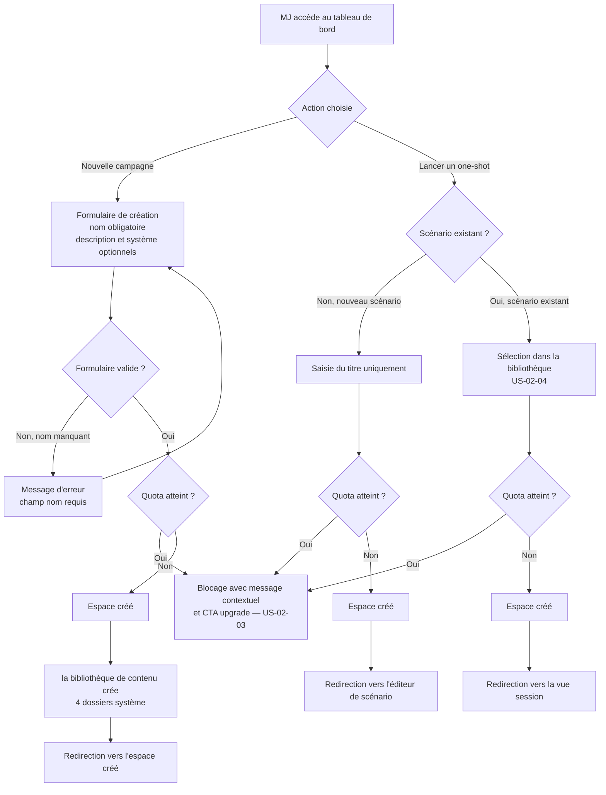
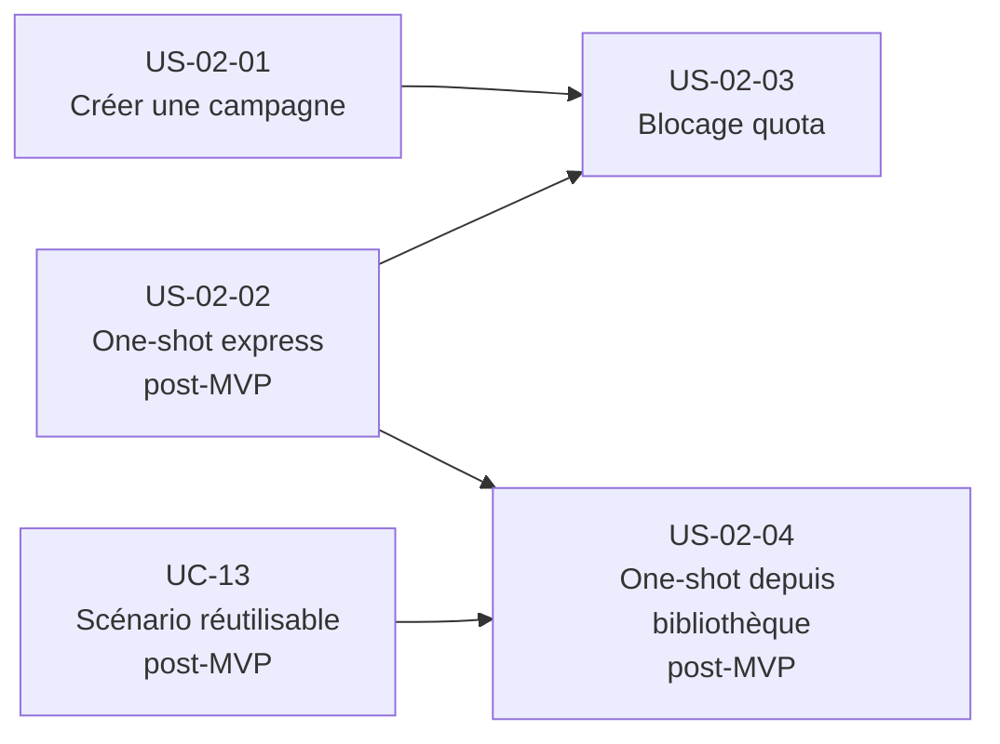

# Epic — Créer un espace de jeu

---

## Objectif utilisateur

Permettre à un MJ de créer un espace de travail pour organiser une campagne longue ou lancer un one-shot, avec un niveau de configuration adapté au contexte. L'objectif est de minimiser la friction à la création, d'offrir un parcours express pour les one-shots (< 30 secondes), et de permettre une configuration progressive pour les campagnes.

---

## Personas concernés

| Persona | Profil | Douleur principale | Lien avec cet epic |
|---|---|---|---|
| **Nadia** | MJ infirmière, 42 ans, session mensuelle | Configuration initiale trop longue | Bénéficiaire directe — campagne créable avec juste un nom |
| **Antoine** | MJ multi-campagnes, 3 systèmes différents | Structure imposée et non agnostique | Espace agnostique sans système de jeu obligatoire |
| **Sonia** | MJ one-shot exclusif, 3 à 5 one-shots/mois | Lancer un one-shot prend trop de temps | Parcours express one-shot < 30 secondes |
| **Émilie** | MJ improvisatrice | Devoir tout configurer avant de commencer | Création minimaliste, enrichissement en cours de route |
| **Thomas** | MJ Obsidian | Migration de contenu forcée | Espace créé sans importer de contenu |

---

## Use cases couverts

- **UC-02** — Créer un espace de jeu (intégralité du périmètre)
- **UC-13** — Scénario réutilisable (dépendance externe pour US-02-04)

---

## Priorité MoSCoW

| Story | Priorité |
|---|---|
| US-02-01 | Must Have |
| US-02-02 | Should Have — post-MVP (dépend UC-13 ; voir vision §5bis et UC-02 §A1) |
| US-02-03 | Must Have |
| US-02-04 | Should Have (dépend UC-13) |
| US-02-05 | Exclue |

---

## Bounded contexts pressentis

- **la gestion de campagne** — création de l'espace, application des règles métier (quota, ownership, type), publication de création de campagne
- **la bibliothèque de contenu** — réception de création de campagne, création des dossiers système (Personnages, Joueurs, Scénarios, Notes)
- **Identity & Access** — vérification de l'iddu MJ propriétaire, plan d'abonnement (gratuit/PRO)
- **la conduite de session** — redirection vers la vue session à l'issue du parcours one-shot depuis scénario existant (US-02-04)

La création des dossiers système n'appartient pas à la gestion de campagne. Ce périmètre fonctionnel publie uniquement l'événement création de campagne. C'est la bibliothèque de contenu qui réagit à cet événement pour créer les dossiers système.

---

## Vue d'ensemble



---

## Dépendances



---

## User stories

---

### US-02-01 — Créer une campagne depuis le tableau de bord

**Format**

> En tant que MJ,
> je veux créer un espace de campagne depuis mon tableau de bord en renseignant uniquement un nom,
> afin de commencer à préparer ma campagne sans configuration longue.

**Métadonnées**

| Champ | Valeur |
|---|---|
| Priorité | Must Have |
| Source | UC-02 — scénario nominal |
| Bounded context | la gestion de campagne, la bibliothèque de contenu |

**Critères d'acceptation**

```gherkin
Feature: Création d'une campagne

  Scenario: Le MJ crée une campagne avec le nom uniquement
    Given le MJ est connecté et accède à son tableau de bord
    And son quota de campagnes actives n'est pas atteint
    When il choisit "Nouvelle campagne"
    And il renseigne uniquement un nom
    And il valide
    Then un espace de campagne est créé
    And les 4 dossiers système sont créés automatiquement : Personnages, Joueurs, Scénarios, Notes
    And le MJ est redirigé vers le nouvel espace

  Scenario: Le MJ crée une campagne avec tous les champs
    Given le MJ est connecté et accède à son tableau de bord
    And son quota de campagnes actives n'est pas atteint
    When il choisit "Nouvelle campagne"
    And il renseigne un nom, une description courte et un système de jeu
    And il valide
    Then un espace de campagne est créé avec les informations fournies
    And les 4 dossiers système sont créés automatiquement

  Scenario: Le MJ tente de créer une campagne sans renseigner de nom
    Given le MJ accède au formulaire de création de campagne
    When il valide sans renseigner de nom
    Then un message d'erreur indique que le nom est obligatoire
    And aucun espace n'est créé

  Scenario: Le MJ crée une campagne sans système de jeu
    Given le MJ accède au formulaire de création de campagne
    When il valide sans renseigner de système de jeu
    Then l'espace est créé en mode générique
    And les 4 dossiers système sont créés avec leurs labels neutres

  Scenario: Le MJ est en mode local et crée une campagne
    Given le MJ utilise l'application en mode local sans compte
    And il a moins de 3 campagnes créées
    When il crée une campagne avec un nom
    Then l'espace est créé et pleinement fonctionnel
    And les 4 dossiers système sont créés automatiquement
```

**Règles métier**

- RB-02-01 : Le nom est obligatoire pour créer une campagne. Description et système de jeu sont facultatifs.
- RB-02-02 : L'espace créé appartient à un seul propriétaire avec le rôle `MemberRole.OWNER`.
- RB-02-03 : Les 4 dossiers système (Personnages, Joueurs, Scénarios, Notes) sont créés automatiquement. Ils sont renommables et supprimables (`isSystem` est informatif, non restrictif).
- RB-02-04 : Un espace créé sans système de jeu est en mode générique — comportement recommandé par défaut.
- RB-02-05 : Un espace créé en mode local est pleinement fonctionnel, au même titre qu'un espace cloud.

**Notes de conception**

- création d’un espace de jeu publie l'événement création de campagne. la gestion de campagne ne crée pas les dossiers système directement. C'est la bibliothèque de contenu qui consomme création de campagne et déclenche la création des 4 dossiers. Ce point d'architecture transverse doit être documenté dans les contrats d'intégration.
- Le `type` est positionné à `CAMPAIGN` pour ce scénario. L'utilisateur ne voit jamais ce détail technique.
- L'absence de système de jeu est le comportement par défaut. Aucune valeur pré-sélectionnée ne doit orienter le MJ vers un système spécifique.

---

### US-02-02 — Lancer un one-shot en parcours express

> **Post-MVP** — Cette story décrit le parcours express one-shot (point d'entrée dédié « Lancer un one-shot »). En première livraison, un one-shot se crée via le parcours campagne nominal avec `type = ONE_SHOT` (US-02-01). La livraison de cette story est conditionnée à celle de UC-13 — voir vision §5bis et UC-02 §A1.

**Format**

> En tant que MJ,
> je veux lancer un one-shot depuis le tableau de bord en moins de 30 secondes avec un titre uniquement,
> afin de ne pas perdre de temps en configuration avant une partie.

**Métadonnées**

| Champ | Valeur |
|---|---|
| Priorité | Should Have — post-MVP (dépend UC-13) |
| Source | UC-02 — scénario alternatif A1 |
| Bounded context | la gestion de campagne |

**Critères d'acceptation**

```gherkin
Feature: Lancement d'un one-shot en parcours express

  Scenario: Le MJ lance un one-shot avec un nouveau scénario
    Given le MJ est connecté et accède à son tableau de bord
    And son quota de campagnes actives n'est pas atteint
    When il choisit "Lancer un one-shot"
    And il saisit uniquement un titre de scénario
    And il valide
    Then un espace one-shot est créé
    And le MJ est redirigé vers l'éditeur de scénario

  Scenario: Le parcours one-shot est complété en moins de 30 secondes
    Given le MJ est connecté et accède à son tableau de bord
    When il choisit "Lancer un one-shot" et saisit un titre
    And il valide
    Then l'espace est créé et le MJ est redirigé en moins de 30 secondes depuis l'action initiale
```

**Règles métier**

- RB-02-06 : Un one-shot est techniquement une campagne avec type one-shot. Cette distinction n'est pas exposée à l'utilisateur.
- RB-02-07 : Pour un one-shot avec nouveau scénario, le titre est le seul champ obligatoire.
- RB-02-08 : L'archivage d'un one-shot est manuel, comme pour une campagne.
- RB-02-09 : Un espace archivé n'est pas supprimé définitivement.

**Notes de conception**

- Le parcours "Lancer un one-shot" doit être mesuré de bout en bout (depuis le clic sur l'action jusqu'à la redirection finale) pour vérifier le critère < 30 secondes. Il s'agit d'un critère d'acceptation mesurable.

---

### US-02-03 — Être bloqué et guidé quand la limite de campagnes est atteinte

**Format**

> En tant que MJ,
> je veux recevoir un message clair et contextuel quand je ne peux pas créer de nouvel espace,
> afin de comprendre pourquoi je suis bloqué et de savoir comment débloquer la situation.

**Métadonnées**

| Champ | Valeur |
|---|---|
| Priorité | Must Have |
| Source | UC-02 — règles métier, règle stable gratuit |
| Bounded context | la gestion de campagne |

**Critères d'acceptation**

```gherkin
Feature: Blocage à la limite de campagnes actives

  Scenario: Le MJ gratuit tente de créer une 4e campagne active
    Given le MJ possède un compte gratuit
    And il a déjà 3 campagnes actives
    When il tente de créer une nouvelle campagne ou de lancer un one-shot
    Then la création est bloquée
    And un message indique qu'il a atteint la limite de 3 campagnes actives pour un compte gratuit
    And un CTA l'invite à passer en PRO pour bénéficier d'un nombre illimité de campagnes

  Scenario: Le MJ gratuit peut créer un nouvel espace après avoir archivé une campagne
    Given le MJ possède un compte gratuit
    And il a 3 campagnes actives
    When il archive l'une de ses campagnes
    And il tente de créer une nouvelle campagne
    Then la création est autorisée

  Scenario: Le MJ en mode local tente de créer une 4e campagne
    Given le MJ utilise l'application en mode local sans compte
    And il a déjà 3 campagnes créées
    When il tente de créer une nouvelle campagne ou de lancer un one-shot
    Then la création est bloquée
    And un message indique qu'il a atteint la limite en mode local
    And un CTA l'invite à créer un compte pour continuer

  Scenario: Le MJ PRO n'est jamais bloqué
    Given le MJ possède un compte PRO
    And il a déjà 3 campagnes actives ou plus
    When il tente de créer une nouvelle campagne
    Then la création est autorisée sans restriction
```

**Règles métier**

- RB-02-10 : Un utilisateur gratuit ne peut pas avoir plus de 3 campagnes actives simultanément. Cet règle stable est vérifié côté dans la gestion de campagne.
- RB-02-11 : En mode local, le cap à 3 campagnes est une règle d’interface (pas un règle stable). Le message est distinct de celui du compte gratuit.
- RB-02-12 : Le message de blocage est contextuel : il distingue le mode local (invitation à créer un compte) du compte gratuit (invitation à passer en PRO).
- RB-02-13 : Les campagnes archivées ne comptent pas dans le quota actif.
- RB-02-14 : Un utilisateur PRO ne rencontre jamais ce blocage.

**Notes de conception**

- La limite du compte gratuit (3 campagnes actives maximum) est vérifiée à la création. Le rejet est une règle fonctionnelle, pas seulement une validation d'écran.
- Le cap mode local est une règle d’interface uniquement. Il n'y a pas de compte utilisateur côté serveur en mode local. Les deux règles ont la même valeur (3) mais ne sont pas du même type.
- Le CTA doit différer selon le contexte : "Créer un compte" en mode local, "Passer en PRO" pour un compte gratuit. Ne pas afficher le même message.

---

### US-02-04 — Lancer un one-shot depuis un scénario de bibliothèque

**Format**

> En tant que MJ,
> je veux lancer un one-shot directement depuis un scénario de ma bibliothèque,
> afin de démarrer une session sans re-saisir le titre ni naviguer manuellement vers l'espace.

**Métadonnées**

| Champ | Valeur |
|---|---|
| Priorité | Should Have (dépend UC-13) |
| Source | UC-02 — scénario alternatif A1, option "scénario existant" |
| Bounded context | la gestion de campagne, la bibliothèque de contenu, la conduite de session |

**Critères d'acceptation**

```gherkin
Feature: One-shot depuis un scénario de bibliothèque

  Scenario: Le MJ lance un one-shot depuis un scénario existant
    Given le MJ est connecté et accède à son tableau de bord
    And son quota de campagnes actives n'est pas atteint
    When il choisit "Lancer un one-shot"
    And il sélectionne un scénario existant dans sa bibliothèque
    And il valide
    Then un espace one-shot est créé
    And le nom du scénario est pré-rempli comme nom de l'espace
    And le MJ est redirigé directement vers la vue session

  Scenario: Le nom de l'espace est pré-rempli depuis le titre du scénario
    Given le MJ sélectionne un scénario existant pour un one-shot
    When l'espace est créé
    Then le nom de l'espace correspond au titre du scénario sélectionné
    And le MJ peut modifier ce nom avant de valider

  Scenario: Le MJ est redirigé vers la vue session sans étape intermédiaire
    Given le MJ a sélectionné un scénario existant
    When il valide la création du one-shot
    Then il est redirigé directement vers la vue session (UC-06)
    And aucune étape de configuration supplémentaire n'est présentée
```

**Règles métier**

- RB-02-15 : Lors d'un one-shot depuis scénario existant, le nom de l'espace est pré-rempli avec le titre du scénario.
- RB-02-16 : La redirection est directe vers la vue session (UC-06) — aucune étape intermédiaire.
- RB-02-17 : Le quota de campagnes actives est vérifié de la même façon que pour les autres créations.

**Notes de conception**

- Cette story dépend de UC-13 (scénario réutilisable). Elle ne peut être livrée qu'après stabilisation d'UC-13. Marquer en bloquée si UC-13 n'est pas livré.
- La redirection vers la vue session implique la conduite de session. L'intégration transverse (la gestion de campagne → la conduite de session) doit être définie dans les contrats d'intégration.
- Le scénario sélectionné est associé à l'espace one-shot nouvellement créé. la bibliothèque de contenu doit exposer la liste des scénarios disponibles pour la sélection dans ce parcours.

---

## Stories exclues ou repoussées

- **US-02-02** — Should Have — post-MVP. Le parcours express one-shot (point d'entrée dédié) est reporté après la première livraison. En MVP, le one-shot se crée via le parcours campagne nominal avec `type = ONE_SHOT` (US-02-01). Conditionné à la livraison de UC-13.
- **US-02-04** — Should Have (non bloquante pour le MVP, dépend de UC-13).
- **US-02-05 — Sauvegarder une campagne en brouillon** — Exclue. Hors MVP. Le formulaire de création est minimal (1 champ obligatoire). Si implémenté, ce sera un état purement interface (brouillon local) sans statut DRAFT dans le modèle fonctionnel.

---

## Ordre de livraison recommandé

**MVP (première livraison) :**

1. **US-02-01** — Créer une campagne (fondation de l'epic, couvre aussi la création de one-shot via `type = ONE_SHOT`)
2. **US-02-03** — Blocage quota (corollaire obligatoire de US-02-01, la création sans garde est risquée)

**Post-MVP (après livraison de UC-13) :**

3. **US-02-02** — One-shot express (parcours express dédié, conditionné à UC-13)
4. **US-02-04** — One-shot depuis bibliothèque (conditionné à UC-13 et US-02-02)

---

## Vérification de couverture

| Règle métier UC-02 | Story couvrant la règle |
|---|---|
| Un espace appartient à un seul propriétaire (MemberRole.OWNER) | US-02-01 |
| Nom obligatoire pour les campagnes | US-02-01 |
| Nom pré-rempli pour un one-shot depuis scénario existant | US-02-04 |
| Dossiers système créés automatiquement, renommables et supprimables (`isSystem` informatif) | US-02-01 |
| One-shot archivable manuellement par le MJ, comme une campagne | US-02-02 |
| Un espace peut être archivé sans suppression définitive | US-02-02, US-02-03 |

| Critère d'acceptation UC-02 | Story couvrant le critère |
|---|---|
| MJ peut créer une campagne avec juste un nom | US-02-01 |
| MJ peut lancer un one-shot en moins de 30 secondes | US-02-02 |
| One-shot depuis scénario existant redirige vers la vue session | US-02-04 |
| Les 4 dossiers système existent avec leurs noms neutres | US-02-01 |
| Un espace créé en mode local est pleinement fonctionnel | US-02-01 |
| One-shot archivable manuellement (comme une campagne) | US-02-02 |

| Scénario alternatif UC-02 | Story couvrant le scénario |
|---|---|
| A1 — One-shot express (nouveau scénario) | US-02-02 |
| A1 — One-shot depuis scénario existant | US-02-04 |
| A2 — Brouillon | US-02-05 (exclue, hors MVP) |
| A3 — Sans système de jeu | US-02-01 |

---

## Questions ouvertes

1. **Séparation visuelle campagnes / one-shots dans le tableau de bord** — Le tableau de bord doit-il distinguer visuellement les espaces de type "campagne" et "one-shot", ou afficher tous les espaces ensemble avec un simple indicateur de type ? Impact sur l'UX et la lisibilité pour des MJ comme Sonia (5 one-shots/mois).

2. **Renommage des dossiers système à la création** — Les dossiers système (Personnages, Joueurs, Scénarios, Notes) peuvent-ils être renommés par le MJ dès le formulaire de création, ou uniquement après que l'espace est créé ?
