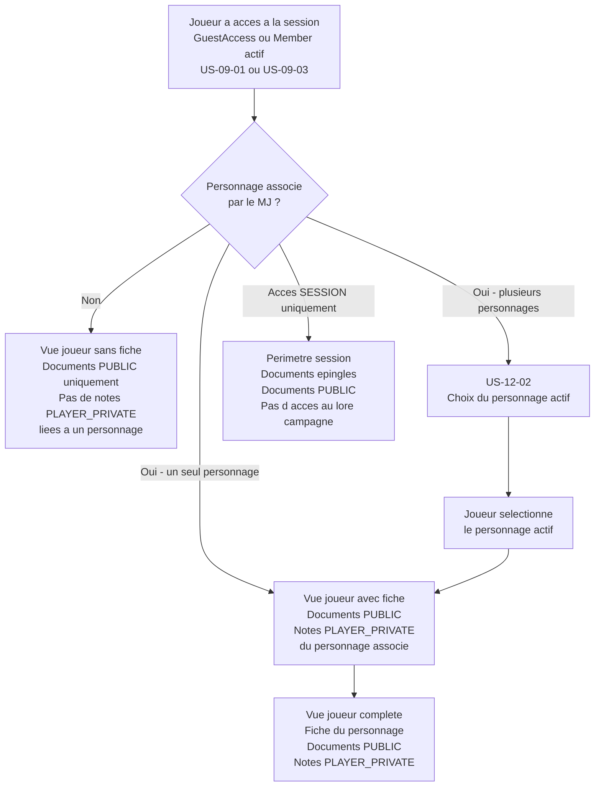
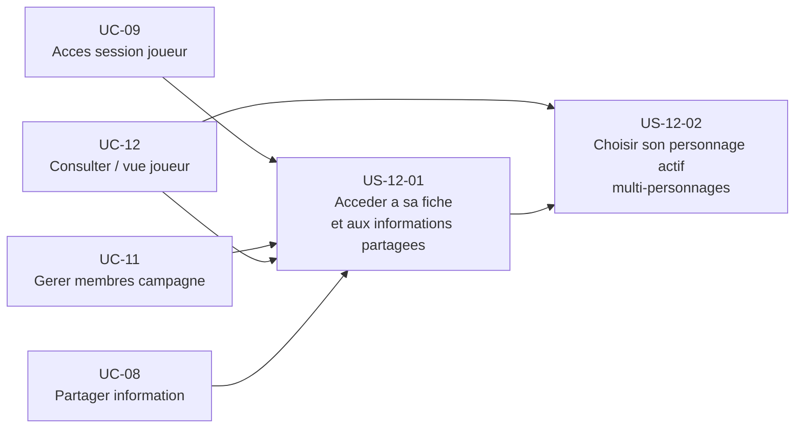

# Epic — Consulter sa campagne en tant que joueur (vue post-accès) (UC-12)

## Objectif utilisateur

Donner au joueur, après qu'il a rejoint via un lien (couvert par UC-09 et UC-11), une vue cohérente de sa fiche de personnage et des informations partagées. UC-12 couvre spécifiquement la perspective joueur post-accès : accès à la fiche, consultation des documents `PUBLIC`, et choix du personnage actif quand le joueur est associé à plusieurs personnages dans une même campagne.

---

## Personas concernés

| Persona | Motivation principale |
|---|---|
| Lucas | Accéder sans friction à sa fiche de personnage et aux informations partagées après avoir cliqué sur un lien |
| Thomas | Jouer en tant que joueur dans une campagne avec deux personnages alternés, choisir lequel est actif selon la session |

---

## Use cases couverts

- **UC-12** — Consulter sa campagne en tant que joueur (vue post-accès)
  - Nominal : vue joueur post-accès — fiche personnage + documents `PUBLIC`
  - A1 : joueur associé à plusieurs personnages — choix du personnage actif
  - A2 : accès limité à la session seulement (périmètre `SESSION`, sans accès campagne complet)
  - E1 : joueur sans personnage associé — consultation des documents `PUBLIC` uniquement

---

## Priorité MoSCoW

| Priorité | Stories |
|---|---|
| Should Have | US-12-01, US-12-02 |

---

## Bounded contexts pressentis

- **Campaign Management** — gère les `Member`, les associations joueur-personnage, le personnage actif.
- **Identity & Access** — valide les tokens `GuestAccess` et `Member`, contrôle le périmètre d'accès.
- **Bibliothèque de contenu** — fournit les documents `PUBLIC` et les fiches de personnage (Document de type `player_character`).

---

## Relation avec UC-09 et UC-11

Les flux d'accès (clic sur le lien, validation du token, création du `GuestAccess` ou du `Member`) sont entièrement couverts par UC-09 et UC-11. UC-12 commence là où ils s'arrêtent : le joueur est déjà dans la session.

| Ce qui est couvert ailleurs | UC / Story de référence |
|---|---|
| Accès via lien session ponctuel sans compte | US-09-01 |
| Lien expiré ou révoqué | US-09-02 |
| Accès via lien campagne permanent avec compte | US-09-03 |
| Migration invité vers compte | US-09-04 |
| Génération du lien d'invitation par le MJ | US-11-01 |
| Association joueur-personnage par le MJ | US-11-04 |

UC-12 couvre uniquement : la vue joueur post-accès (fiche + documents `PUBLIC`) et le choix du personnage actif (joueur multi-personnages).

---

## Vue d'ensemble Mermaid



---

## Diagramme de dépendances



---

## User stories

### US-12-01 — Accéder à sa fiche de personnage et aux informations partagées

**Priorité** : Should Have

**En tant que** joueur,
**je veux** voir ma fiche de personnage et les documents partagés par le MJ dès que j'ai rejoint la session,
**afin de** disposer de toutes les informations utiles pour jouer sans avoir à les demander au MJ.

**Notes de conception** :
- La vue joueur est rendue disponible dès que le `GuestAccess` ou le `Member` est actif (UC-09).
- La fiche de personnage n'est visible que si le MJ a associé un personnage à ce joueur (US-11-04). Sans association, le joueur consulte uniquement les documents `PUBLIC`.
- Les notes `PLAYER_PRIVATE` sont liées à leur **auteur**, rattachées au personnage pour l'affichage. Un `GuestAccess` récupère la **fiche** du personnage associé — les notes `PLAYER_PRIVATE` ne sont visibles que si le même auteur y accède de nouveau (compte stable) ; un nouvel invité réassocié au même personnage ne récupère jamais les notes d'un invité précédent (RB-12-02, RB-09-19).
- Les documents `PUBLIC` sont fournis par la Bibliothèque de contenu et filtrés selon le périmètre d'accès (`SESSION` ou `CAMPAIGN`).
- Un accès périmètre `SESSION` donne accès aux documents épinglés de la session et aux documents `PUBLIC` de la campagne, mais pas à l'historique complet du lore campagne (couvert par US-09-03).
- Un accès périmètre `CAMPAIGN` (`Member`) donne accès à l'ensemble des documents `PUBLIC` de la campagne et à l'historique des sessions.

**Règles métier** :
- RB-12-01 : Le joueur ne voit que les documents dont la visibilité est `PUBLIC`. Les documents `GM_ONLY` et les documents `PLAYER_PRIVATE` d'autres personnages sont invisibles.
- RB-12-02 : Les notes `PLAYER_PRIVATE` sont liées à leur **auteur**, **rattachées au personnage pour l'affichage** ; elles persistent entre les sessions pour le **même auteur** (compte stable). Elles ne sont pas propriété du personnage — un joueur (invité ou membre) qui accède à un personnage déjà joué par quelqu'un d'autre ne récupère jamais les notes de son prédécesseur (RB-09-19).
- RB-12-03 : Un joueur sans personnage associé peut consulter les documents `PUBLIC` mais ne peut pas créer de notes `PLAYER_PRIVATE` liées à un personnage.
- RB-12-04 : Un accès périmètre `SESSION` ne donne pas accès à l'historique complet des sessions et du lore de la campagne. Seuls les documents `PUBLIC` et les documents épinglés de la session sont visibles.
- RB-12-05 : Un accès périmètre `CAMPAIGN` (`Member`) donne accès à l'ensemble des documents `PUBLIC` et à l'historique des sessions passées.

**Critères d'acceptation** :
- [ ] Le joueur avec un personnage associé voit la fiche du personnage dès l'accès à la session.
- [ ] Le joueur voit les documents `PUBLIC` de la campagne et les documents épinglés de la session.
- [ ] Les notes `PLAYER_PRIVATE` du personnage associé sont accessibles et éditables.
- [ ] Un joueur sans personnage associé voit les documents `PUBLIC` mais ne peut pas créer de notes liées à un personnage.
- [ ] Un accès périmètre `SESSION` ne donne pas accès à l'historique des sessions précédentes ni au lore complet de la campagne.
- [ ] Un accès périmètre `CAMPAIGN` donne accès à l'ensemble des documents `PUBLIC` et à l'historique des sessions.
- [ ] Les documents dont la visibilité n'est pas `PUBLIC` ne sont pas visibles par le joueur.

```gherkin
Scenario : Joueur avec personnage associe accede a sa fiche et aux documents partages (nominal)
  Etant donne que Lucas a rejoint la session via un lien valide
  Et que le MJ a associe le personnage "Aldric" a Lucas
  Quand la vue joueur s affiche
  Alors Lucas voit la fiche du personnage "Aldric"
  Et Lucas voit les documents PUBLIC de la campagne
  Et Lucas peut consulter et modifier ses notes PLAYER_PRIVATE liees a Aldric

Scenario : Joueur sans personnage associe - consultation uniquement
  Etant donne que Lucas a rejoint la session via un lien valide
  Et qu aucun personnage n a ete associe a Lucas par le MJ
  Quand la vue joueur s affiche
  Alors Lucas voit les documents PUBLIC de la campagne
  Et Lucas ne voit pas de fiche de personnage
  Et Lucas ne peut pas creer de notes PLAYER_PRIVATE liees a un personnage

Scenario : Acces perimetre SESSION - pas d acces au lore campagne complet
  Etant donne que Lucas a rejoint via un lien perimetre SESSION
  Quand la vue joueur s affiche
  Alors Lucas voit les documents epingles de la session et les documents PUBLIC
  Et Lucas ne voit pas l historique des sessions precedentes ni le lore complet de la campagne

Scenario : Notes PLAYER_PRIVATE preservees entre les sessions pour le meme auteur
  Etant donne que Lucas a pris des notes PLAYER_PRIVATE sur Aldric lors d une session precedente
  Et que Lucas rejoint une nouvelle session en tant que meme auteur (meme compte)
  Quand la vue joueur s affiche
  Alors les notes PLAYER_PRIVATE ecrites par Lucas sur Aldric sont disponibles

Scenario : Documents GM_ONLY invisibles pour le joueur
  Etant donne que la campagne contient un document avec la visibilite GM_ONLY
  Quand Lucas consulte la vue joueur
  Alors ce document n apparait pas dans sa liste de documents
```

---

### US-12-02 — Choisir son personnage actif quand associé à plusieurs personnages

**Priorité** : Should Have

**En tant que** joueur,
**je veux** choisir lequel de mes personnages est actif pour la session en cours,
**afin de** consulter la bonne fiche et prendre des notes liées au personnage que je joue ce soir.

**Notes de conception** :
- Un joueur peut être associé à plusieurs personnages dans une même campagne (RB-11-17 dans UC-11). Cette story couvre la vue joueur de cette fonctionnalité.
- Le choix du personnage actif est local à la session en cours. Il ne modifie pas l'association définie par le MJ (US-11-04) — il détermine seulement quel personnage est affiché en priorité dans la vue joueur.
- Le personnage actif conditionne uniquement les actions qui dépendent d'une fiche précise : affichage de la fiche en tête, notes `PLAYER_PRIVATE` visibles et éditables, accès aux ressources liées au personnage.
- Si le joueur n'a qu'un seul personnage associé, aucune sélection n'est requise — la fiche s'affiche directement (US-12-01).
- `Campaign Management` gère la liste des personnages associés à un `Member`. La sélection du personnage actif est une préférence de vue, côté client ou stockée en session, sans modifier les données de `Campaign Management`.

**Règles métier** :
- RB-12-06 : Un joueur associé à plusieurs personnages doit choisir un personnage actif pour les actions dépendant d'une fiche précise (notes `PLAYER_PRIVATE`, affichage de fiche).
- RB-12-07 : Le choix du personnage actif est propre à la session en cours. Il ne modifie pas les associations définies par le MJ.
- RB-12-08 : Un joueur avec un seul personnage associé n'a pas à effectuer de sélection — son personnage est actif par défaut.
- RB-12-09 : Le joueur peut changer de personnage actif à tout moment pendant la session.
- RB-12-10 : Les notes `PLAYER_PRIVATE` et la fiche affichées correspondent toujours au personnage actif sélectionné.

**Critères d'acceptation** :
- [ ] Un joueur associé à plusieurs personnages voit une interface de sélection du personnage actif à l'entrée en session.
- [ ] Après sélection, la fiche du personnage actif est affichée dans la vue joueur.
- [ ] Les notes `PLAYER_PRIVATE` visibles et éditables correspondent au personnage actif.
- [ ] Le joueur peut changer de personnage actif à tout moment pendant la session.
- [ ] Un joueur avec un seul personnage associé ne voit pas d'interface de sélection — la fiche s'affiche directement.
- [ ] Le changement de personnage actif ne modifie pas les associations définies par le MJ.

```gherkin
Scenario : Joueur avec plusieurs personnages - choix du personnage actif a l entree
  Etant donne que Thomas est Member de la campagne
  Et que le MJ a associe Thomas aux personnages "Veran" et "Kael"
  Quand Thomas accede a la vue joueur
  Alors une interface de selection lui propose de choisir entre "Veran" et "Kael"
  Et Thomas peut selectionner le personnage qu il joue ce soir

Scenario : Vue joueur apres selection du personnage actif
  Etant donne que Thomas a selectionne "Veran" comme personnage actif
  Quand la vue joueur s affiche
  Alors la fiche de "Veran" est visible en priorite
  Et les notes PLAYER_PRIVATE liees a "Veran" sont accessibles et editables
  Et les notes de "Kael" ne sont pas affichees

Scenario : Changement de personnage actif en cours de session
  Etant donne que Thomas a "Veran" comme personnage actif
  Quand Thomas change le personnage actif pour "Kael" depuis la vue joueur
  Alors la fiche de "Kael" s affiche
  Et les notes PLAYER_PRIVATE de "Kael" remplacent celles de "Veran" dans la vue

Scenario : Joueur avec un seul personnage - pas de selection requise
  Etant donne que Lucas est Member de la campagne
  Et que le MJ a associe Lucas a un seul personnage "Aldric"
  Quand Lucas accede a la vue joueur
  Alors la fiche d Aldric s affiche directement sans etape de selection

Scenario : Changement de personnage actif sans modifier les associations MJ
  Etant donne que Thomas a "Veran" comme personnage actif et change pour "Kael"
  Quand le MJ consulte le panneau membres
  Alors l association de Thomas avec "Veran" et "Kael" est inchangee dans Campaign Management
```

---

## Stories exclues ou repoussées

| Story / Feature | Raison |
|---|---|
| A2 — Validation manuelle du MJ avant l'accès joueur | Hors MVP (cohérent avec UC-11 et UC-09 : l'accès est automatique sur lien valide). |
| Notification au joueur quand le MJ partage un nouveau document | Could Have — fonctionnalité de notification non prioritaire. |
| Accès joueur à l'historique des sessions passées via périmètre SESSION | Hors périmètre : le lien SESSION donne accès à la session courante uniquement. L'historique est couvert par US-09-03 (Member, périmètre CAMPAIGN). |
| Partage sélectif de documents par joueur (un document PUBLIC pour ce joueur uniquement) | Hors MVP — RB-08-04 : le partage s'applique à tous les membres actifs. |
| Personnage actif persisté entre les sessions | Could Have — à préciser selon les retours utilisateur. La story couvre uniquement la sélection en session courante. |

---

## Ordre de livraison recommandé

1. **US-12-01** — Accéder à sa fiche et aux informations partagées (fondation : valeur joueur principale, dépend de US-11-04 pour l'association personnage)
2. **US-12-02** — Choisir son personnage actif (valeur pour Thomas, dépend de US-12-01 et des associations multi-personnages définies en US-11-04)

---

## Vérification de couverture

| Cas UC-12 | Story couvrant |
|---|---|
| Nominal — vue joueur post-accès, fiche + documents PUBLIC | US-12-01 |
| A1 — joueur associé à plusieurs personnages, choix du personnage actif | US-12-02 |
| A2 — accès périmètre SESSION uniquement (sans accès campagne complet) | US-12-01 |
| E1 — joueur sans personnage associé, consultation documents PUBLIC uniquement | US-12-01 |
| Flux d'accès (lien, token, GuestAccess, Member) | UC-09 (US-09-01 à US-09-04) |
| Génération du lien et association joueur-personnage | UC-11 (US-11-01, US-11-04) |

---

## Questions ouvertes

1. Le personnage actif doit-il être mémorisé entre les sessions (préférence persistante) ou remis à zéro à chaque nouvelle connexion ? La story couvre uniquement la session en cours.
2. Quand Thomas a deux personnages associés et que le MJ épingle un document lié à un seul personnage, ce document doit-il apparaître dans la vue joueur quel que soit le personnage actif, ou seulement quand le personnage concerné est actif ?
3. Un joueur sans personnage associé peut-il prendre des notes "libres" non liées à un personnage ? Ces notes seraient rattachées à son `Member` ou `GuestAccess`, pas à un personnage joueur (`Document` de type `player_character`).
4. La sélection du personnage actif doit-elle être visible par le MJ dans sa vue session ? Cela permettrait au MJ de savoir quel personnage Thomas joue ce soir sans lui poser la question.
5. Si un joueur a un accès périmètre `SESSION` et un accès périmètre `CAMPAIGN` simultanément (par exemple après migration invité vers compte), quelle vue s'affiche en priorité ?
