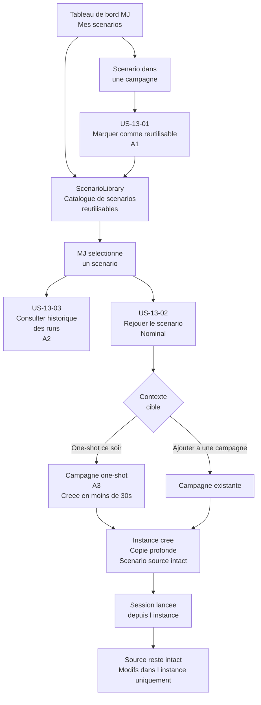
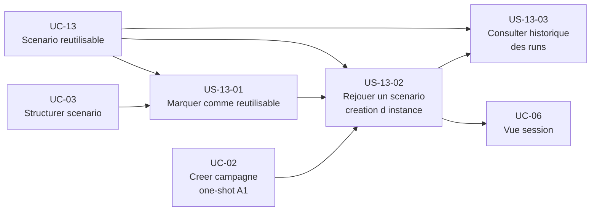

# Epic — Utiliser un scénario réutilisable (UC-13)

> **Should Have — hors première livraison (post-MVP)** — Cet epic, ainsi que le parcours express one-shot qu'il conditionne (UC-02 §A1, US-02-02, US-02-04), sont reportés après la première livraison. Voir vision §5bis et UC-13. En MVP, le one-shot se crée via le parcours campagne nominal (US-02-01, `type = ONE_SHOT`).

## Objectif utilisateur

Permettre au MJ de créer un scénario une fois et de le rejouer avec des groupes différents, en conservant le contenu source intact. L'unité de travail de Sonia n'est pas la campagne — c'est le scénario. Elle veut "lancer ce scénario ce soir" sans recréer une structure depuis zéro à chaque fois.

---

## Personas concernés

| Persona | Motivation principale |
|---|---|
| Sonia | Catalogue de 15 scénarios, 3 à 5 parties par mois, joueurs différents à chaque session, veut lancer sans préparer |
| Antoine | 3 campagnes simultanées, veut des structures réutilisables entre campagnes sans dupliquer manuellement |

---

## Use cases couverts

- **UC-13** — Utiliser un scénario réutilisable (one-shot)
  - Nominal : rejouer un scénario depuis la `ScenarioLibrary` (créer une instance dans une campagne ou un one-shot)
  - A1 : marquer un scénario existant comme réutilisable (le promouvoir dans la `ScenarioLibrary`)
  - A2 : consulter l'historique des runs (instances passées)
  - A3 : campagne one-shot légère (création en moins de 30 secondes) — sans archivage automatique

---

## Priorité MoSCoW

| Priorité | Stories |
|---|---|
| Should Have | US-13-01, US-13-02, US-13-03 |

---

## Bounded contexts pressentis

- **Campaign Management** — héberge la `ScenarioLibrary` (concept cross-campagne rattaché au compte MJ), les scénarios sources (templates) et les instances créées par copie profonde. Accueille également les instances dans les campagnes ou one-shots et gère la relation entre une instance et son contexte de jeu.
- **Content Library** — consomme les instances de scénario comme documents de campagne dans le contexte de jeu cible.

Note de conception : la `ScenarioLibrary` est rattachée à **Campaign Management** — décision actée. La `ScenarioLibrary` existant au niveau du compte MJ (cross-campagne), elle relève du contexte qui gère les espaces de jeu et le cycle de vie des campagnes, pas du stockage documentaire intra-campagne.

---

## Vue d'ensemble Mermaid



---

## Diagramme de dépendances



---

## User stories

### US-13-01 — Marquer un scénario comme réutilisable

**Priorité** : Should Have

**En tant que** MJ,
**je veux** marquer un scénario existant comme réutilisable,
**afin de** le conserver dans ma `ScenarioLibrary` et pouvoir en créer des instances sans toucher à l'original.

**Notes de conception** :
- L'action "Marquer comme réutilisable" est disponible depuis la vue d'un scénario dans une campagne.
- Une fois promu, le scénario apparaît dans la `ScenarioLibrary` du compte MJ, accessible depuis le tableau de bord ("Mes scénarios").
- Le scénario source reste dans la campagne d'origine. La `ScenarioLibrary` contient une référence ou une copie du template — à trancher lors de la modélisation.
- Un scénario déjà présent dans la `ScenarioLibrary` ne peut pas être promu une deuxième fois.
- La `ScenarioLibrary` est propre au compte MJ ; elle n'est pas partagée entre MJ dans le MVP.

**Règles métier** :
- RB-13-01 : Un scénario source marqué comme réutilisable ne peut pas être modifié depuis une instance.
- RB-13-02 : La `ScenarioLibrary` est propre au compte MJ — aucun partage entre MJ dans le MVP.
- RB-13-03 : Un scénario déjà dans la `ScenarioLibrary` ne peut pas être promu une deuxième fois depuis la même source.

**Critères d'acceptation** :
- [ ] Le MJ peut accéder à l'action "Marquer comme réutilisable" depuis un scénario dans une campagne.
- [ ] Après l'action, le scénario apparaît dans la `ScenarioLibrary` accessible depuis le tableau de bord.
- [ ] Le scénario source dans la campagne d'origine reste intact.
- [ ] Un scénario déjà présent dans la `ScenarioLibrary` ne peut pas être promu une deuxième fois.
- [ ] La `ScenarioLibrary` n'est accessible que par le MJ propriétaire du compte.

```gherkin
Scenario : Marquer un scenario comme reutilisable depuis une campagne - nominal
  Etant donne que Sonia a un scenario "La Crypte de Malnoir" dans sa campagne "One-shots 2024"
  Et que ce scenario n est pas encore dans sa ScenarioLibrary
  Quand Sonia choisit "Marquer comme reutilisable" sur ce scenario
  Alors "La Crypte de Malnoir" apparait dans la ScenarioLibrary de Sonia
  Et le scenario dans la campagne "One-shots 2024" reste intact

Scenario : Promotion impossible si le scenario est deja dans la ScenarioLibrary
  Etant donne que "La Crypte de Malnoir" est deja dans la ScenarioLibrary de Sonia
  Quand Sonia tente de marquer ce scenario comme reutilisable une deuxieme fois
  Alors l application indique que le scenario est deja dans la bibliotheque
  Et aucune duplication n est creee

Scenario : ScenarioLibrary accessible uniquement par le MJ proprietaire
  Etant donne que Sonia a une ScenarioLibrary avec 15 scenarios
  Quand Antoine accede au tableau de bord de son propre compte
  Alors Antoine ne voit pas les scenarios de Sonia dans sa ScenarioLibrary
```

---

### US-13-02 — Rejouer un scénario depuis la bibliothèque

**Priorité** : Should Have

**En tant que** MJ,
**je veux** créer une instance d'un scénario depuis ma `ScenarioLibrary` et la lancer dans le contexte de mon choix,
**afin de** rejouer le même scénario avec un nouveau groupe sans modifier le contenu source.

**Notes de conception** :
- Le MJ choisit entre deux contextes cibles : "One-shot ce soir" (crée une campagne one-shot minimale, A3) ou "Ajouter à une campagne existante".
- La création de l'instance est une copie profonde : le scénario, ses scènes et les `Document` liés (PNJ, lieux, objets) sont dupliqués dans le contexte cible.
- Le scénario source reste intact après la création de l'instance.
- Une instance est toujours liée à une campagne ou un one-shot — elle ne peut pas exister de manière indépendante.
- Modifier une instance (noms, variantes, notes) n'affecte pas le scénario source.
- La campagne one-shot est créée en moins de 30 secondes (nom + scénario sélectionné) — conforme au critère d'acceptation de UC-13.
- L'archivage de la campagne one-shot est uniquement manuel, conformément à la décision prise dans UC-02.

**Règles métier** :
- RB-13-04 : La création d'une instance est une copie profonde — scénario, scènes et `Document` liés sont dupliqués dans le contexte cible.
- RB-13-05 : Le scénario source reste intact après la création de toute instance.
- RB-13-06 : Une instance est toujours liée à une campagne ou un one-shot. Elle ne peut pas exister sans contexte.
- RB-13-07 : Modifier une instance n'affecte pas le scénario source.
- RB-13-08 : La campagne one-shot créée via "One-shot ce soir" reste à l'état CLOSED après la session et doit être archivée manuellement par le MJ.

**Critères d'acceptation** :
- [ ] Le MJ peut sélectionner un scénario dans sa `ScenarioLibrary` et choisir "Rejouer".
- [ ] Le MJ peut choisir entre "One-shot ce soir" et "Ajouter à une campagne existante".
- [ ] Une instance est créée dans le contexte sélectionné avec une copie profonde du contenu source.
- [ ] Le scénario source reste intact après la création de l'instance.
- [ ] Le MJ peut modifier l'instance (noms, notes, variantes) sans affecter le scénario source.
- [ ] La campagne one-shot peut être créée en moins de 30 secondes avec un nom et un scénario.
- [ ] L'instance est liée à une campagne ou un one-shot — elle ne peut pas être créée sans contexte.

```gherkin
Scenario : Rejouer un scenario en one-shot ce soir - nominal
  Etant donne que Sonia a le scenario "La Crypte de Malnoir" dans sa ScenarioLibrary
  Quand Sonia choisit "Rejouer" puis "One-shot ce soir"
  Et que Sonia saisit le nom "Vendredi 10 mai"
  Alors une campagne one-shot "Vendredi 10 mai" est creee
  Et une instance de "La Crypte de Malnoir" est creee dans cette campagne
  Et le scenario source "La Crypte de Malnoir" reste intact dans la ScenarioLibrary

Scenario : Rejouer un scenario dans une campagne existante
  Etant donne que Antoine a le scenario "Module d initiation" dans sa ScenarioLibrary
  Et que Antoine a une campagne "Campagne Nordique" en cours
  Quand Antoine choisit "Rejouer" puis "Ajouter a une campagne existante"
  Et que Antoine selectionne "Campagne Nordique"
  Alors une instance de "Module d initiation" est creee dans "Campagne Nordique"
  Et le scenario source reste intact dans la ScenarioLibrary

Scenario : Modification de l instance sans impact sur le source
  Etant donne que Sonia a cree une instance de "La Crypte de Malnoir"
  Quand Sonia renomme le PNJ "Arborak" en "Mordrec" dans l instance
  Alors le PNJ s appelle "Mordrec" dans l instance
  Et le PNJ s appelle toujours "Arborak" dans le scenario source

Scenario : Campagne one-shot creee en moins de 30 secondes
  Etant donne que Sonia est sur la page du scenario "La Crypte de Malnoir"
  Quand Sonia choisit "One-shot ce soir" et saisit un nom
  Alors la campagne one-shot et l instance du scenario sont creees en moins de 30 secondes

Scenario : Archivage manuel de la campagne one-shot apres la session
  Etant donne que Sonia a joue une session dans la campagne one-shot "Vendredi 10 mai"
  Quand la session se termine
  Alors la campagne "Vendredi 10 mai" reste a l etat CLOSED
  Et Sonia doit archiver manuellement la campagne si elle le souhaite
```

---

### US-13-03 — Consulter l'historique des runs

**Priorité** : Should Have

**En tant que** MJ,
**je veux** consulter la liste des instances passées d'un scénario depuis ma `ScenarioLibrary`,
**afin de** me souvenir des runs précédents, voir les notes laissées et éviter de répéter les mêmes variantes avec un même groupe.

**Notes de conception** :
- L'historique est accessible depuis la fiche d'un scénario dans la `ScenarioLibrary`.
- Chaque entrée de l'historique affiche : la date du run, le contexte (nom de la campagne ou du one-shot), et les notes MJ de l'instance.
- Les instances passées sont consultables en lecture seule depuis cet historique.
- Le MJ ne peut pas modifier une instance passée depuis l'historique — les modifications se font depuis la campagne ou le one-shot lié.

**Règles métier** :
- RB-13-09 : L'historique des runs est propre au MJ et accessible uniquement depuis sa `ScenarioLibrary`.
- RB-13-10 : Les instances passées sont consultables en lecture seule depuis l'historique.
- RB-13-11 : Chaque entrée d'historique affiche au minimum : date du run, nom du contexte (campagne ou one-shot), et notes MJ de l'instance.

**Critères d'acceptation** :
- [ ] Le MJ peut accéder à l'historique des runs depuis la fiche d'un scénario dans la `ScenarioLibrary`.
- [ ] L'historique liste les instances passées avec la date, le contexte et les notes MJ.
- [ ] Le MJ peut consulter le contenu d'une instance passée en lecture seule.
- [ ] L'historique n'est pas accessible par d'autres MJ.

```gherkin
Scenario : Consulter l historique des runs d un scenario - nominal
  Etant donne que Sonia a joue "La Crypte de Malnoir" trois fois
  Et que chaque run a genere une instance dans un contexte different
  Quand Sonia ouvre la fiche de "La Crypte de Malnoir" dans sa ScenarioLibrary
  Alors Sonia voit trois entrees dans l historique des runs
  Et chaque entree affiche la date du run, le nom du contexte et les notes MJ

Scenario : Consulter une instance passee en lecture seule
  Etant donne que Sonia a un historique avec le run "Vendredi 10 mai"
  Quand Sonia clique sur l entree "Vendredi 10 mai"
  Alors Sonia consulte le contenu de l instance en lecture seule
  Et aucune modification n est possible depuis cette vue historique

Scenario : Historique vide pour un scenario jamais joue
  Etant donne que Antoine a ajoute "Module d initiation" dans sa ScenarioLibrary
  Et qu aucune instance n a encore ete creee
  Quand Antoine consulte l historique de "Module d initiation"
  Alors l historique est vide et un message invite Antoine a lancer le premier run
```

---

## Stories exclues ou repoussées

| Story / Feature | Raison |
|---|---|
| Archivage automatique de la campagne one-shot apres la session | Hors MVP — la decision prise dans UC-02 impose que l archivage soit uniquement manuel. La campagne reste a l etat CLOSED. |
| Partage de la ScenarioLibrary entre MJ | Hors MVP — la ScenarioLibrary est strictement personnelle dans la version initiale. |
| Diff entre instance et source pour visualiser les modifications | Hors MVP — identifie comme question ouverte dans UC-13. Pas prioritaire pour Sonia et Antoine. |
| Import et export de scenarios | Hors MVP — fonctionnalite utile mais non prioritaire pour les personas cibles. |
| Versionnage du scenario source | Hors MVP — complexite technique non justifiee par les besoins immediats. |

---

## Ordre de livraison recommandé

1. **US-13-01** — Marquer comme réutilisable (fondation : sans cette story, la `ScenarioLibrary` reste vide et US-13-02 n'a pas de matière)
2. **US-13-02** — Rejouer un scénario (valeur principale pour Sonia et Antoine ; dépend de US-13-01 et d'UC-02 pour la création one-shot)
3. **US-13-03** — Consulter l'historique (enrichissement : dépend de US-13-02 pour avoir des instances à lister)

---

## Vérification de couverture

| Cas UC-13 | Story couvrant |
|---|---|
| Nominal — rejouer un scenario depuis la ScenarioLibrary, creation d une instance | US-13-02 |
| A1 — marquer un scenario comme reutilisable | US-13-01 |
| A2 — consulter l historique des runs | US-13-03 |
| A3 — campagne one-shot en moins de 30 secondes | US-13-02 |
| Archivage automatique one-shot | Exclu MVP — archivage manuel uniquement |

---

## Questions ouvertes

1. La `ScenarioLibrary` contient-elle une copie du template au moment du marquage, ou une référence vivante au scénario source dans la campagne ? Si la référence est vivante, les modifications du scénario source après promotion affectent-elles les futures instances ?
2. Sonia trace-t-elle vraiment les variantes entre runs, ou se contente-t-elle de relancer sans notes ? L'historique (US-13-03) est-il utile tel quel ou faut-il un mécanisme de diff (hors MVP) ?
3. Peut-on promouvoir un scénario directement depuis la `ScenarioLibrary` sans passer par une campagne ? Par exemple, créer un template de zéro directement dans la bibliothèque.
4. Le "contexte" affiché dans l'historique est-il le nom de la campagne, le nom du one-shot, ou les deux ? Que se passe-t-il si la campagne liée est archivée ou supprimée ?
5. Lors d'une copie profonde, quels `Document` sont inclus dans l'instance ? Seulement ceux liés au scénario, ou aussi les documents liés aux PNJ et lieux référencés par le scénario ?
