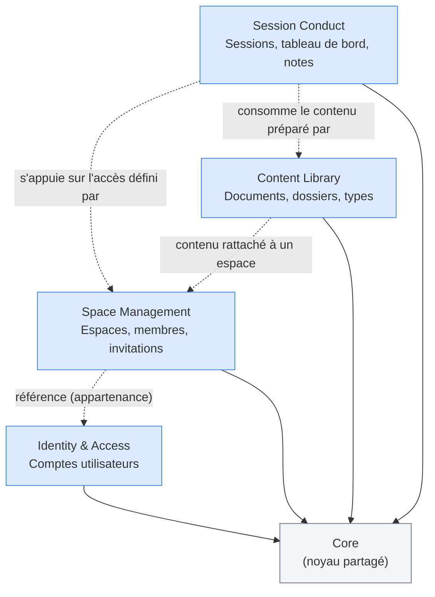
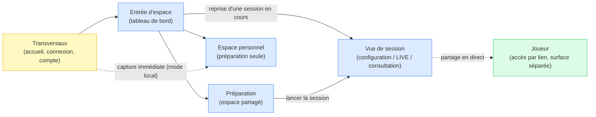

# Cahier des charges — Haversack (MVP)

## Métadonnées

| Champ | Valeur |
|---|---|
| Version | 1.0 |
| Date | 2026-07-02 |
| Statut | Version de travail — périmètre produit stabilisé ; volet architecture technique à confirmer, cf. [§7](#7-contraintes-techniques-rgpd--sécurité) |
| Porteur / responsable du document | Pierre-Marie Marchio |
| Validation / approbation | Pierre-Marie Marchio — validé en conception ; volet architecture technique ([§7](#7-contraintes-techniques-rgpd--sécurité)) à re-confirmer à l'entrée en build |

### Historique des révisions

| Version | Date | Auteur | Nature de la révision |
|---|---|---|---|
| 1.0 | 2026-07-02 | Pierre-Marie Marchio | Rédaction initiale — consolidation du corpus de conception |

## Nature et portée du document

Ce cahier des charges est le document officiel de référence pour la construction du MVP de Haversack. Il consolide et met en forme, dans un registre de cahier des charges, le travail de conception mené par l'équipe. Le corpus de conception (`docs/conception/`) reste la source de vérité détaillée : en cas de divergence de détail entre ce document et le corpus, le corpus fait foi.

## Sommaire

- [Résumé exécutif](#résumé-exécutif)
- [1. Présentation & contexte](#1-présentation--contexte)
  - [1.1 Le produit](#11-le-produit)
  - [1.2 Le problème adressé](#12-le-problème-adressé)
  - [1.3 Le besoin non adressé](#13-le-besoin-non-adressé)
  - [1.4 Positionnement concurrentiel](#14-positionnement-concurrentiel)
- [2. Objectifs, enjeux & hypothèses](#2-objectifs-enjeux--hypothèses)
  - [2.1 Objectif principal du MVP](#21-objectif-principal-du-mvp)
  - [2.2 Hypothèses stratégiques](#22-hypothèses-stratégiques)
  - [2.3 Hypothèses de validation (H1 à H5)](#23-hypothèses-de-validation-h1-à-h5)
  - [2.4 Modèle de monétisation](#24-modèle-de-monétisation)
- [3. Périmètre (MoSCoW)](#3-périmètre-moscow)
  - [Vue de synthèse](#vue-de-synthèse)
  - [Must Have](#must-have)
  - [Should Have](#should-have)
  - [Could Have](#could-have)
  - [Won't Have (cette version)](#wont-have-cette-version)
  - [Dépendances clés](#dépendances-clés)
- [4. Acteurs & besoins](#4-acteurs--besoins)
  - [4.1 Le Maître du Jeu (MJ)](#41-le-maître-du-jeu-mj)
  - [4.2 Le Joueur](#42-le-joueur)
  - [4.3 Le Joueur invité](#43-le-joueur-invité)
  - [4.4 Le MJ comme utilisateur principal](#44-le-mj-comme-utilisateur-principal)
  - [4.5 Personas de référence](#45-personas-de-référence)
  - [4.6 Parcours bout-en-bout](#46-parcours-bout-en-bout)
- [5. Spécifications fonctionnelles](#5-spécifications-fonctionnelles)
  - [UC-01 — Mode local sans compte](#uc-01--mode-local-sans-compte)
  - [UC-02 — Créer et configurer un espace (campagne ou one-shot)](#uc-02--créer-et-configurer-un-espace-campagne-ou-one-shot)
  - [UC-03 — Structurer un scénario](#uc-03--structurer-un-scénario)
  - [UC-04 — Gérer les documents d'un espace](#uc-04--gérer-les-documents-dun-espace)
  - [UC-05 — Organiser le contenu en dossiers](#uc-05--organiser-le-contenu-en-dossiers)
  - [UC-06 — Utiliser la vue de session](#uc-06--utiliser-la-vue-de-session)
  - [UC-07 — Créer un élément à la volée en session](#uc-07--créer-un-élément-à-la-volée-en-session)
  - [UC-08 — Partager une information aux joueurs](#uc-08--partager-une-information-aux-joueurs)
  - [UC-09 — Accès joueur sans compte](#uc-09--accès-joueur-sans-compte)
  - [UC-10 — Créer un compte et synchroniser dans le cloud](#uc-10--créer-un-compte-et-synchroniser-dans-le-cloud)
  - [UC-11 — Gérer les membres d'un espace](#uc-11--gérer-les-membres-dun-espace)
  - [UC-12 — Consulter son espace en tant que joueur (vue post-accès)](#uc-12--consulter-son-espace-en-tant-que-joueur-vue-post-accès)
  - [UC-13 — Utiliser un scénario réutilisable](#uc-13--utiliser-un-scénario-réutilisable)
  - [UC-14 — Rechercher et filtrer l'information](#uc-14--rechercher-et-filtrer-linformation)
  - [Hors périmètre fonctionnel MVP](#hors-périmètre-fonctionnel-mvp)
- [6. Exigences non-fonctionnelles](#6-exigences-non-fonctionnelles)
  - [6.1 Performance perçue](#61-performance-perçue)
  - [6.2 Fonctionnement hors connexion](#62-fonctionnement-hors-connexion)
  - [6.3 Confidentialité](#63-confidentialité)
  - [6.4 Accessibilité](#64-accessibilité)
  - [6.5 Internationalisation](#65-internationalisation)
- [7. Contraintes techniques, RGPD & sécurité](#7-contraintes-techniques-rgpd--sécurité)
  - [7.1 Principes d'architecture](#71-principes-darchitecture)
  - [7.2 Stack technique](#72-stack-technique)
  - [7.3 Sécurité & authentification](#73-sécurité--authentification)
  - [7.4 Conformité RGPD & protection des données](#74-conformité-rgpd--protection-des-données)
  - [7.5 Contraintes de stockage](#75-contraintes-de-stockage)
  - [7.6 Architecture détaillée](#76-architecture-détaillée)
- [8. Modèle de données & domaine](#8-modèle-de-données--domaine)
  - [Carte des contextes bornés](#carte-des-contextes-bornés)
  - [Core (noyau partagé)](#core-noyau-partagé)
  - [Identity & Access](#identity--access)
  - [Space Management](#space-management)
  - [Content Library](#content-library)
  - [Session Conduct](#session-conduct)
- [9. Conception d'interface](#9-conception-dinterface)
  - [9.1 Approche et colonne vertébrale](#91-approche-et-colonne-vertébrale)
  - [9.2 Inventaire des écrans](#92-inventaire-des-écrans)
  - [9.3 Arbitrages d'interface figés](#93-arbitrages-dinterface-figés)
  - [9.4 Renvoi wireframes](#94-renvoi-wireframes)
- [10. Glossaire](#10-glossaire)
- [11. Phasage & jalons](#11-phasage--jalons)
  - [Macro-ordonnancement (axe canonique)](#macro-ordonnancement-axe-canonique)
  - [Légende — codes de renvoi des ADR](#légende--codes-de-renvoi-des-adr)
  - [Incohérence historique résolue](#incohérence-historique-résolue)
- [12. Annexes](#12-annexes)
  - [12.1 Points à arbitrer et questions ouvertes](#121-points-à-arbitrer-et-questions-ouvertes)
  - [12.2 Matrice de traçabilité](#122-matrice-de-traçabilité)
  - [12.3 Index des décisions d'architecture (ADR)](#123-index-des-décisions-darchitecture-adr)
  - [12.4 Valeurs de référence chiffrées](#124-valeurs-de-référence-chiffrées)

---

## Résumé exécutif

Haversack est un outil web fonctionnant en mode local-first, destiné au Maître du Jeu (MJ) de jeu de rôle sur table. Il répond à un besoin aujourd'hui couvert de façon fragmentaire par des supports hétérogènes — fichiers texte, outils génériques (Notion, Obsidian), Discord, papier, tables virtuelles (Roll20, Foundry) — qui traitent chacun partiellement la préparation narrative d'une campagne et le pilotage d'une session, sans qu'aucun ne couvre les deux avec une logique propre au JDR ([§1](#1-présentation--contexte)).

Le périmètre du MVP est livré en un seul bloc, structuré autour de trois piliers indissociables : la **préparation** du contenu (espaces, dossiers, documents, scénarios structurés en scènes), une **vue de session** dédiée au pilotage en temps réel pendant la partie, et le **partage sélectif** d'informations aux joueurs. Ce dernier pilier rend la brique de compte et de synchronisation cloud non différable dès la première livraison, le partage reposant structurellement sur un compte MJ ([§3](#3-périmètre-moscow)).

Le MVP vise à valider cinq hypothèses chiffrées (H1 à H5), chacune assortie d'un seuil et d'un délai d'observation constituant un critère de décision objectif, non réinterprétable a posteriori une fois l'observation engagée. Parmi elles, l'**hypothèse H2 est l'hypothèse centrale du produit** : elle porte sur la valeur réelle de la vue de session en pleine partie — si elle n'est pas confirmée, la proposition de valeur du produit dans son ensemble est invalidée ([§2.3](#23-hypothèses-de-validation-h1-à-h5)).

Le modèle de monétisation suit une progression en trois paliers sans contrainte imposée en amont : un usage **local** gratuit et sans compte, un palier **gratuit** avec compte et synchronisation cloud, puis un palier **payant** sans limite de volume ni d'espaces — le passage d'un palier au suivant étant déclenché par un besoin concret (partage aux joueurs, dépassement de quota) plutôt que par une contrainte du produit ([§2.4](#24-modèle-de-monétisation)).

Le positionnement de Haversack repose sur trois différenciants principaux : un outil dédié au MJ, **agnostique au système de jeu** pratiqué (D&D, Call of Cthulhu, Fate, systèmes maison…) ; une **friction d'entrée nulle**, sans compte requis pour commencer à préparer ou piloter une session ; et la **possession effective des données** par l'utilisateur, y compris la possibilité de les exporter dans un format ouvert, en mode local comme avec un compte ([§1.4](#14-positionnement-concurrentiel)).

---

## 1. Présentation & contexte

### 1.1 Le produit

Haversack est un outil web fonctionnant en mode local-first, destiné à assister le Maître du Jeu (MJ) de jeu de rôle sur table. Il se concentre sur deux fonctions : la préparation narrative en amont d'une session (structuration de scénarios, gestion de la documentation de campagne) et le pilotage de la session elle-même (accès rapide au contenu préparé, prise de notes, création de contenu à la volée). Haversack n'est ni une table virtuelle destinée à gérer combats et mécaniques de jeu, ni un éditeur de texte générique dépourvu de logique métier JDR.

### 1.2 Le problème adressé

Un MJ actif gère un volume d'information important : scénarios, historique des sessions passées, fiches de personnages non-joueurs, notes secrètes, informations à partager avec les joueurs, lore, lieux, factions, objets. Cette information est aujourd'hui dispersée sur des supports hétérogènes et peu adaptés les uns aux autres : fichiers texte, outils de type Notion ou Google Docs, Discord, papier, PDF, ou encore tables virtuelles telles que Roll20 ou Foundry. Chacun de ces supports répond partiellement au besoin mais aucun ne couvre l'ensemble : les fichiers texte sont difficiles à parcourir en session, les outils collaboratifs génériques ne portent pas de logique JDR, Discord disperse l'information dans le fil de discussion, le papier n'est pas cherchable, le PDF est en lecture seule, et les tables virtuelles se concentrent sur le combat au détriment de la narration.

Cette fragmentation a des conséquences directes en session : le MJ perd du temps à rechercher une information, le rythme de jeu est interrompu, certaines informations sont oubliées ou deviennent introuvables, et la charge mentale de préparation reste élevée.

### 1.3 Le besoin non adressé

Les solutions existantes se répartissent en deux catégories, chacune insuffisante pour l'usage visé. Les outils génériques (Notion, Obsidian) offrent une grande flexibilité mais aucune logique propre au JDR : le MJ doit construire seul son organisation, sans que celle-ci soit pensée pour un accès rapide pendant la partie. Les tables virtuelles (Roll20, Foundry VTT) sont riches sur le plan mécanique — combat, cartes, jets de dés — mais traitent la préparation narrative et la gestion documentaire comme des fonctions secondaires. Haversack se positionne entre ces deux catégories : un outil dédié aux problèmes concrets du MJ, sans être ni l'un ni l'autre.

### 1.4 Positionnement concurrentiel

| Outil | Points forts | Limites au regard du besoin MJ |
|---|---|---|
| Notion | Grande flexibilité, mise en forme riche | Non spécialisé JDR, aucune vue dédiée à la session, pas de partage sélectif |
| Obsidian | Graphe de liens entre notes, stockage local | Pas de collaboration, aucune vue de session, pas de partage aux joueurs |
| Roll20 | Table virtuelle complète, dés, cartes | Centré sur la mécanique de jeu, la narration reste secondaire |
| Foundry VTT | Très puissant et extensible | Complexité d'usage élevée, centré sur le combat |
| WorldAnvil | Worldbuilding riche | Centré sur le lore, aucune vue de session, prise en main longue |
| Google Docs + Discord | Simplicité, outils déjà connus | Aucune logique JDR, information dispersée entre les deux outils |

Haversack se différencie de ces solutions sur six points : une friction d'entrée nulle, sans compte requis pour commencer, avec des données locales possédées par l'utilisateur et exportables ; une vue de session dédiée au pilotage en temps réel, absente des outils comparés ; une neutralité vis-à-vis du système de jeu utilisé (D&D, Call of Cthulhu, Fate, Blades in the Dark, systèmes maison…) ; un partage d'information contrôlé par le MJ, document par document, sans exposer les notes de préparation privées ; un accès joueur sans création de compte ; et une organisation du contenu entièrement libre, structurée par le MJ selon ses propres besoins plutôt qu'imposée par l'application.

> Sources : docs/conception/besoin/vision/vision-produit.md

---

## 2. Objectifs, enjeux & hypothèses

### 2.1 Objectif principal du MVP

Le MVP doit permettre à un MJ de capturer et structurer son contenu — scénarios, PNJ, notes — dès l'ouverture de l'application, dans son espace personnel par défaut ou dans un espace de jeu partagé (campagne ou one-shot) lorsqu'il le décide, et d'accéder rapidement aux informations importantes pendant une session, sans friction d'onboarding et sans qu'un compte soit obligatoire pour commencer à utiliser l'application.

### 2.2 Hypothèses stratégiques

Le MVP vise à valider deux hypothèses de nature différente, portées en parallèle.

L'**hypothèse produit** postule qu'un MJ acceptera de payer pour un outil qui réduit la friction de préparation et de pilotage de ses sessions, même en l'absence de fonctionnalités avancées telles que l'intelligence artificielle, une table virtuelle ou un moteur de règles.

L'**hypothèse de monétisation** postule qu'un modèle structuré en trois paliers — usage local gratuit, compte gratuit, puis abonnement payant — permet une adoption initiale sans résistance, suivie d'une conversion naturelle vers le cloud au moment où le besoin de partage ou de sauvegarde se manifeste.

### 2.3 Hypothèses de validation (H1 à H5)

Le MVP doit démontrer cinq hypothèses auprès d'une cohorte pilote d'utilisateurs réels (early adopters recrutés). Chaque hypothèse est assortie d'un seuil chiffré et d'un délai d'observation, constituant un critère de décision objectif à l'issue de la période d'observation. Les seuils sont calibrés pour cette cohorte restreinte et peuvent être ajustés avant le lancement de l'observation, jamais pendant.

**Principe de falsifiabilité** : un seuil non atteint impose un constat explicite — réussite partielle, échec du pilier concerné, ou hypothèse invalidée — et ne peut jamais donner lieu à une réinterprétation a posteriori du critère.

**L'hypothèse H2 est l'hypothèse centrale du produit.** Elle porte sur la valeur de la vue de session : si cette valeur n'est pas confirmée, la proposition de valeur du produit dans son ensemble est invalidée.

| # | Hypothèse | Seuil chiffré | Délai | Instrument de constat |
|---|---|---|---|---|
| H1 | Un MJ peut créer un espace structuré et y retrouver ses informations sans friction d'onboarding (pas de compte obligatoire au démarrage). | ≥ 60 % des MJ de la cohorte pilote qui ouvrent l'application atteignent l'activation préparation (espace actif — campagne avec premiers documents créés, ou espace personnel dont le contenu traduit un geste structurant — définition consolidée en `vision-produit.md §2.3`). | 14 jours après le premier usage. | Activation préparation (mesure d'usage anonyme). |
| H2 (centrale) | La vue de session apporte une valeur réelle pendant une partie (réduction du temps de recherche, accès au contenu préparé, création à la volée). | ≥ 50 % des MJ ayant atteint l'activation préparation atteignent l'activation vue session (session ouverte et réellement utilisée en partie) ; signal de répétabilité confirmé si ≥ 50 % d'entre eux l'utilisent sur deux sessions ou plus. | 30 jours pour la première activation ; 60 jours pour le signal de répétabilité. | Activation vue session (mesure d'usage anonyme) + entretiens sur les motifs de non-adoption. |
| H3 | Le partage d'informations aux joueurs est perçu comme plus fluide que les solutions actuelles (Discord, Google Docs, papier). | ≥ 40 % des MJ ayant animé une session avec joueurs atteignent l'activation partage (document partagé et consulté par au moins un joueur) ; perception de fluidité supérieure confirmée par au moins 3 MJ interrogés sur 5. | 60 jours pour l'activation partage ; entretiens en parallèle ou en fin de période. | Activation partage (mesure d'usage anonyme) + entretiens utilisateurs. |
| H4 | L'accès joueur sans compte n'est pas un frein à l'adoption du groupe entier. | Sur les sessions où un partage a eu lieu, ≥ 70 % comptent au moins un joueur ayant effectivement consulté le contenu partagé ; moins de 2 joueurs sur 10 interrogés rapportent avoir renoncé à l'étape d'entrée. | 60 jours. | Activation partage (taux de consultation côté joueur) + entretiens sur les motifs d'abandon. |
| H5 | La conversion du mode local vers un compte cloud se produit naturellement lorsque le besoin de partage ou de sauvegarde apparaît. | ≥ 10 % des MJ actifs en mode local (activation préparation atteinte) créent un compte, le déclencheur constaté étant une intention de partage ou de sauvegarde plutôt qu'une migration forcée. | 90 jours. | Mesure d'usage anonyme (passage du mode local au compte) + entretiens sur le déclencheur explicite. |

Les seuils et délais des cinq hypothèses sont consolidés, avec leur date de validité, en [§12.4](#124-valeurs-de-référence-chiffrées).

Les instruments de constat mobilisés sont exclusivement ceux inscrits au périmètre Must Have : activation préparation, activation vue session, activation partage, mesure d'usage anonyme en mode local, et entretiens utilisateurs (détaillés en [§3](#3-périmètre-moscow)).

### 2.4 Modèle de monétisation

Le modèle de monétisation repose sur trois paliers, conçus pour n'imposer aucune contrainte agressive : la valeur doit être perçue avant tout engagement, et le passage à un palier supérieur résulte d'une décision rationnelle déclenchée par un besoin concret.

| Palier | Compte requis | Fonctionnalités | Limites |
|---|---|---|---|
| Local | Aucun | Préparation complète, vue de session, création de contenu à la volée | Stockage dans le navigateur, pas de partage aux joueurs, un seul appareil |
| Gratuit | Email et mot de passe | Synchronisation cloud, partage aux joueurs, accès multi-appareil | 3 espaces de type campagne ou one-shot, 4 joueurs par session, 500 Mo de stockage — l'espace personnel n'est pas décompté de ce quota |
| Pro | Abonnement (environ 7 €/mois) | Ensemble des fonctionnalités du palier gratuit, sans limite | Espaces illimités, 5 Go de stockage et plus |

Les quotas des trois paliers et le tarif du palier Pro sont consolidés, avec leur date de validité, en [§12.4](#124-valeurs-de-référence-chiffrées).

Le passage du palier local au palier gratuit est déclenché naturellement lorsque le MJ souhaite partager une information avec ses joueurs, ou lorsqu'il souhaite sécuriser ses données locales. Le passage du palier gratuit au palier Pro est déclenché lorsque le MJ dépasse le quota de trois espaces actifs.

> Sources : docs/conception/besoin/vision/vision-produit.md

---

## 3. Périmètre (MoSCoW)

Le périmètre du MVP est structuré selon la méthode MoSCoW (Must Have / Should Have / Could Have / Won't Have) et livré en un seul bloc : la brique cloud n'est pas différable, dans la mesure où le partage aux joueurs — exigence Must Have — dépend structurellement d'un compte utilisateur.

### Vue de synthèse

| Catégorie | Ce que la catégorie signifie | Contenu |
|---|---|---|
| Must Have | Le produit ne peut pas être validé sans ces éléments ; leur absence rend l'hypothèse centrale non testable ou l'outil inutilisable. | UC-01 à UC-10 (dont UC-05 base — dossiers libres), espace personnel (conteneur par défaut, capture immédiate), instrumentation de validation du MVP, export d'espace (version minimale) |
| Should Have | Le concept central peut être validé sans ces éléments, mais le MVP en serait significativement affaibli. | UC-05 riche (types de document élaborés), UC-11, UC-12, UC-14, UC-13 (hors première livraison) |
| Could Have | Valeur réelle mais non prioritaire pour la validation initiale ; peut être livré dans une version ultérieure sans compromettre l'adoption. | Types de document personnalisés, réimport de fichier de sauvegarde (post-MVP, distinct de l'export), persistance inter-sessions des notes du joueur |
| Won't Have (cette version) | Exclusion assumée pour cette version, par choix stratégique de positionnement ou de complexité. | Inventaire personnage, clôture formelle de session, lore en use case distinct, relations typées entre documents, moteur de règles, assistant IA, table visuelle, application desktop avec synchronisation CRDT, templates communautaires |

### Must Have

Le périmètre minimal cohérent du MVP est constitué de dix use cases, complétés par l'espace personnel, l'instrumentation de validation et l'export d'espace. Sans l'un de ces éléments, soit le produit devient inutilisable, soit l'hypothèse centrale ne peut pas être testée.

- **UC-01 — Mode local sans compte** : un MJ crée un espace et prépare du contenu sans s'inscrire ; ses données persistent entre les sessions du navigateur. Constitue le point d'entrée du produit et la fondation du modèle de monétisation.
- **UC-02 — Créer et configurer un espace (campagne ou one-shot)** : un MJ crée un espace nommé, de type campagne ou one-shot, et accède à son espace de travail en moins de deux minutes.
- **UC-03 — Structurer un scénario** : un MJ crée un scénario organisé en scènes et le sauvegarde ; valide l'hypothèse produit principale.
- **UC-04 — Gérer les documents d'un espace** : un MJ crée un document, le retrouve et le modifie ; s'applique à tout type d'espace, y compris l'espace personnel.
- **UC-05 base — Organiser le contenu en dossiers** : un MJ crée des dossiers nommés librement, sur une structure par défaut neutre et système-agnostique.
- **UC-06 — Utiliser la vue de session** : un MJ pilote une session depuis une vue dédiée — accès aux scènes, aux notes et au contenu épinglé, prise de note rapide ; use case différenciant principal du produit.
- **UC-07 — Créer un élément à la volée en session** : depuis la vue de session, un MJ crée un document en moins de dix secondes sans interrompre la partie.
- **UC-08 — Partager une information aux joueurs** : depuis la vue de session, un MJ partage un document ou une note ; un joueur muni du lien consulte l'information sans créer de compte. Nécessite un compte côté MJ (palier gratuit minimum).
- **UC-09 — Accès joueur sans compte** : un joueur clique sur un lien, saisit un nom d'affichage, et accède en temps réel aux informations partagées, sans inscription.
- **UC-10 — Créer un compte et synchroniser dans le cloud** : un MJ en mode local crée un compte, ses données migrent vers le cloud, et le partage aux joueurs s'active. Must Have car UC-08 et UC-09 en dépendent structurellement.

À ces dix use cases s'ajoutent trois éléments transverses :

- **Espace personnel** (conteneur par défaut, capture immédiate) : un MJ en mode local peut créer et retrouver un document sans avoir créé d'espace de type campagne ou one-shot au préalable. L'espace personnel est provisionné automatiquement dès UC-01 et n'est pas décompté du quota d'espaces du palier gratuit.
- **Instrumentation de validation du MVP** : l'application permet de constater, de façon anonyme et sans capter de contenu narratif, l'activation préparation, l'activation vue de session et l'activation partage — les trois mesures qui alimentent les hypothèses H1 à H5.
- **Export d'espace (version minimale)** : un MJ exporte l'ensemble de son espace — documents, notes, structure — dans un format ouvert, lisible et réutilisable hors de l'application, disponible aussi bien en mode local qu'avec un compte. Promu de Should Have à Must Have par décision du 2026-06-25, cette exigence matérialise la possession effective des données, différenciant central du produit.

### Should Have

Ces éléments apportent une valeur forte mais le concept central du produit peut être validé sans eux.

- **UC-05 riche — Dossiers et types de document élaborés** : types de document intégrés (personnage non-joueur, lieu, objet…) proposés en complément optionnel des dossiers libres, sans contraindre la structure de base.
- **UC-11 — Gérer les membres d'un espace** : invitation de membres permanents et génération de liens de session temporaires, avec révocation d'accès.
- **UC-12 — Consulter son espace en tant que joueur** : vue cohérente pour un joueur déjà membre, regroupant sa fiche de personnage, les documents publics et l'historique partagé.
- **UC-14 — Rechercher et filtrer l'information** : retrouver un document par mot-clé depuis la vue de session, avec filtrage par étiquettes.
- **UC-13 — Utiliser un scénario réutilisable** *(hors première livraison)* : marquer un scénario comme réutilisable et en créer une instance indépendante pour un nouveau groupe. Exclu de la première livraison par arbitrage du 2026-06-10 — le contexte campagne porte seul la validation du cœur du produit lors du MVP.

### Could Have

Valeur réelle identifiée mais non prioritaire pour la validation initiale ; envisageable dans une version ultérieure sans compromettre l'adoption.

- **Types de document personnalisés** : définition par le MJ de ses propres types de document, au-delà des types intégrés.
- **Réimport de fichier de sauvegarde** *(post-MVP, distinct de l'export Must Have)* : récupération d'un espace à partir d'un fichier exporté précédemment.
- **Notes personnelles joueur** : prise de notes privées par un joueur, persistantes entre les sessions.

### Won't Have (cette version)

Exclusion assumée par choix stratégique, non par oubli.

- Inventaire personnage — concurrencerait des outils spécialisés sans pouvoir les égaler.
- Clôture formelle de session — absorbée par la gestion des documents et la création à la volée.
- Lore en use case distinct — déjà couvert par le document générique organisé en dossiers.
- Relations typées entre documents — nécessite une adoption préalable des types de document.
- Moteur de règles ou émulation de système de jeu — dépend des relations typées, hors positionnement agnostique du produit.
- Assistant IA — risque de brouiller le positionnement du MVP.
- Table visuelle — concurrence directe des tables virtuelles existantes, hors positionnement.
- Application desktop avec synchronisation CRDT — complexité disproportionnée pour le MVP.
- Templates communautaires — nécessite un écosystème à construire après validation du cœur du produit.

### Dépendances clés

UC-01 constitue le point d'entrée du produit : l'espace personnel y est provisionné automatiquement, permettant à un document de naître sans qu'un espace de type campagne ou one-shot existe. UC-10 (création de compte) est Must Have exclusivement parce que UC-08 (partage) et UC-09 (accès joueur), tous deux Must Have, en dépendent structurellement — une exigence Must Have ne peut pas reposer sur une exigence Should Have sans rendre le périmètre incohérent. UC-05 base (dossiers libres) précède UC-05 riche (types élaborés), qui reste Should Have. UC-13, bien que hors première livraison, s'appuie sur l'espace personnel comme infrastructure déjà livrée en MVP.

> Sources : docs/conception/besoin/vision/moscow.md, docs/conception/besoin/vision/vision-produit.md

---

## 4. Acteurs & besoins

### 4.1 Le Maître du Jeu (MJ)

Le MJ est l'utilisateur créant et administrant un ou plusieurs espaces — campagne, one-shot ou espace personnel. C'est le seul acteur habilité à créer du contenu, à administrer un espace et à partager une information avec les joueurs. Son compte est optionnel : il peut utiliser l'application en mode local, sans jamais s'inscrire.

Ses douleurs principales tiennent à la gestion d'un volume d'information important et dispersé : le temps perdu à chercher une information en pleine partie, une charge mentale de préparation élevée, des informations réparties sur des supports hétérogènes et peu adaptés les uns aux autres, la difficulté à partager sélectivement une information aux joueurs sans exposer sa préparation privée, et la friction d'adoption d'un nouvel outil — obligation de compte, configuration initiale lourde.

Ses objectifs applicatifs en découlent directement : commencer à préparer immédiatement, sans inscription ; structurer ses scénarios et son contenu à sa façon, quel que soit le système de jeu pratiqué ; réduire sa charge mentale pendant la session grâce à un accès rapide au contenu préparé ; créer des éléments à la volée en session sans interrompre la partie ; partager certaines informations aux joueurs sans exposer ses notes privées.

### 4.2 Le Joueur

Le Joueur est l'utilisateur accédant à une campagne sur invitation du MJ. Son compte est optionnel : il peut accéder en mode invité via un lien de session, sans jamais créer de compte.

Sa douleur principale est la même friction d'adoption que celle du MJ — obligation de compte, configuration — à laquelle s'ajoute la dispersion des informations de campagne entre Discord, papier et outils tiers. Son objectif est de rejoindre une session avec un minimum de friction, idéalement sans aucune inscription, puis d'accéder en temps réel aux informations que le MJ partage pendant la partie. À titre optionnel, avec un compte, il peut retrouver l'historique des sessions entre les parties.

### 4.3 Le Joueur invité

Le Joueur invité est un joueur rejoignant via un lien temporaire, sans création de compte. Son accès est limité à la durée de la session et au périmètre défini par le MJ — un profil typique des one-shots, des conventions et des groupes changeants.

Ses objectifs sont de rejoindre rapidement, sans aucune configuration, et de consulter les informations partagées pour cette session uniquement. Son accès expire à la fin de la session, avec une fenêtre de grâce, et ne donne pas accès à l'historique des sessions précédentes. Il peut à tout moment créer un compte pour convertir son accès en accès membre permanent, sans perdre les données de session déjà consultées.

### 4.4 Le MJ comme utilisateur principal

Haversack retient un parti pris délibéré : le MJ est l'utilisateur principal du produit. Ce choix repose sur quatre constats. Le MJ porte l'intégralité de la charge de préparation de la partie. Il est le décideur d'achat : c'est lui qui choisit les outils employés par l'ensemble du groupe. Sa douleur utilisateur est la plus forte et la plus documentable des trois profils. Enfin, une adoption réussie côté MJ entraîne mécaniquement l'adoption côté joueurs — l'inverse n'est pas vrai.

### 4.5 Personas de référence

Sept personas illustrent la diversité des profils MJ et joueur pris en compte dans la conception. Ils servent à valider les choix fonctionnels retenus, sans se substituer aux besoins exprimés dans les use cases.

| Persona | Profil | Besoin ou douleur saillante |
|---|---|---|
| Thomas | MJ préparateur, utilisateur avancé d'Obsidian, résistant au changement d'outil | Veut une structuration fine sans perdre la richesse de son organisation actuelle ; craint la dépendance à un nouvel outil et la perte de contrôle sur ses données |
| Émilie | MJ improvisatrice, prépare peu, capture en séance | A besoin de créer un élément à la volée en quelques secondes sans casser le rythme de jeu |
| Lucas | Joueur sans compte, réfractaire aux nouveaux outils | Veut rejoindre une session sans inscription ni configuration |
| Nadia | MJ occasionnelle, sessions espacées, peu de temps disponible | A besoin de retrouver une information après une longue absence sans se souvenir de son organisation |
| Antoine | MJ avancé, multi-groupe et multi-système, plusieurs campagnes simultanées | A besoin de structures réutilisables et d'une organisation cohérente entre plusieurs espaces |
| Rémi | MJ débutant, proche du papier, résistant idéologique au numérique | Craint la complexité et la dépendance au numérique ; la friction d'entrée doit être nulle pour l'accrocher |
| Sonia | MJ one-shot, anime des parties ponctuelles avec des groupes changeants | Son unité de travail est le scénario, pas la campagne ; veut lancer une partie sans configuration lourde |

### 4.6 Parcours bout-en-bout

Sept parcours bout-en-bout tissent les use cases décrits en [§5](#5-spécifications-fonctionnelles) du point de vue de chacun de ces personas, du premier contact avec l'application jusqu'aux usages avancés — ils ne sont pas détaillés dans ce document mais complètent les fiches de spécification par une lecture transverse des enchaînements réels.

> Sources : docs/conception/besoin/vision/vision-produit.md, docs/conception/besoin/persona/README.md, docs/conception/besoin/parcours/README.md

---

## 5. Spécifications fonctionnelles

Cette section détaille les 14 use cases du périmètre MVP sous forme de fiches homogènes. Chaque fiche est présentée telle que sa fiche use case source la décrit ; les priorités MoSCoW et les dépendances transverses sont posées en [§3](#3-périmètre-moscow).

### UC-01 — Mode local sans compte

**Objectif** : Permettre à un MJ de commencer à utiliser Haversack immédiatement, sans créer de compte, avec des données stockées localement dans le navigateur.

**Acteur(s)** : MJ · **Must Have**

**Préconditions** : Aucune — UC-01 est le point d'entrée de l'application.

**Déroulé nominal** :
- Le MJ ouvre l'application et choisit de commencer sans compte, plutôt que de créer un compte ou de se connecter.
- L'application indique que les données seront stockées dans le navigateur.
- Le MJ accède à son espace de travail et crée du contenu immédiatement, sans créer d'espace partagé au préalable — ce contenu atterrit dans son espace personnel.
- Il utilise normalement les fonctionnalités de préparation et de session.
- Il peut à tout moment créer un compte pour migrer ses données vers le cloud, après confirmation explicite.

**Règles de gestion** :
- En mode local, aucune donnée n'est transmise au serveur (RB-01-01).
- Le contenu créé sans espace explicite atterrit dans l'espace personnel, instancié automatiquement dès le mode local, sans précondition de création de campagne (RB-01-18).
- Le mode local est mono-utilisateur MJ : le partage et l'accès joueur nécessitent au minimum un compte gratuit (RB-01-06).
- Deux bandeaux distincts et non bloquants informent des risques du mode local : durabilité de la conservation des données, et confidentialité en cas de poste partagé (RB-01-14).
- La création de compte depuis le mode local déclenche une migration soumise à confirmation explicite, traitée espace par espace ; un espace rejeté reste intact en local (RB-01-09).
- L'export d'un espace dans un format ouvert est disponible en mode local comme avec un compte (RB-01-16).

**Critères d'acceptation** :
- Un MJ peut créer du contenu et préparer une session sans créer de compte ni d'espace partagé.
- Les données persistent après fermeture et réouverture du navigateur.
- Le MJ peut exporter un espace dans un format ouvert depuis les paramètres.
- Les bandeaux de durabilité et de confidentialité s'affichent selon leurs conditions respectives, sans jamais bloquer l'usage.

### UC-02 — Créer et configurer un espace (campagne ou one-shot)

**Objectif** : Permettre au MJ de créer un espace de travail nommé, de type campagne ou one-shot, avec un niveau de configuration adapté au contexte de jeu.

**Acteur(s)** : MJ · **Must Have**

**Préconditions** : L'application est accessible, en mode local ou depuis un compte cloud ; l'espace personnel du MJ préexiste.

**Déroulé nominal** :
- Le MJ accède à son tableau de bord et choisit de créer une nouvelle campagne.
- Il renseigne un nom (obligatoire), une description et un système de jeu (facultatifs).
- Il valide ; l'espace de type campagne est créé.
- Quatre dossiers système sont générés automatiquement (Personnages, Joueurs, Scénarios, Notes).
- En première livraison, le one-shot se crée via ce même parcours nominal avec le type approprié ; le parcours express dédié (lancement direct depuis une bibliothèque de scénarios) est hors première livraison.

**Règles de gestion** :
- Le nom est obligatoire pour créer une campagne ; description et système de jeu restent facultatifs (RB-02-01).
- Un espace appartient à un seul propriétaire (RB-02-02).
- Les dossiers système sont créés automatiquement pour un espace campagne ou one-shot ; ils sont renommables et supprimables (RB-02-03).
- Un espace créé sans système de jeu fonctionne en mode générique — comportement par défaut recommandé (RB-02-04).
- Un espace créé en mode local est pleinement fonctionnel, au même titre qu'un espace cloud (RB-02-05).
- L'espace personnel préexiste : il n'est pas créé via ce parcours et n'est jamais décompté du quota d'espaces actifs (RB-02-18, RB-02-19).
- Un compte gratuit est limité à trois espaces campagne ou one-shot actifs simultanément, l'espace personnel restant hors quota (RB-02-10).

**Critères d'acceptation** :
- Un MJ peut créer une campagne depuis son tableau de bord avec un simple nom.
- Un MJ peut créer un one-shot via le parcours campagne nominal avec le type approprié.
- Les quatre dossiers système existent, portant leurs noms neutres, dès la création de l'espace.
- Un espace créé en mode local est pleinement utilisable.

### UC-03 — Structurer un scénario

**Objectif** : Permettre au MJ de préparer un scénario exploitable pendant une session, librement rédigé en blocs ou structuré en scènes liées.

**Acteur(s)** : MJ · **Must Have**

**Préconditions** : Un espace existe (campagne, one-shot ou personnel) et le MJ y a les droits d'administration.

**Déroulé nominal** :
- Le MJ accède à la section Scénarios de son espace et crée un scénario.
- Il renseigne titre, résumé, contexte, objectif narratif et statut de préparation.
- Il ajoute une ou plusieurs scènes (titre, description, objectif, informations à révéler, notes privées, éléments liés).
- Il lie des documents déjà existants (PNJ, lieux, objets) au scénario ou en crée de nouveaux directement depuis l'éditeur.
- Il sauvegarde le scénario, qui devient disponible dans l'espace et utilisable en session.

**Règles de gestion** :
- Un scénario est un document d'espace spécialisé pour la préparation narrative, référençant zéro, une ou plusieurs scènes.
- Une scène est un document lié au scénario, pouvant elle-même référencer plusieurs documents (PNJ, lieux, objets, révélations, notes).
- Les notes privées d'un scénario restent des documents privés pour le MJ.
- Un scénario peut être créé sans découpage en scènes, sous forme de document monobloc, ou de façon minimale et improvisée en amont ou pendant une session.
- L'activité de structuration s'applique à tout espace, y compris l'espace personnel, pour une préparation autonome hors campagne.

**Critères d'acceptation** :
- Le MJ peut créer un scénario dans un espace, avec ou sans découpage en scènes.
- Le MJ peut ajouter, modifier et supprimer des scènes, et lier un PNJ à une scène.
- Le MJ peut sauvegarder un scénario comme brouillon et le retrouver depuis l'espace.

### UC-04 — Gérer les documents d'un espace

**Objectif** : Permettre au MJ de créer, modifier, structurer, organiser, retrouver et éventuellement partager tout document d'un espace — notes, scénarios, fiches, lore ou aides de jeu.

**Acteur(s)** : MJ (Joueurs, en consultation des documents partagés) · **Must Have**

**Préconditions** : Un espace existe (campagne ou personnel) et le MJ y a accès.

**Déroulé nominal** :
- Le MJ ouvre son espace et accède à la bibliothèque de documents, à un dossier, ou à une zone de création rapide.
- Il crée un document en renseignant un titre, un type optionnel, des propriétés structurées si un type est choisi, du contenu libre en blocs, une visibilité, des tags et des liens vers d'autres documents.
- Le document est privé par défaut.
- Il sauvegarde le document, qui devient accessible depuis son dossier, la recherche et les vues qui en dépendent (dont la vue session).

**Règles de gestion** :
- Tout document créé par le MJ est privé par défaut ; un document peut rester libre, sans type.
- Un type de document ajoute des propriétés structurées sans supprimer la liberté du contenu en blocs.
- Un document appartient toujours à exactement un dossier, et peut être lié à plusieurs autres documents.
- Un document peut être instancié depuis un template réutilisable associé à un dossier, sans que cela n'affecte le template source.
- Seul le MJ peut partager un document de campagne avec les joueurs ; un joueur ne consulte que les documents qui lui sont explicitement accessibles.
- Un document créé sans dossier explicite est placé dans le dossier virtuel « Non classés ».

**Critères d'acceptation** :
- Le MJ peut créer un document libre ou typé sans perdre la liberté du contenu en blocs.
- Le MJ peut créer une note rapide, utiliser un template, lier un document à d'autres documents et l'organiser dans un dossier.
- Un document privé n'est pas visible par les joueurs ; un document peut être retrouvé via la recherche.

### UC-05 — Organiser le contenu en dossiers

**Objectif** : Permettre au MJ de structurer librement le contenu de son espace en dossiers nommés, d'associer un template par défaut à chaque dossier, et de déplacer des documents entre dossiers.

**Acteur(s)** : MJ · **Must Have** (base — dossiers libres) / **Should Have** (couche riche — types de document élaborés)

**Préconditions** : Un espace existe et le MJ en est propriétaire.

**Déroulé nominal** :
- Le MJ crée un dossier en lui donnant un nom et, optionnellement, un template de contenu par défaut.
- Le dossier apparaît dans la navigation de l'espace ; le MJ peut y créer des documents immédiatement.
- Il peut associer ou changer le template par défaut d'un dossier existant sans affecter les documents déjà créés.
- Il déplace un ou plusieurs documents d'un dossier à un autre, sans que leur contenu ne soit modifié.

**Règles de gestion** :
- Le nom du dossier est obligatoire et non vide ; un dossier appartient à un seul espace (RB-05-01, RB-05-02).
- Les sous-dossiers imbriqués sont hors périmètre MVP (RB-05-03).
- Tous les dossiers, y compris les dossiers système, sont renommables ; seul le dossier virtuel « Non classés » ne l'est pas (RB-05-04, RB-05-05).
- Un dossier peut avoir zéro ou un template par défaut ; en changer n'affecte jamais les documents déjà créés (RB-05-06, RB-05-07).
- La suppression d'un dossier non vide impose de traiter son contenu — déplacer ou laisser non classé ; les dossiers système sont supprimables comme les autres (RB-05-09, RB-05-10).
- À la création d'un espace campagne ou one-shot, quatre dossiers système sont créés (Personnages, Joueurs, Scénarios, Notes) ; un espace personnel ne reçoit que le dossier virtuel « Non classés ».

**Critères d'acceptation** :
- Le MJ peut créer un dossier, lui associer un template par défaut, le renommer et le réordonner.
- Le MJ peut supprimer un dossier, y compris système, en traitant son contenu au préalable.
- Un document créé depuis un dossier avec template est initialisé avec ce template ; les documents existants ne sont jamais modifiés rétroactivement.

### UC-06 — Utiliser la vue de session

**Objectif** : Permettre au MJ de piloter une session de jeu depuis un tableau de bord configurable donnant un accès rapide au contenu préparé, à la prise de notes et au partage ; permettre au joueur de consulter les informations partagées et de prendre ses propres notes pendant la session.

**Acteur(s)** : MJ (pilotage) · Joueur (consultation et notes en session live) · **Must Have**

**Préconditions** : Un espace campagne existe et le MJ y a accès en tant que propriétaire ou MJ. La vue MJ est disponible en mode local comme avec un compte ; la vue joueur nécessite un compte MJ au minimum gratuit.

**Déroulé nominal** :
- Le MJ lance une session, qui s'ouvre directement au statut actif (`LIVE`), avec ou sans scénario associé.
- La vue s'ouvre avec les panneaux de dossiers que le MJ a configurés pour sa campagne, un panneau de documents épinglés et une barre de recherche globale.
- Le MJ consulte les documents de ses dossiers configurés, épingle des éléments pour un accès rapide, et prend des notes de session au fil de la partie — visibilité privée par défaut, basculable vers visible par les joueurs.
- Il peut créer un élément à la volée (UC-07) ou partager une information (UC-08) sans quitter la vue.
- Il clôture la session, qui passe en statut clos ; des notes rétroactives restent possibles.
- Pendant une session active, le joueur consulte les documents partagés et crée ses propres notes de session personnelles, invisibles du MJ et des autres joueurs.

**Règles de gestion** :
- La vue session MJ est réservée au MJ de la campagne ; le mode local ne connaît ni vue joueur ni accès invité.
- Une note de session créée par le MJ est privée par défaut et peut être basculée vers visible par les joueurs (RB-06-11, RB-06-12).
- L'épinglage n'affecte pas le document source dans la bibliothèque de contenu ; un document créé à la volée ou partagé est épinglé automatiquement (RB-06-15, RB-06-17) *(l'automaticité de l'épinglage d'un document créé à la volée reste à réconcilier — voir [§12.1](#121-points-à-arbitrer-et-questions-ouvertes))*.
- Le passage de l'état actif à l'état clos est irréversible ; une fois close, seul le MJ peut encore ajouter des notes rétroactives (RB-06-18, RB-06-19).
- Un document non partagé aux joueurs n'apparaît jamais dans la vue joueur, même s'il est épinglé dans la session.
- Il est possible de constater a posteriori, de façon anonyme et sans accès au contenu narratif, qu'une session a été réellement utilisée en partie — instrument de mesure de l'hypothèse H2.

**Critères d'acceptation** :
- Le MJ peut lancer une session, avec ou sans scénario associé, consulter ses panneaux configurés et rechercher sans quitter la vue.
- Le MJ peut créer une note de session, en faire basculer la visibilité, et épingler un document.
- Le joueur voit les informations partagées et peut créer une note de session personnelle pendant une session active, sans accès aux notes privées du MJ ni des autres joueurs.

### UC-07 — Créer un élément à la volée en session

**Objectif** : Permettre au MJ de créer instantanément un document depuis la vue session, pour répondre à un imprévu des joueurs sans interrompre la partie.

**Acteur(s)** : MJ · **Must Have**

**Préconditions** : Une session est active ou close ; le MJ est propriétaire de l'espace (compte cloud) ou en mode local.

**Déroulé nominal** :
- Le MJ ouvre le panneau de création rapide depuis la vue session.
- Il choisit le mode de création — note de session, document libre, document typé — et saisit un titre minimal, seul champ obligatoire.
- Il valide ; le document est créé avec une visibilité privée par défaut, lié à l'espace de la session en cours.
- Si le document est utile en séance, il est automatiquement ajouté aux documents épinglés *(formulation à réconcilier avec le modèle de domaine — voir [§12.1](#121-points-à-arbitrer-et-questions-ouvertes))*.
- Le MJ peut l'enrichir plus tard, en dehors de la session.

**Règles de gestion** :
- Le titre est le seul champ obligatoire pour toute création à la volée.
- Le document créé est automatiquement lié à l'espace de la session en cours ; une note de session est rattachée à la session.
- La création à la volée est possible sur une session active ou close, jamais sur une session archivée.
- Les documents créés à la volée sont privés par défaut.

**Critères d'acceptation** :
- Le MJ peut créer une note, un PNJ, un personnage joueur ou un document depuis la vue session avec un titre seul.
- Le document créé est immédiatement lié à l'espace et, si nécessaire, référencé par la session.
- La création est impossible depuis une session archivée.

### UC-08 — Partager une information aux joueurs

**Objectif** : Permettre au MJ de rendre certains documents visibles par les joueurs, tout en conservant le reste de sa préparation privée.

**Acteur(s)** : MJ (Joueurs, en consultation) · **Must Have**

**Préconditions** : Un espace campagne existe ; des joueurs ou des accès invités peuvent y accéder ; le contenu à partager existe ou est créé par le MJ.

**Déroulé nominal** :
- Le MJ ouvre un document partageable et choisit l'action de partage.
- Le système indique que le document deviendra visible par tous les membres de la campagne et les accès invités actifs.
- Le MJ valide ; le document devient visible par les joueurs, qui le voient dans leur espace ou leur vue session.
- Le MJ peut retirer ce partage à tout moment.

**Règles de gestion** :
- Seul un membre propriétaire ou MJ de la campagne peut partager ou retirer le partage d'un document (RB-08-01, RB-08-06).
- Le partage change la visibilité du document et reste durable, jusqu'à retrait explicite (RB-08-02, RB-08-03).
- Le partage s'applique à l'ensemble des membres et accès invités autorisés ; aucun partage sélectif par joueur n'est prévu au MVP (RB-08-04).
- Un document partagé depuis une session active y est automatiquement épinglé ; ce comportement ne s'applique pas à une session close (RB-08-10, RB-08-11).
- Partager un document déjà visible, ou retirer le partage d'un document déjà privé, reste sans effet (RB-08-05, RB-08-08).

**Critères d'acceptation** :
- Le MJ peut partager un document avec l'ensemble des joueurs autorisés et retirer ce partage.
- Un joueur ne voit pas les documents privés du MJ.
- Les joueurs voient les informations partagées dans leur espace ou leur vue session.

### UC-09 — Accès joueur sans compte

**Objectif** : Permettre à un joueur d'accéder à une session ou à une campagne via un lien partagé par le MJ — sans création de compte pour un accès ponctuel, ou avec compte pour un accès permanent.

**Acteur(s)** : Joueur (MJ, émetteur du lien) · **Must Have**

**Préconditions** : Le MJ dispose d'un compte au minimum gratuit et a généré un lien de session ou de campagne (UC-11).

**Déroulé nominal — accès session ponctuel, sans compte** :
- Le joueur clique sur le lien de session partagé par le MJ.
- Il saisit uniquement un nom d'affichage, sans email ni mot de passe.
- Il consulte les documents partagés et les informations révélées en temps réel pendant la session.
- Son accès expire à la fin de la session, après une fenêtre de grâce.

**Déroulé nominal — accès campagne permanent, avec compte** :
- Le joueur clique sur le lien de campagne, se connecte ou crée un compte.
- Son adhésion à la campagne est activée dès qu'il utilise le lien d'invitation généré par le MJ.
- Il obtient un accès persistant, jusqu'à révocation par le MJ.

**Règles de gestion** :
- Un lien de session ponctuel est valable le temps de la session, plus une fenêtre de grâce de 24 heures ; un lien de campagne reste valable jusqu'à révocation par le MJ.
- Le joueur invité sans compte dispose des mêmes droits fonctionnels qu'un joueur authentifié dans le périmètre de son lien ; seule diffère l'absence de compte persistant.
- Sur un compte gratuit, une session est limitée à quatre joueurs distincts disposant d'un accès (RB-09-21) ; le cinquième accès est refusé et le MJ est invité à passer au palier Pro pour lever la limite.
- À la fin définitive d'un accès invité non converti en compte, les notes personnelles de son auteur sont supprimées sans délai ; l'identifiant d'accès (nom d'affichage) cesse d'être utilisé immédiatement et est effacé au plus tard sous 90 jours (RB-09-18, RB-09-19).
- L'invité est informé, à la saisie de son nom puis en temps utile avant la fin de son accès, du sort réservé à ses données (RB-09-20, RB-09-22).

**Critères d'acceptation** :
- Un joueur peut rejoindre une session en cliquant sur un lien et en saisissant uniquement un nom, sans inscription.
- Le lien expire correctement après la session ; un lien révoqué affiche un message sobre, sans révéler d'information sur la campagne.
- Un joueur authentifié suivant un lien de campagne obtient un accès persistant, visible dans la gestion des membres.

### UC-10 — Créer un compte et synchroniser dans le cloud

**Objectif** : Permettre à un utilisateur, MJ ou joueur, de créer un compte pour activer la synchronisation cloud, le partage aux joueurs et l'accès multi-appareil.

**Acteur(s)** : MJ ou Joueur · **Must Have** — prérequis structurel d'UC-08 et UC-09, tous deux Must Have.

**Préconditions** : Aucune pour l'inscription ; un compte existant pour la connexion. Des données locales éventuelles déclenchent un gate de reconnaissance avant toute migration.

**Déroulé nominal — inscription depuis le mode local** :
- Le MJ déclenche une action nécessitant un compte, ou accepte l'invite de sauvegarde cloud.
- Il renseigne email, nom d'affichage et mot de passe ; le compte est créé au palier gratuit.
- L'application présente les espaces locaux détectés (titres, historique de session, volume, date) et demande une confirmation explicite avant toute migration.
- Après confirmation, les espaces sont migrés un à un, tout-ou-rien par espace ; le MJ retrouve son contenu et son historique de session intacts pour les espaces migrés avec succès.

**Règles de gestion** :
- L'email est unique dans le système ; le mot de passe est hashé en infrastructure, jamais détenu en clair par le domaine applicatif (RB-10-01, RB-10-02).
- La migration ne démarre qu'après confirmation explicite de l'utilisateur — c'est une exigence du système, quel que soit le moyen de déclenchement (RB-10-04).
- Une session en cours doit être clôturée avant que son espace ne puisse migrer.
- La validation de l'adresse de messagerie n'est pas bloquante à la connexion, mais devient requise avant toute opération sensible — changement d'email, de mot de passe, liaison fédérée, demande d'effacement (RB-10-05).
- La suppression de compte, au titre du droit à l'effacement RGPD, supprime physiquement les notes personnelles de l'utilisateur, anonymise les données nominatives, et reste bloquée tant que l'utilisateur est propriétaire d'espaces avec des membres actifs (RB-10-17, RB-10-18).

**Critères d'acceptation** :
- Un utilisateur peut créer un compte avec email et mot de passe, et se connecter avec ses identifiants.
- Le gate de reconnaissance présente l'historique détecté par espace avant toute migration ; une session en cours est signalée comme bloquante.
- Après migration réussie, l'historique de session des espaces migrés est retrouvé intact dans l'espace de travail cloud.
- Un utilisateur peut demander la suppression de son compte ; celle-ci est bloquée s'il est propriétaire d'espaces avec des membres actifs.

### UC-11 — Gérer les membres d'un espace

**Objectif** : Permettre au MJ de contrôler qui accède à son espace de campagne — inviter des joueurs, leur associer un personnage, retirer ou révoquer un accès.

**Acteur(s)** : MJ (Joueurs invités, en destinataires) · **Should Have**

**Préconditions** : Une campagne existe et le MJ en est propriétaire.

**Déroulé nominal** :
- Le MJ accède à la section Membres de sa campagne et choisit d'inviter un joueur.
- Il choisit le périmètre d'accès — campagne durable ou session temporaire — et configure optionnellement une expiration ou un nombre d'utilisations.
- Le système génère un lien d'invitation, que le MJ partage par le canal de son choix.
- Une fois le joueur entré, le MJ peut lui associer un personnage existant ou nouveau.
- Le MJ peut révoquer une invitation non utilisée ou retirer un membre actif.

**Règles de gestion** :
- Seul le MJ propriétaire peut générer et révoquer une invitation, ou retirer un membre (RB-11-01, RB-11-07, RB-11-11).
- L'accès est accordé automatiquement à l'utilisation d'un lien valide, sans validation manuelle du MJ (RB-11-03).
- Un lien dont la limite d'utilisation ou d'expiration est atteinte passe à l'état révoqué et ne crée plus d'accès (RB-11-05).
- Retirer un membre ne supprime pas ses données dans la campagne — personnage, notes partagées ; un membre retiré peut être réinvité (RB-11-12, RB-11-13, RB-11-14).
- L'octroi d'un accès durable reste soumis à la limite du palier gratuit définie par UC-09 (RB-09-21).

**Critères d'acceptation** :
- Le MJ peut générer un lien d'invitation, configurer son expiration et son nombre d'usages, et le révoquer.
- Le MJ peut associer un membre à un personnage et retirer un membre de la campagne.
- La liste des membres est visible depuis la campagne.

### UC-12 — Consulter son espace en tant que joueur (vue post-accès)

**Objectif** : Offrir au joueur déjà entré dans une campagne une vue cohérente de sa fiche de personnage et des documents publics, selon le périmètre de son accès.

**Acteur(s)** : Joueur · **Should Have**

**Préconditions** : Le joueur dispose d'un accès invité ou d'une adhésion active, obtenus via UC-09 ou UC-11.

**Déroulé nominal** :
- Le joueur accède à la vue de campagne ou de session ; le système vérifie que son accès est actif.
- Si un personnage lui a été associé, la fiche de ce personnage s'affiche.
- Les documents publics s'affichent selon le périmètre de son accès — session ou campagne.
- S'il est associé à plusieurs personnages, il choisit le personnage actif pour la session en cours.

**Règles de gestion** :
- Le joueur ne voit que les documents dont la visibilité est publique ; les documents réservés au MJ ou les notes personnelles d'autres personnages restent invisibles (RB-12-01).
- Les notes personnelles sont liées à leur auteur et persistent entre les sessions pour ce même auteur uniquement (RB-12-02).
- Un accès de périmètre session ne donne pas accès à l'historique complet des sessions ni au lore de la campagne, à la différence d'un accès de périmètre campagne (RB-12-04, RB-12-05).
- Un joueur associé à plusieurs personnages doit choisir un personnage actif ; ce choix ne modifie pas les associations définies par le MJ et peut être changé à tout moment (RB-12-06, RB-12-07, RB-12-09).

**Critères d'acceptation** :
- Le joueur avec un personnage associé voit sa fiche active dès l'accès à la vue.
- Le joueur voit les documents publics filtrés selon son périmètre d'accès.
- Un joueur associé à plusieurs personnages dispose d'une interface de sélection du personnage actif.

### UC-13 — Utiliser un scénario réutilisable

**Objectif** : Permettre au MJ de créer un scénario une fois et de le rejouer avec des groupes de joueurs différents, en conservant le contenu source intact.

**Acteur(s)** : MJ · **Should Have**, hors première livraison (post-MVP).

**Préconditions** : Le MJ utilise l'application en mode local ou avec un compte cloud ; un scénario source existe dans son espace personnel, marqué réutilisable.

**Déroulé nominal** :
- Le MJ accède à sa bibliothèque personnelle — les scénarios de son espace personnel marqués réutilisables — et sélectionne un scénario à rejouer.
- Il choisit de lancer un one-shot directement ou d'ajouter le scénario à une campagne existante.
- L'application crée une instance du scénario : le contenu source est copié dans l'espace cible, sans lien vivant avec le source.
- Le MJ adapte l'instance si nécessaire et lance la session ; après la partie, les modifications de l'instance n'affectent jamais le scénario source.

**Règles de gestion** :
- Un scénario source marqué réutilisable ne peut pas être modifié depuis une instance (RB-13-01).
- La création d'une instance est une copie profonde : scénario, scènes et documents liés sont dupliqués dans l'espace cible (RB-13-04).
- Une instance est toujours liée à un espace cible, campagne ou one-shot ; elle n'existe jamais hors contexte (RB-13-06).
- Le catalogue de scénarios réutilisables est propre au MJ, sans partage entre MJ au MVP (RB-13-02).
- L'historique des runs passés — date, contexte, notes — est consultable en lecture seule depuis la bibliothèque personnelle (RB-13-09, RB-13-10).

**Critères d'acceptation** :
- Un MJ peut marquer un scénario comme réutilisable en le transférant vers son espace personnel.
- Il peut créer une instance de ce scénario dans un espace cible sans modifier le source.
- L'historique des runs passés est visible depuis la bibliothèque personnelle.

### UC-14 — Rechercher et filtrer l'information

**Objectif** : Permettre au MJ, et de façon limitée au joueur, de retrouver rapidement un document dans un espace, par mot-clé sur le titre et par filtrage de type.

**Acteur(s)** : MJ (Joueur, en version limitée) · **Should Have**

**Préconditions** : Un espace existe et contient des données recherchables.

**Déroulé nominal** :
- Le MJ saisit un mot-clé dans la barre de recherche ; la correspondance porte exclusivement sur le titre des documents.
- Les résultats, filtrés à l'espace actif, sont regroupés par type de document.
- Le MJ sélectionne un résultat, qui s'ouvre sans casser le contexte s'il est en vue session.
- Depuis la vue session, les documents liés à la session active remontent en tête des résultats.

**Règles de gestion** :
- La recherche est limitée aux documents de l'espace actif ; le MJ voit les documents privés et partagés, le joueur uniquement les documents publics (RB-14-01, RB-14-02, RB-14-03).
- Le filtre par type s'applique en conjonction avec la recherche par titre, sans jamais lever les règles de visibilité (RB-14-05).
- Depuis la vue session, les résultats s'ouvrent dans un panneau latéral qui laisse la session active, et les documents liés à la session en cours sont pondérés en tête (RB-14-07, RB-14-08).

**Critères d'acceptation** :
- Le MJ peut rechercher une information dans un espace et obtenir des résultats classés par type.
- Les notes privées du MJ ne sont jamais visibles dans une recherche joueur.
- Depuis la vue session, les documents liés à la session active apparaissent en tête des résultats.

### Hors périmètre fonctionnel MVP

Les fonctionnalités explicitement exclues de cette version — table visuelle, moteur de règles, assistant IA, relations typées entre documents, application desktop avec synchronisation, notamment — sont recensées dans la catégorie Won't Have du périmètre ([§3](#3-périmètre-moscow)) et détaillées, avec leur trajectoire produit envisagée, dans UC-HORS-MVP (voir [§9](#9-conception-dinterface) et [§12](#12-annexes)).

> Sources : docs/conception/besoin/usecases/UC-01-mode-local-sans-compte.md à UC-14-recherche.md, docs/conception/besoin/usecases/README.md, docs/conception/besoin/user-stories/US-UC-01-mode-local-sans-compte.md à US-UC-14-recherche.md

---

## 6. Exigences non-fonctionnelles

Cette section reformule les vingt exigences non fonctionnelles du corpus de conception, exprimées du point de vue de l'expérience vécue par le MJ et le joueur plutôt qu'en métrique d'infrastructure. Chaque exigence est vérifiable par un critère observable ; il est cité en langage besoin, sans seuil chiffré lorsque la source n'en fixe pas.

### 6.1 Performance perçue

La vue de session est conçue pour réduire le temps de recherche d'une information en pleine partie, douleur principale identifiée chez le MJ ([§1.2](#12-le-problème-adressé)). Les quatre exigences suivantes portent sur ce que le MJ et le joueur doivent ressentir pendant l'usage, non sur une mesure d'infrastructure.

- **Fluidité de la navigation en session (NFR-PERF-01)** : en cours de partie, le MJ retrouve un document, épingle un élément ou lance une recherche sans qu'un observateur assis à la table perçoive de pause imputable à l'outil — y compris sur une campagne riche en contenu ou lors de la reprise d'une session interrompue. Critère de vérification : absence de pause perceptible constatée en situation, quelle que soit la densité de contenu de l'espace.
- **Réactivité à la première interaction (NFR-PERF-02)** : l'application est utilisable dès son ouverture, sans écran de chargement prolongé qui retarderait le début d'une session — pour un MJ disposant déjà de campagnes, pour un MJ l'ouvrant pour la première fois, et pour un joueur accédant via un lien de session, y compris sur un réseau lent en mode local. Critère de vérification : absence de phase d'attente perceptible entre l'ouverture et la première action possible.
- **Continuité sans interruption lors des actions en session (NFR-PERF-03)** : créer un élément à la volée, épingler un document ou partager une information pendant une session active ne gèle pas l'interface et n'impose pas d'attente avant de poursuivre le pilotage, y compris lors d'un enchaînement rapproché de plusieurs actions. Critère de vérification : absence de gel ou d'indicateur d'attente bloquant après chacune de ces actions.
- **Résultats de recherche immédiats (NFR-PERF-04)** : la recherche produit des résultats visibles avant que le MJ n'ait eu le temps de détourner le regard de la table, au fil de la frappe et sans validation manuelle, y compris depuis la vue de session (résultats affichés en panneau latéral, sans quitter le contexte, ceux liés à la session active étant pondérés en tête) et sur une campagne dense en contenu. Critère de vérification : affichage des résultats sans relance manuelle et sans délai perceptible supplémentaire lié au volume de contenu.

### 6.2 Fonctionnement hors connexion

Le mode local (UC-01) est le point d'entrée sans compte du produit ; il doit fonctionner intégralement sans réseau. Le partage aux joueurs et la sauvegarde cloud restent, par choix de périmètre explicite, dépendants d'une connexion — la synchronisation hors connexion entre plusieurs appareils reste hors périmètre MVP.

- **Utilisation intégrale sans connexion en mode local (NFR-OFF-01)** : un MJ en mode local prépare une campagne, capture du contenu dans son espace personnel, structure des scénarios, organise ses documents, lance et pilote une vue de session, sans aucune connexion réseau. Les fonctionnalités nécessitant un compte restent visibles mais indiquées indisponibles, sans message d'erreur réseau. Critère de vérification : comportement identique de l'application, connexion coupée ou disponible, pour l'ensemble des fonctionnalités de préparation et de session.
- **Durabilité des données locales entre les sessions (NFR-OFF-02)** : le contenu saisi en mode local est retrouvé intact à la prochaine ouverture de l'application sur le même appareil, y compris après fermeture prolongée du navigateur ou redémarrage de l'appareil. Si la garantie de conservation permanente ne peut être obtenue de l'appareil, un message non bloquant en informe le MJ. Critère de vérification : absence de contenu manquant ou partiellement chargé à la réouverture.
- **Aucune perte silencieuse de données locales (NFR-OFF-03)** : toute situation où une perte de données locales devient possible — garantie de conservation non obtenue, stockage de l'appareil saturé — déclenche un avertissement non bloquant préalable accompagné d'une action de sécurisation proposée. Critère de vérification : absence de scénario où une donnée locale disparaît sans avertissement préalable au MJ.
- **Fonctionnement partiel en cas de perte de réseau passagère en mode cloud (NFR-OFF-04)** : un MJ utilisant un compte qui perd sa connexion en session continue de saisir des notes et de consulter les documents déjà chargés ; les modifications en attente sont conservées et synchronisées automatiquement au retour de la connexion, sans action supplémentaire de sa part. Critère de vérification : aucune note perdue lors d'une interruption réseau passagère, état synchronisé conforme à l'état affiché au retour de connexion.
- **Continuité d'édition en préparation cloud lors d'une perte de réseau (NFR-OFF-05)** : un MJ utilisant un compte qui perd sa connexion pendant la préparation — édition d'un document ou d'un scénario, hors session — ne perd pas son travail en cours ; les modifications sont conservées et synchronisées au retour de la connexion, sans action de sa part. Ce cas, distinct de NFR-OFF-04 (qui couvre la session active), referme un trou de conception antérieurement signalé sur l'éditeur de document et l'éditeur de scénario en préparation cloud. Critère de vérification : aucune modification perdue lors d'une interruption réseau passagère en cours d'édition, état synchronisé conforme à l'état affiché à la reconnexion.

### 6.3 Confidentialité

Haversack repose sur une asymétrie d'information structurante : le MJ prépare des informations secrètes et contrôle ce qui en est révélé, quand et comment. Ce contrôle est une règle métier centrale. La protection des données personnelles s'inscrit par ailleurs dans le cadre du règlement européen sur la protection des données (RGPD).

- **Séparation stricte entre notes privées du MJ et vue des joueurs (NFR-CONF-01)** : un joueur, avec ou sans compte, ne voit jamais les documents que le MJ n'a pas explicitement rendus visibles aux joueurs. L'épinglage d'un document en session ne constitue pas un partage implicite ; une tentative d'accès direct à un document non partagé est refusée sans révéler son existence. Critère de vérification : aucun document non partagé n'apparaît dans la vue joueur, quelle que soit la méthode d'accès (compte ou lien invité).
- **Isolation des données en mode local (NFR-CONF-02)** : en mode local, aucune donnée saisie par le MJ n'est transmise hors de son appareil sans action explicite de sa part (création de compte, export manuel). Le comportement de l'application ne dépend pas de la disponibilité d'une connexion réseau pour les fonctionnalités de préparation et de session. Critère de vérification : absence de communication vers un service extérieur pour le contenu local tant que le MJ reste en mode local.
- **Suppression effective des données personnelles sur demande (NFR-CONF-03)** : la suppression d'un compte rend les données personnelles (identifiants, adresse de messagerie) effectivement inaccessibles et fait échouer toute tentative de reconnexion ultérieure, sans révéler si le compte a été supprimé ou si les identifiants sont erronés (référence : droit à l'effacement, RGPD article 17). Critère de vérification : confirmation visible de la suppression, échec systématique d'une reconnexion avec les identifiants du compte supprimé.
- **Transparence sur les risques de confidentialité en mode local partagé (NFR-CONF-04)** : dès l'entrée en mode local, un bandeau non bloquant informe systématiquement le MJ que les données stockées localement sont lisibles par toute personne ayant accès au même appareil, et propose la création d'un compte comme alternative. Ce bandeau reste distinct du bandeau de durabilité (NFR-OFF-03). Critère de vérification : présence continue du bandeau tant que le MJ reste en mode local, sans blocage de l'usage.

### 6.4 Accessibilité

Haversack s'utilise dans des conditions concrètes particulières : éclairage faible autour d'une table de jeu, lecture rapide en pleine partie, mains parfois occupées. Le référentiel WCAG 2.1 niveau AA fournit un cadre de mesure pour ces exigences, sans s'y substituer.

- **Utilisabilité sans dispositif de pointage (NFR-ACC-01)** : l'ensemble des parcours documentés — vue de session MJ, préparation, accès et consultation joueur — est exécutable exclusivement au clavier ou à un dispositif de navigation équivalent, avec un focus visuellement identifiable en permanence et sans action bloquée. Critère de vérification : parcours complets réalisables sans recours à une souris ou à un écran tactile.
- **Compatibilité avec les outils de lecture d'écran (NFR-ACC-02)** : le contenu, les actions et les changements d'état (création de note, bascule de visibilité, résultat de recherche, notification non bloquante) sont exploitables et annoncés par les outils de lecture d'écran usuels, pour le MJ comme pour le joueur, sans aide extérieure. Critère de vérification : parcours de création de campagne, de navigation en session et de consultation joueur réalisables via un lecteur d'écran seul (référence : WCAG 2.1 niveau AA).
- **Lisibilité en conditions de faible éclairage (NFR-ACC-03)** : le contraste entre texte et arrière-plan permet la lecture des documents, notes, résultats de recherche, notifications et libellés d'interface — y compris en mode condensé — dans des conditions d'éclairage d'ambiance typiques d'une soirée de jeu, côté vue MJ comme côté vue joueur, sans ajustement de l'appareil. Critère de vérification : lisibilité constatée sans modification de la luminosité de l'écran ni rapprochement de l'appareil (référence : WCAG 2.1 niveau AA).
- **Tailles de texte adaptées à la lecture rapide en session (NFR-ACC-04)** : les titres de documents, notes de session et résultats de recherche affichés dans la vue de session sont lisibles d'un coup d'œil à distance normale de l'écran, sans zoom ni configuration préalable, pour le MJ comme pour le joueur. Critère de vérification : lecture possible sans inclinaison de la tête ni rapprochement de l'écran, dès l'ouverture de l'application.

### 6.5 Internationalisation

Le produit est développé et lancé en français. Sa conception doit permettre d'accueillir d'autres langues sans refonte de l'expérience — une exigence d'évolutivité produit, non un engagement de calendrier.

- **Interface entièrement utilisable en français au MVP (NFR-I18N-01)** : l'ensemble des libellés, messages d'erreur, notifications, textes d'aide et confirmations, accessibles au MJ comme au joueur, sont en français correct et cohérent, y compris dans les états exceptionnels (aucun résultat, perte de connexion, stockage sous pression, suppression de compte). Critère de vérification : absence de texte en langue étrangère sur l'ensemble des parcours documentés (UC-01 à UC-14).
- **Évolutivité vers d'autres langues sans refonte de l'expérience (NFR-I18N-02)** : ajouter une langue d'interface supplémentaire est un travail de traduction, non de reconception ; la disposition des écrans et l'enchaînement des parcours restent identiques quelle que soit la longueur des libellés. Critère de vérification : absence de chevauchement, de troncature non signalée ou de débordement avec des libellés significativement plus longs ou plus courts qu'en français.
- **Liberté totale de langue pour le contenu créé par le MJ (NFR-I18N-03)** : un MJ peut rédiger, retrouver et rechercher son contenu (titres, notes, descriptions) dans n'importe quelle langue, y compris une langue fictive ou des caractères inhabituels, indépendamment de la langue de l'interface. Critère de vérification : saisie, affichage et recherche par titre fonctionnels sans dégradation ni message d'erreur, quelle que soit la langue du contenu.

> Sources : docs/conception/besoin/nfr/README.md, docs/conception/besoin/nfr/NFR-PERF-01 à NFR-PERF-04, NFR-OFF-01 à NFR-OFF-05, NFR-CONF-01 à NFR-CONF-04, NFR-ACC-01 à NFR-ACC-04, NFR-I18N-01 à NFR-I18N-03 (20 fiches)

---

## 7. Contraintes techniques, RGPD & sécurité

> **Section provisoire.** Les choix décrits ci-dessous s'appuient sur des décisions d'architecture (ADR) de nature pré-implémentation : elles cadrent la trajectoire technique retenue à ce stade, mais n'ont pas encore été confrontées à la construction effective du MVP. Le volet architecture détaillé n'est pas finalisé et fera l'objet d'un travail dédié ultérieur, en amont de l'entrée en build. Les éléments listés dans cette section sont donc provisoires et susceptibles d'ajustement à cette occasion.

Cette section synthétise, au niveau des choix structurants, les décisions d'architecture actées pour le MVP. À la différence des sections précédentes centrées sur le besoin, la nomination des technologies et mécanismes retenus est ici pertinente : elle trace les arbitrages sans en reproduire le détail d'implémentation.

### 7.1 Principes d'architecture

Le mode local est un pilier non négociable du produit : il consiste en une couche de persistance et de règles de validation minimales exécutée côté navigateur (création, modification, suppression, contrôles élémentaires tels qu'un titre non vide ou une structure de blocs valide), sans réimplémentation du domaine métier complet. Le domaine métier, exécuté côté serveur, demeure la source de vérité unique ; toute migration de données locales vers le cloud est traitée comme un import revalidé par ce domaine, jamais comme une copie de confiance, selon l'invariant que la validation locale reste un sous-ensemble strict de la validation serveur (ADR-001).

Le contenu éditorial du produit suit le principe « tout est document » : chaque élément (scénario, PNJ, lieu, note, fiche) est un document identifié par un identifiant unique, composé de blocs de contenu. Les propriétés structurées d'un document (dont sa visibilité) sont validées à l'écriture contre un schéma déclaré pour son type, ce qui gouverne un champ auparavant libre de toute contrainte (ADR-002).

La solution suit les principes de la Clean Architecture avec inversion des dépendances — le domaine métier définit les contrats, l'infrastructure les implémente, la présentation en dépend sans jamais l'inverse — organisée en monolithe modulaire structuré autour de quatre frontières logiques (Identity & Access, Space Management, Content Library, Session Conduct). Ces frontières restent internes à une solution unique pour le MVP, avec possibilité d'extraction en composants séparés si un besoin réel émerge ultérieurement ; les préoccupations techniques transverses (persistance, notifications temps réel, présentation) sont, elles, isolées en composants distincts dès le démarrage (ADR-008).

### 7.2 Stack technique

Le front est construit sur un écosystème unique — Angular — pour l'application principale comme pour la landing page, ce qui évite la duplication de pipelines et de composants pour une équipe réduite ; la landing page est servie en rendu statique préconstruit pour ses besoins de référencement (ADR-003).

Le partage d'informations en temps réel du MJ vers les joueurs s'appuie sur un mécanisme de connexions persistantes natif à la plateforme serveur retenue, avec repli automatique vers des mécanismes de transport alternatifs selon les capacités du réseau. Chaque information poussée est filtrée selon la visibilité de la ressource concernée, de sorte qu'aucune diffusion non différenciée ne contourne les règles de partage définies par le MJ (ADR-004).

En mode local, les données sont persistées dans le stockage structuré du navigateur, organisées autour de l'espace de travail comme unité de regroupement plutôt qu'en miroir des tables du serveur ; les mécanismes d'accès rapide (recherche par titre, navigation par dossier) se limitent aux besoins réellement exigés par le mode local (ADR-017).

L'export d'un espace et sa migration vers le cloud reposent sur un format de données unique et versionné, couvrant un périmètre défini de contenu (documents, dossiers, historique de session terminée). La migration est soumise à une confirmation explicite préalable, traitée intégralement ou pas du tout par espace, avec un rapport des éléments rejetés en cas d'échec de revalidation (ADR-016).

### 7.3 Sécurité & authentification

Le modèle d'authentification du MVP s'applique exclusivement au mode cloud — le mode local ne comporte aucune authentification. La création d'un compte par email et mot de passe impose une longueur minimale de mot de passe, sans règle de complexité additionnelle imposée, avec un hachage robuste des mots de passe ; une connexion via un fournisseur d'identité externe est également proposée. La validation de l'adresse de messagerie n'est pas bloquante à la connexion mais devient requise avant toute opération sensible (changement d'email ou de mot de passe, liaison d'un compte externe, demande d'effacement des données personnelles). Les jetons d'accès ont une durée de vie courte et les jetons de renouvellement une durée de vie bornée et non prolongeable, avec rotation à chaque usage et révocation immédiate en cas de réutilisation détectée après rotation (ADR-015).

Le modèle d'autorisation d'accès aux API repose sur la composition systématique de deux vérifications pour toute ressource d'un espace : une vérification d'appartenance (l'appelant est membre actif de l'espace, ou dispose d'un accès invité actif dont le périmètre couvre la ressource demandée) et une vérification de visibilité portée par le domaine métier (document public, réservé au MJ, ou strictement privé à son auteur). Cette double vérification est centralisée dans un mécanisme unique, appliqué de façon identique aux appels d'API et à la diffusion en temps réel, ce qui écarte le risque d'accès direct non autorisé à une ressource par contournement (ADR-014, ADR-007).

Un joueur invité accède à un espace ou à une session via un lien, sans création de compte, dans un périmètre d'accès borné (session ponctuelle ou campagne durable) défini par le MJ. Cet accès peut être révoqué par le MJ ou converti par le joueur en accès membre permanent sans perte des données de session déjà consultées ; il est soumis au même modèle d'autorisation que les accès à compte (ADR-014, ADR-007).

### 7.4 Conformité RGPD & protection des données

La suppression d'un compte anonymise par réécriture les données identifiantes (adresse de messagerie, nom d'affichage) tout en conservant l'identifiant technique de l'utilisateur pour assurer la continuité des espaces partagés auxquels il appartenait ; les documents strictement privés de l'utilisateur sont supprimés physiquement sans exception, et le contenu de son espace personnel est supprimé intégralement et sans condition (ADR-012, ADR-007).

Le nom d'affichage saisi par un joueur invité est traité sur la base de l'intérêt légitime, avec une information affichée au moment même de sa saisie, avant l'entrée en session. Les données techniques de connexion associées à un accès invité sont conservées au maximum trente jours après la fin de cet accès, et la trace de l'accès lui-même est purgée dans un délai borné après son expiration (ADR-013).

L'instrumentation de validation du MVP — activation préparation, activation vue de session, activation partage (périmètre Must Have, [§3](#3-périmètre-moscow)) — est conçue pour mesurer l'occurrence d'un usage sans capter le contenu narratif créé ou partagé par le MJ, cohérent avec l'isolation des données en mode local (NFR-CONF-02).

L'export d'un espace (Must Have, [§3](#3-périmètre-moscow)) réutilise le même format de sérialisation versionné que celui de la migration locale vers le cloud ([§7.2](#72-stack-technique), ADR-016), garantissant que les données exportées restent lisibles et réutilisables hors de l'application. Cette possibilité d'export, combinée à la suppression effective des données personnelles sur demande (NFR-CONF-03), concrétise le principe de possession des données par l'utilisateur porté par le positionnement produit ([§1.4](#14-positionnement-concurrentiel)).

### 7.5 Contraintes de stockage

Le palier local persiste les données exclusivement dans le navigateur de l'appareil utilisé par le MJ, sans limite de volume propre au produit au-delà de celle de l'appareil lui-même. Les paliers gratuit et Pro disposent chacun d'un quota de stockage propre, le palier Pro offrant un volume sensiblement supérieur à celui du palier gratuit et sans limite du nombre d'espaces actifs ; l'espace personnel n'est, dans les deux cas, jamais décompté du quota du palier gratuit. Les valeurs chiffrées de ces quotas sont consolidées en [§2.4](#24-modèle-de-monétisation) et [§12.4](#124-valeurs-de-référence-chiffrées).

### 7.6 Architecture détaillée

Cette sous-section consolide, au niveau synthèse, l'état des décisions d'architecture actées pour le MVP — sans en reproduire le détail, dans le prolongement de la logique du reste de [§7](#7-contraintes-techniques-rgpd--sécurité). La vue transverse par préoccupation, qui recense les décisions actées du registre ADR ([§12.3](#123-index-des-décisions-darchitecture-adr)) sous un angle organisé par sujet plutôt que décision par décision, est consolidée dans **`docs/architecture/architecture-detaillee.md`**.

**Ce qui est consolidé dès à présent** : la synthèse des choix structurants déjà actés — principes d'architecture, stack technique, sécurité & authentification, conformité RGPD, contraintes de stockage ([§7.1](#71-principes-darchitecture) à [§7.5](#75-contraintes-de-stockage)) — et leur mise en regard transverse dans `architecture-detaillee.md`, qui organise différemment une matière déjà tranchée sans y ajouter de décision nouvelle.

**Ce qui reste différé** : la conception détaillée « en avant » — vues composants, vues séquences, contrats de module au-delà de ce que couvrent les ADR — demeure un travail dédié, à mener en amont de l'entrée en construction. Ce report est cohérent avec l'encadré « section provisoire » en tête de [§7](#7-contraintes-techniques-rgpd--sécurité) : les ADR cadrent une trajectoire technique de nature pré-implémentation, non encore confrontée à la construction effective du MVP.

> Sources : docs/architecture/architecture-detaillee.md, docs/architecture/stack.md, docs/architecture/README.md, docs/architecture/ddd-fondations.md, docs/architecture/structure-projets.md, docs/architecture/decisions/ADR-001-execution-domaine-mode-local.md, ADR-002-tout-est-document-gouvernance.md, ADR-003-stack-front.md, ADR-004-transport-temps-reel.md, ADR-007-rgpd-autorisation-api.md, ADR-008-structure-solution.md, ADR-012-rgpd-effacement-compte.md, ADR-013-rgpd-donnees-invites.md, ADR-014-modele-autorisation-api.md, ADR-015-securite-authentification-mvp.md, ADR-016-serialisation-locale-migration.md, ADR-017-modele-indexeddb-local.md

---

## 8. Modèle de données & domaine

Le domaine métier de Haversack est modélisé selon les principes de la conception pilotée par le domaine (Domain-Driven Design), organisé en **quatre contextes bornés** adossés à un **noyau partagé** (shared kernel) qui leur fournit un langage technique commun sans les coupler entre eux. Les contextes bornés ne dépendent jamais les uns des autres directement : leurs échanges passent par des identifiants typés, des événements de domaine ou des contrats applicatifs.

Le modèle documentaire repose sur un principe fondamental — **tout est document** : il n'existe pas de type « Scénario » ou « Scène » distinct du système documentaire général. Un document est composé de blocs de contenu libre et de références ordonnées vers d'autres documents ; cette structure récursive permet au MJ de rédiger un scénario monobloc, de le structurer en scènes liées, ou de réutiliser un même document comme scène dans un autre contexte, sans qu'aucune de ces organisations ne soit imposée par le système.

L'agrégat central du modèle est l'**espace** (`Space`), frontière de cohérence pour les membres, les invitations et le rattachement du contenu. La campagne, le one-shot et l'espace personnel n'en sont pas des concepts distincts mais des **spécialisations d'un seul et même agrégat**, distinguées par un type (`SpaceType ∈ {CAMPAIGN, ONE_SHOT, PERSONAL}`) : les différences de comportement entre ces trois formes sont comportementales, pas structurelles.

### Carte des contextes bornés

Le schéma suivant situe, au niveau synthèse, les quatre contextes bornés et le noyau partagé qui les outille, ainsi que leurs relations principales telles que décrites ci-dessous. Les contextes bornés ne se connaissent jamais directement en détail : leurs échanges passent par des identifiants typés, des événements de domaine ou des contrats applicatifs.

### Core (noyau partagé)

**Responsabilité** : fournir aux quatre contextes bornés les abstractions techniques, les identifiants typés et les objets de valeur transverses dont ils ont besoin, sans jamais porter de logique métier propre à un contexte ni la moindre entité dotée d'un cycle de vie.

**Éléments principaux** : les identifiants typés qui évitent la confusion entre entités de nature différente (identifiant utilisateur, identifiant d'espace, identifiant de session, identifiant de document, identifiant de dossier) ; les objets de valeur transverses tels que l'adresse email, l'identifiant lisible d'URL (slug) ou l'étiquette de classement (tag) ; les primitives de traçabilité communes (horodatage de création et de modification, auteur, suppression réversible) ; l'énumération partagée de visibilité d'un contenu (public, réservé au MJ, strictement privé à un joueur).

**Règles structurantes** :
- Le noyau ne contient jamais d'entité avec un cycle de vie propre : seules des abstractions, des types et des valeurs stables y trouvent leur place ; tout concept doté d'un identifiant propre appartient à son contexte borné, jamais au noyau.
- Un concept n'intègre le noyau que s'il sert au moins deux contextes bornés avec un sens métier strictement identique, indépendant de toute connaissance d'un contexte spécifique, et suffisamment stable pour ne pas évoluer au gré des besoins d'un seul contexte.
- La suppression réversible (masquage logique) ne s'applique pas aux contenus strictement privés à un joueur qui tombent sous une obligation légale d'effacement : pour cette population, la suppression doit être physique et définitive, jamais un simple masquage.

### Identity & Access

**Responsabilité** : gérer les comptes utilisateurs authentifiés — création, connexion, mise à jour du profil, palier d'abonnement, suppression au titre du RGPD. Ce contexte ignore les notions de MJ, de joueur, d'espace ou de session : il ne connaît qu'un compte, son identité, son statut et son palier.

**Agrégats et entités principaux** : un agrégat unique, l'utilisateur (`User`), portant l'identité, l'adresse email, le nom d'affichage, l'état du compte et le palier d'abonnement (gratuit ou payant).

**Invariants et règles structurantes** :
- Une adresse email est unique dans l'ensemble du système ; un compte suspendu ou supprimé ne peut plus s'authentifier.
- La suppression d'un compte est irréversible ; le blocage qu'elle peut subir dépend du **type** de l'espace possédé par le titulaire — une divergence que le corpus signalait entre UC-10 et le domaine (voir le dossier de conception détaillée, §2.2/§3.c/§8.1), désormais réconciliée par le domaine : un espace personnel (`PERSONAL`), mono-membre par construction, n'est **jamais** bloquant et subit un hard-delete inconditionnel à la suppression du compte ; un espace campagne ou one-shot (`CAMPAIGN`/`ONE_SHOT`) **bloque** la suppression tant qu'il comporte au moins un membre actif autre que le propriétaire, conformément à UC-10 — le titulaire doit d'abord exclure ces membres. Une fois la suppression exécutée pour les espaces éligibles, elle anonymise les données nominatives tout en conservant l'identifiant technique comme référence dans les autres contextes.
- Les opérations sensibles sur le compte — changement d'adresse de messagerie, liaison d'une identité externe, demande d'effacement — exigent que l'adresse de messagerie ait été préalablement vérifiée.
- À la suppression d'un compte, l'effacement physique au titre du droit à l'effacement (RGPD article 17) porte sur la confidentialité du document et non sur son type : tout `Document` dont la confidentialité (`visibility`) est `PLAYER_PRIVATE` et qui a été créé par l'utilisateur supprimé est effacé physiquement, quel qu'en soit le type — portée décidée en conception, ratifiée dans UC-10 et portée par la règle F-08 du domaine (identity-access.md § Règles métier). Les contenus partagés qu'il a produits dans un espace campagne ou one-shot restent, eux, rattachés à l'espace sous identité anonymisée, au titre de la continuité. Le contenu d'un espace personnel ne connaît pas cette continuité : l'espace entier, mono-membre, est supprimé physiquement et sans exception avec la suppression du compte.

### Space Management

**Responsabilité** : gérer les espaces (campagnes, one-shots et espace personnel), leur configuration, leurs membres, leurs invitations et leurs accès invités. Ce contexte est le gardien de l'accès — il décide qui peut entrer dans quel espace et selon quel niveau d'accès — sans jamais gérer le contenu ni le déroulement d'une session.

**Agrégats et entités principaux** : l'espace (`Space`), agrégat racine portant le type d'espace, ses membres et ses invitations ; l'appartenance à un espace (`SpaceMembership`), qui porte le rôle du membre (propriétaire, MJ, joueur) ; l'invitation, mécanisme d'entrée par lien ou email ; l'accès invité (`GuestAccess`), agrégat séparé représentant l'accès d'un joueur sans compte, dont le cycle de vie (expiration, conversion) est indépendant de celui de l'espace.

**Invariants et règles structurantes** :
- Un espace a toujours exactement un membre propriétaire, qui ne peut jamais en être retiré.
- Un espace personnel est mono-membre par construction : aucune invitation, aucun accès invité et aucun membre supplémentaire n'y sont possibles.
- Un compte du palier gratuit est limité à trois espaces de type campagne ou one-shot actifs simultanément ; l'espace personnel n'est jamais décompté de ce quota.
- Un accès invité non converti en compte cesse de donner accès dès sa fin définitive (expiration ou révocation), et les données personnelles qu'il portait sont effacées dans un délai borné.

### Content Library

**Responsabilité** : gérer tout le contenu durable d'un espace — documents, dossiers et types de documents — en tant que référentiel de ce que le MJ prépare avant et entre les séances, sans jamais porter les droits d'accès à l'espace ni le déroulement d'une session.

**Agrégats et entités principaux** : le document (`Document`), agrégat principal représentant indifféremment une note, un personnage non-joueur, un lieu, un scénario ou une scène, composé de blocs de contenu et de références vers d'autres documents ; le dossier (`Folder`), conteneur organisationnel structurant l'arborescence d'un espace ; le type de document (`DocumentType`), entité de référence activant des propriétés structurées optionnelles sans jamais contraindre la liberté du contenu en blocs.

**Invariants et règles structurantes** :
- Un document appartient toujours à exactement un dossier ; un dossier virtuel non supprimable, présent dans chaque espace, garantit ce rattachement même après suppression du dossier d'origine.
- Un document dont la visibilité est strictement privée à un joueur n'est lisible que par son auteur — ni le propriétaire ni le MJ n'y ont accès, quel que soit le chemin par lequel on tenterait de l'atteindre.
- Le partage d'un document (passage en visibilité publique) est permanent jusqu'à retrait explicite : ce n'est pas un partage temporaire limité à une session.
- Les documents strictement privés à un joueur qui tombent sous une obligation légale d'effacement sont supprimés physiquement, jamais simplement masqués.

### Session Conduct

**Responsabilité** : gérer le déroulement d'une session de jeu — cycle de vie, tableau de bord configurable, documents épinglés, notes de session, accès des joueurs en temps réel. Ce contexte ne possède aucun contenu propre : il consomme et orchestre ce que la bibliothèque de contenu a préparé.

**Agrégats et entités principaux** : la session (`Session`), dont le cycle de vie passe par les statuts actif, clos puis archivé ; la configuration du tableau de bord de session (`SessionViewConfig`), qui mémorise les dossiers que le MJ met en avant pour son espace ; les notes de session, documents spécialisés créés pendant la partie et référencés par la session.

**Invariants et règles structurantes** :
- Le cycle de vie d'une session est unidirectionnel (actif → clos → archivé) et ne revient jamais en arrière ; une session archivée refuse toute modification.
- Une session n'existe que dans un espace partagé (campagne ou one-shot) : l'espace personnel, mono-membre, n'a ni session ni tableau de bord de session.
- Épingler un document en session n'en modifie jamais la visibilité, et partager un document ne l'épingle automatiquement qu'en session active — les deux opérations restent indépendantes l'une de l'autre.
- Un joueur ne voit, en session, que les documents publics et ses propres notes strictement privées ; le MJ ne voit jamais les notes privées dont il n'est pas l'auteur.

Les diagrammes associés à chaque contexte borné — modèle conceptuel de données (MCD), modèle logique de données (MLD), diagrammes de classes et diagrammes de flux — sont disponibles dans `docs/conception/domain/diagrams/` et ne sont pas reproduits dans ce document.

> Sources : docs/conception/domain/README.md, docs/conception/domain/core.md, docs/conception/domain/identity-access.md, docs/conception/domain/space-management.md, docs/conception/domain/content-library.md, docs/conception/domain/session-conduct.md, docs/architecture/decisions/ADR-018-espace-personnel-generalisation-space.md

---

## 9. Conception d'interface

### 9.1 Approche et colonne vertébrale

La conception d'interface du MVP repose sur une ossature de navigation unique : **Tableau de bord (espaces de jeu) → Espace → {Préparation | Vue session MJ}**. L'espace se décline selon les trois types du modèle de domaine (campagne, one-shot, espace personnel) ; l'espace personnel, mono-membre, ne se branche que sur la préparation — il n'a pas de vue session. La **surface joueur** constitue un point d'entrée parallèle et séparé, accessible par lien direct, hors de l'arborescence de l'espace. Le **mode local** (sans compte) est un état transversal, présent sur l'ensemble des surfaces MJ tant qu'un compte n'a pas été créé.

Cette colonne vertébrale répond à un principe directeur de **fluidité de navigation** : passer d'une vue à l'autre — tableau de bord, espace, vue session — et à l'intérieur de chacune d'elles est instantané, sans rupture perceptible ni perte de l'état de travail en cours. Ce principe se décline dans un **châssis applicatif** — la structure persistante de l'application, distincte des écrans eux-mêmes — qui porte les éléments transversaux communs à toutes les surfaces : un indicateur de statut de session toujours visible, un indicateur récapitulatif de ce que les joueurs voient en ce moment, les bandeaux d'information du mode local, les garanties d'accessibilité transversale (focus clavier visible, ordre de navigation cohérent, changements d'état annoncés), la règle de retour contextuel vers la surface appelante, ainsi que la recherche et l'accès au profil, tous deux traités comme des composants de châssis présents sur l'ensemble des surfaces MJ plutôt que comme des écrans dédiés.

Les **wireframes basse fidélité** constituent le livrable de conception d'interface du MVP : leur rôle est de servir de support de démonstration à l'hypothèse centrale du produit (H2 — la valeur de la vue de session), la vue session MJ demeurant à ce titre l'écran prioritaire de l'ensemble du périmètre.

#### Carte de navigation de synthèse

Le schéma suivant situe, au niveau synthèse, les grandes surfaces de l'application et leurs transitions principales, sans reproduire le détail écran par écran du modèle de navigation complet (`docs/conception/interface/zoning.md`).

> Légende : fond bleu — surfaces MJ ; fond vert — surface joueur ; fond jaune — écrans transversaux. L'espace personnel ne se branche pas sur la vue de session (espace mono-membre) ; la surface joueur constitue un point d'entrée parallèle, séparé de l'arborescence de l'espace.

### 9.2 Inventaire des écrans

Vingt écrans composent le périmètre d'interface du MVP, regroupés par surface :

| Surface | Écran | Rôle |
|---|---|---|
| Transversaux | Accueil non authentifié | Point d'entrée présentant les deux chemins d'accès — sans compte ou avec compte |
| Transversaux | Inscription | Création de compte, par email ou par fournisseur d'identité externe |
| Transversaux | Connexion | Authentification à un compte existant |
| Transversaux | Profil utilisateur | Consultation et modification du nom d'affichage, du mot de passe, du niveau de compte |
| Transversaux | Suppression de compte (RGPD) | Confirmation de suppression avec présentation des conséquences, bloquée si des espaces actifs comportent des membres |
| Transversaux | Gate de migration local→cloud | Présentation des espaces locaux détectés et confirmation explicite avant leur migration vers le compte |
| Entrée d'espace | Tableau de bord des espaces de jeu | Liste de l'ensemble des espaces du MJ, espace personnel inclus hors quota, avec repère de session en cours |
| Entrée d'espace | Création d'un espace partagé | Formulaire de création d'un espace partagé (campagne ou one-shot) |
| Préparation | Vue campagne (espace de travail) | Hub de l'espace partagé — point d'entrée vers les dossiers, les documents, la vue session, les paramètres et l'invitation de joueurs |
| Préparation | Navigation par dossiers | Arborescence des dossiers de l'espace et accès à la création de documents |
| Préparation | Recherche en préparation | Recherche globale par titre dans le contenu de l'espace |
| Préparation | Éditeur de document | Création et modification d'un document — titre, type optionnel, contenu en blocs, visibilité, liens |
| Préparation | Éditeur de scénario | Cas spécialisé de l'éditeur pour la structuration narrative d'un scénario en scènes liées |
| Préparation | Paramètres de campagne | Renvoi vers la configuration de la vue session, export d'espace, archivage, génération du lien d'invitation permanent |
| Espace personnel | Vue de l'espace personnel | Hub de l'espace personnel — navigation par dossiers, éditeur et recherche, sans vue session, sans partage ni gestion de membres |
| Vue de session | Vue session MJ | Écran prioritaire du MVP — tableau de bord configurable de pilotage de session, à trois modes (configuration, actif, consultation après clôture) |
| Vue de session | Panneau de création rapide à la volée | Création instantanée d'un document ou d'une note sans quitter la vue session |
| Joueur | Accès par lien + saisie du nom d'affichage | Première page vue par le joueur à l'ouverture d'un lien, avec saisie du seul nom d'affichage |
| Joueur | Vue joueur post-accès | Consultation des documents partagés et prise de notes personnelles pendant une session active |
| Joueur | Page d'erreur d'accès | Message sobre en cas de lien expiré, révoqué ou invalide, sans révéler l'existence de la campagne |

### 9.3 Arbitrages d'interface figés

Les arbitrages de conception d'interface tranchés et figés au cours de la phase de zoning font foi dans [`docs/conception/interface/zoning.md` §S6 — Arbitrages tracés](../conception/interface/zoning.md), qui en porte la liste et les motifs. Les tables ci-dessous en regroupent par thème ceux qui étaient figés à la date de la présente version ; s'y référer pour l'orientation, à `zoning.md §S6` pour la liste faisant foi.

**Ossature et surfaces**

| Réf. | Décision |
|---|---|
| AR-01 | Ossature de navigation retenue : tableau de bord → espace → {préparation \| vue session}, espace personnel branché uniquement sur la préparation, surface joueur séparée par lien, mode local transversal |
| AR-02 | Préparation et vue session sont deux surfaces distinctes ; la configuration hors session active est un mode de la vue session, non un écran séparé |
| AR-03 | Séparation radicale entre surface MJ et surface joueur : la vue joueur n'expose ni structure MJ ni existence d'un document non partagé |
| AR-07 | Forme cible grand écran et tablette avec logique responsive ; le mobile est pensé dans la structure mais non implémenté au MVP |
| AR-09 | La vue session est une surface unique à trois modes, à machine d'états unidirectionnelle, reprise en un clic depuis le tableau de bord |
| AR-18 | La configuration de la vue session s'effectue dans la surface session elle-même ; les paramètres de campagne n'en constituent qu'un renvoi |

**Vue de session et partage**

| Réf. | Décision |
|---|---|
| AR-04 | Vue session épurée par défaut, avec une zone de notes toujours co-présente et jamais masquée par défilement |
| AR-06 | Partage temps réel côté joueur : apparition et disparition ambiantes et symétriques, sans notification active au MVP |
| AR-12 | Partager et épingler sont deux affordances distinctes ; en session active, partager épingle automatiquement, jamais l'inverse |
| AR-19 | Principe de densité à trois niveaux : un plancher garanti toujours visible, un plafond borné à priorité déclarée en cas de saturation, le reste en divulgation progressive |

**Contenu et organisation**

| Réf. | Décision |
|---|---|
| AR-11 | La navigation par dossiers est l'épine dorsale du contenu, la recherche un accélérateur omniprésent, les backlinks consultables depuis la fiche cible |
| AR-16 | L'espace personnel démarre avec le seul dossier virtuel « Non classés », sans les dossiers système nommés des espaces partagés |
| AR-20 | Les dossiers système proposés à la création restent un gabarit entièrement modifiable ; seul le dossier virtuel « Non classés » est un réceptacle garanti |

**Accès, comptes et vocabulaire**

| Réf. | Décision |
|---|---|
| AR-05 | Vocabulaire de surface : « campagne » pour les espaces de ce type, « Espace personnel » nommé tel quel, jamais « espace de jeu » |
| AR-10 | Périmètre membres et vue joueur : seule la fraction Must (lien d'invitation, vue joueur de base, page d'erreur) est produite ; le placement du lien dépend de la nature de l'acte, session ou préparation |
| AR-13 | Transition du mode sans compte vers le compte par invite contextuelle au point de friction ; fonctions cloud visibles mais désactivées, jamais de filigrane |
| AR-17 | Le quota du palier gratuit n'inclut jamais l'espace personnel, affiché hors compteur et jamais bloqué |

**Espace personnel et onboarding**

| Réf. | Décision |
|---|---|
| AR-08 | La réservation logique initialement prévue pour la bibliothèque de scénarios réutilisables est caduque : l'espace personnel est le foyer réel dès le MVP ; la bibliothèque future s'y logera sans nouveau nœud de navigation |
| AR-14 | L'espace personnel est une destination opérationnelle réelle dès le MVP, à surface réduite — sans vue session, sans joueurs, sans partage ni gestion de membres |
| AR-15 | Onboarding capture-first : création de contenu immédiate dès la première ouverture, sans étape de création d'espace préalable |

### 9.4 Renvoi wireframes

Les vingt fiches de spécification basse fidélité correspondant à cet inventaire d'écrans, leurs wireframes associés, ainsi que la table de couverture reliant chaque use case à son ou ses écrans porteurs, sont conservés dans `docs/conception/interface/wireframes/`. Ce document n'en reproduit ni le détail ni le contenu visuel : il n'en constitue qu'un renvoi de traçabilité.

Pour une entrée directe dans la conception d'interface, les écrans les plus représentatifs du produit sont :

| Écran | Rôle | Emplacement |
|---|---|---|
| Vue de session MJ | Écran prioritaire du MVP, support de démonstration de l'hypothèse centrale H2 | `docs/conception/interface/wireframes/sv-session/vue-session-mj/` |
| Tableau de bord d'espace | Point d'entrée dans un espace de travail | `docs/conception/interface/wireframes/sv2-entree-espace/tableau-de-bord/` |
| Éditeur de scénario | Structuration d'un scénario en scènes | `docs/conception/interface/wireframes/sv3-preparation/editeur-scenario/` |
| Accès joueur par lien | Entrée joueur sans compte | `docs/conception/interface/wireframes/sv5-joueur/acces-lien-saisie-nom/` |

> Sources : docs/conception/interface/zoning.md, docs/conception/interface/wireframes/README.md

---

## 10. Glossaire

Ce glossaire reprend, en langage besoin, les termes structurants employés dans les sections précédentes. Il synthétise le langage ubiquitaire porté par les quatre contextes du domaine ([§8](#8-modèle-de-données--domaine)) sans s'y substituer : en cas de nuance technique plus fine sur un terme, le glossaire de conception (`docs/conception/glossaire.md`) fait foi.

| Terme | Définition |
|---|---|
| **Espace** | Conteneur de travail appartenant à un MJ, sous l'une de ses trois formes — campagne, one-shot ou espace personnel. Regroupe les dossiers et les documents et, pour une campagne ou un one-shot, les membres et l'historique des sessions. |
| **Campagne / One-shot** | Les deux formes d'espace destinées à un jeu partagé avec des joueurs — la campagne pour un jeu mené sur plusieurs sessions, le one-shot pour une partie unique. Au MVP, elles se créent et se comportent de façon identique ; seule leur vocation diffère. |
| **Espace personnel** | Espace de premier ordre, propre au MJ et mono-membre, provisionné automatiquement dès le premier usage. Il reçoit tout contenu créé sans campagne ni one-shot et n'est jamais décompté du quota d'espaces d'un compte gratuit. |
| **Document** | Unité de contenu de base d'un espace — note, scénario, scène, fiche de personnage, lieu, ou tout autre écrit du MJ — composée de texte libre et de liens vers d'autres documents. |
| **Dossier** | Regroupement nommé de documents à l'intérieur d'un espace, librement créé, renommé et organisé par le MJ. |
| **Type de document** | Spécialisation optionnelle d'un document (personnage non-joueur, lieu, scénario…) qui ajoute des champs structurés sans jamais imposer la forme du contenu libre. |
| **Scénario** | Document spécialisé dans la préparation narrative d'une aventure, rédigeable d'un seul bloc ou découpé en scènes liées. |
| **Scène** | Document lié à un scénario, représentant un moment de jeu et pouvant lui-même référencer d'autres documents — personnages, lieux, révélations. |
| **Session** | Séance de jeu pilotée par le MJ, dont le déroulement suit un sens unique — actif, puis clos, puis archivé — sans retour en arrière possible. |
| **Vue de session** | Surface de pilotage dédiée à une session en cours, distincte de la préparation, donnant accès aux dossiers mis en avant par le MJ, aux notes et au contenu épinglé. |
| **Tableau de bord de session** | Appellation du visage MJ de la vue de session, dans son rôle de poste de pilotage configurable pendant la partie. |
| **Épingler** | Mettre un document en avant dans une session pour un accès rapide, sans que cela modifie sa visibilité ni sa place dans la bibliothèque de contenu de l'espace. |
| **Partage** | Action par laquelle le MJ rend un document visible par l'ensemble des joueurs de l'espace, de façon durable jusqu'à retrait explicite de sa part. |
| **Note privée / note de session** | Note prise pendant ou juste après une partie. Privée par défaut lorsqu'elle est écrite par le MJ (basculable vers visible par les joueurs) ; strictement personnelle et jamais visible du MJ lorsqu'elle est écrite par un joueur. |
| **Membre** | Personne — MJ ou joueur — rattachée durablement à un espace de type campagne ou one-shot, par opposition à un accès invité ponctuel. |
| **Invitation** | Mécanisme par lequel le MJ ouvre l'accès à son espace, sous forme de lien, à portée durable (campagne) ou ponctuelle (session). |
| **Accès invité** | Accès temporaire d'un joueur sans compte à une session ou à une campagne, obtenu via un lien, limité dans le temps et convertible en accès membre permanent. |
| **Lien de session** | Lien d'invitation à portée ponctuelle, valable le temps d'une session et d'une brève fenêtre de grâce après sa clôture. |
| **MJ (Maître du Jeu)** | Utilisateur qui crée et administre un espace, prépare son contenu et pilote les sessions ; seul acteur habilité à partager une information aux joueurs. |
| **Joueur** | Utilisateur qui accède à un espace sur invitation du MJ, consulte les informations qui lui sont partagées et peut y prendre des notes personnelles. |
| **Backlink** | Renvoi vers un document depuis un autre document qui le référence ; consultable depuis la fiche du document ciblé, sans être stocké séparément du document qui pointe vers lui. |
| **Mode local** | Manière d'utiliser l'application sans création de compte, avec des données conservées uniquement dans le navigateur du MJ. |
| **Compte** | Identité créée par un utilisateur — email et mot de passe, ou fournisseur d'identité externe — qui active la synchronisation cloud, le partage aux joueurs et l'accès multi-appareil. |
| **Palier** | Niveau d'usage du produit — local, gratuit ou payant — déterminant les fonctionnalités disponibles et les limites de volume ou de nombre d'espaces. |
| **Migration** | Opération qui transfère le contenu du mode local vers un compte nouvellement créé, traitée intégralement ou pas du tout pour chaque espace concerné. |

> Sources : docs/conception/glossaire.md

---

## 11. Phasage & jalons

Le périmètre livrable est fixé ([§3](#3-périmètre-moscow) et [§5](#5-spécifications-fonctionnelles)) ; cette section n'en redéfinit rien — elle **ordonnance** ce périmètre déjà arrêté. Le phasage détaillé (contenu précis de chaque lot, jalons datés, critères d'entrée/sortie) n'est pas arrêté à ce stade et fera l'objet d'un **artefact de planification dédié**, établi en amont de l'entrée en construction. Ce qui suit pose uniquement le macro-ordonnancement de référence, à titre **indicatif et non figé**.

### Macro-ordonnancement (axe canonique)

Le corpus retient un axe **J0 → J1 → J2 → J3** comme repère macro de séquencement, chaque jalon nommé par son contenu :

- **J0** — socle (structure de solution, test d'architecture CI).
- **J1** — local-only.
- **J2** — cloud + migration.
- **J3** — partage + temps réel.

Une décision marché s'intercale avant l'engagement du build lourd cloud (entre J1 et J2) ; une validation juridique conditionne le lancement EU, hors séquence technique. Cet axe est ratifié pour l'ensemble du corpus (2026-09-01) — détail et justification dans l'artefact de planification dédié ([`roadmap-entree-build.md` §5](../gestion-projet/roadmap-entree-build.md)).

Ce macro-ordonnancement reste indicatif : le contenu précis affecté à chaque jalon, ses dates et ses critères d'entrée/sortie relèvent de l'artefact de planification dédié mentionné ci-dessus, non de la présente section.

### Légende — codes de renvoi des ADR

Les décisions d'architecture ([§12.3](#123-index-des-décisions-darchitecture-adr)) portent, dans leurs sections « Conséquences » ou « Points à trancher », des codes tels que `B1.x`, `M1`, `L1`, `P0.5`, `P6`, `P7`, `B3.2`, `B5.x`… Ces codes sont des **tags de renvoi** identifiant un travail détaillé (implémentation, test, spécification complémentaire) **rattaché à un jalon** — ils ne constituent en aucun cas un second schéma de phasage distinct du macro-ordonnancement ci-dessus.

**Ancrage documenté** (le seul établi à ce jour) :

- **B1.x → J2** — ADR-011, §Points à trancher, rattachait littéralement le lot B1.x à un jalon nommé numériquement dans une nomenclature de jalon aujourd'hui retirée du corpus (`ADR-011-cascade-integrite-referentielle.md`, §Points à trancher). Par contenu — RGPD étendu, authentification, migration, cascade de suppression cloud — ce lot correspond à **J2** ; le rattachement retenu ici suit le contenu de B1.x, conformément à la règle de résolution actée par la ratification de l'axe canonique.

**Ancrage inféré, à confirmer** — distinct de l'ancrage documenté ci-dessus : ADR-010, §Conséquences, écrit seulement que « l'implémentation complète est prévue en J2 (hors périmètre du lot P0.5) » (`ADR-010-suppression-espace.md`, §Conséquences). Cette phrase établit une **antériorité** de P0.5 par rapport au premier jalon de build — elle n'établit pas littéralement que P0.5 se situe à la phase de conception. Le rapprochement **P0.5 = phase de conception** n'est donc qu'une **inférence** de cette antériorité, pas un ancrage documentaire au même titre que le précédent — à confirmer explicitement dans l'artefact de planification dédié.

**Codes non ancrés** : `M1`, `L1`, `P6`, `P7`, `B3.2`, `B5.x` et les autres codes de renvoi présents dans les ADR ne sont, à ce stade, rattachés à aucun jalon de façon documentée dans la présente section. Leur rattachement est précisé dans l'artefact de planification dédié — ils ne sont **pas mappés** ici, pour ne pas dupliquer cette table.

### Incohérence historique résolue

ADR-007, §Conséquences, mentionnait un « jalon J1 » associé à une nomenclature de jalon aujourd'hui retirée du corpus, sans que la relation entre la série de codes `P` (`P0.5`, `P6`, `P7`…) et cette ancienne nomenclature ne soit documentée par ailleurs. Cette incohérence apparente de repère, signalée ici, est résolue par la ratification de l'axe J0-J3 nommé par contenu ([`roadmap-entree-build.md` §5.4](../gestion-projet/roadmap-entree-build.md)) : ADR-007 est reformulé en conséquence (§Conséquences) pour lever l'ambiguïté de jalon.

> Sources : docs/architecture/decisions/ADR-010-suppression-espace.md, ADR-011-cascade-integrite-referentielle.md, ADR-007-rgpd-autorisation-api.md

---

## 12. Annexes

Le corpus de conception (`docs/conception/`, `docs/architecture/`) reste la source de vérité détaillée sur l'ensemble des points recensés ci-dessous ; ce cahier des charges en est le document officiel dérivé.

### 12.1 Points à arbitrer et questions ouvertes

Les points listés dans cette annexe sont explicitement **non tranchés** : ils restent à instruire, notamment en entretiens utilisateurs, avant ou pendant la construction du MVP. Ils sont à distinguer des éléments que le périmètre a déjà **tranchés mais différés** — le contenu Should Have, Could Have et Won't Have du MoSCoW ([§3](#3-périmètre-moscow)), UC-13 exclu de la première livraison, et plus largement les fonctionnalités post-MVP décrites en [§3](#3-périmètre-moscow) : ces éléments sont des décisions de périmètre assumées, non des points ouverts.

**Divergences de conception à réconcilier** (signalées dans le corpus, non tranchées) :

1. Épinglage en session : la fiche UC-07 décrit un épinglage *conditionnel* — un document créé à la volée n'est épinglé automatiquement que s'il se révèle utile en séance — tandis que le contexte de domaine Session Conduct (règle métier 7) décrit un épinglage *systématique* de tout document créé à la volée. Ces deux formulations sont à réconcilier.
2. Vocabulaire de la migration : UC-01 décrit une migration « espace par espace », UC-10 une migration « campagne par campagne ». Le modèle sous-jacent est le même (traitement tout-ou-rien par unité d'espace) ; seule la terminologie diffère et reste à unifier.
3. Inventaire d'écran : la table des wireframes ([§9.2](#92-inventaire-des-écrans)) distingue un écran « Vue de l'espace personnel » propre, alors que l'inventaire des écrans du zoning (§S5), en version réduite, fond cette vue dans la « Vue campagne ». Ces deux lectures de l'inventaire d'écrans sont à aligner.

**Questions ouvertes — famille C** (entretiens utilisateurs, recensées au zoning d'interface §S9) :

1. L'opportunité d'une notification active côté joueur lorsqu'une information lui est partagée — non décidée pour le MVP, qui retient à ce stade une apparition ambiante sans notification (AR-06, [§9.3](#93-arbitrages-dinterface-figés)).
2. La persistance des notes personnelles d'un joueur invité d'une session à l'autre, en l'absence de compte.

**Statuts d'un espace personnel — RÉSOLU.** La sémantique des statuts d'un espace personnel a été tranchée par l'**invariant 15** de `docs/conception/domain/space-management.md` : un espace `PERSONAL` est toujours `ACTIVE` ; les opérations `Archive()` et `Freeze()` sont refusées pour `type = PERSONAL` car `FROZEN` n'a pas d'objet (espace hors quota) et `ARCHIVED` contredirait l'invariant 14 (un `PERSONAL` doit toujours exister et être actif pour un compte donné).

**Fournisseurs d'identité — RÉSOLU.** MVP : Google et Discord. Règle de confiance par fournisseur : cf. ADR-015 (Sécurité authentification MVP).

**Granularité du gate de migration — résolu.** Le principe du traitement tout-ou-rien est tranché à l'échelle d'un espace (RB-01-09, RB-10-04, [§5](#5-spécifications-fonctionnelles) UC-01 et UC-10). La granularité *globale* du lot de migration a été tranchée par décision produit du 2026-07-09 : **lot unique** — tous les espaces éligibles migrent en un seul passage, avec une confirmation unique et les espaces éligibles cochés par défaut, décochables individuellement. Cette granularité globale ne modifie pas le tout-ou-rien par espace ci-dessus, qui reste en place. Décision tracée dans `docs/conception/interface/reflexion-ux-mvp.md` (§ Décisions produit actées, point 5).

**Sémantique de comptage du quota du palier gratuit — résolu.** L'invariant limitant l'accès à une session à 4 joueurs distincts pour un espace dont le propriétaire est au palier gratuit (`docs/conception/domain/space-management.md`, invariant 11) est désormais tranché : la sémantique de comptage est portée par **RB-09-21 (UC-09), qui fait foi** — le comptage a lieu **au moment de l'octroi** de l'accès, de manière **agnostique au type d'accès** (identités-joueur distinctes comptées en capacité joueur, MJ non compté). L'invariant 11 de `space-management.md` a été réaligné en conséquence.

**Autres trous de conception** (recensés au zoning d'interface §S9, à spécifier) : la vue mobile du joueur, la spécification visuelle de l'éditeur de document (disposition des blocs, affordances de type, gestion des liens), l'écran de consultation des backlinks, et la vue « Non classés » — particulièrement centrale pour l'espace personnel, où elle constitue la seule vue de départ.

**Suivi des points de conception à trancher.** Le suivi des points de conception restant à trancher se fait via cette annexe ([§12.1](#121-points-à-arbitrer-et-questions-ouvertes)).

### 12.2 Matrice de traçabilité

Le tableau suivant relie chaque section de ce cahier des charges à ses sources principales dans le corpus de conception, pour permettre de remonter du document officiel vers la conception détaillée qui fait foi.

| Section CdC | Sources principales |
|---|---|
| 1. Présentation & contexte | `docs/conception/besoin/vision/vision-produit.md` |
| 2. Objectifs, enjeux & hypothèses | `docs/conception/besoin/vision/vision-produit.md` |
| 3. Périmètre (MoSCoW) | `docs/conception/besoin/vision/moscow.md`, `docs/conception/besoin/vision/vision-produit.md` |
| 4. Acteurs & besoins | `docs/conception/besoin/vision/vision-produit.md`, `docs/conception/besoin/persona/README.md`, `docs/conception/besoin/parcours/README.md` |
| 5. Spécifications fonctionnelles | `docs/conception/besoin/usecases/` (UC-01 à UC-14), `docs/conception/besoin/usecases/README.md`, `docs/conception/besoin/user-stories/` (US-UC-01 à US-UC-14) |
| 6. Exigences non-fonctionnelles | `docs/conception/besoin/nfr/README.md`, `docs/conception/besoin/nfr/` (NFR-PERF, NFR-OFF, NFR-CONF, NFR-ACC, NFR-I18N) |
| 7. Contraintes techniques, RGPD & sécurité | `docs/architecture/stack.md`, `docs/architecture/README.md`, `docs/architecture/ddd-fondations.md`, `docs/architecture/structure-projets.md`, `docs/architecture/decisions/` (ADR-001, 002, 003, 004, 007, 008, 012, 013, 014, 015, 016, 017) |
| 8. Modèle de données & domaine | `docs/conception/domain/README.md`, `docs/conception/domain/core.md`, `docs/conception/domain/identity-access.md`, `docs/conception/domain/space-management.md`, `docs/conception/domain/content-library.md`, `docs/conception/domain/session-conduct.md`, `docs/architecture/decisions/ADR-018-espace-personnel-generalisation-space.md` |
| 9. Conception d'interface | `docs/conception/interface/zoning.md`, `docs/conception/interface/wireframes/README.md` |
| 10. Glossaire | `docs/conception/glossaire.md` |

### 12.3 Index des décisions d'architecture (ADR)

Le tableau suivant recense les décisions d'architecture actées pour le MVP, telles qu'indexées dans `docs/architecture/decisions/README.md`. Il ne reproduit pas le contenu de ces décisions ; il permet d'identifier laquelle consulter pour un point donné.

| ADR | Titre | Statut |
|---|---|---|
| ADR-001 | Exécution du domaine en mode local | Accepté |
| ADR-002 | « Tout est Document » strict et gouvernance des identifiants et de `properties` | Accepté |
| ADR-003 | Stack front : mono-écosystème Angular | Accepté |
| ADR-004 | Transport temps réel : SignalR | Accepté |
| ADR-005 | Modèle de monétisation | Accepté |
| ADR-006 | Périmètre MVP | Accepté |
| ADR-007 | Conformité RGPD et modèle d'autorisation API | Accepté |
| ADR-008 | Structure physique de la solution | Accepté |
| ADR-009 | FK CAMPAIGN.ownerId → USER | Accepté |
| ADR-010 | Suppression de campagne (soft-delete + purge + saga) | Accepté |
| ADR-011 | Cascade & intégrité référentielle (sagas `SpaceDeleted` et `UserAnonymized`) | Accepté |
| ADR-012 | RGPD : effacement de compte (Art. 17 — droit à l'oubli) | Accepté |
| ADR-013 | RGPD : données des joueurs invités (GuestAccess, Art. 6/13) | Accepté |
| ADR-014 | Modèle d'autorisation API (appartenance ressource↔campagne) | Accepté |
| ADR-015 | Sécurité authentification MVP (politique mdp, tokens, OAuth, rate limiting) | Accepté |
| ADR-016 | Sérialisation locale et contrat de migration local→cloud (format payload, frontière de confiance, parcours d'échec) | Accepté |
| ADR-017 | Modèle IndexedDB local et sécurité du mode local (object stores, posture migration-only, persist(), F-09) | Accepté |
| ADR-018 | Contenu personnel de premier ordre : généralisation de `Campaign` en `Space` | Accepté |

> Note de traçabilité : l'index de `docs/architecture/decisions/README.md` a été complété pour inclure ADR-018, auparavant absent du tableau alors que le fichier existait déjà dans le dépôt.

### 12.4 Valeurs de référence chiffrées

Les valeurs consolidées dans cette annexe sont **volatiles** : elles sont susceptibles d'être révisées avant l'entrée en construction ou avant un jalon ultérieur. Elles sont centralisées ici comme **point de référence unique et daté** pour l'ensemble du document, **arrêtées au 2026-07-02**. La **source de vérité reste le corpus de conception** cité en colonne « Source » ; en cas de révision d'une valeur, la mise à jour porte à la fois sur cette table et sur les occurrences du corps de ce document qui la citent ([§2.3](#23-hypothèses-de-validation-h1-à-h5), [§2.4](#24-modèle-de-monétisation), [§7.5](#75-contraintes-de-stockage)).

| Paramètre | Valeur (au 2026-07-02) | Source (corpus) |
|---|---|---|
| Quota d'espaces CAMPAIGN/ONE_SHOT (palier gratuit) | 3 espaces | `docs/conception/besoin/vision/moscow.md`, `docs/conception/besoin/vision/vision-produit.md §3` |
| Espace personnel décompté du quota | Non | `docs/conception/besoin/vision/moscow.md`, `docs/conception/besoin/vision/vision-produit.md §3` |
| Nombre de joueurs par session (palier gratuit) | 4 joueurs distincts, MJ non compté — sémantique résolue : comptage à l'octroi, agnostique au type d'accès (RB-09-21 fait foi) | `docs/conception/besoin/vision/vision-produit.md §3`, `docs/conception/domain/space-management.md` (invariant 11), `docs/conception/besoin/usecases/UC-09` (RB-09-21) |
| Stockage — palier local | Aucun quota propre au produit ; limité par la seule capacité de l'appareil | `docs/architecture/decisions/ADR-017-modele-indexeddb-local.md` |
| Stockage — palier gratuit | 500 Mo | `docs/conception/besoin/vision/vision-produit.md §3` |
| Stockage — palier Pro | 5 Go et plus | `docs/conception/besoin/vision/vision-produit.md §3` |
| Tarif — palier Pro | Environ 7 €/mois | `docs/conception/besoin/vision/vision-produit.md §3` |
| H1 — seuil et délai | Seuil : ≥ 60 % des MJ de la cohorte pilote atteignent l'activation préparation. *Nuance (décision produit du 2026-07-09) : le contenu d'un espace personnel sans campagne n'est comptabilisé que **partiellement** dans cette activation, lorsqu'il traduit un **geste structurant** (au-delà d'une capture triviale) ; seuil exact du geste structurant `[À TRANCHER — métrique produit]`.* Délai : 14 jours après le premier usage. | `docs/conception/besoin/vision/vision-produit.md §2.3` |
| H2 (centrale) — seuil et délai | Seuil : ≥ 50 % des MJ ayant atteint l'activation préparation atteignent l'activation vue session ; signal de répétabilité si ≥ 50 % d'entre eux l'utilisent sur deux sessions ou plus. Délai : 30 jours pour la première activation, 60 jours pour le signal de répétabilité. | `docs/conception/besoin/vision/vision-produit.md §2.3` |
| H3 — seuil et délai | Seuil : ≥ 40 % des MJ ayant animé une session avec joueurs atteignent l'activation partage ; perception de fluidité supérieure confirmée par au moins 3 MJ interrogés sur 5. Délai : 60 jours pour l'activation partage. | `docs/conception/besoin/vision/vision-produit.md §2.3` |
| H4 — seuil et délai | Seuil : sur les sessions avec partage, ≥ 70 % comptent au moins un joueur ayant consulté le contenu partagé ; moins de 2 joueurs sur 10 interrogés rapportent avoir renoncé à l'étape d'entrée. Délai : 60 jours. | `docs/conception/besoin/vision/vision-produit.md §2.3` |
| H5 — seuil et délai | Seuil : ≥ 10 % des MJ actifs en mode local créent un compte, déclencheur constaté = intention de partage ou de sauvegarde. Délai : 90 jours. | `docs/conception/besoin/vision/vision-produit.md §2.3` |
