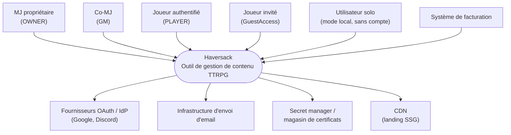
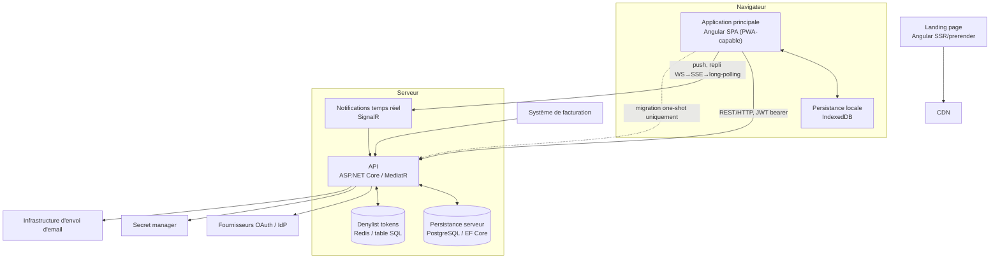
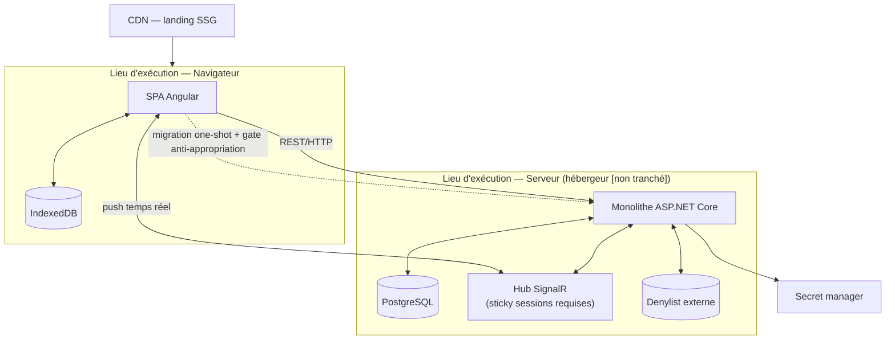

# Dossier d'Architecture Technique — Haversack

## §0 — Métadonnées & portée

**Titre** : Dossier d'Architecture Technique (DAT) — Haversack.

**Nature** : document de consolidation, zéro décision neuve. Ce dossier ne tranche rien qui ne soit déjà tranché ailleurs — il assemble en un point d'entrée unique la carte structurelle du système (structure statique, choix macro, frontières), déjà actée dans le registre des décisions d'architecture (ADR) et les documents de structure existants.

**Audience** : lecteur externe ou opérationnel découvrant le système — architecte rejoignant le projet, relecteur technique, nouvel arrivant qui a besoin de comprendre la forme du système avant d'en lire le détail par préoccupation ou par cas d'usage.

**Clause d'autorité** : ce document est une consolidation ; en cas de divergence apparente avec un ADR cité, l'ADR fait autorité.

**Note d'autorité de la carte** : la carte structurelle du système (vues de contexte, conteneurs, composants, déploiement) vit dans ce DAT. Le document [`architecture-detaillee.md`](../architecture/architecture-detaillee.md) l'indexe par préoccupation technique transverse (sécurité, RGPD, persistance, temps réel, mode local) sans ré-énoncer la structure présentée ici — il renvoie aux mêmes ADR sous un angle différent (thématique plutôt que structurel), sans redondance d'autorité.

**Légende de statut** : sauf mention contraire, les décisions cartographiées dans ce document sont **actées en conception et à confirmer à l'entrée en build** — elles ne décrivent pas un système déjà construit. Les points explicitement ouverts sont signalés `[non tranché]` ou `[à ratifier]`.

---

## §1 — Choix structurants & justification

Haversack est un monolithe modulaire organisé selon les principes de la Clean Architecture (inversion de dépendances, domaine au centre), structuré en quatre bounded contexts DDD — Identity & Access, Space Management, Content Library, Session Conduct — et opère une dualité d'exécution local/cloud : un mode local navigateur (persistance IndexedDB, sans compte) coexiste avec un mode cloud serveur-autoritaire, reliés exclusivement par une migration one-shot. Les quatorze choix structurants ci-dessous portent cette forme et renvoient chacun à l'ADR ou au document de structure qui les justifie en détail.

| # | Choix macro | Alternative écartée | ADR autorité |
|---|---|---|---|
| 1 | Clean Architecture — inversion de dépendances, domaine au centre | Monorepo plat (perte des garanties de sens de dépendance vérifiables par le compilateur) | ADR-008, 06 §2 |
| 2 | Monolithe modulaire ; 4 bounded contexts = frontières logiques (namespaces), pas d'assemblies séparées au MVP ; frontières outillées par test d'architecture CI (NetArchTest) | 6 assemblies isolées dès le démarrage | ADR-008, 06 §3/§5/§6 |
| 3 | Domaine et Application en projets .NET uniques ; Infrastructure et Présentation en multi-projets ; noyau partagé `SharedKernel` | — | ADR-008, 06 §3/§4 |
| 4 | Mono-écosystème Angular (SPA principale + SSR/prerender pour la landing) | Blazor WASM ; Next.js comme second écosystème front pour la landing | ADR-003 |
| 5 | Mode local = couche de persistance TypeScript + validations minimales, pas le domaine C# complet ; source de vérité serveur ; invariant « validation locale ⊆ validation serveur » ; ordre de construction C#-first | Réimplémenter le domaine en TypeScript côté navigateur ; cloud-first avec mode local reporté post-MVP | ADR-001 |
| 6 | Store local IndexedDB structuré en aggregate-rooted (racine `Space`), jeu d'index restreint aux chemins de lecture requis, versionnement du store découplé du `schemaVersion` du payload | Structure miroir relationnel des tables serveur ; versions couplées ; moteur de synchronisation delta | ADR-017 |
| 7 | Sérialisation et migration one-shot local→cloud : enveloppe versionnée `schemaVersion`, frontière de confiance, transaction par espace, ordre topologique à l'import, gate de confirmation anti-appropriation | Tout-ou-rien sur le payload entier ; import document par document ; sans enveloppe versionnée | ADR-016 |
| 8 | Transport temps réel SignalR dès le MVP, avec repli automatique WebSocket → Server-Sent Events → long-polling | Polling court ou SSE au MVP ; aucun temps réel | ADR-004 |
| 9 | « Tout est Document » strict : un seul `DocumentId`, champ `properties` gouverné par un value object validé contre un `propertiesSchema` déclaré par type | Entités de premier ordre distinctes (`Scenario`, `Character`) ; `properties` libre sans value object de validation | ADR-002 |
| 10 | Généralisation de `Campaign` en `Space`, avec `SpaceType.PERSONAL` comme conteneur de premier ordre | Racine sur l'utilisateur (`ownerId` de premier ordre sur `Document`) — écartée pour flaw structural sur trois axes indépendants ; `PERSONAL` ajouté sur `Campaign` non renommée | ADR-018 |
| 11 | Autorisation : `IResourceAccessPolicy` centralise le prédicat d'appartenance (ressource↔espace) et le prédicat de visibilité domaine, un service unique consommé par le pipeline REST et le filtre de diffusion SignalR | Vérification d'appartenance par discipline de handler (vecteur IDOR) ; middleware HTTP ; autorisation RBAC seule | ADR-014 |
| 12 | Sécurité de l'authentification : hachage Argon2id, JWT asymétrique RS256/ES256, rotation des refresh tokens avec détection de réutilisation, denylist externe partagée, rate limiting hybride IP + compte | HS256 (secret partagé) ; denylist en mémoire par instance ; rate limiting par-IP seul | ADR-015 |
| 13 | Intégrité référentielle à la suppression : saga applicative, toutes les FK en `ON DELETE RESTRICT`, DELETE topologique en deux passes ; sagas `SpaceDeleted` et `UserAnonymized` | `ON DELETE CASCADE` SQL déclaratif ; `ON DELETE SET NULL` câblé en base | ADR-011 |
| 14 | Base de données PostgreSQL (recherche plein texte native, JSONB pour le contenu structuré, UUID) | — | stack.md |

---

## §2 — Vue de contexte (C4 niveau 1)

Le système Haversack met en relation cinq natures d'acteurs et cinq systèmes externes autour de l'application. Aucun stockage objet externe n'est prévu au MVP — tout média associé à un document est stocké inline en base ([ADR-011](../architecture/decisions/ADR-011-cascade-integrite-referentielle.md)).

**Acteurs** :
- **MJ propriétaire** — `MemberRole.OWNER`, responsable billing et RGPD de ses espaces ([ADR-009](../architecture/decisions/ADR-009-fk-campaign-owner.md)).
- **Co-MJ** — `MemberRole.GM`.
- **Joueur authentifié** — `SpaceMembership` de rôle `PLAYER`.
- **Joueur invité sans compte** — `GuestAccess`, scope `SPACE` ou `SESSION` ([ADR-014](../architecture/decisions/ADR-014-modele-autorisation-api.md) §1).
- **Utilisateur solo / mode local** — aucun `User` n'existe en mode local ([ADR-001](../architecture/decisions/ADR-001-execution-domaine-mode-local.md), [ADR-017](../architecture/decisions/ADR-017-modele-indexeddb-local.md) §1.1) ; propriétaire de facto d'un espace `PERSONAL` local, sans `ownerId` assigné.

**Systèmes externes** :
- **Fournisseurs OAuth / IdP** — Google, Discord ([ADR-015](../architecture/decisions/ADR-015-securite-authentification-mvp.md) §2.2).
- **Infrastructure d'envoi d'email** ([ADR-015](../architecture/decisions/ADR-015-securite-authentification-mvp.md) §2.1).
- **Système de facturation** — émet `AccountTierChanged` (PRO ↔ FREE).
- **Secret manager / magasin de certificats** — clé de signature JWT, rotation ([ADR-015](../architecture/decisions/ADR-015-securite-authentification-mvp.md) §3.2).
- **CDN** — sert la landing en SSG ([ADR-003](../architecture/decisions/ADR-003-stack-front.md)).

---

## §3 — Vue conteneurs (C4 niveau 2)

| Conteneur | Techno | Source ADR/fichier |
|---|---|---|
| Landing page | Angular SSR/prerender (SSG au MVP), CDN | [ADR-003](../architecture/decisions/ADR-003-stack-front.md), [stack.md](../architecture/stack.md), [06 §7](../architecture/structure-projets.md) |
| Application principale | Angular SPA (PWA-capable) | [ADR-003](../architecture/decisions/ADR-003-stack-front.md), [stack.md](../architecture/stack.md) |
| Persistance locale | IndexedDB, store aggregate-rooté | [ADR-001](../architecture/decisions/ADR-001-execution-domaine-mode-local.md), [ADR-017 §1](../architecture/decisions/ADR-017-modele-indexeddb-local.md) |
| API | ASP.NET Core (Kestrel), MediatR | [stack.md](../architecture/stack.md), [06 §3](../architecture/structure-projets.md), [ADR-014 §3](../architecture/decisions/ADR-014-modele-autorisation-api.md) |
| Persistance serveur | EF Core → PostgreSQL (FTS, JSONB, UUID) | [stack.md](../architecture/stack.md), [06 §3](../architecture/structure-projets.md), [ADR-008](../architecture/decisions/ADR-008-structure-solution.md) |
| Notifications temps réel | SignalR (`Haversack.Infrastructure.Notifications`) | [ADR-004](../architecture/decisions/ADR-004-transport-temps-reel.md), [06 §3](../architecture/structure-projets.md) |
| Denylist tokens | Store externe (Redis ou table SQL) | [ADR-015 §3.4](../architecture/decisions/ADR-015-securite-authentification-mvp.md) |

**Frontières et protocoles** :
- **SPA ↔ API** — REST/HTTP, JWT bearer, OpenAPI.
- **SPA ↔ SignalR** — push MJ → joueurs, repli WebSocket → SSE → long-polling, token invité jamais transmis en query-string ([ADR-004](../architecture/decisions/ADR-004-transport-temps-reel.md)).
- **Navigateur ↔ API** — migration one-shot exclusivement, payload JSON `schemaVersion`, aucune synchronisation continue ([ADR-016](../architecture/decisions/ADR-016-serialisation-locale-migration.md), [ADR-017](../architecture/decisions/ADR-017-modele-indexeddb-local.md)).
- **API ↔ PostgreSQL** — EF Core, FK `ON DELETE RESTRICT`, query filters de soft-delete ([ADR-011](../architecture/decisions/ADR-011-cascade-integrite-referentielle.md), [ADR-014](../architecture/decisions/ADR-014-modele-autorisation-api.md)).
- **API ↔ IdP** — OAuth2 ([ADR-015](../architecture/decisions/ADR-015-securite-authentification-mvp.md)).
- **API ↔ secret manager** — clé de signature JWT ([ADR-015 §3.2](../architecture/decisions/ADR-015-securite-authentification-mvp.md)).
- **API ↔ infrastructure email** — envoi des emails de validation et de bienvenue ([ADR-015](../architecture/decisions/ADR-015-securite-authentification-mvp.md) §2.1).
- **Facturation → API** — le système de facturation émet `AccountTierChanged` (PRO ↔ FREE) consommé par l'API.

---

## §4 — Vue composants (C4 niveau 3)

### Core / SharedKernel

Noyau partagé, pas un bounded context. Porte les abstractions communes : `AggregateRoot` / `Entity` / `ValueObject` / `DomainEvent` ; les identifiants typés (`UserId`, `SpaceId`, `GuestAccessId`, `SessionId`, `DocumentId`, `FolderId`) ; les value objects `Email` / `Slug` / `Tag` ; les primitives de traçabilité `AuditInfo` et `SoftDelete` ; l'enum partagée `Visibility`. Source : [core.md](../conception/domain/core.md).

### Identity & Access

Agrégat unique `User` (shadow entity — les secrets d'authentification sont délégués à l'infrastructure d'identité). Contrats applicatifs observables portés par [ADR-015](../architecture/decisions/ADR-015-securite-authentification-mvp.md) : `ITokenValidator`, `ITokenDenylist`, `ITokenSigner`, `IEmailVerificationPolicy` (§5) et `IPasswordHasher<User>` (§1.2, Argon2id). Un Hosted Service assure la purge périodique des JTI expirés.

### Space Management

Gardien de l'accès. Agrégat principal `Space` (`SpaceType {CAMPAIGN, ONE_SHOT, PERSONAL}`), entités enfants `SpaceMembership` et `Invitation` ; `GuestAccess` est un agrégat séparé (cycle de vie orthogonal). Port `ISpaceRepository`. Il n'existe pas d'agrégat `ScenarioLibrary` — la réutilisabilité est subsumée par l'espace `PERSONAL` ([ADR-018](../architecture/decisions/ADR-018-espace-personnel-generalisation-space.md)).

### Content Library

Référentiel du principe « Tout est Document ». Agrégat `Document` (composé de `DocumentBlock`, du value object `DocumentLink`, et de `DocumentTag`), agrégat `Folder`, entité de référence `DocumentType`. Méthodes souveraines du domaine : `Document.CanBeReadBy(...)` (résolution de la visibilité — [ADR-014](../architecture/decisions/ADR-014-modele-autorisation-api.md) §Frontière fondamentale) ; `Document.SetProperties()` via le value object `DocumentProperties` validé contre le `propertiesSchema` du type ([ADR-002](../architecture/decisions/ADR-002-tout-est-document-gouvernance.md)) ; `Document.Instantiate()` ; `Document.LinkDocument()` (invariant anti-lien cross-espace, rejeté au niveau domaine). Port `IDocumentRepository`.

### Session Conduct

Consomme ce que Content Library prépare, sans posséder de contenu propre. Agrégat `Session` (existence d'une machine d'états `LIVE → CLOSED → ARCHIVED`, sans détail des transitions — relève du SDD), agrégat `SessionViewConfig` avec le value object `SessionViewFolder`. Les notes de session sont des `Document` de type `LIVE_NOTE`. Port `ISessionRepository`.

### Transverse — couche Application

- `IResourceAccessPolicy.CanAccess(principal, resourceRef)` — service de décision unique composant le prédicat d'appartenance (P1) et le prédicat de visibilité domaine (P4), consommé aux deux points d'application : pipeline behavior MediatR côté REST et filtre de diffusion côté SignalR ([ADR-014](../architecture/decisions/ADR-014-modele-autorisation-api.md) §3/§6).
- Sagas applicatives `SpaceDeleted` et `UserAnonymized` — Hosted Service idempotent ([ADR-011](../architecture/decisions/ADR-011-cascade-integrite-referentielle.md)).
- Orchestration de la migration locale → cloud et de la conversion `GuestAccess` → `SpaceMembership` ([ADR-016](../architecture/decisions/ADR-016-serialisation-locale-migration.md) pour la migration ; [space-management.md](../conception/domain/space-management.md) pour la conversion).

---

## §5 — Vue déploiement (C4 niveau 4)

Deux lieux d'exécution structurent le déploiement :

- **(a) Navigateur** — SPA + IndexedDB, mode local pleinement hors-ligne, `connect-src 'self'`, aucune donnée envoyée au serveur en mode local ([ADR-017](../architecture/decisions/ADR-017-modele-indexeddb-local.md)).
- **(b) Serveur** — monolithe ASP.NET Core, PostgreSQL, hub SignalR, denylist externe.

La landing est servie en SSG depuis un CDN ([ADR-003](../architecture/decisions/ADR-003-stack-front.md)). Les connexions persistantes du canal temps réel imposent des **sticky sessions** côté hébergement, d'où une denylist externe et une clé de signature en secret manager ([ADR-004](../architecture/decisions/ADR-004-transport-temps-reel.md), [ADR-015](../architecture/decisions/ADR-015-securite-authentification-mvp.md)). La frontière local↔cloud n'est traversée que par la migration one-shot, complétée d'un gate anti-appropriation ([ADR-016](../architecture/decisions/ADR-016-serialisation-locale-migration.md), [ADR-017](../architecture/decisions/ADR-017-modele-indexeddb-local.md)). Le déploiement du monolithe est **atomique** — aucun module ne se déploie seul ([stack.md](../architecture/stack.md)). **Aucun stockage objet n'est prévu au MVP.** L'extensibilité vers d'autres clients (PWA, Tauri, Capacitor, MAUI) se fait par des projets de présentation distincts consommant la même API, sans modification du domaine ([stack.md](../architecture/stack.md), [ADR-003](../architecture/decisions/ADR-003-stack-front.md)).

**`[non tranché]` — hébergeur.** [`stack.md`](../architecture/stack.md) recense des options (Railway, Supabase, Render, auto-hébergé) sans arbitrer. Ce document cartographie la contrainte structurelle (sticky sessions imposées par le transport temps réel), pas une topologie d'hébergement : aucun choix de fournisseur n'est acté ici ni ailleurs dans le corpus actuel.

---

## §6 — Traçabilité vue → ADR

| Vue / section | ADR(s) et fichiers sources |
|---|---|
| §1 — Choix structurants | ADR-001, ADR-002, ADR-003, ADR-004, ADR-008, ADR-011, ADR-014, ADR-015, ADR-016, ADR-017, ADR-018, stack.md |
| §2 — Vue de contexte | ADR-001, ADR-003, ADR-009, ADR-011, ADR-014 §1, ADR-015 §2.1/§2.2/§3.2, ADR-017 §1.1 |
| §3 — Vue conteneurs | ADR-003, ADR-004, ADR-008, ADR-011, ADR-014, ADR-015, ADR-016, ADR-017, structure-projets.md, stack.md |
| §4 — Identity & Access | ADR-015 §5, identity-access.md |
| §4 — Space Management | ADR-018, space-management.md |
| §4 — Content Library | ADR-002, ADR-014 §Frontière fondamentale, content-library.md |
| §4 — Session Conduct | session-conduct.md |
| §4 — Transverse (couche Application) | ADR-011, ADR-014 §3/§6 |
| §4 — Core/SharedKernel | core.md |
| §5 — Vue déploiement | ADR-003, ADR-004, ADR-015, ADR-016, ADR-017, stack.md |

---

## §7 — Limites cartographiques

**Hébergeur non tranché.** [`stack.md`](../architecture/stack.md) liste des options d'hébergement (Railway, Supabase, Render, auto-hébergé) sans arbitrage. Ce document cartographie la contrainte imposée par le transport temps réel (sticky sessions) sans inventer de topologie.

**Observabilité non consolidée.** Un document [`specs/telemetrie.md`](../architecture/specs/telemetrie.md) existe, mais son contenu relève du cahier de spécification technique — il n'est pas consolidé dans ce DAT. La vue déploiement (§5) reste muette sur ce point ; ce silence n'est pas comblé ici.

**Statut pré-implémentation généralisé.** C'est le point le plus structurant de ce document : à l'exception des rares cas explicitement marqués autrement, chaque choix cartographié est une décision de conception à confirmer à l'entrée en build — voir la légende de statut en §0.

**Points ouverts, non tranchés dans ce document** :
- [ADR-015](../architecture/decisions/ADR-015-securite-authentification-mvp.md) §2.3 — résolution *reclaim-in-place* pour le cas d'un email OAuth correspondant à un compte préexistant non vérifié : `[à ratifier]` en décision produit.
- [ADR-018](../architecture/decisions/ADR-018-espace-personnel-generalisation-space.md) — deux validations juridiques ouvertes avant tout lancement EU, consolidées dans [`cadrage-validation-pre-lancement-eu.md`](../securite/conformite/cadrage-validation-pre-lancement-eu.md) : la qualification au regard de l'Art. 17 du hard-delete inconditionnel du contenu personnel, et le périmètre du DPA (Art. 28) pour un contenu personnel décrivant des tiers identifiables. Ces deux points sont des items de conformité ouverts, non des décisions d'architecture ; ils ne sont pas tranchés ici.

---

*Ce document est une consolidation ; en cas de divergence apparente avec un ADR cité, l'ADR fait autorité.*
