# Dossier de conception détaillée — Haversack (MVP)

## Métadonnées

| Champ | Valeur |
|---|---|
| Version | 1.0 |
| Date | 2026-07-16 |
| Statut | Version de travail — consolidation dérivée du corpus de conception ; ne tranche aucune décision. Points ouverts et limites de vérifiabilité recensés en §8, à traiter à l'entrée en build. |
| Porteur / responsable du document | Pierre-Marie Marchio |
| Validation / approbation | Pierre-Marie Marchio |

### Historique des révisions

| Version | Date | Auteur | Nature de la révision |
|---|---|---|---|
| 1.0 | 2026-07-16 | Pierre-Marie Marchio | Rédaction initiale — consolidation relationnelle du corpus de conception (architecture, décisions, specs, domaine) |

## Nature et portée du document

Ce document **consolide et renvoie** — il ne tranche rien qui ne soit déjà tranché ailleurs. Sa valeur n'est pas de réénoncer les décisions actées dans les ADR, les specs ou le domaine, mais de porter les **relations et dépendances** entre elles : ce qui, dans une décision, en présuppose une autre, la raffine, ou la contraint. En cas de divergence apparente avec une source citée (ADR, spec, fichier de domaine), **la source fait autorité** — ce document est corrigé en conséquence, jamais l'inverse.

Ce document n'est **ni une nouvelle décision de conception, ni une décision d'architecture** : il ne prépare pas de travail d'implémentation au sens où l'entendent les specs pré-build, et il ne remplace aucun ADR. Pour l'historique et le statut de chaque décision, voir le [registre ADR](../architecture/decisions/README.md) ; pour une découverte dans l'ordre pédagogique, voir l'[index d'architecture](../architecture/README.md) ; pour la vue transverse par préoccupation technique, voir [architecture-detaillee.md](../architecture/architecture-detaillee.md). L'audience visée est l'équipe de conception elle-même et tout relecteur qui aborde ce corpus à l'entrée en build.

## Sommaire

- [Résumé exécutif](#résumé-exécutif)
- [Conventions de lecture](#conventions-de-lecture)
  - [Ordre d'autorité applicable à ce document](#ordre-dautorité-applicable-à-ce-document)
  - [Critère de lecture et de relecture — consolidation, pas catalogue](#critère-de-lecture-et-de-relecture--consolidation-pas-catalogue)
  - [Fidélité de consolidation — pas de re-décision](#fidélité-de-consolidation--pas-de-re-décision)
  - [Nommage des jalons dans ce dossier](#nommage-des-jalons-dans-ce-dossier)
  - [Comment lire ce document](#comment-lire-ce-document)
- [1 — Socle transverse](#1--socle-transverse)
  - [1.1 — Clean Architecture et quatre bounded contexts](#11--clean-architecture-et-quatre-bounded-contexts)
  - [1.2 — Pattern « tout est Document » et gouvernance de `properties`](#12--pattern--tout-est-document--et-gouvernance-de-properties)
  - [1.3 — Généralisation de `Space` et type `PERSONAL`](#13--généralisation-de-space-et-type-personal)
  - [1.4 — Contexte Core (Shared Kernel)](#14--contexte-core-shared-kernel)
- [2 — Relations transverses](#2--relations-transverses)
  - [2.1 — Cascade RGPD de `Space.Delete()` et purge différée *(chaîne canonique)*](#21--cascade-rgpd-de-spacedelete-et-purge-différée-chaîne-canonique)
  - [2.2 — Effacement de compte : routage de cascade différencié par type d'espace (`UserAnonymized`)](#22--effacement-de-compte--routage-de-cascade-différencié-par-type-despace-useranonymized)
  - [2.3 — Modèle d'autorisation composé P1 + P4 : non-divergence REST / SignalR](#23--modèle-dautorisation-composé-p1--p4--non-divergence-rest--signalr)
  - [2.4 — Frontière local ↔ cloud : migration one-shot et contrat de sérialisation](#24--frontière-local--cloud--migration-one-shot-et-contrat-de-sérialisation)
- [3 — Identity & Access](#3--identity--access)
  - [3.1 — UC-01 : absence d'authentification en mode local](#31--uc-01--absence-dauthentification-en-mode-local)
  - [3.2 — UC-10 : compte, opérations sensibles, cascade d'effacement](#32--uc-10--compte-opérations-sensibles-cascade-deffacement)
  - [3.3 — UC-11 (facette Identity & Access) : création de compte à la conversion d'un invité](#33--uc-11-facette-identity--access--création-de-compte-à-la-conversion-dun-invité)
- [4 — Space Management](#4--space-management)
  - [4.1 — UC-02 : création d'espace et espace `PERSONAL` automatique](#41--uc-02--création-despace-et-espace-personal-automatique)
  - [4.2 — UC-11 / UC-09 : cycle d'invitation, `GuestAccess`, conversion en membre](#42--uc-11--uc-09--cycle-dinvitation-guestaccess-conversion-en-membre)
  - [4.3 — UC-15 : gel et dégel au changement de tier](#43--uc-15--gel-et-dégel-au-changement-de-tier)
  - [4.4 — Suppression d'espace (flux transverse)](#44--suppression-despace-flux-transverse)
  - [4.5 — Modèle du principal et appartenance P1 (flux transverse)](#45--modèle-du-principal-et-appartenance-p1-flux-transverse)
- [5 — Content Library](#5--content-library)
  - [5.1 — UC-03 / UC-04 : cycle de vie du `Document`](#51--uc-03--uc-04--cycle-de-vie-du-document)
  - [5.2 — UC-04 / UC-08 : partage permanent d'un document](#52--uc-04--uc-08--partage-permanent-dun-document)
  - [5.3 — UC-13 : réutilisabilité (template → instance)](#53--uc-13--réutilisabilité-template--instance)
  - [5.4 — UC-05 : dossiers système conditionnels au type d'espace](#54--uc-05--dossiers-système-conditionnels-au-type-despace)
  - [5.5 — UC-04 / UC-14 : gouvernance de `properties` et visibilité domaine (P4)](#55--uc-04--uc-14--gouvernance-de-properties-et-visibilité-domaine-p4)
- [6 — Session Conduct](#6--session-conduct)
  - [6.1 — UC-06 : machine d'états de session](#61--uc-06--machine-détats-de-session)
  - [6.2 — UC-07 : création à la volée — routage `PinDocument`/`AttachNote`](#62--uc-07--création-à-la-volée--routage-pindocumentattachnote)
  - [6.3 — UC-06 : tableau de bord configurable](#63--uc-06--tableau-de-bord-configurable)
  - [6.4 — UC-08 / UC-09 / UC-12 : diffusion temps réel (flux transverse)](#64--uc-08--uc-09--uc-12--diffusion-temps-réel-flux-transverse)
  - [6.5 — UC-09 : scope `GuestAccess SESSION`](#65--uc-09--scope-guestaccess-session)
- [7 — Authentification cloud et temps réel](#7--authentification-cloud-et-temps-réel)
  - [7.a — Cycle de vie de l'authentification cloud (rotation, denylist, raccordement domaine)](#7a--cycle-de-vie-de-lauthentification-cloud-rotation-denylist-raccordement-domaine)
  - [7.b — Transport temps réel et repli](#7b--transport-temps-réel-et-repli)
- [8 — Points ouverts et limites de vérifiabilité](#8--points-ouverts-et-limites-de-vérifiabilité)
  - [8.1 — Registre des `[À TRANCHER]`](#81--registre-des-à-trancher)
  - [8.2 — Renvoi juridique](#82--renvoi-juridique)
  - [8.3 — Limites de vérifiabilité en build](#83--limites-de-vérifiabilité-en-build)
- [Sources et références](#sources-et-références)

## Résumé exécutif

Ce dossier consolide, en un seul document, les relations et dépendances entre les décisions de conception de Haversack déjà actées ailleurs — décisions d'architecture (ADR), spécifications techniques, modèle de domaine. Il ne tranche aucune décision nouvelle : en cas de divergence apparente avec une source citée, la source fait autorité et ce dossier est corrigé en conséquence, jamais l'inverse.

Sa valeur propre n'est pas de réénoncer ce que chaque source dit déjà, mais de rendre lisibles les dépendances qu'une lecture source par source aplatit — ce qui, dans une décision, en présuppose une autre, la raffine ou la contraint. Quatre chaînes transverses illustrent ce travail de composition : la cascade RGPD de suppression d'un espace, le routage de cascade différencié à l'effacement d'un compte, le modèle d'autorisation composé (appartenance et visibilité, non-divergence REST/SignalR), et la frontière entre mode local et cloud (migration one-shot, contrat de sérialisation).

L'organisation du dossier part d'un socle transverse commun (Clean Architecture, quatre bounded contexts, pattern « tout est Document », généralisation de l'espace `Space`, Core partagé), développe ces quatre chaînes transverses, puis décline la conception module par module et use case par use case — Identity & Access, Space Management, Content Library, Session Conduct — avant de traiter l'authentification cloud et le temps réel.

Les points non tranchés rencontrés au fil du dossier, ainsi que les limites de vérifiabilité par test ou par CI, sont recensés sans être comblés dans le registre unique de §8.

## Conventions de lecture

Les cinq sous-sections qui suivent posent le cadre de lecture et de relecture de ce dossier — ordre d'autorité, critère d'admission d'un contenu, discipline de fidélité aux sources, nommage des jalons, et mode de lecture recommandé.

### Ordre d'autorité applicable à ce document

La hiérarchie du corpus de conception reste celle définie dans [docs/conception/README.md § Ordre d'autorité entre artefacts](../conception/README.md#ordre-dautorité-entre-artefacts) :

**personas → vision produit → use cases (source de vérité du besoin) → user journeys / user stories / NFR → domaine → glossaire.**

Les ADR et les specs techniques **raffinent** un besoin déjà exprimé en amont — ils ne priment jamais sur les use cases. Conséquence structurante pour la lecture de ce dossier : **chaque flux décrit ici est enraciné sur son ou ses use case(s)** ; l'ADR ou la spec qui en précise la mécanique intervient en **annotation de raffinement**, jamais comme source d'autorité première de la règle. Un flux dont l'unique ancrage serait un ADR, sans UC porteur du besoin, signalerait une inversion à corriger — pas une omission de ce dossier à combler par invention.

Le principe sous-jacent — un ADR peut motiver une règle, jamais la définir ; si masquer le renvoi ADR rend la règle vide, l'inversion est consommée — est posé dans [docs/conception/domain/README.md § Sens de dépendance besoin ↔ décision](../conception/domain/README.md#sens-de-dépendance-besoin--décision--pureté-du-domaine), lui-même renvoyant à [docs/conception/README.md § Sens de dépendance besoin ↔ décision](../conception/README.md#sens-de-dépendance-besoin--décision). Ce dossier applique le même principe à son propre contenu : un renvoi vers un ADR justifie, un renvoi vers un UC ancre.

### Critère de lecture et de relecture — consolidation, pas catalogue

Une unité de ce document (paragraphe, ligne de tableau, note) n'a droit de cité que si elle porte une **arête de dépendance** reliant au moins deux sources — de la forme : *« X d'ADR-a et Y de spec-b composent, dans cet ordre, pour garantir W, pour telle raison »*. La description d'une seule décision, sans composition avec une autre, appartient à sa source d'origine, pas à ce dossier.

**Test de suppression**, applicable à toute phrase candidate à figurer ici : masquer mentalement les renvois vers les sources citées. Si la phrase restante est encore une règle normative complète et autoportante, **déjà énoncée verbatim dans une source unique**, alors c'est une entrée de catalogue — elle n'a pas sa place dans ce dossier, quel que soit son intérêt informatif. Si la phrase devient vide, orpheline, ou cesse de faire sens sans les renvois, alors la substance vivait bien dans la composition — elle a sa place ici. Ce test est dérivé, par symétrie, du test d'autoportance défini pour la relation besoin ↔ décision ([domain/README.md § Sens de dépendance](../conception/domain/README.md#sens-de-dépendance-besoin--décision--pureté-du-domaine)) : appliqué là à la relation ADR ↔ domaine, il est repris ici à la relation entre sources consolidées.

Ce test est un outil de relecture réutilisable : tout contributeur qui amende une section de ce dossier l'applique avant intégration, au même titre que le balayage décrit dans `docs/conception/README.md`.

### Fidélité de consolidation — pas de re-décision

- Aucun `[À TRANCHER — <axe>]` **nouveau ou prématuré** n'est introduit dans ce dossier. Un point non tranché dans le corpus source se **reporte tel quel**, avec son axe nommé, jamais comblé par une hypothèse de ce document.
- Les `[À TRANCHER]` **déjà existants** dans les ADR, les specs ou le domaine sont reportés fidèlement — ni supprimés silencieusement, ni requalifiés en décision.
- Aucune borne normative fixée par une source (seuil, cardinalité, énumération de valeurs, délai) n'est **affaiblie**, ni **recopiée comme si ce dossier la possédait en propre**. Ce dossier renvoie à la borne ; il ne la réénonce pas comme sienne.
- **Distinction opérationnelle** : *reporter un trou existant* consiste à citer l'axe déjà nommé dans la source et à le faire figurer tel quel dans la synthèse relationnelle ; *créer un trou* consisterait à inventer un axe non nommé ailleurs — c'est strictement exclu.

### Nommage des jalons dans ce dossier

Ce dossier nomme les jalons qu'il mentionne par leur **contenu observable** — par exemple « local-only » ou « cloud + migration » — jamais par un identifiant numéroté ou arbitraire indépendant du contenu.

### Comment lire ce document

Ce dossier décline la conception détaillée **par module** (les quatre bounded contexts + Core), **par use case**, et par **flux transverses** qui traversent plusieurs modules. Les diagrammes de séquence de ce dossier sont des **vues de consolidation** — elles composent, pour un flux donné, les décisions de plusieurs sources en une lecture unique. La source détaillée de chaque flux reste [docs/conception/domain/diagrams/flows/\<contexte\>.md](../conception/domain/diagrams/flows/) : un diagramme de ce dossier ne remplace jamais le diagramme de flux du module concerné, il le compose avec d'autres.

Trois renvois structurants pour situer ce dossier dans le corpus :

- **Vue transverse par préoccupation technique** (persistance, sécurité, RGPD, temps réel, mode local — organisée par sujet plutôt que par module) → [architecture-detaillee.md](../architecture/architecture-detaillee.md).
- **Registre des décisions** (statut, nature, date de chaque ADR) → [decisions/README.md](../architecture/decisions/README.md).
- **Découverte pédagogique** (ordre de lecture conseillé pour qui rejoint le projet) → [architecture/README.md](../architecture/README.md).

## 1 — Socle transverse

### 1.1 — Clean Architecture et quatre bounded contexts

Le socle architectural compose deux décisions distinctes qui, ensemble, fixent la forme du code avant tout raffinement de flux : le principe Clean Architecture (inversion de dépendances, domaine indépendant de l'infrastructure et de la présentation) et le découpage DDD en quatre bounded contexts — **Identity & Access**, **Space Management**, **Content Library**, **Session Conduct** — plus un **Core** transverse (Shared Kernel) dont ils dépendent tous sans dépendre les uns des autres ([domain/README.md § Architecture générale](../conception/domain/README.md#architecture-générale)).

Au MVP, ces quatre contextes sont des **frontières logiques** — namespaces et contrats internes au sein de projets Domaine/Application uniques — et non des assemblies isolées. Ce statut n'est pas une simplification informelle : il est explicitement acté dans [ADR-008](../architecture/decisions/ADR-008-structure-solution.md) comme un compromis entre rigueur DDD et praticité d'un démarrage solo, avec promotion en projets physiques séparés **autorisée à tout moment** si un besoin réel émerge (montée en équipe, dépendances incompatibles, performance de build). La garantie du compilateur étant absente tant que les contextes coexistent dans le même assembly, ADR-008 fait porter la frontière par un test d'architecture automatisé en CI, livrable de J0 — le détail concret de cette structure (arborescence de projets, nommage `SharedKernel`) est spécifié dans [structure-projets.md](../architecture/structure-projets.md).

### 1.2 — Pattern « tout est Document » et gouvernance de `properties`

Le domaine unifie tout contenu éditorial (scénario, scène, PNJ, personnage, note…) sous un agrégat unique `Document`, composé de `DocumentBlock[]` et de `DocumentLink[]`, sans entité de premier ordre distincte par type de contenu ([content-library.md § Principe fondamental](../conception/domain/content-library.md)). Ce choix est acté et sa gouvernance des identifiants et du champ `properties` est définie dans [ADR-002](../architecture/decisions/ADR-002-tout-est-document-gouvernance.md) : un identifiant unique `DocumentId` (les types forts `ScenarioId`/`SceneId`/`CharacterId` sont supprimés), et un value object `DocumentProperties` qui valide toute écriture dans `properties` contre le `propertiesSchema` déclaré par le `DocumentType` — deux régimes de validation distincts selon que le type est système figé ou custom/modifié. Le contrat détaillé de ce value object, les deux régimes de validation et l'énumération des huit types système seedés sont spécifiés dans [specs/document-properties-schemas.md](../architecture/specs/document-properties-schemas.md), qui reporte fidèlement les champs de `propertiesSchema` non modélisés par le domaine (`[À TRANCHER — modélisation domaine]` pour six des huit types système).

Ce pattern est un **nœud transverse** du dossier : la promotion des champs `characterId`/`guestAccessId` hors de `properties` (ADR-002, compléments post-revue) irrigue directement l'invariant d'autorisation d'ADR-007/ADR-014 sur la ressource `LIVE_NOTE`, la gouvernance de `properties` porte l'enjeu de confidentialité RGPD sur la visibilité des notes, et le schéma déclaré par type sécurise la migration locale→cloud contre un EAV non gouverné. Ces trois chaînes de dépendance sont développées en §2 (chaînes RGPD et migration locale→cloud) et en §6.2 (promotion `characterId`/`guestAccessId` et autorisation `LIVE_NOTE`) — ce paragraphe se limite à en annoncer le point d'ancrage commun.

### 1.3 — Généralisation de `Space` et type `PERSONAL`

L'agrégat racine autrefois nommé `Campaign` est généralisé en `Space`, porteur d'un `SpaceType ∈ {CAMPAIGN, ONE_SHOT, PERSONAL}` — la valeur `PERSONAL` permettant au contenu documentaire d'exister indépendamment de toute campagne partagée, comme conteneur de premier ordre appartenant au propriétaire. Cette généralisation, sa justification (voie retenue face aux deux alternatives écartées) et son analyse d'impact invariant par invariant sont actées dans [ADR-018](../architecture/decisions/ADR-018-espace-personnel-generalisation-space.md) ; l'état courant du modèle qui en résulte est décrit dans [space-management.md](../conception/domain/space-management.md).

> **Note de lecture** : ADR-018 cite, dans son contexte et son analyse d'impact, des références à `campaign-management.md` et des numéros de ligne antérieurs au renommage exécuté — l'ADR le signale lui-même comme périmé dans ses compléments post-revue. Ce dossier dérive exclusivement de l'état courant (`space-management.md`, domaine actuel) et ne reprend aucun de ces renvois périmés ni aucun vocabulaire `Campaign` résiduel.

La généralisation `Space`/`PERSONAL` compose avec plusieurs modules sans que ce paragraphe développe ces chaînes (renvoi §2) :
- le quota du tier FREE ne décompte pas l'espace `PERSONAL` par défaut (space-management.md, invariant 6 ; ADR-018 § Recommandations MoSCoW) ;
- un espace `PERSONAL` ne porte ni session ni configuration de vue de session — Session Conduct n'a pas de prise sur un espace mono-membre sans joueur (space-management.md § One-shot — spécificités, colonne `PERSONAL`) ;
- la création des dossiers à `SpaceCreated` est **conditionnelle au type d'espace** : quatre dossiers système nommés pour `CAMPAIGN`/`ONE_SHOT`, seul le dossier virtuel « Non classés » pour `PERSONAL` (content-library.md § Dossiers créés à `SpaceCreated`) ;
- la purge RGPD de l'espace `PERSONAL` à `UserDeleted` est **inconditionnelle** — hard-delete via la saga `SpaceDeleted`, sans passage par l'anonymisation réservée aux espaces partagés (ADR-018 § Conséquences — Effacement de compte) ;
- l'espace `PERSONAL` est inclus dans le périmètre de la migration locale→cloud, au même titre que tout autre espace (ADR-018 § Mode local).

### 1.4 — Contexte Core (Shared Kernel)

Le Core porte les briques transverses stables aux quatre bounded contexts : les identifiants typés (`UserId`, `SpaceId`, `GuestAccessId`, `SessionId`, `DocumentId`, `FolderId`), les value objects primitifs (`Email`, `Slug`, `Tag`), l'enum partagée `Visibility` (`PUBLIC`/`GM_ONLY`/`PLAYER_PRIVATE`), et les primitives de traçabilité `AuditInfo` et `SoftDelete` ([core.md § Ce qui est dans le Core](../conception/domain/core.md)). Le Core ne contient jamais d'entité — un concept n'y entre que s'il est utile à au moins deux contextes, stable, et testable seul.

`SoftDelete` porte une **exception RGPD explicite** : les notes `PLAYER_PRIVATE` sous obligation d'effacement (fin de compte utilisateur, fin définitive d'un accès invité non converti) ne relèvent pas de la suppression logique réversible — elles sont supprimées **physiquement**, l'article 17 du RGPD ne pouvant être satisfait par un simple masquage (core.md, l. 54-66). Cette exception est le point d'ancrage Core de la chaîne d'effacement RGPD développée en §2 — ce paragraphe n'en pose que le socle partagé.

---

## 2 — Relations transverses

Cette section porte quatre chaînes de décisions qui traversent plusieurs modules et qui, aujourd'hui, ne sont lisibles qu'en recomposant plusieurs fichiers. Chacune est enracinée sur un besoin porté par les use cases ; les ADR et specs cités précisent le mécanisme, ils ne le fondent pas. Les diagrammes ci-dessous sont des **vues de consolidation** — ils composent des décisions de plusieurs sources en une lecture unique et renvoient, quand ils existent, aux diagrammes de flux détaillés par module.

### 2.1 — Cascade RGPD de `Space.Delete()` et purge différée *(chaîne canonique)*

**Ancrage UC.** Le corpus des use cases ne nomme pas de UC dédié à la suppression d'un espace avec fenêtre de corbeille. [UC-02](../conception/besoin/usecases/UC-02-creer-espace-jeu.md) couvre le cycle de vie de création et d'archivage d'un espace mais s'arrête avant sa suppression express ; [UC-11](../conception/besoin/usecases/UC-11-gerer-membres-espace-partage.md) ne couvre que la gestion des membres. Le droit du propriétaire à supprimer son espace est posé directement par [ADR-010](../architecture/decisions/ADR-010-suppression-espace.md) §Contexte comme un besoin domaine, sans UC porteur explicite. Conformément à la discipline posée en tête de ce dossier (« un flux dont l'unique ancrage serait un ADR … signalerait une inversion à corriger »), ce point est signalé ici comme un angle mort d'ancrage — pas comblé par une invention de ce document.

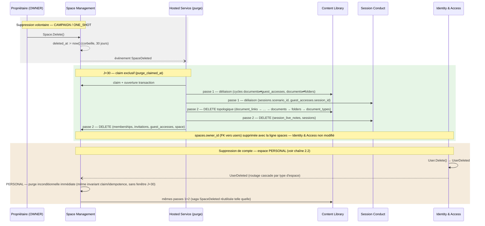

> Vue de consolidation inter-modules. Diagrammes de flux détaillés par module : [flows/space-management.md](../conception/domain/diagrams/flows/space-management.md), [flows/content-library.md](../conception/domain/diagrams/flows/content-library.md), [flows/session-conduct.md](../conception/domain/diagrams/flows/session-conduct.md).

**Règles de gestion consolidées.** `Space.Delete()` émet `SpaceDeleted` (space-management.md § Space — agrégat principal, méthode `Delete()`, et § Événements domaine) ; ADR-011 §1 compose cet événement avec le rejet du `ON DELETE CASCADE` SQL pour imposer que toute la progression des suppressions soit pilotée par la saga applicative, jamais par le SGBD. La matrice des FK (ADR-011 §Schéma et MLD) applique ensuite la règle générale de déliaison (ADR-011 §2) aux deux cycles référentiels identifiés — `documents ⇄ guest_accesses` et `documents ⇄ folders` — pour fixer l'ordre exact de la passe 1. Pendant toute la fenêtre de corbeille, la visibilité de l'espace supprimé sur *tous* les chemins de lecture (y compris lecture directe par ID) est garantie par la composition de l'invariant de jointure `spaces.deleted_at` (ADR-011 §Schéma et MLD) avec les query filters globaux P2/P3 (ADR-014 §2, repris dans mapping-ef-core.md §5 et §8) — sans cette composition, un chemin de lecture hors du filtre global exposerait un espace en corbeille. Le mécanisme de claim/idempotence/reprise après crash (ADR-011 §Saga `SpaceDeleted`) constitue le socle générique de la purge à 30 jours posée par ADR-010 §Décision ; ADR-018 §Conséquences y déroge explicitement pour le type `PERSONAL`, qui déclenche la même saga *sans* attendre la fenêtre de 30 jours, sous le même invariant de reprise (composition explicitement actée : « la purge immédiate de l'espace `PERSONAL` … s'exécute sous le même invariant de claim/idempotence/reprise que la purge J+30 », ADR-011 §Exception PERSONAL). Pour le contenu des espaces partagés seulement, le critère « document non partagé » (ADR-012 §3(b), détaillé dans requete-effacement-non-partage.md) vient affiner, en aval de cette même cascade, ce qui est effacé ou conservé — un raffinement qui ne s'applique pas à `PERSONAL`, purgé sans condition (ADR-012 §3, périmètre d'application).

**Modules traversés** : Space Management (racine — `Space.Delete()`, job de purge, memberships/invitations/guest_accesses) ; Content Library (documents, folders, document_types, cycles nullable) ; Session Conduct (sessions, session_live_notes, session_pinned_documents) ; Identity & Access (FK `owner_id`/`created_by_id`, non modifié par cette cascade — seule la ligne `spaces` la référençant disparaît en fin de passe 2).

**`[À TRANCHER — références nullable entrantes]` reporté** : les références nullable *entrantes* vers un document par ailleurs qualifié « non partagé » — `documents.character_id` d'un autre document, `guest_accesses.character_id`, `folders.default_template_document_id` — ne sont pas couvertes par le critère §3(b) et laisseraient une FK `RESTRICT` non résolue si elles existaient sur un document sélectionné (ADR-012 §4 ; requete-effacement-non-partage.md §5). Non tranché dans le corpus source, non comblé ici.

| Maillon | Source (fichier + section) | Rôle dans la chaîne |
|---|---|---|
| `Space.Delete()` → `SpaceDeleted` | space-management.md § Space (agrégat principal), méthode `Delete()` ; § Événements domaine | Déclencheur domaine de la saga |
| Toutes FK `ON DELETE RESTRICT`, saga applicative | ADR-011 §1 | Mécanisme de cascade retenu (rejet du `CASCADE` SQL) |
| Deux cycles + règle générale de déliaison | ADR-011 §2, §3 | Ordre exact de la passe 1 |
| Invariant de jointure soft-delete + query filters P2/P3 | ADR-011 §Schéma et MLD ; ADR-014 §2 ; mapping-ef-core.md §5, §8 | Garantit l'invisibilité de l'espace en corbeille sur tous les chemins de lecture |
| Claim / idempotence / reprise après crash | ADR-011 §Saga `SpaceDeleted` | Socle générique de la purge J+30 |
| Précédent — corbeille 30 jours | ADR-010 §Décision | Cadre général que la saga (ADR-011) mécanise |
| Exception `PERSONAL` — purge inconditionnelle | ADR-018 §Conséquences ; ADR-011 §Exception PERSONAL | Dérogation à la fenêtre J+30, même invariant de reprise |
| Critère « document non partagé » §3(b) | ADR-012 §3(b) ; requete-effacement-non-partage.md | Raffinement du périmètre effacé, espaces partagés uniquement |

---

### 2.2 — Effacement de compte : routage de cascade différencié par type d'espace (`UserAnonymized`)

**Ancrage UC.** [UC-10](../conception/besoin/usecases/UC-10-compte-cloud.md) §A4 — « Suppression du compte (droit à l'effacement RGPD) ».

> **Réconciliation acquise — blocage conditionné par type d'espace.** UC-10 §A4/§E4 pose le principe : la suppression de compte est **bloquée** tant que le titulaire est propriétaire d'espaces partagés avec des membres actifs (« le système bloque la suppression », UC-10 §E4). `identity-access.md` § Invariants métier, invariant 3, réconcilie ce principe avec le routage par type d'espace : **bloquant** pour `CAMPAIGN`/`ONE_SHOT` tant que l'espace porte au moins un `SpaceMembership` actif autre que le propriétaire (conforme UC-10) ; **jamais bloquant** pour `PERSONAL`, mono-membre par construction et structurellement hors du champ « membres actifs » visé par UC-10. UC-10 reste la source du principe de blocage, le domaine en donne le routage exact par type — ce n'est plus une divergence non réconciliée mais l'articulation actée entre les deux sources.

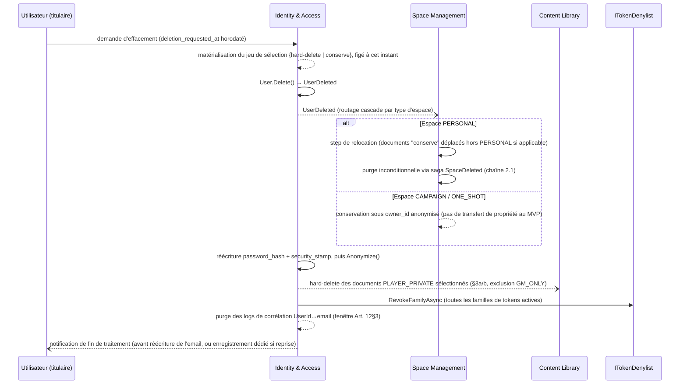

> Vue de consolidation inter-modules. Diagrammes de flux détaillés par module : [flows/identity-access.md](../conception/domain/diagrams/flows/identity-access.md), [flows/space-management.md](../conception/domain/diagrams/flows/space-management.md).

**Règles de gestion consolidées.** `User.Delete()` émet `UserDeleted` (identity-access.md § Invariants métier, invariant 3), consommé à la fois par Space Management pour le routage de cascade et par Content Library pour la règle F-08 — deux consommateurs d'un même événement, chacun appliquant sa propre conséquence. Le routage compose deux traitements strictement disjoints selon le type d'espace : `PERSONAL` réutilise **telle quelle** la saga `SpaceDeleted` détaillée en chaîne 2.1 (ADR-018 §Conséquences ; ADR-012 §2, dernière ligne du tableau ; ADR-011 §Exception PERSONAL) — ce n'est pas un mécanisme distinct, c'est le même déclenché par un autre événement ; `CAMPAIGN`/`ONE_SHOT` composent au contraire la conservation par défaut d'ADR-012 §Conséquences (UC-11) avec la confirmation de ce comportement MVP dans ADR-013 §6. L'ordre impératif de la saga `UserAnonymized` (ADR-011 §Saga `UserAnonymized`) est complété par ADR-012 §7, qui y ajoute la matérialisation du jeu de sélection à `deletion_requested_at` et un step de relocation obligatoire — ce dernier n'existe que parce que la purge inconditionnelle `PERSONAL` (chaîne 2.1) pourrait sinon détruire un document que ce jeu marque « conserve » s'il a été déplacé après la demande. La révocation des tokens actifs (`ITokenDenylist.RevokeFamilyAsync`, mécanisme défini par ADR-015 §3.6) est câblée comme étape de cette même saga par renvoi croisé explicite d'ADR-012 §Conséquences — sans ce câblage, la fenêtre résiduelle d'accès post-effacement serait bornée par la seule durée de l'access token. La purge des logs de corrélation (ADR-012 §5) s'exécute dans la fenêtre de traitement Art. 12§3 (ADR-012 §6).

La règle anti-résidu **F-08** n'est pas réinventée à quatre reprises : elle est portée une fois par le mécanisme (ADR-012 §4) et échoée dans le vocabulaire propre de chaque contexte qu'elle traverse — identity-access.md règle métier n°4, content-library.md règle métier n°10, session-conduct.md règle métier n°8, et l'exception RGPD à `SoftDelete` dans core.md. Ce dossier consolide la carte des quatre échos, pas leur contenu individuel (déjà propre à chaque source).

**`[À TRANCHER]` reporté** : voir le point de vigilance ci-dessus (divergence UC-10/identity-access.md sur le caractère bloquant de la suppression) — non tranché ici.

| Maillon | Source (fichier + section) | Rôle dans la chaîne |
|---|---|---|
| `User.Delete()` → `UserDeleted`, routage par type | identity-access.md § Invariants métier, invariant 3 | Déclencheur, point de bifurcation de la cascade |
| Routage `PERSONAL` → hard-delete inconditionnel | ADR-018 §Conséquences ; ADR-012 §2 (dernière ligne) ; ADR-011 §Exception PERSONAL | Réutilise la saga `SpaceDeleted` (chaîne 2.1) |
| Routage `CAMPAIGN`/`ONE_SHOT` → conservation anonymisée | ADR-012 §Conséquences (UC-11) ; ADR-013 §6 | Comportement MVP par défaut, sans transfert de propriété |
| Ordre impératif de la saga `UserAnonymized` | ADR-011 §Saga `UserAnonymized` ; ADR-012 §1 | Séquencement non modifiable sans rouvrir ADR-011 |
| Matérialisation du jeu de sélection + step de relocation | ADR-012 §7 ; requete-effacement-non-partage.md §2 | Ferme le TOCTOU entre demande et exécution |
| Révocation des tokens actifs | ADR-015 §3.6 ; ADR-012 §Conséquences | Ferme la fenêtre d'accès résiduel post-effacement |
| Purge des logs de corrélation | ADR-012 §5 | Bornée par la fenêtre Art. 12§3 (ADR-012 §6) |
| Règle F-08 anti-résidu (4 échos) | identity-access.md RM 4 ; content-library.md RM 10 ; session-conduct.md RM 8 ; core.md (exception `SoftDelete`) | Une seule garantie normative (ADR-012 §4), quatre reformulations contextuelles |

---

### 2.3 — Modèle d'autorisation composé P1 + P4 : non-divergence REST / SignalR

**Ancrage UC.** Accès aux ressources d'un espace — [UC-04](../conception/besoin/usecases/UC-04-gerer-documents-espace.md) (documents), [UC-06](../conception/besoin/usecases/UC-06-vue-session.md) (vue session), [UC-09](../conception/besoin/usecases/UC-09-acces-session-joueur.md) (accès joueur/invité), [UC-12](../conception/besoin/usecases/UC-12-consulter-espace-joueur.md) (vue joueur).

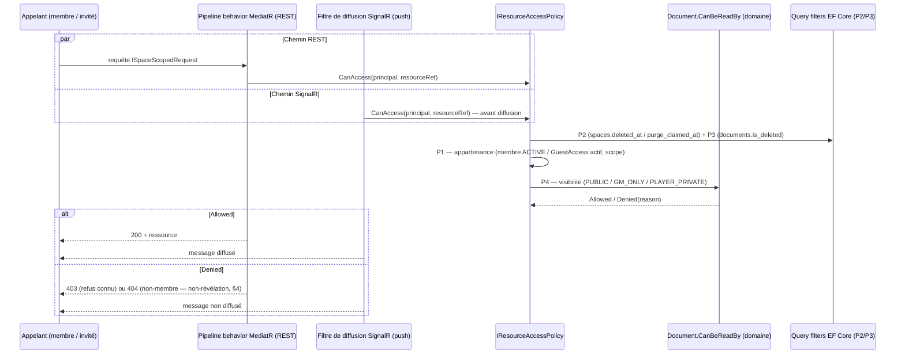

> Vue de consolidation inter-modules. Diagramme de flux détaillé : [flows/space-management.md](../conception/domain/diagrams/flows/space-management.md) (résolution `space_id`), [flows/content-library.md](../conception/domain/diagrams/flows/content-library.md) (visibilité document).

**Règles de gestion consolidées.** `IResourceAccessPolicy.CanAccess` (ADR-014 §3) est le point unique où se composent, en ET, le prédicat d'appartenance P1 (ADR-014 §1) et le prédicat de visibilité domaine P4 — ce dernier n'est pas re-spécifié par ADR-014 mais délégué à `Document.CanBeReadBy` (content-library.md invariant 6 / règle métier 3 ; session-conduct.md invariant 4) : masquer ce renvoi viderait la phrase d'ADR-014 sur `PLAYER_PRIVATE` auteur-seul de son contenu, puisque la règle elle-même vit dans le domaine. Les prédicats P2/P3, indépendants de l'appelant, sont portés par des query filters EF Core globaux (ADR-014 §2, câblage repris dans mapping-ef-core.md §5) — la même paire de filtres que celle qui garantit l'invisibilité de l'espace en corbeille dans la chaîne 2.1. La non-divergence entre REST et SignalR est le produit d'une composition en trois temps : ADR-007 §Compléments pose le principe (« l'invariant d'autorisation défini dans ADR-007 s'applique intégralement au canal SignalR ») avant que le transport ne soit choisi ; ADR-004 §Compléments l'instancie concrètement sur SignalR (filtrage par message, pas de diffusion par groupe indifférenciée, coupure sur révocation) ; ADR-014 §3/§6 le referme en un seul service partagé (`IResourceAccessPolicy`), point d'appel unique aux deux extrémités REST et SignalR. La sémantique 403/404 qui en résulte (contrat-openapi.md §2-§4) compose les huit scénarios déjà tranchés par ADR-014 §Conséquences avec une proposition dérivée du principe de non-révélation pour le seul scénario que l'ADR laisse ouvert.

**`[À TRANCHER — B1.10]` reporté** : le choix entre 403 et 404 pour un appelant non-membre accédant à une ressource d'un autre espace est explicitement laissé ouvert par ADR-014 §Conséquences (l.240) et renvoyé à B1.10 ; contrat-openapi.md §4 fournit une proposition dérivée du principe de non-révélation, non tranchée en décision produit.

| Maillon | Source (fichier + section) | Rôle dans la chaîne |
|---|---|---|
| Service unique `IResourceAccessPolicy.CanAccess` | ADR-014 §3 | Point de composition unique de P1 + P4 |
| P1 — appartenance | ADR-014 §1 | Prédicat couche Application, dépend de l'appelant |
| P4 — visibilité domaine (`CanBeReadBy`) | content-library.md invariant 6 / RM 3 ; session-conduct.md invariant 4 | Prédicat domaine, délégué et non redéfini par ADR-014 |
| P2/P3 — query filters globaux | ADR-014 §2 ; mapping-ef-core.md §5 | Prédicats structurels, indépendants de l'appelant (partagés avec la chaîne 2.1) |
| Invariant étendu au canal SignalR (principe puis instanciation) | ADR-007 §Compléments ; ADR-004 §Compléments | Pose puis instancie la non-divergence avant que le service partagé n'existe |
| Deux points d'appel, un seul service | ADR-014 §3, §6 | Ferme la non-divergence REST/SignalR structurellement |
| Sémantique 403/404, non-révélation, backlinks | contrat-openapi.md §2-§4 | Contrat API dérivé, partiellement tranché |

---

### 2.4 — Frontière local ↔ cloud : migration one-shot et contrat de sérialisation

**Ancrage UC.** [UC-01](../conception/besoin/usecases/UC-01-mode-local-sans-compte.md) (mode local) et [UC-10](../conception/besoin/usecases/UC-10-compte-cloud.md) (migration locale→cloud).

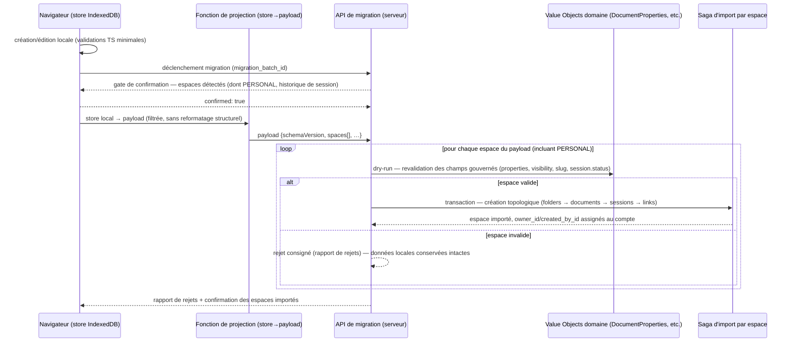

> Vue de consolidation inter-modules. Diagramme de flux détaillé : [flows/content-library.md](../conception/domain/diagrams/flows/content-library.md) (chemin d'écriture normal du domaine consommé par l'import).

**Règles de gestion consolidées.** Le principe fondateur — domaine serveur source de vérité unique, mode local limité à un CRUD TypeScript avec validations minimales, invariant « validation locale ⊆ validation serveur » (ADR-001 §Décision, §Compléments) — est ce qui contraint le store IndexedDB à une structure aggregate-rooted plutôt qu'un miroir relationnel (ADR-017 §1.1-1.2) : réimporter les contraintes FK côté client serait précisément ce qu'ADR-001 refuse. Cette structure aggregate-rooted est à son tour ce qui permet à la fonction de projection `store → payload` de rester sans reformatage structurel complexe, au filtre près qui écarte les sessions `LIVE`, `session_view_configs` et `session_view_folders` (ADR-016 §1.4 ; ADR-017 § Conséquences § Couture de projection filtrée, sans reformatage structurel) — les deux décisions se répondent, la seconde n'aurait pas de sens sans la première. Le contrat de payload versionné (enveloppe `schemaVersion`, ADR-016 §1.1) reste stable indépendamment de l'évolution du store grâce à cette même couture de projection. La frontière de confiance qui en découle — aucun champ d'autorité honoré depuis le payload (ADR-016 §2.1-2.2) — n'est fermée que par sa composition avec le mécanisme de revalidation : le chemin d'écriture normal du domaine, les mêmes Value Objects qui gouvernent `Document.SetProperties()` en écriture API ordinaire (ADR-002 §Décision, §Compléments), est réutilisé tel quel à l'import (ADR-016 §2.3) — sans second validateur dédié. Le parcours transactionnel par espace et l'ordre topologique de création (ADR-016 §3.1-3.2) sont explicitement posés comme le miroir de la passe 1 de la saga `SpaceDeleted` détaillée en chaîne 2.1 (« par analogie avec la passe 1 de la saga `SpaceDeleted` d'ADR-011 », ADR-016 §3.2) — la même mécanique de résolution de cycles nullable, appliquée en sens inverse. Le gate de confirmation anti-appropriation (ADR-016 §4) est la réponse posée à la reformulation du risque F-01 (ADR-016 §2.1) : une assignation de propriété à l'import, pas une preuve d'appartenance impossible en l'absence de compte préalable. La sanitisation XSS est un plancher symétrique — liste blanche positive, interdictions absolues identiques — décrit côté serveur par ADR-016 §2.4 et côté client par ADR-017 §4.1/§4.3 ; sanitisation-csp.md consolide les deux plutôt que de choisir un côté. Enfin, l'espace `PERSONAL` est inclus dans le périmètre sérialisé et soumis à la même transactionnalité par espace que tout autre espace (ADR-016 §1.2 ; ADR-018) — le même type d'espace qui traverse déjà les chaînes 2.1 et 2.2 traverse aussi la frontière local↔cloud sans traitement dérogatoire côté migration.

| Maillon | Source (fichier + section) | Rôle dans la chaîne |
|---|---|---|
| Principe fondateur — serveur source de vérité, `validation locale ⊆ validation serveur` | ADR-001 §Décision, §Compléments | Fondation qui contraint toute la chaîne |
| Store IndexedDB aggregate-rooted | ADR-017 §1.1-1.2 | Traduction structurelle du refus (ADR-001) de réimplémenter l'intégrité référentielle côté client |
| Projection `store → payload` filtrée, sans reformatage structurel | ADR-016 §1.4 ; ADR-017 §1.2 | Couture stable entre store interne et contrat de migration |
| Enveloppe `schemaVersion` | ADR-016 §1.1, §1.4 | Contrat versionné indépendant de l'évolution du store |
| Frontière de confiance + revalidation par les Value Objects | ADR-016 §2.1-2.3 ; ADR-002 §Décision (`DocumentProperties`/`SetProperties`) | Le payload ne fait autorité sur rien ; le chemin d'écriture normal du domaine revalide |
| Parcours transactionnel par espace + ordre topologique | ADR-016 §3.1-3.2 | Miroir explicite de la passe 1 de la saga `SpaceDeleted` (ADR-011, chaîne 2.1) |
| Gate de confirmation anti-appropriation | ADR-016 §2.1, §4 | Assignation de propriété à l'import, pas preuve d'appartenance |
| Sanitisation XSS client + serveur | ADR-016 §2.4 ; ADR-017 §4.1, §4.3 ; sanitisation-csp.md | Plancher symétrique liste blanche positive, deux côtés de la frontière |
| `PERSONAL` inclus dans le périmètre migré | ADR-016 §1.2 ; ADR-018 | Même traitement transactionnel que les espaces partagés ; même type traversant les chaînes 2.1/2.2 |

## 3 — Identity & Access

Ce module couvre trois use cases : [UC-01](../conception/besoin/usecases/UC-01-mode-local-sans-compte.md) (mode local — en creux, Identity & Access n'y intervient pas), [UC-10](../conception/besoin/usecases/UC-10-compte-cloud.md) (création de compte, connexion, opérations sensibles, effacement) et [UC-11](../conception/besoin/usecases/UC-11-gerer-membres-espace-partage.md) (dont la facette « conversion d'un invité en compte » touche Identity & Access côté création du `User`). Deux des flux ci-dessous (3.b, 3.c) sont inter-modules ou transverses : ils renvoient à leur composition complète en §2 plutôt que d'être re-dessinés.

### 3.1 — UC-01 : absence d'authentification en mode local

Le mode local n'a pas de `User` : « le mode local n'est pas un tier — il n'y a pas de `User` en mode local » (identity-access.md § Enums, note sous `AccountTier`). Cette absence compose avec deux autres points déjà établis ailleurs dans ce dossier : le principe ADR-001 selon lequel le serveur est la seule source de vérité et le mode local se limite à un CRUD TypeScript sans authentification (§2.4) ; et le fait que le conteneur par défaut local **est** l'espace `PERSONAL`, sans `ownerId` assigné tant qu'aucun compte n'existe (space-management.md invariant 14, note de lecture — repris en §1.3). Identity & Access ne porte donc aucune règle propre à UC-01 : son unique rapport à ce use case est de ne pas exister avant la création de compte (UC-10), point déjà développé dans la chaîne frontière local↔cloud (§2.4) — non redéveloppé ici.

### 3.2 — UC-10 : compte, opérations sensibles, cascade d'effacement

#### 3.a — Register / VerifyEmail et opérations sensibles (invariant 7)

**Ancrage UC.** [UC-10](../conception/besoin/usecases/UC-10-compte-cloud.md), scénarios nominaux « Inscription » et règle métier « Validation de l'adresse de messagerie » — la validation n'est pas bloquante à la connexion mais requise avant toute opération sensible (modification d'email, de mot de passe, liaison fédérée, demande d'effacement).

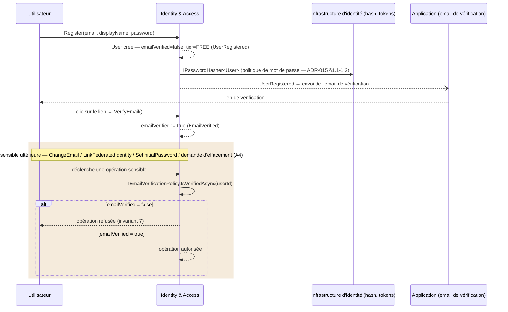

> Vue de consolidation. Diagramme de flux détaillé : [flows/identity-access.md](../conception/domain/diagrams/flows/identity-access.md).

**Règles de gestion consolidées.** L'invariant 7 (identity-access.md § Invariants métier) énumère les opérations sensibles soumises à `emailVerified = true` — `ChangeEmail()`, `LinkFederatedIdentity()`, `SetInitialPassword()`, `Delete()` — sans préciser de mécanisme d'application ; ADR-015 §2.1 referme ce vide en portant la contrainte derrière un contrat applicatif observable (`IEmailVerificationPolicy`), positionné et vérifiable par le test d'archi CI au même titre qu'`IResourceAccessPolicy` (ADR-014) — sans ce contrat, l'invariant domaine resterait une règle non opposable en CI. La délégation du mot de passe à l'infrastructure (identity-access.md règle métier 1 : « `User` ne le connaît pas ») est précisée par ADR-015 §1.1-1.2 — la politique de mot de passe (longueur minimale, désactivation des règles de complexité, algorithme de hachage et repli) y est posée ; ce dossier ne la recopie pas. Le cas `SetInitialPassword()` compose une exigence additionnelle à l'invariant 7 : la note de identity-access.md (« `emailVerified = true` est une précondition nécessaire mais pas suffisante ») trouve son complément dans ADR-015 §1.4 — une preuve d'identité alternative (ré-authentification IdP récente, fraîcheur renvoyée à B1.5, CWE-620) — composition sans laquelle un compte fédéré-only pourrait voir son mot de passe complémentaire défini par un tiers en session non ré-authentifiée.

**Renvoi API** : `contrat-openapi.md` ne consacre pas de section dédiée aux endpoints d'inscription / vérification d'email — seuls les endpoints adjacents `POST /auth/login` et `POST /auth/password-reset/*` figurent au tableau de rate limiting (`contrat-openapi.md` §5). Le contrat détaillé des endpoints d'inscription et de vérification (schémas, codes 400/401) reste `[À TRANCHER — B1.10]`, tel que la spec elle-même le signale (§4, « Récapitulatif »).

| Maillon | Source (fichier + section) | Rôle dans la chaîne |
|---|---|---|
| `Register()`/`VerifyEmail()`, invariant 7 (liste des opérations sensibles) | identity-access.md § Méthodes ; § Invariants métier, invariant 7 | Règle domaine — quelles opérations exigent `emailVerified` |
| Contrat applicatif observable `IEmailVerificationPolicy` | ADR-015 §2.1, §5 | Mécanisme d'application, vérifiable CI |
| Politique de mot de passe (longueur, complexité, hachage) | ADR-015 §1.1, §1.2 | Raffine la délégation domaine à l'infrastructure (RM 1) |
| `SetInitialPassword()` — preuve d'identité alternative (CWE-620) | identity-access.md invariant 7 (note) ; ADR-015 §1.4 | Précondition additionnelle propre à ce cas, au-delà de `emailVerified` |

#### 3.b — `ChangeTier` → gel/dégel Space Management (flux inter-module)

`User.ChangeTier(tier)` émet `AccountTierChanged` (identity-access.md § Méthodes ; règle métier 3 — la transition `PRO → FREE` est déclenchée par une notification du système de facturation via commande applicative). Côté Identity & Access, ce déclencheur ne fait rien d'autre que publier l'événement ; le gel des espaces excédentaires et le dégel réversible qu'il déclenche vivent entièrement côté Space Management et sont détaillés en **§4.c**, avec [UC-15](../conception/besoin/usecases/UC-15-gel-espaces-downgrade-tier.md) comme ancrage amont — non redéveloppés ici. Le cadrage tarifaire (seuils, prix) qu'on pourrait chercher du côté d'[ADR-005](../architecture/decisions/ADR-005-modele-monetisation.md) n'en est plus l'autorité : cet ADR porte, depuis son propre en-tête, la mention « décision produit — fusionnée … le 2026-06-10 » — les valeurs consolidées (quota FREE = 3 espaces) vivent désormais dans la vision produit et le CdC (UC-15 § Contexte le confirme explicitement), pas dans cet ADR.

#### 3.c — `Delete()` → `Anonymize()` : routage de cascade par type d'espace (flux transverse)

**Ancrage UC.** [UC-10](../conception/besoin/usecases/UC-10-compte-cloud.md) §A4 — « Suppression du compte (droit à l'effacement RGPD) ».

`User.Delete()` (identity-access.md invariant 3) est le déclencheur côté Identity & Access de la cascade d'effacement RGPD, dont le routage complet par type d'espace — y compris la réconciliation entre UC-10 §A4/§E4 (principe de blocage) et l'invariant 3 (routage par type : bloquant pour `CAMPAIGN`/`ONE_SHOT` à membre actif, jamais pour `PERSONAL`) — est développé en **§2.2**. Ce dossier n'y revient pas ; l'articulation est consolidée à l'endroit où elle est déjà posée.

#### 3.d — Liaison OAuth et *reclaim-in-place*

**Ancrage UC.** [UC-10](../conception/besoin/usecases/UC-10-compte-cloud.md), scénario nominal « Connexion via un fournisseur d'identité externe » — trois branches exhaustives selon RB-10-08 (adresse vérifiée / non vérifiée / aucun compte existant).

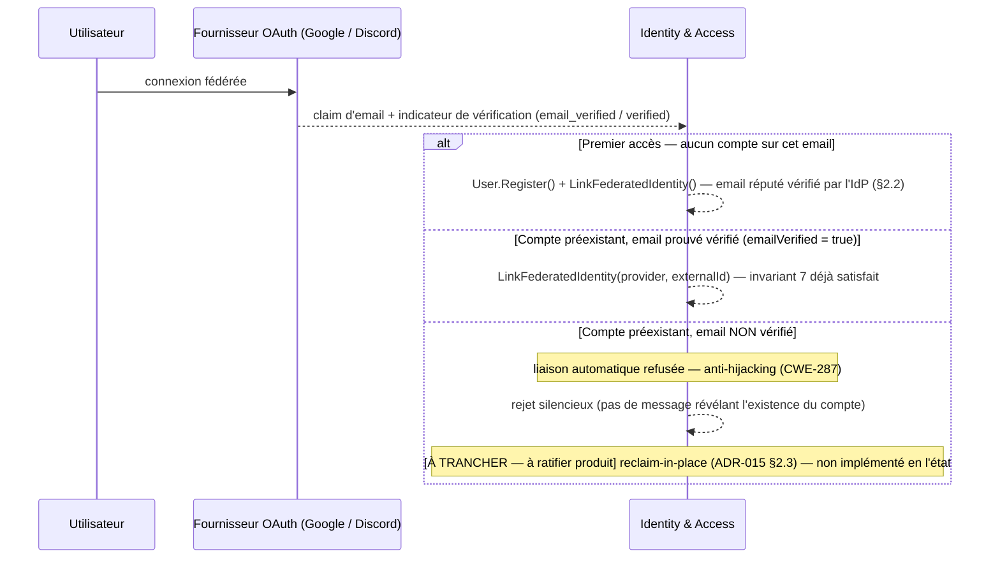

> Vue de consolidation. Diagramme de flux détaillé : [flows/identity-access.md](../conception/domain/diagrams/flows/identity-access.md).

**Règles de gestion consolidées.** `LinkFederatedIdentity()` (identity-access.md § Méthodes, invariant 7 : exige `emailVerified = true`) est le point d'ancrage domaine ; ADR-015 §2.2 le raffine par une règle de confiance généralisée par fournisseur (claim d'email vérifié jugé fiable + email canonique — condition satisfaite par Google et Discord au MVP, dette nommée pour un futur fournisseur à email de relais) et §2.3 pose la règle de liaison à un compte préexistant : autorisée seulement si l'email de ce compte est prouvé vérifié, matching par email canonique (RB-10-08), rejet silencieux sinon — cohérent avec le principe de non-révélation d'ADR-014 §Conséquences.

**`[À TRANCHER — à ratifier produit]` reporté** : la résolution du cas « email OAuth face à un compte préexistant non vérifié » — *reclaim-in-place*, ADR-015 §2.3 (bascule `emailVerified`, neutralisation obligatoire du credential préexistant, liaison fédérée) — est une proposition documentée, **non ratifiée**. Le « nouveau compte » évoqué ailleurs dans le corpus (RB-10-08 (b)) est explicitement écarté comme non implémentable (violerait l'invariant 1, email unique) mais la résolution de repli n'est pas tranchée. Non comblé ici.

**Renvoi API** : `contrat-openapi.md` §6 — « Liaison OAuth rejetée silencieusement » : aucun code ou corps de réponse distinctif ne doit permettre à l'appelant de déduire la cause du rejet ; le code HTTP exact reste `[À TRANCHER — B1.10]` (contrat-openapi.md §6, § Récapitulatif).

| Maillon | Source (fichier + section) | Rôle dans la chaîne |
|---|---|---|
| `LinkFederatedIdentity()`, invariant 7 | identity-access.md § Méthodes ; § Invariants métier | Ancrage domaine — la liaison exige `emailVerified` |
| Règle de confiance par fournisseur (email vérifié + canonique) | ADR-015 §2.2 | Condition d'éligibilité d'un fournisseur à la liaison |
| Règle de liaison à un compte préexistant + rejet silencieux | ADR-015 §2.3 ; UC-10 (RB-10-08) | Anti-hijacking CWE-287, cohérent non-révélation (ADR-014) |
| *Reclaim-in-place* — proposition non ratifiée | ADR-015 §2.3 (Résolution proposée) ; UC-10 RB-10-08(b) | `[À TRANCHER — à ratifier produit]` |
| Code HTTP du rejet silencieux | contrat-openapi.md §6 | `[À TRANCHER — B1.10]` |

### 3.3 — UC-11 (facette Identity & Access) : création de compte à la conversion d'un invité

Quand un invité sans compte crée un compte pour rejoindre une campagne de façon permanente, Identity & Access ne connaît que sa propre moitié du flux : `User.Register()` publie `UserRegistered` (identity-access.md § Note sur la conversion GuestAccess → User) ; la conversion du `GuestAccess` en `SpaceMembership` elle-même est une orchestration **applicative**, pas domaine — Identity & Access ne connaît pas `GuestAccess`. Cette moitié compose avec la garde-fou posée par ADR-014 §1 sur le statut `CONVERTED` : pendant la fenêtre entre la création de compte et l'activation du `SpaceMembership` par un `OWNER`/`GM`, l'appelant conserve le niveau d'accès `GuestAccess` d'origine — le saut de privilège vers `PLAYER` est interdit tant que l'activation explicite n'a pas eu lieu. La suite du flux côté Space Management (`GuestAccess.Convert()`, activation du membership) est détaillée en **§4.b** — non redéveloppée ici.

---

## 4 — Space Management

Ce module couvre cinq use cases : [UC-02](../conception/besoin/usecases/UC-02-creer-espace-jeu.md) (créer un espace), [UC-11](../conception/besoin/usecases/UC-11-gerer-membres-espace-partage.md) (gérer les membres), [UC-09](../conception/besoin/usecases/UC-09-acces-session-joueur.md) (accès invité `GuestAccess`), [UC-12](../conception/besoin/usecases/UC-12-consulter-espace-joueur.md) (vue joueur post-accès) et [UC-15](../conception/besoin/usecases/UC-15-gel-espaces-downgrade-tier.md) (gel/dégel au changement de tier — **Post-MVP (spécifiés)**, classement arbitré, voir `moscow.md` §UC-15). Deux des points ci-dessous (4.d, 4.e) sont transverses et renvoient à leur composition complète en §2.

### 4.1 — UC-02 : création d'espace et espace `PERSONAL` automatique

#### 4.a — `Space.Create` + création automatique de l'espace `PERSONAL` (invariant 14)

**Ancrage UC.** [UC-02](../conception/besoin/usecases/UC-02-creer-espace-jeu.md), scénario nominal (création de campagne / one-shot) ; l'espace `PERSONAL` **préexiste** et n'est pas créé via ce parcours (UC-02 § Contexte — Ontologie des types d'espace) — sa création automatique est ancrée sur la création de compte ([UC-10](../conception/besoin/usecases/UC-10-compte-cloud.md), traité en §3.a).

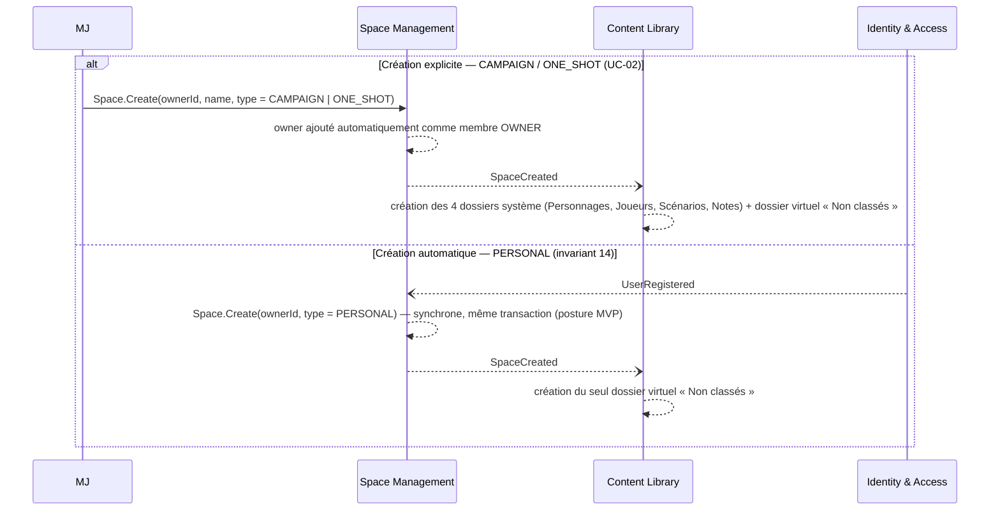

> Vue de consolidation. Diagrammes de flux détaillés : [flows/space-management.md](../conception/domain/diagrams/flows/space-management.md), [flows/content-library.md](../conception/domain/diagrams/flows/content-library.md).

**Règles de gestion consolidées.** `Space.Create()` (space-management.md § Space, méthode `Create()`) satisfait, pour les types `CAMPAIGN`/`ONE_SHOT`, le parcours décrit par UC-02 (nom obligatoire, quatre dossiers système créés à `SpaceCreated` — composition déjà posée en §1.3 avec content-library.md § Dossiers créés à `SpaceCreated`, non répétée ici). Pour le type `PERSONAL`, l'invariant 14 (space-management.md) compose un déclencheur applicatif synchrone sur `UserRegistered` (événement Identity & Access, §3.a) avec une garde d'agrégat distincte (invariant 15 : toujours `ACTIVE`, jamais archivable ni gelable) et une création de dossier restreinte au seul virtuel « Non classés » (§1.3) — la même mécanique de dossier système, appliquée à un espace structurellement hors quota. ADR-018 acte cette généralisation (Voie 3 retenue, § Décision) ; ce dossier n'en reprend pas l'analyse d'impact invariant par invariant, déjà propre à cet ADR — seule la composition UC-02/invariant 14/dossiers est portée ici.

**`[À TRANCHER]` reporté** : l'activation de l'espace `PERSONAL` comme zone d'atterrissage par défaut en **mode local** (sans `ownerId` assigné) reste une recommandation non validée — ADR-018 § Points à trancher : sa validation explicite reste requise avant d'engager `UC-01` et `UC-02`. Non comblé ici.

**Renvoi API** : `contrat-openapi.md` ne consacre pas de section aux endpoints d'écriture (création d'espace) — la spec elle-même signale que « la liste exhaustive et littérale des endpoints … n'est pas fixée par ADR-014 ni ADR-015 » (§4) et renvoie ce point à `[À TRANCHER — B1.10]`. Seule l'annotation de sécurité de traçabilité du pipeline behavior (contrat-openapi.md §7) s'applique structurellement à tout endpoint scopé à un espace, y compris la création.

| Maillon | Source (fichier + section) | Rôle dans la chaîne |
|---|---|---|
| `Space.Create()`, dossiers système (CAMPAIGN/ONE_SHOT) | space-management.md § Space, méthode `Create()` ; UC-02 scénario nominal | Parcours explicite, ancré UC |
| Dossiers créés à `SpaceCreated`, conditionnels au type | content-library.md § Dossiers créés à `SpaceCreated` (déjà composé en §1.3) | Renvoi, non répété |
| Invariant 14 — création automatique `PERSONAL` sur `UserRegistered` | space-management.md § Invariants métier, invariant 14 | Déclencheur applicatif synchrone, cross Identity & Access |
| Invariant 15 — garde d'agrégat `PERSONAL` (toujours `ACTIVE`) | space-management.md § Invariants métier, invariant 15 | Empêche archivage/gel de l'espace personnel |
| Voie retenue (généralisation `Space`) | ADR-018 § Décision (Voie 3) | Justifie l'existence du type `PERSONAL`, non redéveloppé |
| Activation en mode local — non validée | ADR-018 § Points à trancher | `[À TRANCHER]` reporté |

### 4.2 — UC-11 / UC-09 : cycle d'invitation, `GuestAccess`, conversion en membre

#### 4.b — Cycle Invitation / `GuestAccess` + conversion invité → membre (F-07, statut `CONVERTED`)

**Ancrage UC.** [UC-11](../conception/besoin/usecases/UC-11-gerer-membres-espace-partage.md) (génération et administration des accès côté MJ — propriétaire unique des données `Invitation`/`SpaceMembership`) ; [UC-09](../conception/besoin/usecases/UC-09-acces-session-joueur.md) (octroi d'accès côté joueur, propriétaire du cycle de vie `GuestAccess`).

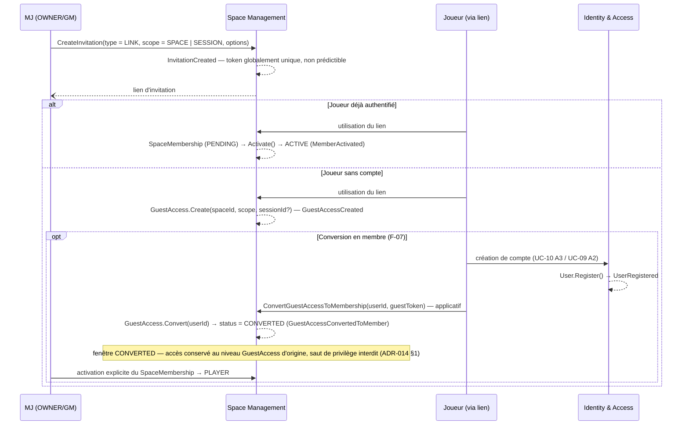

> Vue de consolidation. Diagrammes de flux détaillés : [flows/space-management.md](../conception/domain/diagrams/flows/space-management.md), [flows/identity-access.md](../conception/domain/diagrams/flows/identity-access.md).

**Règles de gestion consolidées.** UC-11 fixe le vocabulaire de périmètre — `scope SPACE` (accès durable) / `scope SESSION` (accès temporaire), qui remplace et subsume l'ancienne notion de type d'accès permanent/temporaire (UC-11 § Données manipulées) — que space-management.md instancie dans l'entité `Invitation` (§ Invitation, champ `scope`). Le statut `CONVERTED` (ADR-014 §1) referme le trou de privilège que la simple création de `SpaceMembership` laisserait ouvert : sans cette composition, un compte fraîchement créé depuis un `GuestAccess` scope `SESSION` hériterait potentiellement du rôle `PLAYER` avant toute activation par le MJ — ADR-014 §1 l'exclut explicitement (« le saut de privilège est interdit »). Le sort RGPD des données invitées (`display_name`, notes `PLAYER_PRIVATE`) à la fin définitive d'un accès non converti compose la règle métier 9/10 de space-management.md avec la base légale et la fenêtre de rétention de 90 jours d'ADR-013 §3 — sans compte créé avant la fin de l'accès, les notes de l'invité sont supprimées physiquement (UC-11 règle métier, RB-09-19/22), non récupérées par un futur invité réassocié au même personnage.

**Renvoi API** : `contrat-openapi.md` §5 — `POST /auth/validate-token (GuestAccess)`, rate limiting contre l'énumération de tokens (F-06 original).

| Maillon | Source (fichier + section) | Rôle dans la chaîne |
|---|---|---|
| `CreateInvitation()`, scope `SPACE`/`SESSION` | space-management.md § Invitation ; UC-11 § Données manipulées | Vocabulaire de périmètre, propriétaire UC-11 |
| `GuestAccess.Create()`/`Convert()` | space-management.md § GuestAccess ; UC-09 § Ownership `GuestAccess` | Cycle de vie invité, propriétaire UC-09 |
| Statut `CONVERTED` — pas de saut de privilège | ADR-014 §1 | Ferme le trou de privilège de la conversion |
| Notes `PLAYER_PRIVATE` invité non converti — suppression physique | space-management.md règle métier 9, 10 ; ADR-013 §3 ; UC-11 (RB-09-19/22) | Composition RGPD — base légale + délai + suppression |
| Rate limiting validation de token invité | contrat-openapi.md §5 | Endpoint directement concerné |

### 4.3 — UC-15 : gel et dégel au changement de tier

#### 4.c — `Freeze()` / `Unfreeze()` (règles 6/11)

**Ancrage UC.** [UC-15](../conception/besoin/usecases/UC-15-gel-espaces-downgrade-tier.md) — le use case se déclare lui-même **amont source-de-vérité** de ce comportement, le domaine (règles 6/11) en étant l'aval documenté (UC-15 § Note de positionnement d'autorité). UC-15 est classé **Post-MVP (spécifiés)** — hors catégorisation MoSCoW du MVP, classement arbitré par `moscow.md` §UC-15, seule autorité du corpus pour ce classement — statut à distinguer de son ancrage fonctionnel ci-dessus, qui reste valide indépendamment de la priorisation.

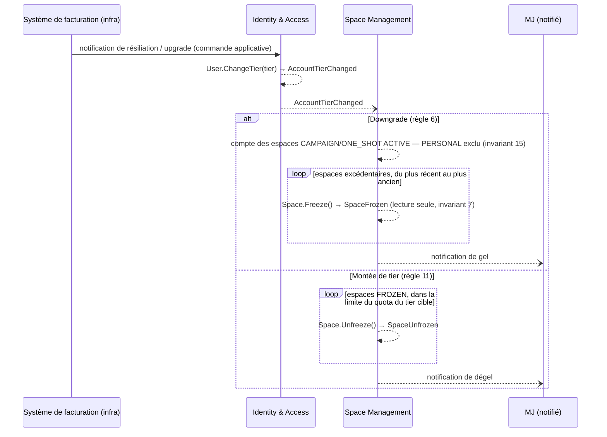

> Vue de consolidation. Diagramme de flux détaillé : [flows/space-management.md](../conception/domain/diagrams/flows/space-management.md).

**Règles de gestion consolidées.** UC-15 ratifie la règle 6 (gel des espaces excédentaires, ordre du plus récent au plus ancien, espace `PERSONAL` jamais compté — invariant 15) et la règle 11 (dégel dans la limite du quota du tier cible, garde exprimée relativement plutôt qu'inconditionnellement pour rester correcte si un tier intermédiaire est introduit). Le quota chiffré lui-même n'est ni fixé ni répété ici : UC-15 § Contexte renvoie explicitement à « vision-produit.md §3 / cahier-des-charges.md §12.4 (quota consolidé, valeur volatile) » et signale qu'[ADR-005](../architecture/decisions/ADR-005-modele-monetisation.md) n'en est plus l'autorité — cet ADR porte lui-même la mention « décision produit — fusionnée … 2026-06-10 » en en-tête. Recopier la valeur ici violerait la discipline de fidélité de consolidation (borne normative non recopiée comme propre à ce dossier).

**`[À TRANCHER — ordre de dégel multi-tier]` reporté** : l'ordre de dégel lorsque le quota du tier cible est borné et inférieur au nombre d'espaces `FROZEN` (cas d'un futur tier intermédiaire) « n'est pas fixé au MVP » (space-management.md règle métier 11) — non pertinent tant que le tier reste binaire (PRO illimité), non comblé ici.

| Maillon | Source (fichier + section) | Rôle dans la chaîne |
|---|---|---|
| `AccountTierChanged` — déclencheur | identity-access.md § Événements domaine ; règle métier 3 | Origine Identity & Access du gel/dégel (renvoi §3.b) |
| Règle 6 — gel des espaces excédentaires | space-management.md règle métier 6 ; UC-15 scénario « Gel au downgrade » | Ancrage UC amont, domaine en aval |
| Règle 11 — dégel dans la limite du quota cible | space-management.md règle métier 11 ; UC-15 scénario « Dégel au ré-upgrade » | Ancrage UC amont, domaine en aval |
| Invariant 15 — `PERSONAL` jamais compté, jamais gelé | space-management.md § Invariants métier, invariant 15 | Exclusion structurelle du quota |
| Quota chiffré — autorité déplacée | UC-15 § Contexte ; ADR-005 (statut « fusionnée ») | Valeur non reprise ici (discipline de fidélité de consolidation) |
| Ordre de dégel multi-tier | space-management.md règle métier 11 | `[À TRANCHER]` reporté |

### 4.4 — Suppression d'espace (flux transverse)

#### 4.d — `Space.Delete()` → `SpaceDeleted`

Space Management est la **racine** de la cascade RGPD de suppression d'espace : `Space.Delete()` (space-management.md § Space, méthode `Delete()`) émet l'événement qui déclenche l'ensemble de la saga développée en **§2.1**. L'ancrage UC de ce flux reste l'angle mort déjà signalé en §2.1 — [UC-02](../conception/besoin/usecases/UC-02-creer-espace-jeu.md) couvre le cycle de création/archivage mais s'arrête avant la suppression express, et le droit du propriétaire à supprimer son espace est posé directement par ADR-010 sans UC porteur explicite. Ce point n'est pas re-tranché ici. Le diagramme, les règles de gestion et le tableau des maillons sont entièrement portés par §2.1 — non redessinés.

### 4.5 — Modèle du principal et appartenance P1 (flux transverse)

#### 4.e — Modèle du principal et appartenance

**Ancrage UC.** [UC-04](../conception/besoin/usecases/UC-04-gerer-documents-espace.md), [UC-06](../conception/besoin/usecases/UC-06-vue-session.md), [UC-09](../conception/besoin/usecases/UC-09-acces-session-joueur.md), [UC-12](../conception/besoin/usecases/UC-12-consulter-espace-joueur.md).

Côté Space Management, le prédicat d'appartenance P1 (membre `ACTIVE` ou `GuestAccess` actif dont le scope inclut la ressource) se lit directement dans les données que ce module possède — `space_memberships`, `guest_accesses` — et la matrice ressource → règle d'appartenance (ADR-014 §4) n'est pas re-détaillée ici : elle est composée avec le prédicat de visibilité domaine P4 (Content Library) dans le service unique `IResourceAccessPolicy`, dont la composition complète (modèle du principal, service centralisé, non-divergence REST/SignalR) est développée en **§2.3**. Ce paragraphe n'en pose que le point d'ancrage côté Space Management, sans redessiner le diagramme ni reproduire le tableau des maillons.

## 5 — Content Library

Ce module couvre cinq use cases : [UC-03](../conception/besoin/usecases/UC-03-structurer-scenario.md) (structurer un scénario), [UC-04](../conception/besoin/usecases/UC-04-gerer-documents-espace.md) (gérer les documents), [UC-05](../conception/besoin/usecases/UC-05-organiser-dossiers.md) (organiser par dossiers), [UC-13](../conception/besoin/usecases/UC-13-scenario-reutilisable.md) (scénario réutilisable) et [UC-14](../conception/besoin/usecases/UC-14-recherche.md) (recherche). Un volet du point 5.e (visibilité domaine `Document.CanBeReadBy`, P4) est transverse et renvoie à sa composition complète en §2.3.

### 5.1 — UC-03 / UC-04 : cycle de vie du `Document`

#### 5.a — CRUD `Document` + `DocumentLink` / backlinks calculés

**Ancrage UC.** [UC-04](../conception/besoin/usecases/UC-04-gerer-documents-espace.md), scénario nominal (titre, type optionnel, propriétés structurées, blocs, visibilité, documents liés) ; [UC-03](../conception/besoin/usecases/UC-03-structurer-scenario.md), scénario nominal (étapes 6-8 — scènes représentées par des documents `SCENE` liés) et A2/A3 (ajout d'éléments liés existants / création d'un élément depuis le scénario).

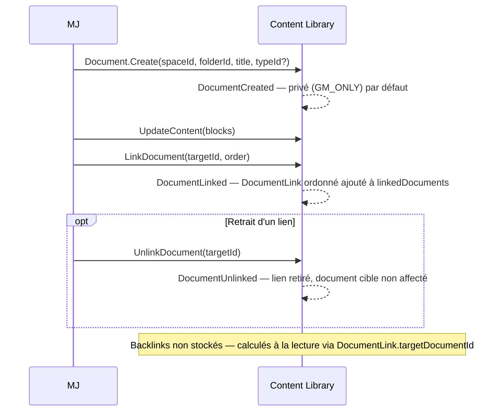

> Vue de consolidation. Diagramme de flux détaillé : [flows/content-library.md](../conception/domain/diagrams/flows/content-library.md).

**Règles de gestion consolidées.** Le cycle `Create()`/`UpdateContent()`/`LinkDocument()`/`UnlinkDocument()` (content-library.md § Document, méthodes) instancie ce que UC-04 décrit dans son scénario nominal et ce que UC-03 détaille pour le cas particulier de la structuration en scènes — le même mécanisme `DocumentLink` porte les deux usages, sans entité distincte pour la hiérarchie Scénario → Scènes (content-library.md § Principe fondamental). La règle métier 11 referme ce que UC-03 A2/A3 laisse ouvert sur le partage d'une scène entre plusieurs scénarios : cardinalité n↔n sans contrainte d'unicité sur `targetDocumentId`, « lier un document existant » étant le seul chemin qui atteint ce partage — « ajouter une scène » crée toujours une scène fraîche possédée (create+link). Les backlinks ne sont pas stockés — calculés à la lecture via `DocumentLink.targetDocumentId` (règle métier 6) — et cette absence de table dédiée est ce qui rend la garantie de non-fuite d'existence dépendante d'un filtrage à la lecture plutôt que d'une donnée à sécuriser : contrat-openapi.md §3.2 compose cette absence avec `IResourceAccessPolicy`/`CanBeReadBy` (ADR-014 §3) pour exclure de la liste retournée tout document source non lisible par l'appelant — sans cette composition, un backlink calculé exposerait à son insu l'existence d'un document `PLAYER_PRIVATE`.

**Renvoi API** : contrat-openapi.md §2 (scénarios 5-8 — visibilité document) et §3.2 (exclusion silencieuse des backlinks non lisibles). La liste exhaustive et littérale des endpoints CRUD document reste `[À TRANCHER — B1.10]` (contrat-openapi.md §4, « Récapitulatif »).

| Maillon | Source (fichier + section) | Rôle dans la chaîne |
|---|---|---|
| `Document.Create/UpdateContent/LinkDocument/UnlinkDocument` | content-library.md § Document, méthodes | Cycle CRUD, ancré UC-03/UC-04 |
| Partage multi-parent d'une scène (n↔n) | content-library.md règle métier 11 ; UC-03 A2, A3 | Referme le partage laissé ouvert par UC-03 |
| Backlinks calculés, non stockés | content-library.md règle métier 6 | Pas de table dédiée |
| Exclusion des backlinks non lisibles | contrat-openapi.md §3.2 ; ADR-014 §3 | Ferme la fuite d'existence par backlink |

---

### 5.2 — UC-04 / UC-08 : partage permanent d'un document

#### 5.b — `Share()` / `Unshare()` (visibilité permanente)

**Ancrage UC.** [UC-04](../conception/besoin/usecases/UC-04-gerer-documents-espace.md) A4 — « changement de visibilité », qui renvoie explicitement le détail à UC-08 ; [UC-08](../conception/besoin/usecases/UC-08-partager-information.md), scénario nominal et arbitrage de granularité.

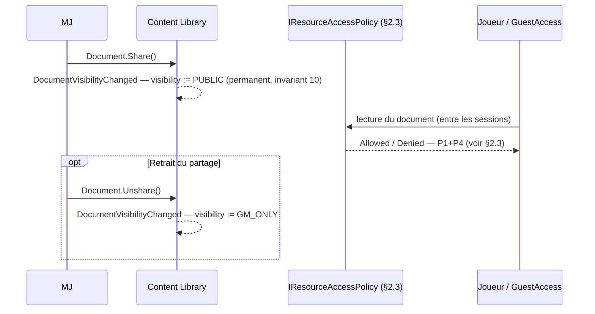

> Vue de consolidation. Diagramme de flux détaillé : [flows/content-library.md](../conception/domain/diagrams/flows/content-library.md). L'évaluation P1+P4 de l'accès n'est pas redessinée ici — voir §2.3.

**Règles de gestion consolidées.** `Document.Share()`/`Unshare()` (content-library.md § Document, méthodes) opèrent un changement de visibilité permanent — invariant 10 : « la visibilité PUBLIC est permanente jusqu'à `Unshare()` explicite ». UC-04 A4 ne détaille pas ce mécanisme et renvoie explicitement à UC-08 ; UC-08 précise ce que l'invariant pose sans le motiver : le partage est **par document**, jamais sélectif par joueur ou personnage (arbitrage du 2026-06-10, granularité fine reportée post-MVP), et il reste distinct de l'épinglage de session — retirer le partage d'un document épinglé ne le désépingle pas (UC-08 règle métier). Le cas du type `REVEAL` (règle métier 8) compose la même mécanique avec un défaut différent : créé `GM_ONLY`, il ne passe à `PUBLIC` que par une action explicite du MJ en session — jamais par défaut. Une fois `PUBLIC`, la lecture effective par un joueur ou un invité reste conditionnée à la composition P1+P4 détaillée en §2.3 — le passage à `PUBLIC` ouvre le prédicat de visibilité domaine, il ne dispense pas de l'appartenance à l'espace.

| Maillon | Source (fichier + section) | Rôle dans la chaîne |
|---|---|---|
| `Document.Share()`/`Unshare()`, permanence | content-library.md § Document, méthodes ; invariant 10 | Mécanisme domaine |
| Partage par document, granularité reportée post-MVP | UC-08 règle métier ; § Arbitrage — Granularité du partage (2026-06-10) | Détaille l'invariant, renvoyé par UC-04 A4 |
| `REVEAL` — défaut `GM_ONLY`, passage `PUBLIC` explicite | content-library.md règle métier 8 | Cas particulier de la même mécanique |
| Lecture effective d'un document `PUBLIC` | §2.3 (P1+P4) | Renvoi — non redessiné |

---

### 5.3 — UC-13 : réutilisabilité (template → instance)

#### 5.c — `Instantiate` (template → instance indépendante)

**Ancrage UC.** [UC-13](../conception/besoin/usecases/UC-13-scenario-reutilisable.md), scénario nominal (« rejouer un scénario depuis la bibliothèque ») et A1 (« marquer un scénario comme réutilisable »).

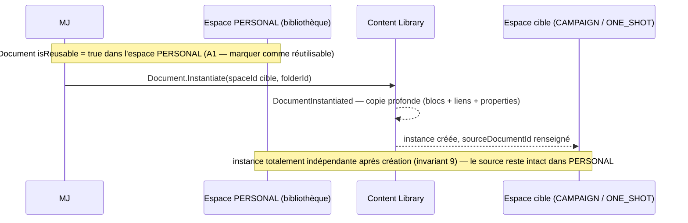

> Vue de consolidation. Diagramme de flux détaillé : [flows/content-library.md](../conception/domain/diagrams/flows/content-library.md).

**Règles de gestion consolidées.** `Document.Instantiate(spaceId, folderId)` (content-library.md § Document, méthodes) crée une copie indépendante d'un document `isReusable = true` (invariant 8 — un document non réutilisable ne peut pas être instancié ; invariant 9 — l'instance est totalement indépendante de son source après création). UC-13 instancie ce mécanisme dans son scénario nominal et son A1 — la bibliothèque personnelle n'est pas une entité de pont dédiée : [ADR-018](../architecture/decisions/ADR-018-espace-personnel-generalisation-space.md) § Conséquences — ScenarioLibrary, UC-13, UC-F07 (subsumés) compose avec la note dédiée de content-library.md (« il n'existe pas d'agrégat de pont `ScenarioLibrary`/`ScenarioLibraryEntry` — subsumé, ADR-018 ») pour établir que la bibliothèque **est** l'espace `PERSONAL` du MJ filtré sur `isReusable = true`, pas une structure distincte — sans cette composition, UC-13 A1 (« déplacer ou copier vers l'espace personnel ») resterait un geste sans ancrage domaine explicite. Cette composition dérive exclusivement de l'état courant : ADR-018 signale lui-même, dans ses compléments post-revue, que ses propres renvois à `campaign-management.md` (dans son § Conséquences, sous-section ScenarioLibrary) sont antérieurs au renommage et périmés — ce dossier ne les reprend pas.

| Maillon | Source (fichier + section) | Rôle dans la chaîne |
|---|---|---|
| `Document.Instantiate()`, invariants 8-9 | content-library.md § Document, méthodes ; § Invariants métier | Mécanisme domaine — copie indépendante |
| Scénario nominal / A1 — marquer réutilisable | UC-13, scénario nominal ; A1 | Ancrage UC |
| Subsomption `ScenarioLibrary` → vue `PERSONAL` | ADR-018 § Conséquences — ScenarioLibrary, UC-13, UC-F07 (subsumés) ; content-library.md § Note sur la ScenarioLibrary | Pas d'agrégat de pont — la bibliothèque est l'espace `PERSONAL` |
| Piège renvois périmés `campaign-management.md` | ADR-018, compléments post-revue | Dérive de l'état courant uniquement |

---

### 5.4 — UC-05 : dossiers système conditionnels au type d'espace

#### 5.d — Dossiers système conditionnels au type d'espace

**Ancrage UC.** [UC-05](../conception/besoin/usecases/UC-05-organiser-dossiers.md) A6 — « dossiers créés à la création d'un espace `CAMPAIGN` ou `ONE_SHOT` », et son complément sur l'espace `PERSONAL`.

```mermaid
sequenceDiagram
    participant SM as Space Management
    participant CL as Content Library

    SM--)CL: SpaceCreated(spaceId, type)

    alt type = CAMPAIGN | ONE_SHOT
        loop 4 dossiers système nommés
            CL-->>CL: Folder.Create() — isSystem = true, isVirtual = false (Personnages, Joueurs, Scénarios, Notes)
        end
        CL-->>CL: Folder.Create() — isVirtual = true, isSystem = true (« Non classés »)
    else type = PERSONAL
        CL-->>CL: Folder.Create() — isVirtual = true, isSystem = true (« Non classés » — seul dossier créé)
        Note over CL: pas de dossiers « Personnages »/« Joueurs » — sans objet sur un espace mono-membre
    end

    Note over CL: isSystem est informatif — renommable/supprimable par le MJ ; isVirtual garantit Document.folderId non-nullable pour tout type d'espace (invariant 4)
```

> Vue de consolidation. Diagramme de flux détaillé : [flows/content-library.md](../conception/domain/diagrams/flows/content-library.md).

**Règles de gestion consolidées.** La règle, déjà annoncée en §1.3, compose content-library.md § Dossiers créés à `SpaceCreated` (quatre dossiers système nommés — Personnages, Joueurs, Scénarios, Notes — plus le dossier virtuel « Non classés » pour `CAMPAIGN`/`ONE_SHOT` ; le seul dossier virtuel pour `PERSONAL`) avec [ADR-018](../architecture/decisions/ADR-018-espace-personnel-generalisation-space.md) § Décision (Voie 3 : « l'espace personnel démarre sans dossiers nommés : les concepts Joueurs et Personnages n'ont pas de sens dans un espace mono-membre ») pour motiver *pourquoi* la conditionnalité existe, pas seulement *ce qu'elle produit* — sans cette composition, la restriction à un seul dossier virtuel pour `PERSONAL` lirait comme une simplification arbitraire plutôt que la conséquence directe du caractère mono-membre de l'espace personnel. L'invariant 4 (dossier virtuel unique par espace, garantissant `folderId` non-nullable) reste valide pour tous les types d'espace sans exception — c'est le seul élément que la conditionnalité ne fait pas varier. UC-05 A6 instancie ce même comportement côté use case, avec un vocabulaire strictement aligné.

| Maillon | Source (fichier + section) | Rôle dans la chaîne |
|---|---|---|
| 4 dossiers système nommés (CAMPAIGN/ONE_SHOT) | content-library.md § Dossiers créés à `SpaceCreated` ; UC-05 A6 | Point de départ renommable/supprimable |
| Seul dossier virtuel « Non classés » (PERSONAL) | content-library.md § Dossiers créés à `SpaceCreated` ; ADR-018 § Décision (Voie 3) | Motivé par le caractère mono-membre |
| Invariant 4 — dossier virtuel unique, `folderId` non-nullable | content-library.md § Invariants métier, invariant 4 | Invariant à part, valide pour tout type d'espace |

---

### 5.5 — UC-04 / UC-14 : gouvernance de `properties` et visibilité domaine (P4)

#### 5.e — `DocumentProperties` gouverné + `Document.CanBeReadBy` (P4)

**Ancrage UC.** [UC-04](../conception/besoin/usecases/UC-04-gerer-documents-espace.md), scénario nominal (propriétés structurées, visibilité) ; [UC-14](../conception/besoin/usecases/UC-14-recherche.md), règles métier (filtrage par visibilité, résultats titre-seul).

La gouvernance du champ `properties` — value object `DocumentProperties`, deux régimes de validation selon que le type est système figé ou custom/modifié — est déjà composée en **§1.2** ([ADR-002](../architecture/decisions/ADR-002-tout-est-document-gouvernance.md) + `specs/document-properties-schemas.md`) ; ce paragraphe ne la redéveloppe pas. `Document.CanBeReadBy` (P4) est le prédicat de visibilité domaine composé avec P1 dans `IResourceAccessPolicy` — sa composition complète (REST/SignalR, non-divergence) est développée en **§2.3** ; ce paragraphe n'en pose que l'ancrage Content Library, sans redessiner le diagramme ni reproduire le tableau des maillons.

**Règles de gestion consolidées.** UC-14 compose deux limites distinctes qui, sans leur source respective, resteraient des observations isolées. La restriction de la recherche joueur aux seuls éléments visibles par ce joueur (UC-14 règle métier) est une instance du même prédicat P4 composé en §2.3 — la recherche n'est pas un chemin de lecture dérogatoire. Le fait que l'extrait de résultat reste « non indexé pour la recherche MVP » (UC-14 § Données manipulées) est la conséquence directe du choix acté par ADR-002 § Conséquences (« la recherche full-text sur `properties` n'est pas indexée au MVP — la recherche reste titre-seul », finding CR-5) — sans cette composition, la limite « titre-seul » lirait comme une omission d'implémentation plutôt que la conséquence d'un choix de gouvernance déjà tranché en §1.2.

**`[À TRANCHER — modélisation domaine]` reporté** : six des huit types système seedés (`scene`, `npc`, `location`, `note`, `player_character`, `reveal`) n'ont pas de champs de `propertiesSchema` modélisés par le domaine — seuls `scenario` (`scenarioStatus`) et `live_note` (absence actée, aucun champ structuré) font l'objet d'une section dédiée dans content-library.md. `specs/document-properties-schemas.md` §5 le signale fidèlement type par type ; ce dossier ne comble aucun de ces six trous.

**Renvoi API** : contrat-openapi.md ne consacre pas de section aux endpoints de propriétés structurées ni de recherche — hors périmètre codes HTTP de cette spec ; la liste exhaustive des endpoints reste `[À TRANCHER — B1.10]` (contrat-openapi.md §4, « Récapitulatif »).

| Maillon | Source (fichier + section) | Rôle dans la chaîne |
|---|---|---|
| Gouvernance `DocumentProperties`, deux régimes | §1.2 ([ADR-002](../architecture/decisions/ADR-002-tout-est-document-gouvernance.md) ; `specs/document-properties-schemas.md`) | Renvoi, non redéveloppé |
| `Document.CanBeReadBy` (P4) | §2.3 | Renvoi transverse, non redessiné |
| Recherche joueur filtrée par visibilité | UC-14 règle métier ; §2.3 (P4) | Instance du même prédicat, pas un chemin dérogatoire |
| Recherche titre-seul (`properties` non indexées) | UC-14 § Données manipulées ; ADR-002 § Conséquences (finding CR-5) | Conséquence de la gouvernance §1.2 |
| 6 types système sans `propertiesSchema` modélisé | `specs/document-properties-schemas.md` §5 ; content-library.md (absence de section dédiée) | `[À TRANCHER — modélisation domaine]` reporté |

## 6 — Session Conduct

Ce module couvre cinq use cases : [UC-06](../conception/besoin/usecases/UC-06-vue-session.md) (vue session), [UC-07](../conception/besoin/usecases/UC-07-creation-volee-session.md) (création à la volée), [UC-08](../conception/besoin/usecases/UC-08-partager-information.md) (partage), [UC-09](../conception/besoin/usecases/UC-09-acces-session-joueur.md) (temps réel joueur) et [UC-12](../conception/besoin/usecases/UC-12-consulter-espace-joueur.md) (vue joueur). Le point 6.d est transverse et renvoie à sa composition complète en §2.3, avec un renvoi complémentaire à §7 pour le transport temps réel.

### 6.1 — UC-06 : machine d'états de session

#### 6.a — Machine d'états de session `LIVE → CLOSED → ARCHIVED`

**Ancrage UC.** [UC-06](../conception/besoin/usecases/UC-06-vue-session.md), Phase 1 — lancement de la session ; Phase 4 — fermeture ; E3 — accès à une session non `LIVE`.

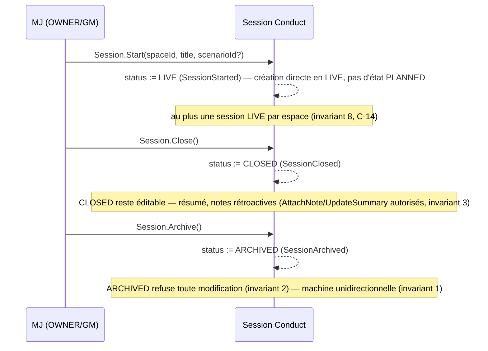

> Vue de consolidation. Diagramme de flux détaillé : [flows/session-conduct.md](../conception/domain/diagrams/flows/session-conduct.md).

**Règles de gestion consolidées.** La machine d'états `LIVE → CLOSED → ARCHIVED` (session-conduct.md § Machine d'états de Session ; invariant 1 — unidirectionnelle) instancie ce que UC-06 Phase 1 pose comme point de départ (« le système crée la session directement en statut LIVE » — pas d'état `PLANNED`) et ce que UC-06 E3 détaille comme conséquence observable pour le MJ : une session `CLOSED` reste éditable (résumé, notes rétroactives — invariant 3) tandis qu'une session `ARCHIVED` refuse toute modification (invariant 2) — sans cette composition, UC-06 E3 lirait comme deux comportements ad hoc plutôt que la même garde d'agrégat appliquée à deux états distincts. L'invariant 8 (une seule session `LIVE` par espace, C-14) n'est pas développé par UC-06 lui-même — il ferme un cas que le scénario nominal ne couvre pas.

| Maillon | Source (fichier + section) | Rôle dans la chaîne |
|---|---|---|
| Machine d'états, invariant 1 | session-conduct.md § Machine d'états de Session ; § Invariants métier, invariant 1 | Ancrage domaine |
| Création directe en `LIVE`, pas d'état `PLANNED` | session-conduct.md § Machine d'états de Session, note ; UC-06 Phase 1 | Point de départ ancré UC |
| `CLOSED` éditable, `ARCHIVED` lecture seule | session-conduct.md invariants 2, 3 ; UC-06 E3 | Détaille la conséquence observable |
| Une seule session `LIVE` par espace | session-conduct.md invariant 8 (C-14) | Ferme un cas non couvert par UC-06 |

---

### 6.2 — UC-07 : création à la volée — routage `PinDocument`/`AttachNote`

#### 6.b — `PinDocument` vs `AttachNote` (`LIVE_NOTE`, règle RB-07-04)

**Ancrage UC.** [UC-07](../conception/besoin/usecases/UC-07-creation-volee-session.md), scénario nominal et règles métier — création à la volée pendant la session.

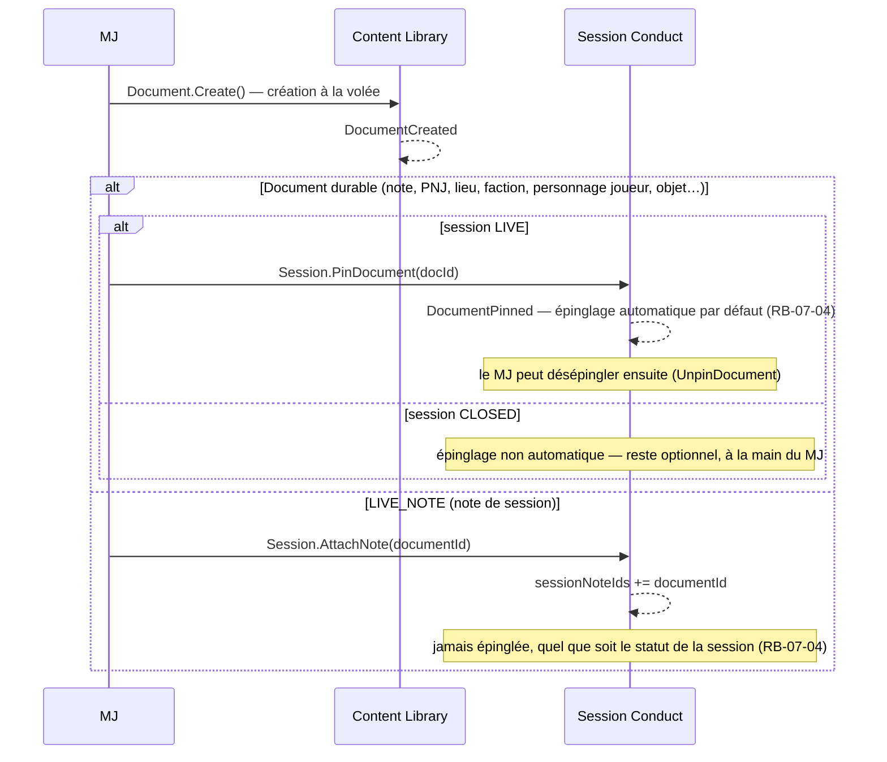

> Vue de consolidation. Diagramme de flux détaillé : [flows/session-conduct.md](../conception/domain/diagrams/flows/session-conduct.md).

**Règles de gestion consolidées.** session-conduct.md règle métier 7 distingue le routage selon le type créé : un document durable est épinglé par défaut en session `LIVE` (`Session.PinDocument()`) et reste optionnel en `CLOSED` ; une `LIVE_NOTE` est systématiquement rattachée via `Session.AttachNote()` — jamais épinglée, quel que soit le statut (renvoi explicite « cf. RB-07-04 »). L'étiquette RB-07-04 elle-même n'est posée ni par le domaine ni par UC-07 : elle est nommée dans `user-stories/US-UC-07-creation-volee-session.md` (« RB-07-04 : un document durable est auto-épinglé par défaut … une note de session est rattachée via `Session.AttachNote` »), qui referme ce que UC-07 § Règles métier décrit dans le même sens sans le nommer — sans cette composition à trois (domaine, UC, user story), le renvoi « cf. RB-07-04 » du domaine serait une référence orpheline. Ce routage repose sur la distinction posée en amont par [ADR-002](../architecture/decisions/ADR-002-tout-est-document-gouvernance.md) (compléments post-revue) : un `LIVE_NOTE` reste un `Document` de plein droit, seuls `characterId`/`guestAccessId` sont promus hors `properties` — c'est parce que le `LIVE_NOTE` ne change pas de nature d'agrégat que le choix entre `PinDocument`/`AttachNote` est un routage applicatif par type, pas une distinction structurelle.

| Maillon | Source (fichier + section) | Rôle dans la chaîne |
|---|---|---|
| Routage par type — durable → `Pin`, `LIVE_NOTE` → `AttachNote` | session-conduct.md règle métier 7 (renvoi RB-07-04) | Règle domaine |
| Étiquette RB-07-04 | `user-stories/US-UC-07-creation-volee-session.md` | Nomme la règle renvoyée par le domaine |
| Description équivalente côté UC | UC-07 § Règles métier | Ancrage UC, sans l'étiquette |
| `LIVE_NOTE` reste un `Document` de plein droit | ADR-002, compléments post-revue (promotion `characterId`/`guestAccessId`) | Fonde le routage comme choix applicatif, pas une distinction d'agrégat |

---

### 6.3 — UC-06 : tableau de bord configurable

#### 6.c — `SessionViewConfig`

**Ancrage UC.** [UC-06](../conception/besoin/usecases/UC-06-vue-session.md), Phase 2 — vue session MJ (tableau de bord configurable).

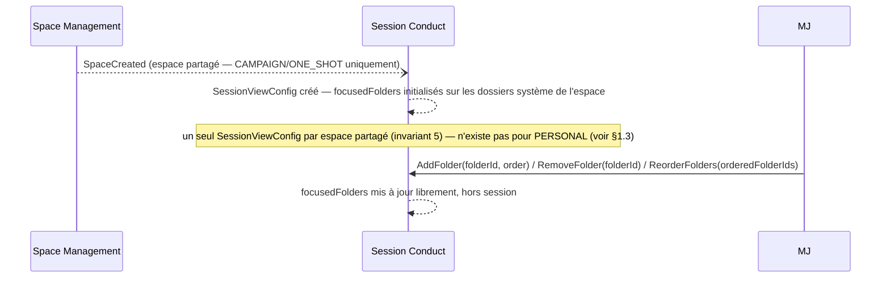

> Vue de consolidation. Diagramme de flux détaillé : [flows/session-conduct.md](../conception/domain/diagrams/flows/session-conduct.md).

**Règles de gestion consolidées.** `SessionViewConfig` (session-conduct.md § SessionViewConfig) matérialise ce que UC-06 Phase 2 décrit en termes d'usage (« le MJ choisit quels dossiers il met en avant … aucune structure n'est imposée par l'application ») : un agrégat unique par espace partagé, créé automatiquement à `SpaceCreated` avec les dossiers système de l'espace comme point de départ (invariant 5), puis librement modifié (`AddFolder`/`RemoveFolder`/`ReorderFolders`) hors session — UC-06 Phase 2 précise que cet ordre et cette sélection sont configurables « hors session (paramètres campagne) », ce que les méthodes de l'agrégat rendent cohérent (aucune n'est conditionnée à `status = LIVE`). `SessionViewConfig` n'existe pas pour un espace `PERSONAL` — composition déjà posée en **§1.3** (space-management.md § One-shot — spécificités, colonne `PERSONAL` ; session-conduct.md, note sous l'agrégat) : un espace mono-membre sans joueurs n'a pas de vue session à configurer.

| Maillon | Source (fichier + section) | Rôle dans la chaîne |
|---|---|---|
| `SessionViewConfig`, un par espace partagé, invariant 5 | session-conduct.md § SessionViewConfig ; § Invariants métier, invariant 5 | Ancrage domaine |
| Tableau de bord configurable, sélection hors session | UC-06 Phase 2 | Ancrage UC, usage observable |
| Absence pour `PERSONAL` | §1.3 (space-management.md § One-shot — spécificités ; session-conduct.md, note sous l'agrégat) | Renvoi, non redéveloppé |

---

### 6.4 — UC-08 / UC-09 / UC-12 : diffusion temps réel (flux transverse)

#### 6.d — Partage temps réel SignalR filtré par visibilité (P4)

**Ancrage UC.** [UC-08](../conception/besoin/usecases/UC-08-partager-information.md) (partage — diffusion aux joueurs) ; [UC-09](../conception/besoin/usecases/UC-09-acces-session-joueur.md) (accès joueur temps réel pendant la session) ; [UC-12](../conception/besoin/usecases/UC-12-consulter-espace-joueur.md) (frontière avec la capacité d'écriture temps réel d'UC-06).

Ce point est un flux **transverse**. La composition complète du filtrage par visibilité qui gouverne la diffusion SignalR — non-divergence REST/SignalR, service unique `IResourceAccessPolicy` — est développée en **§2.3** ; ce paragraphe ne la redéveloppe pas et ne redessine pas son diagramme. session-conduct.md consomme l'événement `DocumentVisibilityChanged` (Content Library) pour « mettre à jour la vue joueur en temps réel » (§ Ce que Session Conduct reçoit) — c'est ce déclencheur événementiel, propre à Session Conduct, qui active le filtrage composé en §2.3 côté diffusion. Le mécanisme de transport temps réel proprement dit (canal SignalR, reconnexion, repli) n'est pas développé ici — il est annoncé en **§7**, à produire.

---

### 6.5 — UC-09 : scope `GuestAccess SESSION`

#### 6.e — Scope `GuestAccess SESSION` (côté session)

**Ancrage UC.** [UC-09](../conception/besoin/usecases/UC-09-acces-session-joueur.md), règle métier RB-09-01 (fenêtre de grâce de l'accès ponctuel) ; [UC-06](../conception/besoin/usecases/UC-06-vue-session.md) (accès joueur validé en couche application).

session-conduct.md règle métier 2 pose, côté session, que l'accès d'un joueur repose sur son `SpaceMembership` ou un `GuestAccess` actif — la validation elle-même reste hors du domaine Session Conduct (couche application). Le cycle de vie complet du `GuestAccess` — création, statut `CONVERTED`, conversion en membre — est développé en **§4.2** ; ce paragraphe n'en pose que le point d'ancrage côté session, sans redessiner le diagramme ni reproduire le tableau des maillons de ce point.

**Règles de gestion consolidées.** La fenêtre de validité d'un accès `SESSION` compose deux sources distinctes : UC-09 règle métier (RB-09-01) fixe la durée — le temps de la session plus une fenêtre de grâce de 24h ferme — tandis que session-conduct.md règle métier 6 fixe le déclencheur applicatif de cette fenêtre : « à la clôture de session (`Close()`), la couche application notifie Space Management pour déclencher le countdown d'expiration des `GuestAccess SESSION` » — sans cette composition, la fenêtre de 24h d'UC-09 n'aurait pas de point de départ observable côté domaine. La matrice ressource d'ADR-014 §4 confirme, côté Space Management, que le scope `SESSION` restreint la ressource `sessions` au seul `guest_accesses.session_id` de l'invité — cette contrainte est déjà composée dans le modèle du principal développé en §2.3/§4.e, non répétée ici.

| Maillon | Source (fichier + section) | Rôle dans la chaîne |
|---|---|---|
| Accès joueur validé en couche application (`SpaceMembership`/`GuestAccess` actif) | session-conduct.md règle métier 2 | Ancrage domaine, côté session |
| Cycle de vie complet du `GuestAccess` | §4.2 | Renvoi, non redéveloppé |
| Fenêtre de grâce 24h (RB-09-01) | UC-09 règle métier | Durée de la fenêtre |
| Déclencheur du countdown — `Session.Close()` | session-conduct.md règle métier 6 | Point de départ observable de la fenêtre |
| Scope `SESSION` restreint à `guest_accesses.session_id` | ADR-014 §4 (matrice ressource) | Renvoi §2.3/§4.e, non répété |

## 7 — Authentification cloud et temps réel

Ce module couvre le cycle de vie de l'authentification cloud (renvoi §3, non redéveloppé) et le transport temps réel annoncé en **§6.4** pour la diffusion SignalR. Deux points transverses composent ici des décisions déjà posées ailleurs dans ce dossier, sans les re-trancher.

### 7.a — Cycle de vie de l'authentification cloud (rotation, denylist, raccordement domaine)

**Ancrage UC.** [UC-10](../conception/besoin/usecases/UC-10-compte-cloud.md) — le cycle de vie complet des opérations sensibles et de la validation email est développé en **§3.a** ; ce paragraphe n'en reprend pas le contenu et se limite à la composition entre le cycle de vie du token et la topologie d'hébergement.

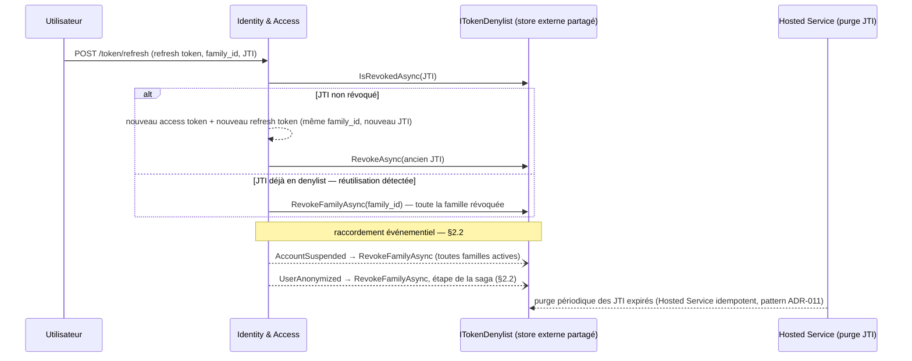

> Vue de consolidation. Diagramme de flux détaillé : [flows/identity-access.md](../conception/domain/diagrams/flows/identity-access.md).

**Règles de gestion consolidées.** La politique de mot de passe et le cycle de vie des tokens JWT — algorithmes, durées, rotation — sont déjà composés avec l'invariant 7 du domaine en **§3.a** (ADR-015 §1, §3.1-3.2) ; ce paragraphe n'y revient pas ni ne les recopie. La rotation des refresh tokens **par famille** (`family_id`) avec détection de réutilisation (ADR-015 §3.3) compose deux garanties : un token réutilisé après rotation révoque toute la famille, pas seulement le JTI concerné — sans cette granularité, un attaquant rejouant un refresh token volé avant la victime pourrait obtenir un nouveau token valide sur la même famille. Cette rotation s'appuie sur une denylist JTI **externe et partagée** (Redis ou table SQL dédiée) plutôt qu'en mémoire par instance — ADR-015 §3.4 pose cette exigence comme une conséquence directe de la topologie scale-out actée par ADR-004 (sticky sessions, connexions persistantes) : une denylist en mémoire par instance ne serait pas visible d'une instance à l'autre avant l'expiration naturelle du token, ce qui viderait la révocation de son effet dans un déploiement multi-instance. Le rate limiting hybride (par-IP ET par-compte, seuils indépendants et cumulatifs — ADR-015 §4.2) couvre les cinq endpoints d'authentification déjà listés côté contrat API (`contrat-openapi.md` §5) ; les valeurs exactes des seuils restent renvoyées à `specs/config-securite-migration.md`, qui ne les fixe pas davantage (reportées `[À TRANCHER — B1.5]`). Le raccordement de la denylist aux événements domaine `AccountSuspended` et `UserAnonymized` (ADR-015 §3.6) ferme la fenêtre d'accès résiduel après suspension ou effacement — sans ce câblage, un token émis avant l'un ou l'autre événement resterait valide jusqu'à l'expiration naturelle de l'access token (durée posée en §3.a, ADR-015 §3.1) ; pour `UserAnonymized`, ce raccordement est une étape de la saga développée en **§2.2**, non une opération asynchrone indépendante — ce dossier n'y revient pas. La purge périodique des JTI expirés est portée par un Hosted Service introduit par ADR-015 §3.5 explicitement sur le pattern du Hosted Service idempotent d'ADR-011 (sélection par critère temporel, claim, transaction atomique, idempotence) — un raccordement de structure, pas de périmètre : ADR-011 couvre les sagas de purge domaine, la purge JTI reste une opération d'infrastructure d'authentification distincte.

| Maillon | Source (fichier + section) | Rôle dans la chaîne |
|---|---|---|
| Politique de mot de passe, cycle de vie JWT, invariant 7 | §3.a ([ADR-015](../architecture/decisions/ADR-015-securite-authentification-mvp.md) §1, §3.1-3.2) | Renvoi, non redéveloppé |
| Rotation par famille + détection de réutilisation | ADR-015 §3.3 | Ferme le rejeu d'un refresh token volé |
| Denylist externe et partagée — motivée par la topologie scale-out | ADR-015 §3.4 ; ADR-004 §Décision, §Conséquences | Arête de dépendance ADR-015 ↔ ADR-004 |
| Rate limiting hybride, cinq endpoints | ADR-015 §4.1, §4.2 ; `contrat-openapi.md` §5 | Principe tranché, valeurs `[À TRANCHER — B1.5]` (`config-securite-migration.md`) |
| Raccordement `AccountSuspended`/`UserAnonymized` | ADR-015 §3.6 ; §2.2 (saga `UserAnonymized`) | Ferme la fenêtre d'accès résiduel |
| Hosted Service de purge JTI — pattern ADR-011 | ADR-015 §3.5 ; ADR-011 §Saga `SpaceDeleted` | Raccordement de structure, périmètre distinct |

**Renvoi API** : le détail des codes 429 et le schéma de réponse restent `[À TRANCHER — B1.10]` (`contrat-openapi.md` §5, §Récapitulatif).

### 7.b — Transport temps réel et repli

**Ancrage UC.** [UC-08](../conception/besoin/usecases/UC-08-partager-information.md), [UC-09](../conception/besoin/usecases/UC-09-acces-session-joueur.md), [UC-12](../conception/besoin/usecases/UC-12-consulter-espace-joueur.md) — mêmes ancrages que la diffusion temps réel développée en **§2.3/§6.4**, dont le filtrage par visibilité n'est pas redessiné ici.

```mermaid
sequenceDiagram
    participant J as Joueur / GuestAccess
    participant Hub as Haversack.Infrastructure.Notifications (SignalR)
    participant Acces as IResourceAccessPolicy (§2.3)

    J->>Hub: négociation de connexion
    Hub-->>Hub: fallback natif — WebSocket → Server-Sent Events → long-polling
    Note over Hub: configuration sobre — SSE forcé tant que le canal reste unidirectionnel MJ→joueurs ; connexion fermée en fin de session LIVE ; heartbeat allongé

    Hub->>Acces: filtrage par visibilité avant diffusion (P1+P4, §2.3) — non redessiné ici

    Note over Hub: seuil de coût par session concurrente [À TRANCHER — ticket] → déclencherait un repli vers polling adaptatif [À TRANCHER — ticket]
```

> Vue de consolidation. Diagramme de flux détaillé : non désigné par le corpus au-delà d'ADR-004 lui-même — le module `Haversack.Infrastructure.Notifications` (isolé dès J0, ADR-008) ne dispose pas encore de diagramme de flux dédié dans `docs/conception/domain/diagrams/flows/`. Le filtrage par visibilité renvoie à [flows/content-library.md](../conception/domain/diagrams/flows/content-library.md) (visibilité document, composé en §2.3).

**Règles de gestion consolidées.** SignalR est retenu comme transport dès le MVP (ADR-004 §Décision), isolé dans le module `Haversack.Infrastructure.Notifications` (ADR-008), avec repli natif WebSocket → Server-Sent Events → long-polling. La revue adversariale post-ADR (ADR-004 §Compléments post-revue) précise ce choix par une configuration sobre obligatoire — SSE forcé tant que la communication reste unidirectionnelle MJ→joueurs, connexion fermée en fin de session `LIVE`, heartbeat/keep-alive allongé (justifié par la rareté des événements en session de jeu) — que `specs/repli-temps-reel.md` §2 reporte telle quelle sans l'affaiblir. Le filtrage par visibilité qui conditionne chaque message diffusé (`PUBLIC`/`GM_ONLY`/`PLAYER_PRIVATE`, pas de diffusion par groupe indifférenciée) est déjà composé en **§2.3** — ce paragraphe ne le redéveloppe pas.

**`[À TRANCHER]` reportés** — quatre points, tous nommés par `specs/repli-temps-reel.md` comme bloquant le passage de cette spec à un ticket de développement, aucun comblé ici ni par ce dossier :
- **valeur du seuil de coût par session concurrente** déclenchant le repli (ADR-004 §Compléments — « un seuil de coût par session concurrente est à définir comme critère de réversibilité … livrable de configuration, pas un commentaire de documentation ») ;
- **définition de la métrique de coût elle-même** (coût de connexions persistantes ? de sticky sessions ? formule composite ?) — absente du corpus, le chiffrage d'hébergement étant renvoyé par ADR-004 §Conséquences à un travail non fait ;
- **cadence cible du polling adaptatif** — nommée qualitativement seulement (« latence de quelques secondes, tolérable », ADR-004 §Alternatives considérées) ;
- **mécanisme de détection du dépassement de seuil** (évaluation continue ? périodique ? par palier d'hébergement ?) — absent du corpus.

Ce cadre n'est, par la qualification de sa propre source, **pas implémentable en l'état** (`repli-temps-reel.md`, en-tête — label « Statut »).

| Maillon | Source (fichier + section) | Rôle dans la chaîne |
|---|---|---|
| SignalR dès le départ, fallback natif, isolation module | ADR-004 §Décision ; ADR-008 | Choix de transport, ancré UC-08/09 |
| Configuration sobre — SSE forcé, fermeture fin de session, heartbeat allongé | ADR-004 §Compléments post-revue ; `repli-temps-reel.md` §2 | Contexte de configuration déjà acté, reporté tel quel |
| Filtrage par visibilité avant diffusion | §2.3 | Renvoi, non redessiné |
| Seuil de coût, métrique, cadence, mécanisme de détection | `repli-temps-reel.md` §3, §5 | Quatre `[À TRANCHER]`, cadre non implémentable en l'état |

---

## 8 — Points ouverts et limites de vérifiabilité

Cette section consolide, en un registre unique, les points non tranchés déjà reportés ailleurs dans ce dossier ainsi que ceux du corpus source non encore listés. Elle ne tranche aucun de ces points — chacun reste à l'état où sa source l'a laissé.

### 8.1 — Registre des `[À TRANCHER]`

| Point | Axe | Source | Statut |
|---|---|---|---|
| Références nullable entrantes non couvertes par le critère §3(b) (`documents.character_id` d'un autre document, `guest_accesses.character_id`, `folders.default_template_document_id`) | RGPD — cascade de suppression | ADR-012 §4 ; `requete-effacement-non-partage.md` §5 | Non tranché (déjà en §2.1) |
| Posture *reclaim-in-place* OAuth (email préexistant non vérifié face à une preuve IdP fraîche) | Sécurité — authentification | ADR-015 §2.3 | `[À TRANCHER — à ratifier produit]` (déjà en §3.4) |
| 403 vs 404 pour un appelant non-membre, cross-espace | Contrat API — non-révélation | `contrat-openapi.md` §4 ; ADR-014 §Conséquences | `[À TRANCHER — B1.10]` (déjà en §2.3) |
| Sémantique de `Visibility` (`GM_ONLY`/`PLAYER_PRIVATE`) sur un espace `PERSONAL` mono-membre | Modélisation domaine | ADR-018 § Points à trancher | Non tranché |
| Modélisation domaine du `propertiesSchema` pour six des huit types système seedés (`scene`, `npc`, `location`, `note`, `player_character`, `reveal`) | Modélisation domaine | `specs/document-properties-schemas.md` §5 | Non tranché (déjà en §5.5) |
| Ordre de dégel multi-tier si un futur tier intermédiaire borne le quota cible sous le nombre d'espaces `FROZEN` | Modélisation domaine — non pertinent tant que le tier reste binaire | `space-management.md` règle métier 11 | Non tranché (déjà en §4.3) |
| Valeur de N (pilier Préparation), opérationnalisation de « usage réel constaté » (pilier Vue session), outil analytics, liste formalisée d'événements/propriétés, technique d'anonymisation RGPD, mécanisme de capture email non bloquante | Télémétrie | `specs/telemetrie.md` §6 | Six points, non tranchés |
| Seuil de coût par session concurrente, définition de la métrique, cadence du polling adaptatif, mécanisme de détection du dépassement | Transport temps réel — repli | `specs/repli-temps-reel.md` §5 | Quatre points, non tranchés (déjà en §7.b) |
| Seuil d'expiration du claim `purge_claimed_at` | Configuration — purge RGPD | ADR-011 §Points à trancher (`ex. 1 heure`, non retenu comme valeur) | `[À TRANCHER — B1]` |
| Dette dormante — câblage de la purge des médias externalisés à la saga `SpaceDeleted` (si une chaîne média est introduite post-MVP) | Dette architecture — condition non réalisée au MVP | ADR-011 §Points à trancher (B1.9) | Dette nommée, non déclenchée au MVP |
| Instanciation cross-espace `PERSONAL` → partagé : comportement du document source à la purge de l'espace `PERSONAL` d'origine | Modélisation domaine | ADR-018 § Points à trancher | Non tranché |
| Activation de l'espace `PERSONAL` comme zone d'atterrissage par défaut en mode local (redéfinit H1) ; posture capture-first recommandée en MVP | Point de décision produit, **à ratifier, jamais acté** | ADR-018 § Recommandations (Geste capture-first) ; § Points à trancher | `[À TRANCHER]` — recommandation non validée |

**Réconciliation de cohérence corpus — désormais actée, plus une divergence.** [UC-10](../conception/besoin/usecases/UC-10-compte-cloud.md) §A4/§E4 pose le principe : la suppression de compte est **bloquée** tant que le titulaire est propriétaire d'espaces partagés avec des membres actifs (« le système bloque la suppression »). `identity-access.md` § Invariants métier, invariant 3, réconcilie ce principe avec le routage par type d'espace : **bloquant** pour `CAMPAIGN`/`ONE_SHOT` à membre actif (conforme UC-10), **jamais bloquant** pour `PERSONAL` (mono-membre, hors champ). UC-10 reste la source du principe de blocage, le domaine en donne le routage exact — l'articulation, déjà développée en **§2.2**, n'est plus une divergence ouverte.

### 8.2 — Renvoi juridique

Les points de conformité RGPD **conçue mais non certifiée** touchant ce dossier — qualification Art. 17 du hard-delete inconditionnel de l'espace `PERSONAL`, instant juridique de référence `deletion_requested_at`, périmètre du DPA Art. 28 pour un contenu personnel décrivant un tiers identifiable, et mise en balance de l'intérêt légitime pour le `display_name` de l'invité — sont consolidés dans [`docs/securite/conformite/cadrage-validation-pre-lancement-eu.md`](../securite/conformite/cadrage-validation-pre-lancement-eu.md), qui les recense en 5 axes à valider par un juriste avant tout lancement EU. Ce dossier renvoie à ce cadrage ; il ne re-tranche aucun des axes qui s'y trouvent.

### 8.3 — Limites de vérifiabilité en build

Les propriétés suivantes du système cible ne sont pas vérifiables par test ou par CI — leur suppression de ce registre donnerait une fausse confiance de couverture. Elles sont documentées comme telles, pas comme des trous à combler par ce dossier.

| Propriété | Cause | Source |
|---|---|---|
| Persistance IndexedDB best-effort (`navigator.storage.persist()`, comportement de grant/refus, éviction sous pression mémoire) | Plateforme navigateur — comportement d'environnement d'exécution, non assertable en CI | ADR-017 §3.3 |
| Migration multi-versions IndexedDB en navigateur réel (fonction de projection appliquée à des données persistées par des versions antérieures du store) | Plateforme navigateur — non couvrable par les tests d'archi CI, renvoyé aux tests e2e (P7) | ADR-016 § Points à trancher ; ADR-017 §Points à trancher |
| Fiabilité du claim d'email vérifié exposé par l'IdP externe (`email_verified` Google, `verified` Discord) | Dépendance externe — comportement de l'IdP, ne se prouve pas par la CI Haversack | ADR-015 §2.2 |
| Coût et comportement du repli temps réel sous charge (connexions persistantes réellement ouvertes, sticky sessions réparties, facturation réelle du fournisseur d'hébergement) | Hébergement — non reproductible en CI, conditions de production uniquement | `specs/repli-temps-reel.md` §4 |

---

## Sources et références

Ce tableau recense, par famille, l'ensemble des sources citées dans ce dossier. Les chemins sont relatifs à `docs/architecture/`, à l'exception des sources situées ailleurs dans le corpus (chemins relatifs indiqués depuis `docs/architecture/`).

### Décisions d'architecture (ADR)

| Référence | Rôle dans ce dossier |
|---|---|
| [ADR-001](../architecture/decisions/ADR-001-execution-domaine-mode-local.md) | Principe fondateur mode local — serveur source de vérité, `validation locale ⊆ validation serveur` (§2.4, §3.1) |
| [ADR-002](../architecture/decisions/ADR-002-tout-est-document-gouvernance.md) | Gouvernance de `properties`/`DocumentProperties`, deux régimes de validation, promotion `characterId`/`guestAccessId` (§1.2, §2.4, §5.5, §6.2) |
| [ADR-004](../architecture/decisions/ADR-004-transport-temps-reel.md) | Choix du transport SignalR, configuration sobre, extension du principe d'autorisation au canal temps réel (§2.3, §7.b) |
| [ADR-005](../architecture/decisions/ADR-005-modele-monetisation.md) | Modèle de monétisation — statut « décision produit fusionnée », autorité déplacée vers la vision produit / le CdC (§3.2, §4.3) |
| [ADR-007](../architecture/decisions/ADR-007-rgpd-autorisation-api.md) | RGPD et modèle d'autorisation API — principe étendu au canal SignalR (§1.2, §2.3) |
| [ADR-008](../architecture/decisions/ADR-008-structure-solution.md) | Structure de la solution — bounded contexts en frontières logiques, test d'architecture CI, isolation du module de notifications (§1.1, §7.b) |
| [ADR-010](../architecture/decisions/ADR-010-suppression-espace.md) | Droit du propriétaire à supprimer son espace, corbeille de 30 jours (§2.1, §4.4) |
| [ADR-011](../architecture/decisions/ADR-011-cascade-integrite-referentielle.md) | Cascade d'intégrité référentielle — saga `SpaceDeleted`, claim/idempotence/reprise, pattern Hosted Service (§2.1, §2.2, §2.4, §7.a) |
| [ADR-012](../architecture/decisions/ADR-012-rgpd-effacement-compte.md) | RGPD effacement de compte — saga `UserAnonymized`, règle F-08, critère « document non partagé » (§2.1, §2.2) |
| [ADR-013](../architecture/decisions/ADR-013-rgpd-donnees-invites.md) | RGPD données invitées — rétention 90 jours, confirmation du comportement MVP de conservation (§3.2, §4.2) |
| [ADR-014](../architecture/decisions/ADR-014-modele-autorisation-api.md) | Modèle d'autorisation API — prédicats P1/P2/P3/P4, `IResourceAccessPolicy`, matrice ressource, statut `CONVERTED` (§2.1, §2.3, §3.3, §4.2, §4.5, §5.1, §5.2, §5.5) |
| [ADR-015](../architecture/decisions/ADR-015-securite-authentification-mvp.md) | Sécurité authentification MVP — politique de mot de passe, cycle de vie JWT, denylist, liaison OAuth (§3.2, §7.a) |
| [ADR-016](../architecture/decisions/ADR-016-serialisation-locale-migration.md) | Sérialisation locale / migration — payload versionné, frontière de confiance, transactions par espace (§2.4) |
| [ADR-017](../architecture/decisions/ADR-017-modele-indexeddb-local.md) | Modèle IndexedDB local — store aggregate-rooted, sanitisation XSS côté client (§2.4) |
| [ADR-018](../architecture/decisions/ADR-018-espace-personnel-generalisation-space.md) | Généralisation `Space`/`PERSONAL` — voie retenue, analyse d'impact par invariant (§1.3, §2.2, §3.2, §4.1, §5.3) |

### Spécifications techniques

| Référence | Rôle dans ce dossier |
|---|---|
| [specs/contrat-openapi.md](../architecture/specs/contrat-openapi.md) | Sémantique HTTP (403/404, rate limiting), endpoints partiellement tranchés, `[À TRANCHER — B1.10]` (§2.3, §3.2, §4.1, §5.1, §5.2, §5.5, §7.a) |
| [specs/mapping-ef-core.md](../architecture/specs/mapping-ef-core.md) | Câblage des query filters globaux EF Core (P2/P3) (§2.1, §2.3, §4.5) |
| [specs/document-properties-schemas.md](../architecture/specs/document-properties-schemas.md) | Contrat détaillé de `DocumentProperties`, deux régimes de validation, six types système non modélisés (§1.2, §5.5) |
| [specs/requete-effacement-non-partage.md](../architecture/specs/requete-effacement-non-partage.md) | Critère « document non partagé », matérialisation du jeu de sélection à l'effacement (§2.1, §2.2) |
| [specs/sanitisation-csp.md](../architecture/specs/sanitisation-csp.md) | Plancher de sanitisation XSS, côté client et côté serveur (§2.4) |
| [specs/telemetrie.md](../architecture/specs/telemetrie.md) | Télémétrie — points non tranchés (valeur de N, outil analytics, anonymisation) (§8.1) |
| [specs/repli-temps-reel.md](../architecture/specs/repli-temps-reel.md) | Configuration sobre du transport temps réel, quatre points non implémentables en l'état (§7.b, §8.1, §8.3) |
| [specs/config-securite-migration.md](../architecture/specs/config-securite-migration.md) | Seuils de rate limiting non fixés, `[À TRANCHER — B1.5]` (§7.a) |

### Modèle de domaine

| Référence | Rôle dans ce dossier |
|---|---|
| [docs/conception/domain/README.md](../conception/domain/README.md) | Architecture générale des quatre bounded contexts + Core (§1.1) |
| [docs/conception/domain/core.md](../conception/domain/core.md) | Core (Shared Kernel) — identifiants typés, value objects partagés, exception RGPD `SoftDelete` (§1.4, §2.2) |
| [docs/conception/domain/identity-access.md](../conception/domain/identity-access.md) | Identity & Access — invariants métier, événements domaine (`UserRegistered`, `UserDeleted`, `AccountTierChanged`) (§2.2, §3.1-§3.3, §4.3, §7.a) |
| [docs/conception/domain/space-management.md](../conception/domain/space-management.md) | Space Management — `Space`, `GuestAccess`, invariants 14/15, absence de `SessionViewConfig` pour `PERSONAL` (§1.3, §2.1, §4.1-§4.5, §6.3, §6.5) |
| [docs/conception/domain/content-library.md](../conception/domain/content-library.md) | Content Library — `Document`, `DocumentLink`, `CanBeReadBy`, dossiers système (§1.2, §2.1, §2.3-§2.4, §5.1-§5.5, §6.2) |
| [docs/conception/domain/session-conduct.md](../conception/domain/session-conduct.md) | Session Conduct — machine d'états, `SessionViewConfig`, routage `PinDocument`/`AttachNote` (§1.3, §2.1, §6.1-§6.5) |
| [docs/conception/domain/diagrams/flows/space-management.md](../conception/domain/diagrams/flows/space-management.md) | Diagramme de flux détaillé — Space Management, source de chaque vue de consolidation le concernant |
| [docs/conception/domain/diagrams/flows/content-library.md](../conception/domain/diagrams/flows/content-library.md) | Diagramme de flux détaillé — Content Library, source de chaque vue de consolidation le concernant |
| [docs/conception/domain/diagrams/flows/identity-access.md](../conception/domain/diagrams/flows/identity-access.md) | Diagramme de flux détaillé — Identity & Access, source de chaque vue de consolidation le concernant |
| [docs/conception/domain/diagrams/flows/session-conduct.md](../conception/domain/diagrams/flows/session-conduct.md) | Diagramme de flux détaillé — Session Conduct, source de chaque vue de consolidation le concernant |

### Autres documents d'architecture

| Référence | Rôle dans ce dossier |
|---|---|
| [architecture-detaillee.md](../architecture/architecture-detaillee.md) | Vue transverse par préoccupation technique (persistance, sécurité, RGPD, temps réel, mode local) |
| [structure-projets.md](../architecture/structure-projets.md) | Arborescence de projets, nommage `SharedKernel` (§1.1) |
| [architecture/README.md](../architecture/README.md) | Découverte pédagogique, ordre de lecture conseillé du corpus d'architecture |
| [decisions/README.md](../architecture/decisions/README.md) | Registre des décisions — statut, nature, date de chaque ADR |
| [docs/conception/README.md](../conception/README.md) | Ordre d'autorité du corpus de conception, test d'autoportance besoin ↔ décision |
| [docs/securite/conformite/cadrage-validation-pre-lancement-eu.md](../securite/conformite/cadrage-validation-pre-lancement-eu.md) | Cadrage RGPD conçue mais non certifiée — 5 axes à valider par un juriste avant tout lancement EU (§8.2) |

---

*Ce document est une consolidation ; en cas de divergence apparente avec une source citée, la source fait autorité.*
