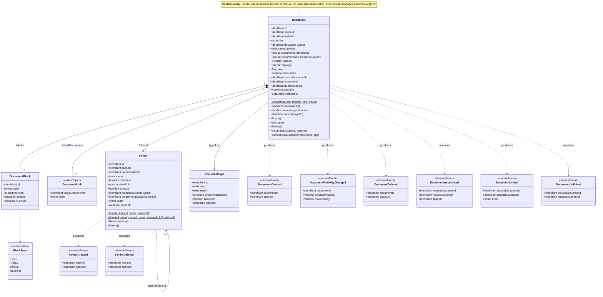

# Content Library — Diagramme de classes

## Diagramme

```mermaid
classDiagram
    class Document {
        +identifiant id
        +identifiant spaceId
        +identifiant folderId
        +texte title
        +identifiant documentTypeId
        +structure properties
        +liste de DocumentBlock blocks
        +liste de DocumentLink linkedDocuments
        +Visibility visibility
        +liste de Tag tags
        +Slug slug
        +booléen isReusable
        +identifiant sourceDocumentId
        +identifiant characterId
        +identifiant guestAccessId
        +AuditInfo auditInfo
        +SoftDelete softDelete
        +Create(spaceId, folderId, title, typeId)$
        +UpdateContent(blocks)
        +LinkDocument(targetId, order)
        +UnlinkDocument(targetId)
        +Share()
        +Unshare()
        +Delete()
        +Instantiate(spaceId, folderId)
        +CanBeReadBy(reader, documentType)
    }

    class DocumentBlock {
        +identifiant id
        +entier order
        +BlockType type
        +structure content
        +booléen isLocked
    }

    class DocumentLink {
        <<valueObject>>
        +identifiant targetDocumentId
        +entier order
    }

    class Folder {
        +identifiant id
        +identifiant spaceId
        +identifiant parentFolderId
        +texte name
        +booléen isSystem
        +texte systemRole
        +booléen isVirtual
        +identifiant defaultDocumentTypeId
        +identifiant defaultTemplateDocumentId
        +entier order
        +AuditInfo auditInfo
        +Create(spaceId, name, parentId?)$
        +CreateSystem(spaceId, name, systemRole?, isVirtual)$
        +Rename(name)
        +Delete()
    }

    class DocumentType {
        +identifiant id
        +texte slug
        +texte name
        +structure propertiesSchema
        +booléen isSystem
        +identifiant spaceId
    }

    class BlockType {
        <<enumeration>>
        TEXT
        TABLE
        IMAGE
        DIVIDER
    }

    class DocumentCreated {
        <<domainEvent>>
        +identifiant documentId
        +identifiant spaceId
    }

    class DocumentVisibilityChanged {
        <<domainEvent>>
        +identifiant documentId
        +Visibility previousVisibility
        +Visibility newVisibility
    }

    class DocumentDeleted {
        <<domainEvent>>
        +identifiant documentId
        +identifiant spaceId
    }

    class DocumentInstantiated {
        <<domainEvent>>
        +identifiant sourceDocumentId
        +identifiant newDocumentId
        +identifiant spaceId
    }

    class DocumentLinked {
        <<domainEvent>>
        +identifiant sourceDocumentId
        +identifiant targetDocumentId
        +entier order
    }

    class DocumentUnlinked {
        <<domainEvent>>
        +identifiant sourceDocumentId
        +identifiant targetDocumentId
    }

    class FolderCreated {
        <<domainEvent>>
        +identifiant folderId
        +identifiant spaceId
    }

    class FolderDeleted {
        <<domainEvent>>
        +identifiant folderId
        +identifiant spaceId
    }

    Document "1" *-- "0..*" DocumentBlock : blocks
    Document "1" *-- "0..*" DocumentLink : linkedDocuments
    Document --> DocumentType : typed by
    Document ..> DocumentCreated : produces
    Document ..> DocumentVisibilityChanged : produces
    Document ..> DocumentDeleted : produces
    Document ..> DocumentInstantiated : produces
    Document ..> DocumentLinked : produces
    Document ..> DocumentUnlinked : produces
    Folder ..> FolderCreated : produces
    Folder ..> FolderDeleted : produces
    DocumentBlock --> BlockType
    Document "0..*" --> "1" Folder : folderId
    Folder "0..*" --> "0..1" Folder : parentFolderId
    note for Document "CanBeReadBy : reader est un membre (UserId et rôle) ou un invité (GuestAccessId), avec ses personnages associés (règle 2)"
```
