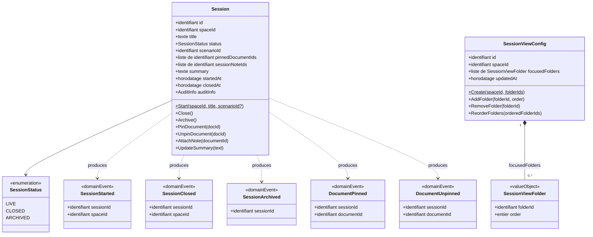

# Session Conduct — Diagramme de classes

## Diagramme

```mermaid
classDiagram
    class Session {
        +identifiant id
        +identifiant spaceId
        +texte title
        +SessionStatus status
        +identifiant scenarioId
        +liste de identifiant pinnedDocumentIds
        +liste de identifiant sessionNoteIds
        +texte summary
        +horodatage startedAt
        +horodatage closedAt
        +AuditInfo auditInfo
        +Start(spaceId, title, scenarioId?)$
        +Close()
        +Archive()
        +PinDocument(docId)
        +UnpinDocument(docId)
        +AttachNote(documentId)
        +UpdateSummary(text)
    }

    class SessionViewConfig {
        +identifiant id
        +identifiant spaceId
        +liste de SessionViewFolder focusedFolders
        +horodatage updatedAt
        +Create(spaceId, folderIds)$
        +AddFolder(folderId, order)
        +RemoveFolder(folderId)
        +ReorderFolders(orderedFolderIds)
    }

    class SessionViewFolder {
        <<valueObject>>
        +identifiant folderId
        +entier order
    }

    class SessionStatus {
        <<enumeration>>
        LIVE
        CLOSED
        ARCHIVED
    }

    class SessionStarted {
        <<domainEvent>>
        +identifiant sessionId
        +identifiant spaceId
    }

    class SessionClosed {
        <<domainEvent>>
        +identifiant sessionId
        +identifiant spaceId
    }

    class SessionArchived {
        <<domainEvent>>
        +identifiant sessionId
    }

    class DocumentPinned {
        <<domainEvent>>
        +identifiant sessionId
        +identifiant documentId
    }

    class DocumentUnpinned {
        <<domainEvent>>
        +identifiant sessionId
        +identifiant documentId
    }

    Session --> SessionStatus
    Session ..> SessionStarted : produces
    Session ..> SessionClosed : produces
    Session ..> SessionArchived : produces
    Session ..> DocumentPinned : produces
    Session ..> DocumentUnpinned : produces
    SessionViewConfig "1" *-- "0..*" SessionViewFolder : focusedFolders
```
